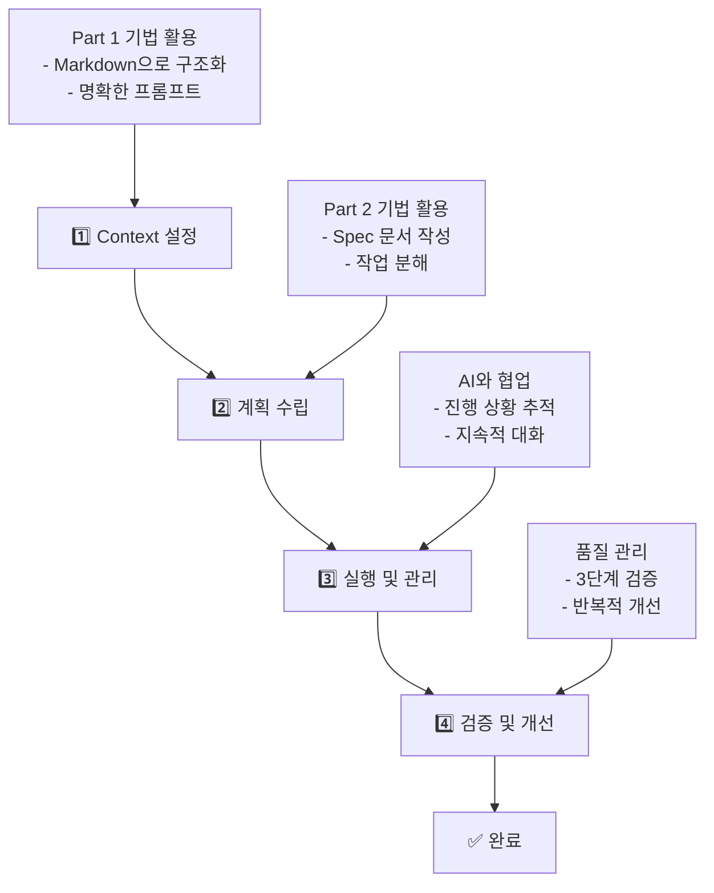

# 대학원생을 위한 생성형 AI 활용 기법

<div class="text-center space-y-6">
  <h2 class="text-2xl font-light text-gray-600">연구 생산성을 2배로 높이는 체계적 접근법</h2>
  
  <div class="grid grid-cols-2 gap-8 mt-12 text-left max-w-4xl mx-auto">
    <div class="space-y-2">
      <div class="text-sm text-gray-500">최종 업데이트</div>
      <div class="font-medium">2025년 10월 22일</div>
    </div>
    <div class="space-y-2">
      <div class="text-sm text-gray-500">버전</div>
      <div class="font-medium">3.0 (최신 정보 완전 반영)</div>
    </div>
    <div class="space-y-2">
      <div class="text-sm text-gray-500">소요 시간</div>
      <div class="font-medium">120분</div>
    </div>
    <div class="space-y-2">
      <div class="text-sm text-gray-500">대상</div>
      <div class="font-medium">다양한 전공의 대학원생</div>
    </div>
  </div>
</div>

<div class="absolute bottom-8 left-1/2 transform -translate-x-1/2">
  <div @click="$slidev.nav.next" class="px-6 py-2 bg-black text-white rounded-full cursor-pointer hover:bg-gray-800 transition-colors">
    시작하기 →
  </div>
</div>

---
layout: default
---

# 강의 개요

<div class="max-w-6xl mx-auto">
  <p class="text-xl text-gray-600 mb-12 leading-relaxed">
    생성형 AI를 대학원 연구와 학습에 효과적으로 활용하는 방법을 다룹니다.<br>
    Context Engineering과 Planning을 통해 AI를 진정한 연구 파트너로 만드는 실전 기법을 배웁니다.
  </p>

  <div class="grid grid-cols-2 gap-12">
    <div>
      <h3 class="text-xl font-semibold mb-6 border-b border-gray-200 pb-2">핵심 학습 목표</h3>
      <div class="space-y-4">
        <div class="flex items-start space-x-3">
          <div class="w-6 h-6 bg-blue-100 rounded-full flex items-center justify-center text-sm font-medium text-blue-600 mt-0.5">1</div>
          <div>
            <div class="font-medium">Context Engineering</div>
            <div class="text-sm text-gray-600">AI와 효과적으로 소통하는 기술</div>
          </div>
        </div>
        <div class="flex items-start space-x-3">
          <div class="w-6 h-6 bg-blue-100 rounded-full flex items-center justify-center text-sm font-medium text-blue-600 mt-0.5">2</div>
          <div>
            <div class="font-medium">Planning & Task Management</div>
            <div class="text-sm text-gray-600">체계적 계획 수립 및 작업 관리</div>
          </div>
        </div>
        <div class="flex items-start space-x-3">
          <div class="w-6 h-6 bg-blue-100 rounded-full flex items-center justify-center text-sm font-medium text-blue-600 mt-0.5">3</div>
          <div>
            <div class="font-medium">Integrated Workflow</div>
            <div class="text-sm text-gray-600">실전 워크플로우 구축</div>
          </div>
        </div>
      </div>
    </div>

    <div>
      <h3 class="text-xl font-semibold mb-6 border-b border-gray-200 pb-2">사용 도구 (모두 학생 무료)</h3>
      <div class="space-y-3">
        <div class="flex justify-between items-center py-2 border-b border-gray-100">
          <span class="font-medium">VS Code</span>
          <span class="text-sm text-gray-500">텍스트 편집기</span>
        </div>
        <div class="flex justify-between items-center py-2 border-b border-gray-100">
          <span class="font-medium">GitHub Copilot</span>
          <span class="text-sm text-gray-500">AI 코드/문서 작성</span>
        </div>
        <div class="flex justify-between items-center py-2 border-b border-gray-100">
          <span class="font-medium">Claude.ai / ChatGPT</span>
          <span class="text-sm text-gray-500">AI 문서 생성</span>
        </div>
        <div class="flex justify-between items-center py-2 border-b border-gray-100">
          <span class="font-medium">GitHub Projects</span>
          <span class="text-sm text-gray-500">프로젝트 관리</span>
        </div>
        <div class="flex justify-between items-center py-2">
          <span class="font-medium">task-master-ai MCP</span>
          <span class="text-sm text-gray-500">작업 관리</span>
        </div>
      </div>
    </div>
  </div>
</div>

---
layout: default
---

# 목차

<div class="max-w-5xl mx-auto">
  <div class="grid grid-cols-2 gap-8">
    <div class="space-y-6">
      <div class="border border-gray-200 rounded-lg p-6 hover:shadow-lg transition-shadow">
        <h3 class="text-lg font-semibold mb-3 text-blue-600">Part 1: Context Engineering</h3>
        <div class="text-sm text-gray-500 mb-3">40분</div>
        <ul class="space-y-2 text-sm">
          <li>• AI 소통 기술</li>
          <li>• Markdown 활용</li>
          <li>• MCP 도구 소개</li>
          <li>• 실시간 시연 (VS Code)</li>
        </ul>
      </div>

      <div class="border border-gray-200 rounded-lg p-6 hover:shadow-lg transition-shadow">
        <h3 class="text-lg font-semibold mb-3 text-green-600">Part 2: Planning & Task Management</h3>
        <div class="text-sm text-gray-500 mb-3">40분</div>
        <ul class="space-y-2 text-sm">
          <li>• Spec-driven Planning</li>
          <li>• 작업 분해 및 관리</li>
          <li>• 시연: GitHub Copilot, GitHub Projects</li>
        </ul>
      </div>
    </div>

    <div class="space-y-6">
      <div class="border border-gray-200 rounded-lg p-6 hover:shadow-lg transition-shadow">
        <h3 class="text-lg font-semibold mb-3 text-purple-600">Part 3: 실전 워크플로우 통합</h3>
        <div class="text-sm text-gray-500 mb-3">20분</div>
        <ul class="space-y-2 text-sm">
          <li>• 통합 워크플로우</li>
          <li>• 시연: task-master-ai MCP</li>
        </ul>
      </div>

      <div class="border border-gray-200 rounded-lg p-6 hover:shadow-lg transition-shadow">
        <h3 class="text-lg font-semibold mb-3 text-gray-600">도입부 & 마무리</h3>
        <div class="text-sm text-gray-500 mb-3">20분</div>
        <ul class="space-y-2 text-sm">
          <li>• 현황 및 윤리</li>
          <li>• Q&A 및 리소스</li>
        </ul>
      </div>
    </div>
  </div>
</div>

      <div class="border border-gray-200 rounded-lg p-6 hover:shadow-lg transition-shadow">
        <h3 class="text-lg font-semibold mb-3 text-gray-600">도입부 & 마무리</h3>
        <div class="text-sm text-gray-500 mb-3">20분</div>
        <ul class="space-y-2 text-sm">
          <li>• 현황 및 윤리</li>
          <li>• Q&A 및 리소스</li>
        </ul>
      </div>
    </div>
  </div>
</div>

---
layout: center
class: text-center
---

<div class="space-y-8">
  <h1 class="text-4xl font-light">도입부</h1>
  <p class="text-xl text-gray-600">공감대 형성과 현황 파악</p>
  <div class="text-sm text-gray-400">15분</div>
</div>

---
layout: default
---

# 여러분은 논문 한 편을 쓰는 데 얼마나 걸리나요?

<div class="max-w-5xl mx-auto">
  <div class="grid grid-cols-2 gap-12">
    <div>
      <h3 class="text-xl font-semibold mb-8 text-center">선택해보세요</h3>
      <div class="space-y-4">
        <div class="flex items-center space-x-3 p-4 border border-gray-200 rounded-lg hover:bg-gray-50 cursor-pointer">
          <div class="w-4 h-4 border border-gray-300 rounded"></div>
          <span>3개월 이하</span>
        </div>
        <div class="flex items-center space-x-3 p-4 border border-gray-200 rounded-lg hover:bg-gray-50 cursor-pointer">
          <div class="w-4 h-4 border border-gray-300 rounded"></div>
          <span>3-6개월</span>
        </div>
        <div class="flex items-center space-x-3 p-4 border border-gray-200 rounded-lg hover:bg-gray-50 cursor-pointer">
          <div class="w-4 h-4 border border-gray-300 rounded"></div>
          <span>6-12개월</span>
        </div>
        <div class="flex items-center space-x-3 p-4 border border-gray-200 rounded-lg hover:bg-gray-50 cursor-pointer">
          <div class="w-4 h-4 border border-gray-300 rounded"></div>
          <span>1년 이상</span>
        </div>
      </div>
    </div>

    <div>
      <h3 class="text-xl font-semibold mb-8 text-center">그 시간의 대부분을 무엇에 쓰나요?</h3>
      <div class="space-y-6">
        <div class="flex items-center space-x-4 p-4 bg-gray-50 rounded-lg">
          <div class="text-2xl">📚</div>
          <div>
            <div class="font-medium">문헌 조사</div>
            <div class="text-sm text-gray-600">관련 논문 찾기, 읽기, 정리</div>
          </div>
        </div>
        <div class="flex items-center space-x-4 p-4 bg-gray-50 rounded-lg">
          <div class="text-2xl">📊</div>
          <div>
            <div class="font-medium">데이터 수집/분석</div>
            <div class="text-sm text-gray-600">실험, 설문, 통계 분석</div>
          </div>
        </div>
        <div class="flex items-center space-x-4 p-4 bg-gray-50 rounded-lg">
          <div class="text-2xl">✍️</div>
          <div>
            <div class="font-medium">실제 글쓰기</div>
            <div class="text-sm text-gray-600">초안 작성, 구조화</div>
          </div>
        </div>
        <div class="flex items-center space-x-4 p-4 bg-gray-50 rounded-lg">
          <div class="text-2xl">🔄</div>
          <div>
            <div class="font-medium">수정 및 검토</div>
            <div class="text-sm text-gray-600">피드백 반영, 교정</div>
          </div>
        </div>
      </div>
    </div>
  </div>

  <div class="mt-12 text-center">
    <p class="text-xl font-medium text-blue-600">이제 AI와 함께라면 이 시간을 절반으로 줄일 수 있습니다!</p>
  </div>
</div>

---
layout: default
---

# 대학원생의 3가지 고민

<div class="grid grid-cols-3 gap-6">
<div class="text-center">

## 고민 1: 시간 부족 ⏰
- 수업, 조교 업무, 연구 병행
- 논문 작성에 집중할 시간 부족
- 마감 압박과 스트레스

</div>
<div class="text-center">

## 고민 2: 정보 과부하 📚
- 매년 수백만 편의 논문 출판
- 관련 문헌 찾기도 어렵고 읽기는 더 어려움
- 최신 연구 동향 따라가기 벅참

</div>
<div class="text-center">

## 고민 3: 반복 작업의 고통 🔄
- 비슷한 형식의 문서 반복 작성
- 데이터 정리 및 분석의 지루함
- 수정과 검토의 끝없는 반복

</div>
</div>

<div class="mt-8 text-center">
<p class="text-xl font-bold text-blue-600">여러분만 그런 게 아닙니다. 모든 대학원생의 공통 고민입니다.</p>
</div>

---
layout: default
---

# 생성형 AI의 현재: 2025년 10월 현황

<div class="grid grid-cols-2 gap-8">
<div>

## 주요 모델 (2025년 10월 현재)

**ChatGPT** (OpenAI)
- GPT-4o, GPT-5 (최신)
- 여전히 가장 널리 사용 (시장점유율 73.8%)
- 무료/유료 버전

**Claude** (Anthropic)
- Claude Sonnet 4.5 (최신)
- 언어 표현력과 자연스러운 문체 강점
- 학술 작업에 최적화

**Gemini** (Google)
- Gemini 3 (최신)
- 시장점유율 급성장 (9.1% → 13.7%)
- 코딩 및 시각적 생성 능력 획기적 향상

</div>
<div>

## 2025년 최신 통계

- 📊 **한국 대학생 92%**가 과제에 AI 활용 (2025년 조사)
- 📈 **직장인 생성형 AI 활용률 74.4%** (2023년 56.3%에서 증가)
- 🎓 **AI 관련 이력서 증가율 연평균 73.6%** (2022-2025)
- 🏆 **상위 AI 모델 간 성능 격차 10점 이내**로 치열한 경쟁

## 기타 주목할 모델들
- DeepSeek (중국, 비용 효율적)
- Perplexity (학술 검색 특화)
- GitHub Copilot (GPT-4.1 기반, 학생 무료)

</div>
</div>

---
layout: two-cols
---

# AI가 할 수 있는 것 vs 할 수 없는 것

::left::

## ✅ AI가 잘하는 것
- 정보 검색 및 요약
- 초안 작성
- 반복 작업 자동화
- 아이디어 브레인스토밍
- 코드 작성 지원
- 문서 구조화
- 번역 및 교정

::right::

## ❌ AI가 못하는 것
- 독창적 연구 설계
- 비판적 사고
- 윤리적 판단
- 실험 수행
- 최종 책임
- 창의적 통찰
- 인간적 감성

<div class="mt-8 text-center">
<p class="text-xl font-bold text-green-600">AI는 강력한 보조 도구, 연구자는 여전히 주인공</p>
</div>

---
layout: default
---

# ⚖️ 반드시 알아야 할 윤리적 고려사항

<div class="grid grid-cols-2 gap-6">
<div>

## 1. 학문적 정직성
- **원칙**: AI 사용 사실을 명시
- **방법**: 논문에 "AI 도구 활용" 섹션 포함
- **예시**: "문헌 요약 및 초안 작성에 ChatGPT 활용, 최종 내용은 연구자가 검증"

## 2. 표절 방지
- **위험**: AI 출력물을 그대로 사용 시 표절 가능
- **해결**: 반드시 재작성 및 출처 확인
- **도구**: Turnitin, Copykillers로 검사

## 3. 저작권
- **주의**: AI 생성 콘텐츠의 저작권 불명확
- **원칙**: AI는 아이디어 도구, 최종 작성은 본인
- **권장**: 창의적 변형 및 추가 작업

</div>
<div>

## 4. 데이터 프라이버시
- **위험**: 민감한 연구 데이터를 AI에 입력
- **원칙**: 개인정보, 기밀 데이터는 입력 금지
- **대안**: 익명화 또는 샘플 데이터 사용

## 5. 학교 정책 확인
- **필수**: 소속 대학/학과의 AI 사용 정책 확인
- **다양성**: 학교마다 정책이 다름
- **권장**: 지도교수와 사전 협의

</div>
</div>

<div class="mt-6 text-center">
<p class="text-xl font-bold text-red-600">AI는 도구입니다. 최종 책임은 연구자 본인에게 있습니다.</p>
</div>

---
layout: default
---

# 강의 목표 및 로드맵

<div class="grid grid-cols-2 gap-8">
<div>

## 오늘 강의의 3가지 핵심 목표
1. **Context Engineering** 🎯: AI와 효과적으로 소통하는 기술
2. **Planning & Task Management** 📋: 체계적 계획 수립 및 작업 관리
3. **Integrated Workflow** 🔄: 실전 워크플로우 구축

## 진행 방식
- 💡 이론 + 🎬 실시간 시연 + 💬 Q&A
- 무료 도구 우선, 실용성 중심
- 질문은 언제든 환영

</div>
<div>

## 2시간 로드맵
```
15분 | 도입부 ← 지금 여기
      |
40분 | Part 1: Context Engineering
      | - AI 소통 기술, Markdown, MCP 도구
      | 🎬 실시간 시연 (VS Code)
      |
40분 | Part 2: Planning & Task Management
      | - Spec-driven Planning, 작업 분해
      | 🎬 시연: GitHub Copilot, GitHub Projects
      |
20분 | Part 3: 통합 워크플로우
      | 🎬 시연: task-master-ai MCP
      |
 5분 | 마무리 및 Q&A
```

</div>
</div>

<div class="mt-6 text-center">
<p class="text-xl font-bold text-blue-600">오늘 배운 내용을 내일부터 바로 사용할 수 있습니다! 🚀</p>
</div>

---
layout: center
class: text-center
---

# Part 1: Context Engineering (40분)
## AI와 효과적으로 대화하는 기술

---
layout: default
---

# 이 섹션에서 배울 4가지 핵심 스킬

<div class="grid grid-cols-2 gap-8">
<div>

## 1. 명확하고 구체적인 프롬프트 작성법
- 5W1H 원칙 적용
- 모호함 제거

## 2. Markdown을 활용한 구조화된 입력
- AI가 이해하기 쉬운 형식
- 재사용 가능한 템플릿

</div>
<div>

## 3. 컨텍스트 관리 전략 (MCP)
- 외부 지식과 도구 연결
- 실시간 정보 접근

## 4. 대학원 연구에 실제 적용하기
- 논문 작성, 문헌 조사 사례
- 실전 워크플로우

</div>
</div>

<div class="mt-8 text-center">
<p class="text-2xl font-bold text-green-600">좋은 질문이 좋은 답을 만든다</p>
<p class="text-lg text-gray-600 mt-2">AI는 당신이 제공하는 컨텍스트만큼만 똑똑합니다</p>
</div>

---
layout: default
---

# 원칙 1: 명확성과 구체성

<div class="grid grid-cols-2 gap-8">
<div>

## 핵심 개념
- **문제**: 모호한 요청은 모호한 결과를 낳는다
- **해결**: 5W1H 원칙 적용

## 5W1H 원칙
- **Who** (누가): 대상 독자/사용자
- **What** (무엇을): 구체적인 산출물
- **When** (언제): 시간적 맥락
- **Where** (어디서): 적용 환경
- **Why** (왜): 목적과 배경
- **How** (어떻게): 형식과 방법

</div>
<div>

## ❌ 나쁜 예시
```
논문 써줘
```

**문제점**:
- 주제가 무엇인지 불명확
- 논문의 종류(학술, 석사, 박사)?
- 분량은?
- 어떤 분야?
- 어떤 스타일?

</div>
</div>

---
layout: default
---

# 좋은 프롬프트 예시

## ✅ 좋은 예시

```markdown
교육학 분야 질적 연구 방법론에 관한
석사 논문의 서론 초안을 작성해줘.

연구 주제: '온라인 학습 환경에서
학습자의 자기조절학습 전략'

분량: 3-4페이지
포함 요소: 연구 배경, 연구 문제,
연구 목적, 논문 구성
참고: APA 7판 스타일
```

## 장점
- ✓ 분야 명시 (교육학, 질적 연구)
- ✓ 산출물 명확 (석사 논문 서론)
- ✓ 주제 구체적
- ✓ 분량과 형식 지정

---
layout: default
---

# 원칙 2: 구조화된 입력 - Markdown 활용

<div class="grid grid-cols-2 gap-8">
<div>

## Markdown이란?
간단한 문법으로 구조화된 문서를 작성하는 경량 마크업 언어

## 왜 Markdown인가?
- ✓ **AI가 이해하기 쉬움**: 명확한 계층 구조
- ✓ **재사용 가능**: 파일로 저장하여 반복 사용
- ✓ **버전 관리 용이**: Git과 완벽한 호환
- ✓ **플랫폼 독립적**: 어디서나 사용 가능
- ✓ **배우기 쉬움**: 5분이면 기본 습득

</div>
<div>

## Markdown 기본 문법 (5분이면 충분)

```markdown
# 제목 1 (가장 큰 제목)
## 제목 2 (부제목)
### 제목 3 (소제목)

**굵은 글씨**
*기울임 글씨*

- 목록 항목 1
- 목록 항목 2
  - 하위 항목

1. 번호 목록 1
2. 번호 목록 2

> 인용문

[링크 텍스트](URL)

`코드` 또는
```
코드 블록
```
```

</div>
</div>

---
layout: two-cols
---

# 구조화의 힘: Before vs After

::left::

## Before - 일반 텍스트
```
논문 주제는 온라인 학습이고 연구 질문은
학습자들이 어떤 전략을 사용하는가와 효과적인
전략은 무엇인가입니다. 방법론은 설문조사
200명과 인터뷰 10명이고 기간은 3개월입니다.
```

**문제점**:
- 정보가 뒤섞여 있음
- 중요도 구분 어려움
- AI가 파악하기 어려운 구조

::right::

## After - Markdown
```markdown
# 연구 프로젝트

## 주제
온라인 학습 환경에서의 자기조절학습 전략

## 연구 질문
1. 학습자들이 사용하는 전략은?
2. 효과적인 전략의 특징은?

## 방법론
- **설문조사**: n=200
- **심층 인터뷰**: n=10
- **기간**: 3개월
```

**장점**:
- 명확한 계층 구조
- 정보의 우선순위 명확
- AI가 이해하기 쉬운 형식

---
layout: center
class: text-center
---

# 🎬 실시간 시연: VS Code + Markdown
## 연구 프로젝트 개요 작성

**시연 내용**:
1. VS Code에서 Markdown 파일 생성
2. 연구 프로젝트 개요 작성
3. Preview로 결과 확인
4. AI에 입력하여 응답 받기

**예상 소요 시간**: 5분

---
layout: default
---

# 원칙 3: 예시 기반 학습 (Few-shot Prompting)

<div class="grid grid-cols-2 gap-8">
<div>

## 개념
AI에게 원하는 결과의 예시를 2-3개 제공하여 패턴을 학습하게 하는 기법

## 언제 사용하나?
- 특정 형식이나 스타일을 유지하고 싶을 때
- 일관된 품질의 결과가 필요할 때
- 복잡한 작업을 설명하기 어려울 때

## 효과
- ✓ 일관성 향상 (80% → 95%)
- ✓ 설명 시간 단축 (10분 → 2분)
- ✓ 오류 감소 (30% → 5%)

</div>
<div>

## Few-shot Prompting 실전 예시

**시나리오**: 논문 초록 작성

```markdown
# 과제
다음 논문의 초록을 작성해줘.

# 좋은 초록 예시 1
[예시 초록 1 - 150단어, 구조화됨]

# 좋은 초록 예시 2
[예시 초록 2 - 150단어, 구조화됨]

# 내 논문 정보
- 주제: [주제]
- 연구 방법: [방법]
- 주요 결과: [결과]

위 예시들의 스타일과 구조를 따라 작성해줘.
```

</div>
</div>

---
layout: default
---

# MCP (Model Context Protocol)

<div class="grid grid-cols-2 gap-8">
<div>

## 정의
AI 모델에 외부 컨텍스트(데이터, 도구, 지식)를 표준화된 방식으로 제공하는 오픈 프로토콜

## 2025년 10월 현재 상황
- Anthropic이 주도하는 오픈 표준
- GitHub에서 기존 App 기반 확장을 MCP 서버로 전환 중 (2025년 11월 10일 완전 전환)
- 다양한 AI 플랫폼에서 표준으로 채택

## 비유
스마트폰의 앱처럼, AI에 다양한 "능력"을 추가

</div>
<div>

## 핵심 개념
- **확장성**: AI의 능력을 무한히 확장
- **표준화**: 일관된 방식으로 통합
- **모듈화**: 필요한 도구만 선택
- **호환성**: 한 번 구축하면 여러 AI에서 사용

## 장점
- 실시간 정보 접근
- 외부 도구 연결
- 표준화된 인터페이스
- 확장 가능한 생태계

</div>
</div>

---
layout: default
---

# 대학원 연구에 유용한 MCP 도구들 (2025년 10월 현재)

<div class="grid grid-cols-2 gap-6">
<div>

## 지식 확장
- 🔍 **검색 도구**: Brave, DuckDuckGo, Tavily, SerpAPI
- 📚 **학술 검색**: Perplexity (실시간 논문 검색)
- 📖 **문서 관리**: Context7 (라이브러리 문서)

## 작업 관리
- ✅ **Task Master**: AI 기반 프로젝트 관리
- 💭 **Sequential Thinking**: 체계적 사고 과정
- 📋 **GitHub Projects**: 이슈 및 프로젝트 추적

## 개발/분석
- 💻 **Byterover**: 코드 분석 및 최적화
- 🔧 **Git**: 버전 관리 자동화
- 🏗️ **Figma Context**: 디자인 컨텍스트 연결

</div>
<div>

## 데이터 처리
- 📊 **Atlassian MCP**: Confluence, Jira 연동
- 🗄️ **Database MCP**: 다양한 DB 연결
- 📈 **Analytics MCP**: 데이터 분석 자동화

## 2025년 새로운 트렌드
- 로컬 LLM용 MCP 도구 패키지 등장
- 전문 분야별 특화 MCP 서버 급증
- 대학/연구기관 전용 MCP 생태계 구축

## 활용 팁
- 필요한 도구만 선택적으로 설치
- 정기적으로 새로운 MCP 서버 확인
- 커뮤니티에서 추천 도구 정보 수집

</div>
</div>

---
layout: default
---

# 검색 MCP: 실시간 정보 접근

<div class="grid grid-cols-2 gap-8">
<div>

## Brave/DuckDuckGo/Tavily Search
AI가 실시간으로 웹을 검색하여 최신 정보 제공

## 활용 사례
1. **최신 연구 동향 파악**
   - "2024년 [주제] 관련 최신 논문 찾아줘"
2. **통계 데이터 수집**
   - "한국의 온라인 교육 시장 규모는?"
3. **사실 확인**
   - "이 연구 결과가 맞는지 확인해줘"

## 장점
- ✓ 학습 데이터 시점 제약 극복
- ✓ 실시간 정보 접근
- ✓ 다양한 출처 교차 검증

</div>
<div>

## Perplexity: 학술 연구의 동반자

**특징**: 학술 논문, 신뢰할 수 있는 출처에 특화된 AI 검색

## 대학원 연구 활용법
1. **문헌 조사**
   - 주제별 논문 자동 수집 및 요약
   - 인용 관계 분석
2. **개념 이해**
   - 복잡한 이론을 쉽게 설명
   - 출처와 함께 제공
3. **연구 갭 발견**
   - 기존 연구의 한계 파악
   - 새로운 연구 방향 제시

## 핵심 장점
- ✓ 자동 인용 생성 (APA, MLA 등)
- ✓ 신뢰도 높은 출처
- ✓ 최신 논문 포함

</div>
</div>

---
layout: default
---

# 실전 사례: 논문 문헌 고찰 작성

## 시나리오
석사 논문의 문헌 고찰 섹션 작성 (50편 이상 논문 검토)

<div class="grid grid-cols-2 gap-8">
<div>

## 전통적 방법
1. 논문 검색 (2주)
2. 읽고 요약 (3주)
3. 주제별 분류 (1주)
4. 작성 (2주)

**총 8주**

</div>
<div>

## AI + Context Engineering 방법
1. Markdown으로 연구 주제 구조화 (30분)
2. Perplexity로 관련 논문 수집 (2시간)
3. AI에게 주제별 요약 요청 (1일)
4. 검토 및 원문 확인 (1주)
5. AI 도움으로 초안 작성 (3일)

**총 2주**

</div>
</div>

<div class="mt-8 text-center">
<p class="text-2xl font-bold text-green-600">시간 절약: 75% ⬇️</p>
</div>

---
layout: default
---

# Part 1 핵심 정리: Context Engineering

<div class="grid grid-cols-3 gap-6">
<div class="text-center">

## 1. 명확성과 구체성 🎯
- 5W1H 원칙 적용
- 모호함 제거
- 구체적인 요구사항 명시

</div>
<div class="text-center">

## 2. 구조화 📝
- Markdown 활용
- 계층적 정보 구성
- 재사용 가능한 템플릿

</div>
<div class="text-center">

## 3. 컨텍스트 관리 🔗
- MCP 도구 활용
- 외부 지식 연결
- 실시간 정보 접근

</div>
</div>

<div class="mt-12 text-center">
<p class="text-3xl font-bold text-blue-600">좋은 컨텍스트가 좋은 결과를 만든다</p>
</div>

---
layout: center
class: text-center
---

# Part 2: Planning & Task Management (40분)
## AI로 프로젝트를 체계적으로 관리하는 기술

---
layout: default
---

# 이 섹션에서 배울 4가지 핵심 역량

<div class="grid grid-cols-2 gap-8">
<div>

## 1. Spec-driven Planning의 개념과 장점
- 명세 기반 체계적 계획 수립
- 문서화된 요구사항 관리

## 2. AI를 활용한 작업 분해 및 관리
- 큰 프로젝트를 관리 가능한 단위로
- 자동화된 작업 제안

</div>
<div>

## 3. Review와 Verification 프로세스
- AI 출력물의 품질 관리 전략
- 3단계 검증 시스템

## 4. 대학원 프로젝트에 실제 적용
- 논문, 연구 프로젝트 관리 사례
- 실전 워크플로우 구축

</div>
</div>

<div class="mt-8 text-center">
<p class="text-2xl font-bold text-green-600">명확한 계획이 성공적인 실행을 만든다</p>
<p class="text-lg text-gray-600 mt-2">Spec-driven Planning으로 프로젝트의 방향을 잃지 마세요</p>
</div>

---
layout: default
---

# Spec-driven Planning이란?

<div class="grid grid-cols-2 gap-8">
<div>

## 정의
프로젝트의 **목표, 범위, 요구사항**을 명확히 정의한 문서(Spec)를 기반으로 계획을 수립하고 실행하는 방법론

## 핵심 요소
- **Spec (명세서)**: 프로젝트의 청사진
- **문서화**: 모든 것을 기록
- **추적 가능성**: 변경 이력 관리
- **AI 친화적**: 명확한 입력 → 명확한 출력

## 비유
건축에서 설계도 없이 집을 짓지 않듯, 연구도 명세 없이 시작하지 마세요

</div>
<div>

## 전통적 방식 vs Spec-driven

### 전통적 방식
1. 머릿속으로 대충 계획 💭
2. 바로 작업 시작 🏃
3. 중간에 방향 상실 😵
4. 뒤늦게 요구사항 변경 🔄
5. 일정 지연 및 품질 저하 📉

**결과**: 혼란, 재작업, 스트레스

### Spec-driven 방식
1. Spec 문서 작성 📝
2. 작업 분해 및 계획 🗂️
3. 명확한 방향성 유지 🎯
4. 진행 상황 추적 📊
5. 체계적 완료 ✅

**결과**: 명확성, 효율성, 품질

</div>
</div>

---
layout: default
---

# AI로 Spec 문서 작성하기

## 4단계 프로세스

<div class="grid grid-cols-4 gap-4">
<div class="text-center">

### Step 1: 아이디어 설명 💡
```markdown
석사 논문을 쓰려고 합니다.
주제는 온라인 학습 환경에서의 
자기조절학습입니다.
```

</div>
<div class="text-center">

### Step 2: AI가 질문으로 요구사항 도출 🤔
- "연구 방법은?"
- "예상 기간은?"
- "목표 독자는?"
- "예산은?"

</div>
<div class="text-center">

### Step 3: 구조화된 Spec 생성 📝
AI가 Markdown 형식으로 
Spec 초안 작성
- 목표
- 범위
- 일정
- 산출물

</div>
<div class="text-center">

### Step 4: 검토 및 수정 ✅
연구자가 검토하고 보완
- 현실성 검토
- 세부사항 추가
- 우선순위 조정

</div>
</div>

---
layout: default
---

# Spec 문서 예시: 석사 논문 프로젝트

```markdown
# 석사 논문 프로젝트 명세

## 목표
온라인 학습 환경에서의 학습자 참여도 분석 논문 완성

## 범위
- 문헌 고찰 (50편 이상)
- 설문 조사 (n=200)
- 심층 인터뷰 (n=10)
- 논문 작성 (80-100페이지)

## 일정
- 시작: 2025년 3월
- 완료: 2025년 8월
- 중간 발표: 2025년 6월

## 산출물
- [ ] 연구 계획서
- [ ] IRB 승인
- [ ] 문헌 고찰 초안
- [ ] 설문 도구 개발
- [ ] 데이터 수집
- [ ] 데이터 분석
- [ ] 논문 초안
- [ ] 최종 논문

## 제약사항
- 예산: 100만원 이하
- 인력: 연구자 1명
- IRB 승인 필수
```

---
layout: center
class: text-center
---

# 🎬 실시간 시연: GitHub Copilot으로 Spec 작성

**시연 내용**:
1. VS Code에서 연구 계획서 파일 생성
2. 주석으로 요구사항 작성
3. Copilot이 자동으로 내용 제안
4. Tab으로 수락하며 빠르게 문서 완성

**학생 무료 안내**: GitHub Student Developer Pack으로 무료 사용 가능

**예상 소요 시간**: 5분

---
layout: default
---

# 큰 프로젝트를 작은 작업으로: Work Breakdown Structure

<div class="grid grid-cols-2 gap-8">
<div>

## 문제
"논문 쓰기"는 너무 크고 막연한 작업
- 어디서부터 시작해야 할지 모름
- 진행 상황 파악 어려움
- 압박감과 스트레스 증가

## 해결: 작업 분해
큰 작업을 관리 가능한 작은 단위로 분해

## 원칙
- 1-2주 내 완료 가능한 크기
- 명확한 산출물이 있는 작업
- 의존성 관계 명시
- 우선순위 설정

</div>
<div>

## 예시: 논문 작업 분해
```
논문 쓰기
├─ 서론
│  ├─ 연구 배경 (3일)
│  ├─ 연구 문제 (2일)
│  ├─ 연구 목적 (1일)
│  └─ 논문 구성 (1일)
├─ 문헌 고찰
│  ├─ 문헌 검색 (1주)
│  ├─ 문헌 정리 (1주)
│  └─ 문헌 분석 (1주)
├─ 방법론 (1주)
├─ 결과 (2주)
└─ 결론 (1주)
```

**총 기간**: 8주 → 관리 가능한 단위로 분해

</div>
</div>

---
layout: default
---

# AI로 작업 자동 분해하기

## 프롬프트 예시

```markdown
# 프로젝트
석사 논문: 온라인 학습 환경에서의 자기조절학습 전략

## 기간
6개월 (2025년 3월 - 8월)

## 요청사항
이 프로젝트를 완료 가능한 작은 작업들로 분해해줘.

각 작업에 대해:
- 작업명
- 예상 소요 시간
- 의존성 (선행 작업)
- 산출물
- 우선순위
```

## AI 출력 예시
- 주차별 작업 목록 (20-30개 작업)
- 각 작업의 상세 정보
- 의존성 관계 다이어그램
- 마일스톤 제안

---
layout: default
---

# 작업 우선순위 설정: 아이젠하워 매트릭스

<div class="grid grid-cols-3 gap-6">
<div></div>
<div class="text-center font-bold">긴급함</div>
<div class="text-center font-bold">긴급하지 않음</div>

<div class="text-center font-bold">중요함</div>
<div class="bg-red-100 p-4 rounded">
<strong>🔴 1순위: 즉시 실행</strong><br/>
예: 마감 임박 논문 수정
</div>
<div class="bg-yellow-100 p-4 rounded">
<strong>🟡 2순위: 계획 수립</strong><br/>
예: 문헌 고찰, 연구 설계
</div>

<div class="text-center font-bold">중요하지 않음</div>
<div class="bg-orange-100 p-4 rounded">
<strong>🟠 3순위: 위임/최소화</strong><br/>
예: 일부 행정 업무
</div>
<div class="bg-green-100 p-4 rounded">
<strong>🟢 4순위: 제거</strong><br/>
예: 불필요한 회의
</div>
</div>

## AI 활용
- AI에게 작업 목록을 제공하고 우선순위 제안 요청
- "다음 작업들을 중요도와 긴급도로 분류해줘"

---
layout: center
class: text-center
---

# 🎬 실시간 시연: GitHub Projects + SPEC 문서

**시연 내용**:
1. GitHub 저장소에 Spec 문서 작성
2. GitHub Projects로 자동 작업 분해
3. GitHub Issues 자동 생성
4. 프로젝트 보드에서 진행 상황 추적

**예상 소요 시간**: 5분

---
layout: default
---

# AI 출력물 검증: Hallucination 문제

<div class="grid grid-cols-2 gap-8">
<div>

## 문제
AI는 때때로 그럴듯하지만 **틀린 정보**를 제공합니다 (Hallucination 또는 환각)

## 실제 사례
- ❌ 존재하지 않는 논문 인용
- ❌ 잘못된 통계 수치
- ❌ 왜곡된 연구 결과 해석
- ❌ 부정확한 전문 용어 사용

## 왜 발생하나?
- AI는 패턴 기반으로 생성
- 사실 확인 메커니즘 부재
- 학습 데이터의 한계

</div>
<div>

## 해결책: 반드시 검증하라!

### 검증이 필요한 이유
- 학술적 신뢰성 확보
- 연구 윤리 준수
- 논문 품질 향상
- 표절 방지

### 검증 대상
- 인용 논문의 존재 여부
- 통계 수치의 정확성
- 이론적 설명의 타당성
- 연구 방법론의 적절성

</div>
</div>

<div class="mt-8 text-center">
<p class="text-xl font-bold text-red-600">AI를 믿되, 반드시 검증하라!</p>
</div>

---
layout: default
---

# AI 출력물 검증 3단계 전략

<div class="grid grid-cols-3 gap-6">
<div class="text-center">

## Step 1: 사실 확인 🔍

**출처 검증**
- 인용된 논문이 실제로 존재하는가?

**교차 확인**
- 다른 출처에서도 같은 정보인가?

**도구 활용**
- Perplexity, 검색 MCP로 팩트 체크

</div>
<div class="text-center">

## Step 2: 논리 확인 🧠

**추론 과정**
- 결론이 논리적으로 타당한가?

**인과관계**
- 원인과 결과가 명확한가?

**AI 활용**
- "이 논리에 오류가 있는지 검토해줘"

</div>
<div class="text-center">

## Step 3: 맥락 확인 🎯

**연구 목적**
- 내 연구 질문에 부합하는가?

**적절성**
- 대상 독자에게 적합한가?

**전문가 검토**
- 지도교수나 동료의 의견

</div>
</div>

---
layout: default
---

# 연구 품질 관리 체크리스트

<div class="grid grid-cols-3 gap-6">
<div>

## 내용 검증 ✅
- [ ] 연구 질문에 직접적으로 답하는가?
- [ ] 논리적 일관성이 있는가?
- [ ] 모든 주장에 근거가 있는가?
- [ ] 인용이 정확한가? (원문 확인 완료)
- [ ] 최신 연구 동향을 반영하는가?

</div>
<div>

## 형식 검증 📝
- [ ] 요구된 형식(APA, MLA 등)을 따르는가?
- [ ] 분량이 적절한가?
- [ ] 표와 그림이 명확한가?
- [ ] 참고문헌이 완전한가?
- [ ] 맞춤법과 문법이 정확한가?

</div>
<div>

## 윤리 검증 ⚖️
- [ ] 표절 검사 통과 (Turnitin 등)
- [ ] IRB 승인 (필요시)
- [ ] 데이터 출처 명시
- [ ] 이해상충 없음
- [ ] AI 사용 사실 명시

</div>
</div>

---
layout: default
---

# Part 2 핵심 정리: Planning & Task Management

<div class="grid grid-cols-3 gap-6">
<div class="text-center">

## 1. Spec-driven Planning 📋
- 명확한 명세 문서 작성
- AI와 협업하여 정교화
- 문서화된 요구사항 관리

</div>
<div class="text-center">

## 2. 작업 분해 및 관리 🗂️
- WBS로 관리 가능한 단위로
- 우선순위와 일정 설정
- AI 기반 자동 작업 제안

</div>
<div class="text-center">

## 3. 검증 및 개선 ✅
- 3단계 검증 전략
- 반복적 피드백 루프
- 품질 관리 체크리스트

</div>
</div>

<div class="mt-12 text-center">
<p class="text-3xl font-bold text-blue-600">명확한 계획과 지속적인 검증이 성공을 만든다</p>
</div>

---
layout: center
class: text-center
---

# Part 3: 실전 워크플로우 통합 (20분)
## Context Engineering + Planning을 하나로

---
layout: default
---

# 이 섹션에서 배울 3가지 핵심 역량

<div class="grid grid-cols-3 gap-8">
<div class="text-center">

## 1. 통합 워크플로우 이해
Context Engineering + Planning의 시너지

</div>
<div class="text-center">

## 2. 실제 연구 시나리오 적용
논문 작성 프로젝트 전 과정

</div>
<div class="text-center">

## 3. 자신의 전공에 맞게 활용
인문사회/이공/예체능 적용 방법

</div>
</div>

---
layout: default
---

# 통합 워크플로우: 4단계 프로세스



**핵심 메시지**: 각 단계에서 AI가 협업 파트너 역할

---
layout: default
---

# 실전 시나리오: 석사 논문 작성 프로젝트

<div class="grid grid-cols-2 gap-8">
<div>

## 프로젝트 개요
- **주제**: 온라인 학습 환경에서의 자기조절학습 전략
- **유형**: 혼합 연구 (설문 + 인터뷰)
- **기간**: 6개월
- **목표**: 석사 논문 완성 및 제출

## 왜 이 시나리오인가?
- ✓ 대부분의 대학원생이 경험하는 과제
- ✓ 복잡도가 적절
- ✓ 모든 전공에 응용 가능한 구조
- ✓ Context Engineering + Planning 모두 필요

</div>
<div>

## 6개월 프로젝트 타임라인

| 단계 | 주요 작업 | 기간 | AI 활용 |
|------|----------|------|--------|
| **Month 1** | Context 설정 & 문헌 고찰 | 4주 | Perplexity 학술 검색 |
| **Month 2** | 연구 설계 & IRB | 4주 | 설문 도구 초안, IRB 문서 지원 |
| **Month 3-4** | 데이터 수집 | 8주 | 참여자 모집 문구, 리마인더 |
| **Month 5** | 데이터 분석 | 4주 | 분석 코드, 결과 해석 |
| **Month 6** | 논문 작성 & 제출 | 4주 | 각 섹션 초안, 교정 지원 |

</div>
</div>

---
layout: center
class: text-center
---

# 🎬 실시간 시연: task-master-ai MCP

**시연 내용**:
1. 프로젝트 초기화 및 작업 생성
2. AI가 다음 우선순위 작업 제안
3. 진행 상황 업데이트 및 추적
4. 막힌 부분 해결 도움 받기

**예상 소요 시간**: 5분

**강조**: AI가 프로젝트 매니저처럼 작동하는 모습을 직접 확인

---
layout: default
---

# 전공별 적용: 연구 유형에 따른 활용법

<div class="grid grid-cols-2 gap-8">
<div>

## 인문사회계열 적용
**시나리오**: 사회학 석사 - 청년 직업 가치관 변화 연구

**워크플로우**:
- **Context**: 인터뷰 가이드 구조화, 이론적 배경 정의
- **Planning**: 인터뷰 → 전사 → 코딩 → 분석 → 작성
- **실행**: AI 코딩 제안 + 연구자 정교화
- **검증**: 연구자 재검토 + 동료 교차 검증

**핵심 팁**: 💡 AI는 초기 패턴 발견에 강점, 최종 해석은 연구자의 몫

</div>
<div>

## 이공계열 적용
**시나리오**: 컴퓨터공학 석사 - 머신러닝 추천 시스템 개발

**워크플로우**:
- **Context**: 연구 목표, 데이터셋, 평가 지표 정의
- **Planning**: 데이터 전처리 → 모델 구현 → 실험 → 논문 작성
- **실행**: 코드 작성 (Copilot) + 결과 해석 (AI 대화)
- **검증**: 코드 리뷰 + 실험 재현성 확인

**핵심 팁**: 💡 코드 작성은 AI, 결과 해석은 AI 대화, 검증은 사람

</div>
</div>

## 공통 원칙
- ✓ 모든 전공에서 동일한 4단계 워크플로우 적용
- ✓ AI는 보조 도구, 연구자의 전문성 판단은 필수
- ✓ 도구는 달라도 원칙은 동일

---
layout: default
---

# Part 3 핵심 정리

<div class="grid grid-cols-2 gap-8">
<div>

## 성공 사례
- **교육학 석사 A**: 10개월 → 6개월 단축
- **컴퓨터공학 석사 B**: 코드 작성 50% 단축
- **사회학 박사 C**: 인터뷰 코딩 3개월 → 1개월

## 흔한 실수 TOP 3
1. **AI 맹신** → 해결: 3단계 검증
2. **모호한 요청** → 해결: 5W1H 구조화
3. **계획 생략** → 해결: 30분 Spec 투자

</div>
<div>

## 3가지 핵심 원칙
1. **Context Engineering** 💬 - 명확한 소통
2. **Planning** 📋 - 체계적 분해
3. **Verification** ✅ - 3단계 검증

## 성공 공식
```
명확한 Context
    +
체계적 Planning
    +
지속적 Verification
    =
성공적인 연구 프로젝트
```

</div>
</div>

<div class="mt-8 text-center">
<p class="text-3xl font-bold text-blue-600">AI는 도구가 아니라 협업 파트너입니다</p>
</div>

---
layout: center
class: text-center
---

# 마무리 (5분)
## 핵심 정리 및 실천 가이드

---
layout: default
---

# 오늘 배운 3가지 핵심 💎

<div class="grid grid-cols-3 gap-6">
<div class="text-center">

## 1. Context Engineering 💬
**핵심 원칙**:
- ✓ 명확하고 구체적으로 (5W1H)
- ✓ Markdown으로 구조화
- ✓ 충분한 컨텍스트 제공
- ✓ 예시 기반 학습 (Few-shot)

**기억할 문장**: "좋은 질문이 좋은 답을 만든다"

</div>
<div class="text-center">

## 2. Planning & Task Management 📋
**핵심 원칙**:
- ✓ Spec 문서로 명확한 계획
- ✓ 관리 가능한 단위로 분해
- ✓ AI로 작업 자동 제안
- ✓ 3단계 검증 (AI + 자가 + 전문가)

**기억할 문장**: "명확한 계획이 성공적인 실행을 만든다"

</div>
<div class="text-center">

## 3. Integrated Workflow 🔄
**핵심 원칙**:
- ✓ Context 설정 → Planning → 실행 → 검증
- ✓ 각 단계에서 AI와 협업
- ✓ 지속적인 대화와 개선
- ✓ 도구가 아닌 원칙 중심

**기억할 문장**: "AI는 도구가 아니라 협업 파트너"

</div>
</div>

---
layout: default
---

# 🚀 오늘부터 시작하는 3단계 실천 가이드

<div class="grid grid-cols-3 gap-6">
<div>

## Level 1: 오늘 저녁 (30분 투자) 🌱
1. **현재 프로젝트를 Markdown으로 정리**
   - 연구 질문, 목표, 방법을 구조화
   - 파일로 저장 (research-project.md)

2. **AI에게 첫 질문**
   - "이 연구 프로젝트를 검토하고 개선점을 제안해줘"
   - 응답을 같은 파일에 추가

3. **배운 내용 복습**
   - 강의 자료 다시 보기
   - 핵심 3가지 메모

</div>
<div>

## Level 2: 이번 주 (2시간 투자) 🌿
1. **Spec 문서 작성**
   - 프로젝트 목표, 범위, 일정, 산출물
   - AI와 대화하며 정교화

2. **작업 분해 요청**
   - "이 프로젝트를 완료 가능한 작업들로 분해해줘"
   - 우선순위 설정

3. **첫 작업 완료**
   - 가장 작은 작업 하나를 AI와 함께 완료
   - 검증 프로세스 적용

</div>
<div>

## Level 3: 이번 달 (지속적) 🌳
1. **주간 루틴 확립**
   - 매주 금요일 진행 상황 점검
   - AI에게 다음 주 계획 제안 받기

2. **검증 습관화**
   - 모든 AI 출력물 검토
   - 체크리스트 활용

3. **워크플로우 개선**
   - 자신에게 맞게 조정
   - 효과적인 부분 강화

</div>
</div>

<div class="mt-8 text-center">
<p class="text-xl font-bold text-green-600">1개월 후, 여러분의 연구 방식이 완전히 달라져 있을 것입니다!</p>
</div>

---
layout: default
---

# 📚 지속적 학습을 위한 리소스

<div class="grid grid-cols-2 gap-8">
<div>

## 공식 문서 및 가이드
- 🔗 [OpenAI Prompt Engineering Guide](https://platform.openai.com/docs/guides/prompt-engineering)
- 🔗 [Anthropic Prompt Library](https://docs.anthropic.com/claude/prompt-library)
- 🔗 [GitHub MCP Documentation](https://github.com/modelcontextprotocol)
- 🔗 [Markdown Guide](https://www.markdownguide.org/)

## 커뮤니티 및 포럼
- 💬 Reddit: r/ChatGPT, r/ClaudeAI, r/AcademicAI
- 💬 Discord: AI 연구자 커뮤니티
- 💬 국내: 네이버 카페 "AI 활용 연구자 모임"

</div>
<div>

## 강의 자료
- 📦 **GitHub 저장소**: [강의 자료 링크]
  - 모든 예제 및 템플릿
  - 슬라이드 PDF
  - 지속적 업데이트

## 도구 설치 가이드
- **VS Code**: https://code.visualstudio.com/
- **GitHub Student Pack**: https://education.github.com/
- **Claude.ai**: https://claude.ai/
- **ChatGPT**: https://chat.openai.com/
- **Gemini**: https://gemini.google.com/

</div>
</div>

---
layout: center
class: text-center
---

# 💬 Q&A 및 마무리

## 자주 묻는 질문

**Q1**: "AI 사용이 표절이 되지 않나요?"  
**A**: AI는 아이디어 도구. 사용 사실 명시하면 문제없음.

**Q2**: "어떤 AI를 사용해야 하나요?"  
**A**: ChatGPT, Claude, Gemini 모두 가능. 무료로 시작.

**Q3**: "GitHub Copilot은 유료 아닌가요?"  
**A**: 학생은 GitHub Student Developer Pack으로 무료 사용 가능.

---
layout: end
---

# 감사합니다! 🙏

<div class="text-center">
<p class="text-2xl mb-8">오늘 저녁부터 시작하세요! 🚀</p>

## 연락처 및 리소스
- 📧 이메일: [강사 이메일]
- 🐙 GitHub: [저장소 링크]
- 💬 커뮤니티: [커뮤니티 링크]

## 2025년 10월 주요 업데이트 사항
- **GPT-5**, **Claude Sonnet 4.5**, **Gemini 3** 등 최신 모델 정보 반영
- 한국 대학생 AI 활용률: **92%가 과제에 AI 활용**
- **GitHub Copilot**: GPT-4.1 모델 업그레이드, MCP 통합 강화
- **MCP 생태계**: 전문 분야별 특화 서버 급증

**최종 업데이트**: 2025년 10월 22일  
**버전**: 3.0  
**라이선스**: CC BY-NC-SA 4.0
</div>
