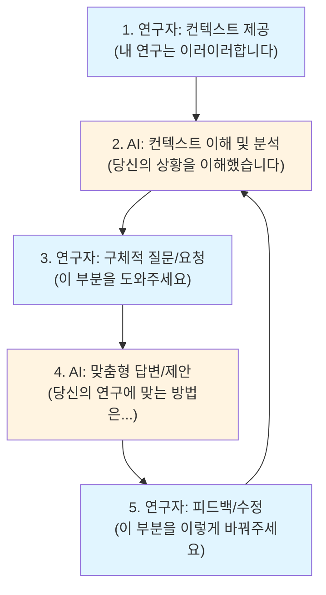
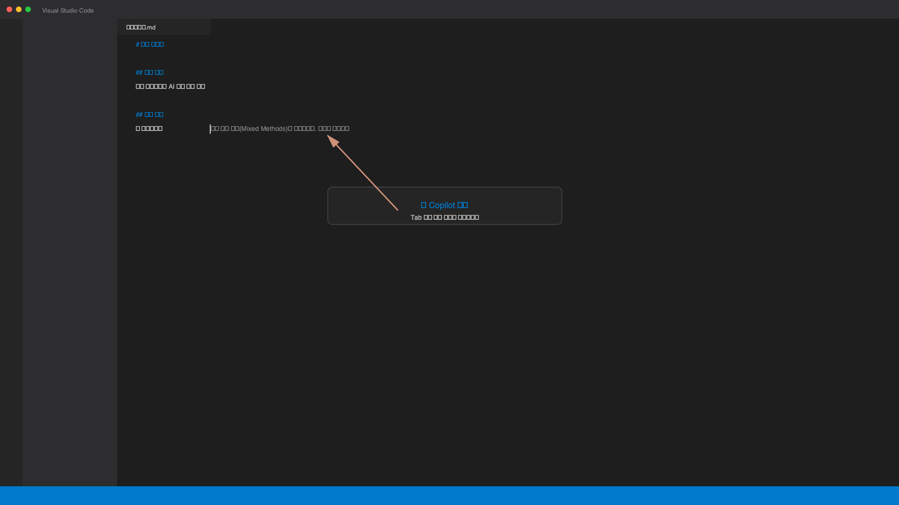
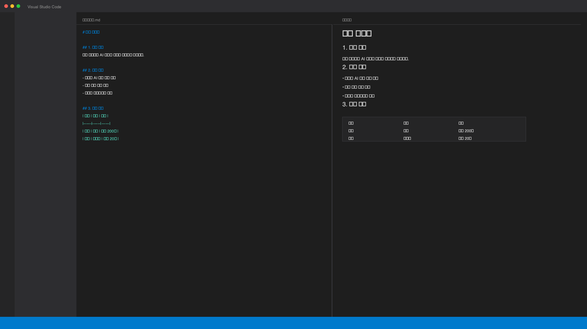
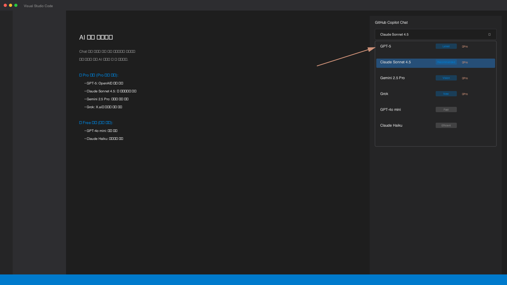
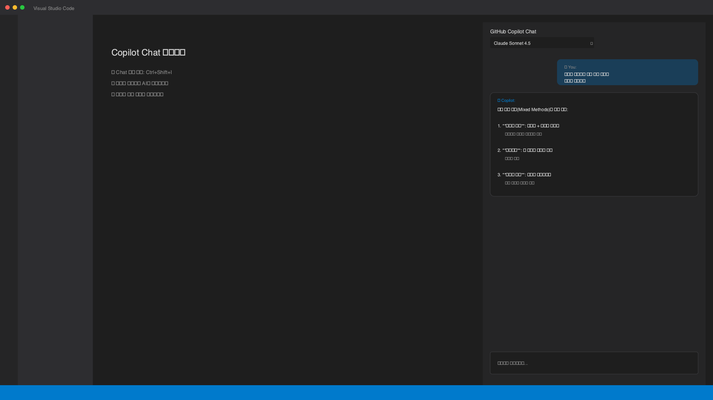
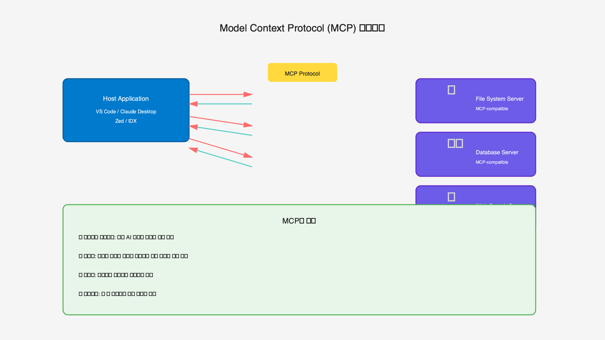
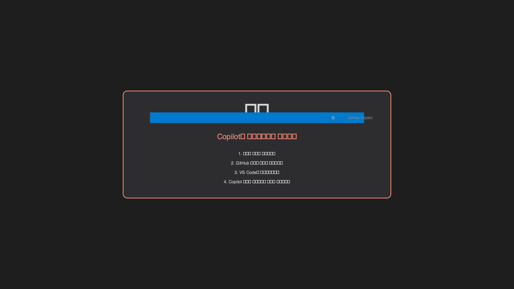

# 대학원생을 위한 실용적 AI 워크플로우 Part 1: 기초 편

**부제**: Context Engineering + Markdown + AI 기본

<!-- 
버전 관리 메타데이터:
- 버전: Part 1
- 최종 수정일: 2025-11-14
- 기반: v12.0 Sections 1-4 + 2025 GitHub Copilot 신기능
- 대상: 다양한 전공의 대학원생 (코딩 지식 불필요)
- 목적: AI 시대의 연구 기본기 다지기
- 특징: 학생 무료 도구, 즉시 적용 가능, Part 2/3으로 확장
- 2025 신기능: Agent mode, Custom Instructions, Multi-model, Vision, MCP
-->

## 📚 Part 1 소개

이 문서는 **대학원생을 위한 실용적 AI 워크플로우** 전체 시리즈 중 **Part 1: 기초 편**입니다.

### 📖 전체 시리즈 구성

- **Part 1 (기초 편)** ← 현재 문서
  - Context Engineering 기본
  - Markdown 문서 체계
  - GitHub Copilot 2025 기능
  - MCP 개념 소개
  
- **Part 2 (고급 도구 편)** → 다음 단계
  - GitHub Copilot Workbook
  - MCP 서버 실습 (task-master-mcp)
  - SpecKit 활용
  
- **Part 3 (통합 워크플로우 편)** → 최종 단계
  - 실제 연구 프로젝트 전체 워크플로우
  - Part 1-2 통합 활용

### 🎯 Part 1 학습 목표

이 문서를 마치면 다음을 할 수 있습니다:

- ✅ AI 시대에 맞는 연구 문서 체계 구축
- ✅ GitHub Copilot으로 연구 효율성 향상
- ✅ Markdown으로 모든 연구 자료 일원화
- ✅ 컨텍스트 엔지니어링으로 AI 활용 극대화
- ✅ 2025년 최신 AI 모델 상황별 선택
- ✅ MCP 개념 이해 및 Part 2 준비

### ⏱️ 예상 소요 시간

- **읽기**: 약 2시간
- **실습**: 약 1시간
- **총**: 약 3시간 (한 번에 완주 또는 여러 세션 분할 가능)

---

## 📋 목차

1. [시작하기: 왜 체계적인 연구 관리가 필요한가?](#1-시작하기-왜-체계적인-연구-관리가-필요한가)
2. [기본 도구 준비하기](#2-기본-도구-준비하기)
3. [연구 컨텍스트 만들기](#3-연구-컨텍스트-만들기)
4. [Markdown으로 연구 문서 체계화하기](#4-markdown으로-연구-문서-체계화하기)
5. [AI와 함께 연구하기 - 기초](#5-ai와-함께-연구하기---기초)
6. [MCP 소개: AI 도구 연결의 새로운 표준](#6-mcp-소개-ai-도구-연결의-새로운-표준)
7. [실습 준비 완료 체크리스트](#7-실습-준비-완료-체크리스트)

---

## 1. 시작하기: 왜 체계적인 연구 관리가 필요한가?

### 1.1 연구 과정에서 흔히 겪는 문제들

#### 😰 대학원생들의 현실

```
문제 상황들
├── 📁 파일 관리 혼란
│   ├── "논문_최종.docx", "논문_진짜최종.docx", "논문_진짜진짜최종_v2.docx"
│   ├── 어디에 뭘 저장했는지 기억 안 남
│   ├── Google Drive, OneDrive, USB, 로컬에 파일 중복
│   └── 중요한 자료를 찾을 수 없음 (마감 직전에 발견)
├── 🤔 연구 방향 혼란
│   ├── 처음 계획과 다른 방향으로 흘러감
│   ├── 왜 이 연구를 시작했는지 잊어버림
│   ├── 중간에 주제가 바뀌어 기존 작업이 무의미해짐
│   └── 지도교수님께 진행상황 설명하기 어려움
├── ⏰ 시간 관리 실패
│   ├── 마감일이 다가와서야 급하게 시작
│   ├── 어떤 일을 먼저 해야 할지 모름
│   ├── 같은 작업을 반복해서 시간 낭비
│   └── 진행률을 가늠할 수 없어 불안함
└── 🤷 AI 도구 활용 실패
    ├── ChatGPT에게 막연한 질문만 던짐
    ├── 답변이 내 연구와 맞지 않음
    ├── 똑같은 질문을 매번 반복
    └── AI가 제대로 도와주지 못한다고 느낌
```

> 💡 **핵심 통찰**: 체계적인 워크플로우만으로도 많은 시간 절약할 수 있습니다!

### 1.2 체계적 관리의 힘

#### 🎯 Before vs After 비교

| 상황 | 체계적 관리 전 (❌) | 체계적 관리 후 (✅) |
|------|---------------------|---------------------|
| **파일 찾기** | 30분 헤매기 → 스트레스 | 3초 만에 찾기 → 즉시 작업 |
| **연구 진행상황 파악** | "음... 뭘 했더라?" → 불안 | 한눈에 보이는 진행률 → 자신감 |
| **지도교수 미팅** | 두서없는 설명 → 준비 부족 | 체계적인 보고 → 신뢰 향상 |
| **논문 작성** | 막막한 시작 → 지연 | 이미 정리된 자료 활용 → 빠른 완성 |
| **AI 활용** | 막연한 질문 → 쓸모없는 답변 | 구체적 컨텍스트 → 정확한 도움 |
| **협업** | 파일 주고받기 → 버전 충돌 | 통합 환경 → 원활한 소통 |

### 1.3 이 가이드의 목표

#### ✨ 핵심 철학: "단순하지만 강력하게"

```
🎯 우리의 목표
├── 📝 Markdown 하나로 모든 것을 관리
├── 🤖 AI를 연구 파트너로 활용
├── 📁 VS Code로 통합 환경 구축
├── 🚀 30분 만에 시작 가능한 워크플로우
└── 🔌 MCP로 도구 통합 (Part 2에서 실습)
```

**최신 업데이트** (2025-11-10 기준):
- 🆕 GitHub Copilot 2025 신기능 완전 반영
  - Agent mode (AI 연구 비서)
  - Multi-model 선택 (GPT-5, Claude Sonnet 4.5, Gemini 2.5 Pro, Grok)
  - Custom Instructions (AGENTS.md)
  - Prompt files (.prompt.md)
  - Vision (이미지 → 코드/분석)
  - Next Edit Suggestions
- 🆕 MCP (Model Context Protocol) 소개 및 준비
- 🆕 3-part 구조로 체계화 (기초 → 고급 → 통합)
- 🆕 학생 무료 혜택 최신 정보 (Student Developer Pack)

**핵심 원칙**:
- ❌ 복잡한 도구 설치 NO
- ❌ 어려운 기술 용어 NO  
- ❌ 프로그래밍 지식 필요 NO
- ✅ 바로 적용 가능한 방법 YES
- ✅ 모든 전공에서 사용 가능 YES (인문·사회·자연·공학)
- ✅ 점진적 학습 가능 YES
- ✅ 무료 도구 우선 YES (학생 혜택 활용)

#### 📖 이 문서를 읽는 방법

**처음 읽는 분**:
1. 순서대로 Section 1-5까지 읽으며 실습
2. Section 6 (MCP)는 개념만 이해 (Part 2에서 상세)
3. Section 7 체크리스트로 준비 상태 확인

**바쁜 분**:
1. Section 1.2 (Before/After 비교) + Section 2.2 (학생 혜택) 읽기
2. Section 5.1 (AI 모델 선택) 실습
3. 나머지는 필요할 때 참조

---

## 2. 기본 도구 준비하기

### 2.1 필수 도구 3가지 (무료!)

#### 🛠️ 도구 준비 체크리스트

```
□ Visual Studio Code (무료 텍스트 에디터)
  ├── 최신 버전: v1.106 (2025-11 기준)
  ├── 모든 OS 지원: Windows, macOS, Linux
  └── 설치 시간: 약 5분

□ GitHub Copilot (AI 코딩 어시스턴트)
  ├── Free tier: 월 2,000 completions + 50 premium requests
  ├── 학생 Pro: 무제한 completions + 300 premium requests (완전 무료!)
  └── 설치 시간: 약 5분

□ 웹 브라우저 (Chrome, Safari, Edge, Firefox 등)
  ├── 이미 설치되어 있음
  └── GitHub Education Pack 신청용

⏱️ 총 설치 시간: 약 15-20분
💰 총 비용: 완전 무료 (학생 계정 기준)
🎓 학생 혜택: GitHub Student Developer Pack 신청 필수!
```

### 2.2 GitHub Copilot 학생 무료 혜택 (2025-11-10 기준)

#### 🎁 Student Developer Pack이란?

GitHub가 학생들에게 제공하는 **무료 개발 도구 패키지**입니다.
핵심은 **GitHub Copilot Pro 완전 무료** 사용!

#### 💰 Free vs Pro 비교 (2025-11 기준)

| 기능 | Free Tier | **Pro (학생 무료)** |
|------|-----------|---------------------|
| 코드 완성 횟수 | 월 2,000회 | ✨ **무제한** |
| Premium 요청 | 50회/월 | ✨ **300회/월** |
| AI 모델 선택 | 제한적 (기본 모델만) | ✨ **전체 모델** (GPT-5, Claude, Gemini, Grok) |
| Chat 기능 | 제한적 | ✨ 전체 기능 |
| Agent mode | ❌ | ✨ ✅ |
| Custom Instructions | ❌ | ✨ ✅ |
| Vision (이미지 분석) | ❌ | ✨ ✅ |
| 월 비용 | 무료 | ✨ **무료 (학생)** / $10 (일반) |

> 💡 **핵심**: 학생이라면 **무조건 Pro 혜택을 신청**하세요!  
> Free tier도 훌륭하지만, Pro는 연구용으로 훨씬 강력합니다.

**출처**: [GitHub Copilot Plans](https://github.com/features/copilot/plans) (2025-11-10 확인)

#### 📝 Student Developer Pack 신청 방법 (10분 완료)

**Step 1: GitHub 계정 생성** (이미 있으면 Skip)
1. https://github.com 방문
2. "Sign up" 클릭
3. 개인 이메일로 계정 생성 (학교 이메일은 다음 단계에서)

**Step 2: Education Pack 신청**
1. https://education.github.com/pack 방문
2. "Get your pack" 클릭
3. **학교 이메일** 입력 (@university.ac.kr 등)
   - 학교 이메일이 없다면: 학생증 + 재학증명서 업로드
4. 학교 정보 입력 (영문 학교명, 졸업 예정일)
5. 사용 목적 간단히 작성 (2-3문장)
   - 예: "I will use GitHub Copilot for my graduate research in education technology and data analysis."

**Step 3: 승인 대기 및 활성화**
- 승인 시간: 보통 **1-3일** (빠르면 몇 시간)
- 이메일 확인: 승인 알림 받기
- VS Code에서 Copilot 로그인 → 자동으로 Pro 활성화!

**문제 해결**:
- 학교 이메일 인식 안 됨 → 학생증 + 재학증명서 업로드
- 승인 거부 → 서류 재제출 (3개월 이내 발급 서류 사용)
- Pro 미적용 → VS Code 재로그인 또는 https://github.com/settings/copilot 확인

> 📚 **상세 가이드**: `resources/01_github_copilot_student_guide.md` 참조

### 2.3 Visual Studio Code 설치 및 설정

#### 📥 Step 1: VS Code 다운로드 및 설치

```
🌐 다운로드
├── 공식 사이트: https://code.visualstudio.com/
├── OS 자동 감지 (Windows/macOS/Linux)
└── "Download" 버튼 → 설치 파일 실행

⏱️ 설치: 약 5분
💾 용량: 약 300MB
```

**설치 시 권장 옵션** (Windows):
- ✅ "Add to PATH" 체크
- ✅ "Create a desktop icon" 체크
- ✅ "Register Code as an editor for supported file types" 체크

**macOS/Linux**: 기본 설정으로 진행

#### 🔌 Step 2: GitHub Copilot 확장 설치

**방법 1: Marketplace에서 설치** (추천)
1. VS Code 실행
2. 왼쪽 사이드바에서 Extensions 클릭 (또는 `Ctrl+Shift+X` / `Cmd+Shift+X`)
3. 검색창에 "GitHub Copilot" 입력
4. "GitHub Copilot" (by GitHub) 클릭
5. "Install" 버튼 클릭
6. VS Code 재시작 (필요 시)

**방법 2: Command Palette로 설치**
1. `Ctrl+Shift+P` (Windows) / `Cmd+Shift+P` (Mac)
2. "Extensions: Install Extensions" 입력
3. "GitHub Copilot" 검색 및 설치

#### 🔐 Step 3: GitHub 로그인

1. 하단 상태바에서 **GitHub Copilot 아이콘** 클릭
2. "Sign in to GitHub" 선택
3. 브라우저가 열리면 GitHub 계정으로 로그인
4. "Authorize GitHub Copilot" 승인
5. VS Code로 돌아오면 자동 활성화

**활성화 확인**:
- 하단 상태바에 **Copilot 아이콘**

#### 🎨 Step 4: 기본 설정 (선택사항)

**테마 설정**:
1. `Ctrl+K Ctrl+T` (Windows) / `Cmd+K Cmd+T` (Mac)
2. 선호하는 테마 선택 (Dark+, Light+ 등)

**폰트 크기 조정**:
1. `Ctrl+,` (Settings)
2. "Font Size" 검색
3. 원하는 크기 입력 (기본 14, 권장 16-18)

### 2.4 작업 환경 구성

#### 📁 연구 폴더 구조 만들기(영문으로 추천함)

**구조 예(한글)**:
```
내연구/
├── 00_컨텍스트/
│   ├── 연구컨텍스트.md
│   └── AGENTS.md (Part 2에서 작성)
├── 01_계획/
│   ├── 연구계획서.md
│   └── 주간계획.md
├── 02_자료수집/
│   ├── 문헌정리.md
│   └── 인터뷰노트/
├── 03_분석/
│   ├── 데이터분석.md
│   └── 결과정리.md
├── 04_작성/
│   ├── 논문초안.md
│   └── 발표자료/
└── README.md (프로젝트 개요)
```

**구조 예(영문)**:
```
my-research/
├── 00_context/
│   ├── research-context.md
│   └── AGENTS.md
├── 01_planning/
│   ├── research-proposal.md
│   └── weekly-plan.md
├── 02_literature/
│   ├── literature-review.md
│   └── notes/
├── 03_data/
│   ├── analysis.md
│   └── results/
├── 04_writing/
│   ├── paper-draft.md
│   └── presentations/
└── README.md
```

#### 🚀 VS Code에서 폴더 열기

**방법 1: File 메뉴**
1. File → Open Folder...
2. 생성한 연구 폴더 선택
3. "Select Folder" 클릭

**방법 2: 드래그 앤 드롭**
- 폴더를 VS Code 아이콘이나 창으로 드래그


#### ✅ 환경 설정 완료 체크

```
기본 설정 확인
□ VS Code가 정상적으로 실행됨
□ GitHub Copilot 아이콘이 하단 상태바에 보임
□ Copilot Pro 활성화 확인 (학생 혜택 신청 완료 시)
□ 연구 폴더가 VS Code에 열림
□ Markdown 파일 (.md) 생성 및 편집 가능
□ `Ctrl+Shift+P` (Command Palette) 작동 확인

다음 단계 준비
□ Section 3으로 이동 (연구 컨텍스트 작성)
□ `resources/02_vscode_setup_checklist.md` 추가 참조
```

> 💡 **팁**: VS Code 단축키가 낯설다면 `Ctrl+K Ctrl+S`로 Keyboard Shortcuts 참조

---

## 3. 연구 컨텍스트 만들기

### 3.1 컨텍스트란 무엇인가?

#### 🧠 컨텍스트의 정의

**컨텍스트 (Context)** = AI가 나의 연구를 정확히 이해할 수 있도록 제공하는 **배경 정보**

```
🎭 연극 비유로 이해하기
├── 🎬 감독(AI)에게 상황 설명
│   └── "이 연극은 조선시대 배경이고, 주인공은 학자입니다"
├── 📝 대본(연구 내용) 제공  
│   └── "연구 주제는 온라인 학습 효과성 분석입니다"
├── 🎯 목표(연구 목적) 명시
│   └── "학습자 참여도를 높이는 방법을 찾고 싶습니다"
└── 🎪 무대(연구 환경) 설정
    └── "6개월, 석사 논문, 제한된 예산"
```

#### 💡 컨텍스트의 힘: 실제 사례

**❌ 컨텍스트 없는 질문**:
> "설문조사 분석해줘"

**AI 응답**:
> "설문조사 데이터를 분석하려면 Excel이나 SPSS를 사용하세요. 기술통계와 추론통계를 실시하면 됩니다."  
> → 너무 일반적, 내 상황과 맞지 않음

**✅ 컨텍스트 있는 질문**:
> **[컨텍스트]**  
> 나는 교육학 석사과정 학생입니다. 대학생 200명을 대상으로 온라인 학습 만족도를 5점 척도로 조사했습니다. 
> 변인: 성별, 학년, 전공, 만족도(5점 척도), 학습성과(점수)
> 
> **[질문]**  
> 성별/학년/전공별로 만족도에 차이가 있는지 분석하고, 만족도가 학습성과에 미치는 영향을 알고 싶습니다. 
> Python pandas로 분석 코드를 작성해주세요.

**AI 응답**:
> "교육학 연구에 적합한 분석 방법을 제안합니다:
> 
> 1. 기술통계: 성별/학년/전공별 만족도 평균과 표준편차
> 2. 차이 검증: 독립표본 t-test (성별), ANOVA (학년/전공)
> 3. 상관분석: 만족도 ↔ 학습성과 Pearson correlation
> 4. 회귀분석: 만족도가 학습성과에 미치는 영향
> 
> Python 코드:
> ```python
> import pandas as pd
> import scipy.stats as stats
> import matplotlib.pyplot as plt
> 
> # 데이터 로드
> df = pd.read_csv('survey_data.csv')
> 
> # 1. 기술통계
> print(df.groupby(['gender', 'year', 'major'])['satisfaction'].describe())
> ...
> ```
> → 구체적이고 즉시 사용 가능한 코드 제공!

**🎯 결과 차이**:
- 첫 번째: 일반론, 실행 불가
- 두 번째: 맞춤형 솔루션, 즉시 적용 가능

> 💡 **핵심**: 컨텍스트는 AI를 "일반 조수"에서 "전문 연구 파트너"로 만듭니다!

### 3.2 연구 컨텍스트 4요소

#### 🏗️ 컨텍스트 구성 요소

```
🎯 연구 컨텍스트 = Background + Specification + Plan + Task

📋 1. Background (배경)
├── 나는 누구인가? (전공, 학위과정, 연차)
├── 무엇을 연구하는가? (주제, 분야, 키워드)
├── 왜 이 연구를 하는가? (목적, 동기, 문제의식)
├── 어떤 제약이 있는가? (시간, 자원, 한계)
└── 이전에 한 작업은? (선행 연구, 기존 데이터)

📝 2. Specification (명세)
├── 구체적인 연구 질문 (RQ1, RQ2, ...)
├── 검증하고 싶은 가설 (H1, H2, ...)
├── 연구 방법과 설계 (정성/정량, 실험/조사)
├── 연구 대상 (모집단, 표본, 크기)
├── 변인 정의 (독립/종속/통제 변인)
└── 예상되는 결과 (무엇을 발견할 것인가?)

📅 3. Plan (계획)  
├── 단계별 일정 (milestone timeline)
├── 각 단계별 목표 및 산출물
├── 필요한 자원 (인력, 예산, 장비)
├── 위험 요소와 대응책 (risk management)
└── 검토/피드백 일정 (지도교수 미팅 등)

✅ 4. Task (작업)
├── 구체적인 할 일 목록 (actionable items)
├── 우선순위와 마감일
├── 완료 기준 (definition of done)
├── 진행 상황 추적 (progress tracking)
└── 막힌 부분/질문 사항 (blockers/questions)
```

#### 🔄 컨텍스트와 AI의 상호작용



> 💡 **핵심**: 컨텍스트는 한 번 작성으로 끝이 아닙니다!  
> 연구가 진행되면서 **지속적으로 업데이트**하세요.

### 3.3 컨텍스트 작성 실습

#### 📝 연구 컨텍스트 템플릿

**파일명**: `00_컨텍스트/연구컨텍스트.md`

```markdown
# 연구 컨텍스트

**작성일**: 2025-11-10  
**최종 업데이트**: [날짜]  
**버전**: v1.0

---

## 🎯 Background (연구 배경)

### 연구자 정보
- **이름**: [이름]
- **소속**: [대학교] [학과] [석사/박사]과정 [N]학기
- **전공**: [세부 전공 분야]
- **지도교수**: [교수님 성함] (전공: [교수님 전공])

### 연구 주제
- **한 문장 요약**: [핵심 주제를 한 문장으로]
- **키워드**: [키워드1], [키워드2], [키워드3], [키워드4], [키워드5]
- **연구 분야**: [학문 분야] → [세부 분야] → [구체적 주제]

### 연구 동기
- **문제의식**: [왜 이 연구가 필요한가?]
- **선행 연구 gap**: [기존 연구에서 부족한 점]
- **기대 기여**: [이 연구로 무엇을 밝히고 싶은가?]

### 사용 가능한 자원
- **기간**: [시작일] ~ [종료일] (총 N개월)
- **예산**: [있다면 명시, 없다면 "제한적"]
- **장비/도구**: [사용 가능한 도구]
- **협력자**: [혼자/팀]

### 제약 조건
- [제약사항 1: 예) 시간 부족]
- [제약사항 2: 예) 표본 확보 어려움]
- [제약사항 3: 예) 특정 방법론 사용 불가]

---

## 📋 Specification (연구 명세)

### 핵심 연구 질문 (Research Questions)
1. **RQ1**: [첫 번째 연구 질문]
   - 예상 답변: [가설 또는 예상]
2. **RQ2**: [두 번째 연구 질문]
   - 예상 답변: [가설 또는 예상]
3. **RQ3** (선택): [세 번째 연구 질문]

### 가설 (Hypotheses)
- **H1**: [가설 1]
- **H2**: [가설 2]
- **H0** (귀무가설): [기각하고 싶은 가설]

### 연구 방법
- **연구 설계**: [실험/조사/질적 연구/혼합 방법]
- **자료 수집 방법**: [설문/인터뷰/관찰/문헌분석]
- **분석 방법**: [통계분석/내용분석/담화분석]

### 연구 대상
- **모집단**: [전체 대상 집단]
- **표본**: [실제 연구 대상]
- **표본 크기**: [N명/N개]
- **표집 방법**: [무작위/편의/층화...]

### 변인 정의 (정량 연구인 경우)
- **독립 변인**: [X변인]
- **종속 변인**: [Y변인]
- **통제 변인**: [Z1, Z2, ...]
- **측정 도구**: [척도, 도구명]

### 예상 결과
- [무엇을 발견할 것으로 예상하는가?]
- [결과가 연구 질문에 어떻게 답하는가?]

---

## 📅 Plan (연구 계획)

### 전체 일정

| 단계 | 기간 | 목표 | 산출물 | 상태 |
|------|------|------|--------|------|
| **1. 문헌 조사** | [월] ~ [월] | 선행연구 100편 리뷰 | 문헌정리.md | ⏳ 진행중 |
| **2. 연구 설계** | [월] ~ [월] | 방법론 확정, IRB 승인 | 연구계획서.md | 📝 대기중 |
| **3. 자료 수집** | [월] ~ [월] | 설문/인터뷰 완료 | 데이터파일 | 📝 대기중 |
| **4. 자료 분석** | [월] ~ [월] | 통계 분석 완료 | 분석결과.md | 📝 대기중 |
| **5. 논문 작성** | [월] ~ [월] | 초고 완성 | 논문초안.md | 📝 대기중 |
| **6. 수정/제출** | [월] ~ [월] | 최종 제출 | 최종논문.pdf | 📝 대기중 |

**마일스톤**:
- 🎯 [날짜]: 문헌 조사 완료
- 🎯 [날짜]: IRB 승인
- 🎯 [날짜]: 데이터 수집 완료
- 🎯 [날짜]: 분석 완료
- 🎯 [날짜]: 초고 완성
- 🎯 [날짜]: 최종 제출

### 주요 위험 요소 및 대응

| 위험 | 발생 가능성 | 영향도 | 대응 방안 |
|------|-------------|--------|-----------|
| 표본 확보 실패 | 중 | 높음 | 온라인 설문 + 인센티브 제공 |
| 분석 도구 미숙 | 중 | 중 | AI 활용 + 온라인 강의 수강 |
| 일정 지연 | 높음 | 중 | 여유 기간 2주 확보 |

### 정기 검토 일정
- **지도교수 미팅**: [주기] (예: 격주 금요일 10시)
- **동료 세미나**: [주기] (예: 매주 수요일 14시)
- **자체 점검**: [주기] (예: 매주 일요일 저녁)

---

## ✅ Task (현재 작업)

### 이번 주 할 일 (Week of [날짜])

- [ ] **[Task 1]**: [구체적인 작업 내용]
  - 마감: [날짜]
  - 상태: 🔴 시작 전 / 🟡 진행중 / 🟢 완료
  - 예상 시간: [N시간]
  
- [ ] **[Task 2]**: [구체적인 작업 내용]
  - 마감: [날짜]
  - 상태: 🔴 시작 전 / 🟡 진행중 / 🟢 완료
  - 예상 시간: [N시간]

- [ ] **[Task 3]**: [구체적인 작업 내용]
  - 마감: [날짜]
  - 상태: 🔴 시작 전 / 🟡 진행중 / 🟢 완료
  - 예상 시간: [N시간]

### 막힌 부분 / 질문 사항

1. **[문제/질문 1]**:
   - 상황: [무엇이 막혔는가?]
   - 시도한 해결 방법: [지금까지 시도한 것]
   - 필요한 도움: [어떤 도움이 필요한가?]

2. **[문제/질문 2]**: ...

### 완료한 작업 (지난주)

- ✅ [완료한 작업 1] - [날짜]
- ✅ [완료한 작업 2] - [날짜]
- ✅ [완료한 작업 3] - [날짜]
```

**작성 팁**:
- 이 템플릿을 복사하여 실제 내용으로 채우세요
- `[ ]` 부분은 실제 내용으로 대체
- 불필요한 섹션은 삭제 가능
- 연구가 진행되면서 지속 업데이트!

**관련 파일**:
- 상세 가이드: `resources/04_context_template_2025.md`
- 전공별 예시: `resources/10_discipline_examples.md`

#### 🎓 전공별 컨텍스트 작성 예시

**교육학 예시**:

```markdown
## 🎯 Background

### 연구자 정보
- **이름**: 김교육
- **소속**: 서울대학교 교육학과 석사과정 2학기
- **전공**: 교육공학 (Educational Technology)
- **지도교수**: 박테크 교수 (전공: 교육공학, 온라인 학습)

### 연구 주제
- **한 문장 요약**: 대학 온라인 수업에서 학습자 참여를 높이는 gamification 전략의 효과 분석
- **키워드**: gamification, online learning, student engagement, higher education, motivation
- **연구 분야**: 교육학 → 교육공학 → 온라인 학습 설계

### 연구 동기
- **문제의식**: 코로나 이후 온라인 수업이 증가했으나, 학습자 참여도가 대면 수업 대비 현저히 낮음 (평균 40% 감소, 2024 통계)
- **선행 연구 gap**: gamification 연구는 K-12에 집중, 대학 수준 연구 부족. 특히 한국 맥락 연구 거의 없음
- **기대 기여**: 한국 대학생에게 효과적인 gamification 전략 발굴, 실제 수업에 적용 가능한 가이드라인 제시

### 사용 가능한 자원
- **기간**: 2025-03 ~ 2025-08 (6개월)
- **예산**: 제한적 (설문 인센티브 소액만 가능)
- **장비/도구**: LMS (Canvas), Python (데이터 분석), 온라인 설문 도구
- **협력자**: 혼자 진행, 담당 교수님 1명 협조 가능

### 제약 조건
- 실제 수업 접근 어려움 (학기 중 실험 제한)
- 통제 집단 설정 어려움 (윤리적 이슈)
- 장기 추적 불가 (한 학기 한정)

## 📋 Specification

### 핵심 연구 질문
1. **RQ1**: gamification 요소(배지, 리더보드, 퀘스트)가 학습자 참여도에 유의미한 영향을 미치는가?
   - 예상: 긍정적 영향, 특히 퀘스트 요소가 가장 효과적
2. **RQ2**: 학습자 특성(내적 동기, 게임 경험)에 따라 효과가 다른가?
   - 예상: 내적 동기 높은 학생은 효과 적음, 게임 경험 많은 학생은 효과 큼

### 가설
- **H1**: gamification 적용 수업의 참여도가 일반 수업보다 높다
- **H2**: 퀘스트 > 배지 > 리더보드 순으로 효과 크다
- **H3**: 게임 경험 많은 학생일수록 참여도 증가폭이 크다

### 연구 방법
- **연구 설계**: 준실험 설계 (quasi-experimental), 사전-사후 비교
- **자료 수집**: 온라인 설문 (사전/사후) + LMS 로그 데이터 (참여 지표)
- **분석 방법**: 
  - 양적: t-test, ANOVA, 회귀분석 (Python pandas, scipy)
  - 질적: 개방형 응답 내용분석 (AI 보조)

### 연구 대상
- **모집단**: 한국 4년제 대학생 (18-24세)
- **표본**: A대학교 교양 수업 수강생 200명 (실험군 100, 비교군 100)
- **표집**: 편의표집 (협조 가능한 교수님 수업)

### 변인 정의
- **독립 변인**: gamification 적용 여부 (적용/미적용)
- **종속 변인**: 
  - 학습 참여도 (출석, 과제 제출률, 토론 참여 횟수)
  - 학습 만족도 (5점 척도)
  - 학업 성취도 (기말 성적)
- **통제 변인**: 학년, 성별, 전공, 사전 GPA
- **조절 변인**: 내적 동기, 게임 경험

### 예상 결과
- gamification 그룹이 참여도 20-30% 높을 것
- 만족도도 유의미하게 높을 것 (0.5점 이상 차이)
- 학업 성취도는 소폭 상승 또는 차이 없을 것 (단기간이라)
```

**공학 예시**:

```markdown
## 🎯 Background

### 연구자 정보
- **이름**: 이공학
- **소속**: KAIST 전기전자공학부 박사과정 5학기
- **전공**: 머신러닝, 컴퓨터 비전
- **지도교수**: 최AI 교수 (전공: Deep Learning)

### 연구 주제
- **한 문장 요약**: 저조도 환경에서 객체 검출 성능을 개선하는 경량 딥러닝 모델 개발
- **키워드**: object detection, low-light, lightweight model, edge computing, YOLO
- **연구 분야**: 전기전자공학 → 컴퓨터 비전 → 실시간 객체 검출

### 연구 동기
- **문제의식**: 야간 CCTV, 자율주행 야간 주행에서 객체 검출 정확도 급격히 하락 (정상 대비 40-60% 감소)
- **선행 연구 gap**: 기존 방법은 전처리(image enhancement) 후 검출 → 속도 느림. End-to-end 경량 모델 필요
- **기대 기여**: 실시간 처리 가능한(30 FPS+) 경량 모델, 엣지 디바이스 탑재 가능

### 사용 가능한 자원
- **기간**: 2024-09 ~ 2026-02 (18개월)
- **예산**: 연구비 충분 (GPU 서버, 데이터셋 구매 가능)
- **장비**: 
  - GPU: NVIDIA A100 x4 (학교 서버)
  - 엣지 디바이스: Jetson Nano, Raspberry Pi 4
  - 카메라: 야간 촬영용 IR 카메라 3대
- **협력자**: 공동 연구원 1명, 학부 인턴 2명

### 제약 조건
- 실제 야간 데이터 수집 어려움 (날씨, 시간 제약)
- 라벨링 비용 높음
- 엣지 디바이스 메모리 제한 (모델 크기 50MB 이하)

## 📋 Specification

### 핵심 연구 질문
1. **RQ1**: 저조도 환경에서 기존 YOLO 대비 mAP 10% 이상 향상 가능한가?
2. **RQ2**: 모델 크기 50MB 이하, 추론 속도 30 FPS 이상 달성 가능한가?
3. **RQ3**: 다양한 조도(0.01 lux ~ 100 lux)에서 일관된 성능 유지 가능한가?

### 가설
- **H1**: attention mechanism을 통한 특징 강화로 저조도 성능 향상
- **H2**: knowledge distillation으로 경량화하면서 성능 유지 가능
- **H3**: multi-scale training으로 다양한 조도에 robust

### 연구 방법
- **연구 설계**: 딥러닝 모델 개발 + 실험적 검증
- **데이터셋**: 
  - 기존: ExDark, DARK FACE, BDD100K-night (총 50K 이미지)
  - 자체 수집: 캠퍼스 야간 영상 5K 프레임 (라벨링 필요)
- **분석**: 
  - 성능 지표: mAP@0.5, mAP@0.75, FPS
  - 비교 모델: YOLOv8, RT-DETR, YOLO-NAS
  - 통계: paired t-test, ablation study

### 예상 결과
- mAP@0.5: 기존 42% → 제안 모델 54% (목표)
- 모델 크기: 45MB (YOLOv8-n 기반)
- 추론 속도: Jetson Nano에서 35 FPS
```

> 📚 **더 많은 예시**: `resources/10_discipline_examples.md` 참조  
> (인문학, 사회과학, 자연과학 등)

### 3.4 AI가 컨텍스트를 이해하는 방법 (간략)

#### 🧮 토큰 (Token)과 컨텍스트 윈도우

**토큰이란?**
- AI가 텍스트를 처리하는 기본 단위
- 대략 단어 1개 = 1.3 토큰 (한글), 1 토큰 (영어)
- 예: "대학원생을 위한 AI 워크플로우" = 약 10 토큰

**컨텍스트 윈도우**:
- AI가 한 번에 처리할 수 있는 최대 토큰 수
- GitHub Copilot 2025 모델별 윈도우:
  - GPT-5: 128K 토큰 (약 10만 단어)
  - Claude Sonnet 4.5: 200K 토큰 (약 15만 단어)
  - Gemini 2.5 Pro: **1M 토큰** (약 75만 단어) ← 최대!

> 💡 **실용 팁**: 
> - 긴 논문 요약: Claude Sonnet 4.5 또는 Gemini 2.5 Pro 사용
> - 일반 작업: GPT-5로 충분
> - 자세한 모델 선택: Section 5.1 참조

#### 📝 Markdown이 컨텍스트에 최적인 이유

```
비교: Word vs Markdown

📄 Word 문서 (.docx)
├── 복잡한 XML 구조
├── 포맷 정보가 내용의 70% 차지
├── AI가 읽기 어려움
├── 토큰 낭비
└── 버전 관리 불가

📝 Markdown 문서 (.md)
├── 순수 텍스트
├── 포맷 정보 최소 (5% 미만)
├── AI가 읽기 쉬움
├── 토큰 효율적
└── Git으로 버전 관리 완벽
```

**결론**: Markdown = AI 시대 최적 문서 형식! (다음 Section에서 상세)

#### 🔗 MCP와 컨텍스트 (예고편)

**Model Context Protocol (MCP)**:
- AI가 외부 도구/데이터에 접근하는 표준
- 예: AI가 직접 Zotero에서 논문 가져오기, Notion 데이터베이스 읽기
- **Part 2**에서 task-master-mcp 실습 예정
- Section 6에서 개념 소개

> 🎯 **현재 단계**: 우선 컨텍스트 파일 작성에 집중!  
> MCP는 고급 기능이므로 Part 2로 미뤄도 됩니다.

---

## 4. Markdown으로 연구 문서 체계화하기

### 4.1 Markdown이 연구에 최적인 이유

#### 🌟 Markdown의 장점

> **Markdown의 원래 목적**: 웹에서 텍스트를 "쉽게 쓰고, 읽고, 편집"할 수 있도록 만든 가볍고 깔끔한 문법. 복잡한 서식 없이도 의미와 구조를 명확히 전달할 수 있도록 설계됨

```
✨ 왜 Markdown(마크다운)인가?
├── 📝 간단한 문법으로 빠른 작성
├── 🔄 어떤 프로그램에서든 열림 (호환성 100%)
├── 📊 표, 목록, 링크 등 체계적 정리 가능
├── 🤖 AI가 이해하기 쉬운 구조
├── 📱 모든 기기에서 동일하게 보임
└── 💾 용량이 작아 빠른 동기화
```

> **Markdown을 사용하는 진짜 이유**: 생성형 AI와 대화할 때 **context 한계**가 결정적임
> - 웹 기반 AI는 8K~약 200K 토큰밖에 못 봄. PDF·Word는 서식 코드만 수백 줄이어서 금방 토큰을 사용해버림  
> - Markdown은 **순수 텍스트 + 최소 문법**이라 동일한 내용을 30~70 % 적은 토큰으로 전달 가능  
> - **GitHub Copilot**은 VS Code 내부에서 문서를 **잘개 쪼개거나 임베딩**해 자동으로 context 초과를 피함
> 결국 "AI가 내 연구 전체를 잡아챌 수 있게" 하려면 **Markdown이 가장 가볍고 안전한 포맷**

> - **토큰(Token)**: 대규모 언어 모델이 텍스트를 처리할 때 사용하는 최소 단위, 모델·토크나이저에 따라 토큰 수가 다를 수 있음. 예: "안녕하세요"는 토크나이저에 따라 2~5토큰으로 분해될 수 있음  
> - **임베딩**: 글을 숫자로 바꿔 AI가 이해하도록 '변환하는' 작업. 예: "고양이" → [0.2, ‑0.8, 0.5 …] 같은 벡터로 변경

#### 📈 워드 프로세서(Word, 한글) vs Markdown 비교

| 기능 | Microsoft Word,<br>한글(hwp) | Markdown |
|------|----------------|----------|
| **학습 난이도** | 중간 | 매우 쉬움 |
| **파일 크기** | 큰 편 | 매우 작음 |
| **호환성** | 제한적 | 완벽 |
| **버전 관리** | 어려움 | 쉬움 |
| **AI 활용** | 제한적 | 최적화 |
| **협업** | 복잡 | 간단 |
| **비용** | 유료 | 무료 |

> 💡 **핵심**: Markdown은 AI 시대에 최적화된 문서 형식!

### 4.2 연구에 필요한 Markdown 문법

#### 📚 기본 문법 (5분 마스터)

```markdown
# 제목 1 (가장 큰 제목, 주로 문서 전체의 제목에 사용됨)
## 제목 2 (중간 제목)  
### 제목 3 (작은 제목)

**굵은 글씨** 또는 __굵은 글씨__
*기울임 글씨* 또는 _기울임 글씨_

- 목록 항목 1
- 목록 항목 2
  - 하위 항목 2-1
  - 하위 항목 2-2

1. 번호 목록 1
2. 번호 목록 2
3. 번호 목록 3

[링크 텍스트](https://example.com)


> 인용문이나 중요한 내용

`코드나 강조할 단어`

| 표 제목 1 | 표 제목 2 |
|----------|----------|
| 내용 1   | 내용 2   |
| 내용 3   | 내용 4   |
```



#### 🎯 연구 문서에 특화된 활용법

**📋 체크리스트 만들기**:
```markdown
## 이번 주 할 일
- [x] 문헌 조사 완료
- [x] 설문지 초안 작성
- [ ] 지도교수님 검토 요청
- [ ] IRB 신청서 준비
- [ ] 예비 조사 계획 수립
```

**📊 연구 진행 상황 표시**:
```markdown
## 연구 진행률

### 전체 진행률: 65%

| 단계 | 진행률 | 상태 |
|------|--------|------|
| 문헌 조사 | 100% | ✅ 완료 |
| 연구 설계 | 80% | 🔄 진행중 |
| 데이터 수집 | 30% | 📅 예정 |
| 분석 | 0% | ⏳ 대기 |
```

**🔗 연구 자료 연결하기**:
```markdown
## 참고 자료
- [핵심 논문 1](./참고자료/논문1.pdf) - 이론적 배경
- [설문지 초안](./자료수집/설문지_v1.md) - 검토 필요
- [분석 계획](./분석/분석계획.md) - 통계 방법 정리
- [회의록 모음](./회의록/) - 지도교수 미팅 기록
```

### 4.3 연구 문서 템플릿

#### 📄 연구 계획서 템플릿

```markdown
# 연구 계획서

## 📋 기본 정보
- **연구 제목**: 
- **연구자**: 
- **지도교수**: 
- **작성일**: 
- **예상 완료일**: 

## 🎯 연구 개요
### 연구 배경 및 필요성
[왜 이 연구가 필요한가?]

### 연구 목적
[이 연구로 무엇을 달성하고 싶은가?]

### 연구 질문
1. [핵심 연구 질문]
2. [세부 연구 질문 1]
3. [세부 연구 질문 2]

## 📚 이론적 배경
### 선행 연구 검토
[관련 연구들의 주요 내용과 한계점]

### 이론적 프레임워크
[연구의 이론적 기반]

## 🔬 연구 방법
### 연구 설계
- **연구 유형**: [양적/질적/혼합]
- **연구 대상**: [누구를 대상으로?]
- **표본 크기**: [몇 명?]
- **표집 방법**: [어떻게 선정?]

### 자료 수집 방법
- **방법**: [설문/인터뷰/관찰/실험]
- **도구**: [사용할 도구나 장비]
- **절차**: [단계별 진행 방법]

### 자료 분석 방법
- **분석 방법**: [통계 분석/내용 분석 등]
- **사용 프로그램**: [SPSS/R/Excel 등]

## 📅 연구 일정
| 단계 | 기간 | 주요 활동 | 산출물 |
|------|------|----------|--------|
| 1단계 | 1-2월 | 문헌 조사 | 이론적 배경 정리 |
| 2단계 | 3월 | 연구 설계 | 설문지/인터뷰 가이드 |
| 3단계 | 4-5월 | 자료 수집 | 원시 데이터 |
| 4단계 | 6월 | 자료 분석 | 분석 결과 |
| 5단계 | 7-8월 | 논문 작성 | 최종 논문 |

## 💰 예산 계획
| 항목 | 금액 | 비고 |
|------|------|------|
| 설문 조사비 | 100,000원 | 응답자 사례비 |
| 통계 프로그램 | 50,000원 | SPSS 라이선스 |
| 인쇄비 | 30,000원 | 논문 인쇄 |
| **총계** | **180,000원** |  

## 🔍 기대 효과
### 학술적 기여
[학문 분야에 어떤 기여를 할 것인가?]

### 실용적 기여  
[실제 현장에 어떤 도움이 될 것인가?]

## 📚 참고문헌
1. [참고문헌 1]
2. [참고문헌 2]
3. [참고문헌 3]
```


#### 📊 주간 진행 보고서 템플릿

```markdown
# 주간 진행 보고서

## 📅 보고 기간
**기간**: 2025년 1월 20일 ~ 1월 26일  
**보고자**: [이름]  
**작성일**: 2025년 1월 27일

## ✅ 이번 주 완료 사항
- [x] [완료한 작업 1] - 소요시간: 5시간
- [x] [완료한 작업 2] - 소요시간: 3시간  
- [x] [완료한 작업 3] - 소요시간: 2시간

**총 작업 시간**: 10시간

## 🔄 진행 중인 작업
- [ ] [진행 중인 작업 1] - 진행률: 70%
- [ ] [진행 중인 작업 2] - 진행률: 30%

## 📋 다음 주 계획
- [ ] [다음 주 할 일 1] - 예상 소요시간: 4시간
- [ ] [다음 주 할 일 2] - 예상 소요시간: 6시간
- [ ] [다음 주 할 일 3] - 예상 소요시간: 2시간

## 🚨 이슈 및 문제점
### 발생한 문제
[어떤 문제가 있었는가?]

### 해결 방안
[어떻게 해결할 계획인가?]

### 도움 요청 사항
[지도교수님께 도움을 요청할 내용]

## 💡 새로운 아이디어/발견
[연구 과정에서 새롭게 발견한 내용이나 아이디어]

## 📈 전체 진행률
**현재 진행률**: 45%

| 단계 | 계획 | 실제 | 차이 |
|------|------|------|------|
| 문헌 조사 | 100% | 100% | ✅ |
| 연구 설계 | 80% | 75% | ⚠️ -5% |
| 데이터 수집 | 20% | 15% | ⚠️ -5% |

## 📝 특이사항
[기타 보고할 내용]
```

> 💡 **작성 팁**: 이 템플릿을/week 단위로 복사하여 업데이트!

### 4.4 VS Code에서 Markdown 활용하기

#### 🎨 Markdown 미리보기 및 편집

**미리보기 기능**:
1. `Ctrl+Shift+V` (Windows) / `Cmd+Shift+V` (Mac)
2. 或는 우측 클릭 → "Open Preview"
3. 실시간 미리보기와 편집 가능



**권장 확장 프로그램** (Part 2에서 상세히 다룰 예정):
- **Markdown All in One**: 완성도 높은 Markdown 에디팅
- **Markdown TOC**: 목차 자동 생성
- **Markdown PDF**: PDF로 출력
- **LaTeX Math**: 수식 입력 지원

#### 📝 효율적인 Markdown 작성 팁

**단축키 활용**:
- `Ctrl+B` (Windows) / `Cmd+B` (Mac): **굵은 글씨**
- `Ctrl+I` (Windows) / `Cmd+I` (Mac): *기울임*
- `Ctrl+Shift+[` / `Ctrl+Shift+]`: 제목 레벨 변경
- `Alt+Click`: 멀티 커서 편집

**에뮬레이터 사용**:
- `Tab`: 들여쓰기 또는 다음 목차
- `Enter`: 다음 줄
- `Shift+Enter`: 단락 내 줄바꿈

> 📚 **상세 가이드**: `resources/05_markdown_quick_reference.md` 참조

---

## 5. AI와 함께 연구하기 - 기초

### 5.1 GitHub Copilot 2025 신기능 소개

#### 🆕 2025년 주요 업데이트 (2025-11-10 기준)

```
🎉 GitHub Copilot 2025 신기능
├── 🤖 Agent mode
│   ├── AI가 연구 비서로 동작
│   ├── 작업을 자동으로 분석하고 제안
│   └── Complex multi-step 프로젝트 관리
├── 🔧 Custom Instructions
│   ├── AGENTS.md 파일로 연구 맞춤형 지침 설정
│   ├── Persistent 컨텍스트 유지
│   └── 연구 스타일별 맞춤화
├── 📁 Prompt files
│   ├── .prompt.md 파일로 반복 사용 프롬프트 저장
│   ├── 다양한 연구 상황별 프롬프트 템플릿
│   └── 효과적인 프롬프트 공유 및 재사용
├── 🎨 Multi-model selection
│   ├── GPT-5, Claude Sonnet 4.5, Gemini 2.5 Pro
│   ├── Grok, OpenAI 모델들 통합
│   └── 작업별 최적 모델 자동 추천
├── 👁️ Vision capabilities
│   ├── 이미지 업로드 및 분석
│   ├── 스크린샷에서 데이터 추출
│   ├── 차트/그래프 자동 분석
│   └── 손그림을 코드로 변환
└── 🔮 Next Edit Suggestions
    ├── AI가 다음 작업 예측 및 제안
    ├── 연구 진행 상황 기반 추천
    └── 논리적 다음 단계 자동 제안
```

> 💡 **핵심**: 2025 Copilot은 단순한 코드 완성 도구에서 **연구 파트너**로 진화했습니다!

#### 🤖 Agent mode 사용법

**Agent mode란?**
- AI가 연구 진행 상황을 이해하고 다음 단계를 제안
- 단순한 질문-답변을 넘어 **상호작용적 연구 지원**

**사용법**:
1. Copilot Chat에서 "Agent mode 활성화" 요청
2. 연구 컨텍스트 제공
3. AI가 진행 상황 분석 및 다음 단계 제안
4. 피드백 제공 → AI가 다시 제안 (반복)

**실제 사용 예시**:

```markdown
사용자: "Agent mode로 내 연구를 도와줘. 
- 연구 주제: 온라인 학습 참여도
- 현재 단계: 문헌 조사 중
- 막힌 점: 너무 많은 논문이 있'da
어떻게 진행해야 할까?"

AI (Agent mode):
"연구 진행 상황을 분석했습니다. 문헌 조사 단계에서
'너무 많은 자료' 문제는 매우 흔합니다. 

**제안하는 접근법**:
1. **체계적 필터링**: 5년 내, 인용수 50회 이상, 1차 저널만
2. **리뷰 논문 중심**: Systematic review, Meta-analysis 먼저
3. **특정 키워드**: 'student engagement', 'online learning', 'higher ed'

**다음 구체적 단계**:
1. 오늘: 핵심 키워드로 20개 논문 수집
2. 내일: 리뷰 논문 5개 선독
3. 주말: 정리 및 요약 완료

진행할까요? 구체적으로 어떤 keyword로 시작할까요?"
```

#### 🔧 Custom Instructions 설정

**AGENTS.md 파일 생성** (이름: `00_컨텍스트/AGENTS.md`):

```markdown
# 연구용 AI 에이전트 설정

## 개인 정보
- 이름: [이름]
- 전공: [전공]
- 연구 단계: [초기/진행/후기]

## 연구 스타일
- 작업 방식: [체계적/창의적/분석적]
- 선호하는 방법론: [정량/정성/혼합]
- 글쓰기 스타일: [형식적/비형식적/논문체]

## 선호하는 AI 응답 스타일
- 응답 길이: [간결/상세/매우 상세]
- 형식: [문항별/일관된 구조/자유형]
- 예시 포함: [필요/원하지 않음/상황에 따라]

## 반복 작업 및 자동화
- 체크리스트 선호: [사용/비사용]
- 진행률 추적: [편리/불편]
- 리마인더: [필요/불필요]

## 시간 관리 및 우선순위
- 마감일 관리: [엄격/유연]
- 빠른 결과 vs 품질: [균형/품질 우선]
- 새로운 작업 시작 시: [현재 작업 완료 후/즉시]

## 후속 조언 및 피드백
- 개선 제안: [상세 피드백/핵심 포인트만]
- 추가 질문: [친절히 유도/명료하게]
- 인용 및 참고문헌: [상세/기본/자동]
```

> 📚 **상세 가이드**: [AGENTS.md](AGENTS.md) 파일 참조 (Part 2에서 상세히 다룰 예정)

#### 📁 Prompt files 활용

**.prompt.md 파일 예시** (이름: `문헌요약.prompt.md`):

```markdown
# 문헌 요약용 프롬프트

## 목적
- 연구 문헌을 체계적으로 요약
- AI 활용으로 시간 절약

## 프롬프트 텍스트
다음 논문을 분석해서 요약해주세요:

**요약 요청**:
- 연구 목적과 연구 질문
- 연구 방법론 (표본, 도구, 절차)
- 주요 발견사항 (3-5개)
- 이론적 시사점
- 실용적 의미
- 한계점과 향후 연구 방향
- 내 연구와의 연관성

**출력 형식**:
- 각 섹션별로 명확히 구분
- 핵심 포인트는 불릿 포인트
- 중요한 수치나 통계 포함
- 내 연구에 적용 가능한 구체적 아이디어 제시

## 예시
다음은 2024년 Shin et al의 온라인 학습 참여도 연구입니다:
[논문 내용 붙여넣기]
```

**사용법**:
1. Copilot Chat에서 `[문헌요약]` 또는 `@문헌요약` 입력
2. 자동으로 위 프롬프트 자동 실행
3. 논문 내용 붙여넣기
4. 일관된 형식으로 결과 보장

#### 🎨 Multi-model 선택 전략

**모델별 특화 작업** (자세한 비교는 `resources/06_copilot_models_comparison.md` 참조):

```
🎯 작업별 최적 모델 선택 가이드

📚 문헌 조사 및 요약
- 우선: Claude Sonnet 4.5 (200K 토큰 컨텍스트)
- 대안: GPT-5, Gemini 2.5 Pro

💻 코드 작성 및 분석
- 우선: GPT-5-Codex (코딩 특화)
- 대안: Grok Code Fast 1, GPT-5

✍️ 논문 작성 및 교정
- 우선: Claude Opus 4.1 (학술 작성 최고)
- 대안: GPT-5, Claude Sonnet 4.5

👁️ 이미지/차트 분석
- 우선: Gemini 2.5 Pro (1M 토큰 + Vision)
- 대안: GPT-5 (Vision 지원)

⚡ 빠른 질문/요약
- 우선: GPT-5 mini, Claude Haiku 4.5
- 대안: Grok Code Fast 1
```

**VS Code에서 모델 변경하기**:
1. Copilot Chat 패널 상단 드롭다운 클릭
2. 원하는 모델 선택
3. Chat 지속 시에도 언제든지 변경 가능



#### 👁️ Vision capabilities 활용

**이미지 기반 연구 지원**:
1. 차트/그래프 스크린샷 업로드
2. AI가 데이터 자동 추출 및 분석
3. 손그림 다이어그램을 코드로 변환
4. 논문 내 이미지에서 텍스트 추출

**사용 예시**:

```markdown
사용자: "이 그래프를 분석해줘. 어떤 경향을 보여주나요?
*(이미지 첨부: 설문 응답 분포 차트)*

AI: "분석한 결과입니다:

**주요 경향**:
- 1-2점(불만족): 15% (30명)
- 3점(보통): 25% (50명) 
- 4-5점(만족): 60% (120명)

**시사점**:
- 전체적으로 긍정적 반응 (만족도 60%)
- 개선 필요 부분: 40%가 중립 또는 불만족
- 특히 1-2점 응답자는 추가 분석 필요

**제안**:
- 불만족 그룹별 특성 분석
- 불만족 이유 심층 인터뷰
- 개선 방안 도출"
```


#### 🔮 Next Edit Suggestions

**자동 다음 단계 제안**:
- AI가 연구 진행 상황 파악
- 논리적 다음 단계를 예측하여 제안
- 연구 진행에 도움이 되는 체크리스트 생성

**사용법**:
1. 연구 컨텍스트를 Chat에 제공
2. "다음 단계 제안줘" 또는 "Next Edit Suggestions" 입력
3. AI가 진행 상황 분석 후 구체적 제안 제공
4. 피드백 제공하여 AI가 재조정

### 5.2 효과적인 AI 연구 대화법

#### 🎯 좋은 질문의 특징

**✅ 구체적이고 명확한 질문**:
```markdown
❌ 나쁜 예:
"온라인 학습에 대해 조사해줘"

✅ 좋은 예:
"교육학 석사과정 학생입니다. 대학생 200명을 대상으로 
온라인 학습 만족도를 5점 척도로 조사했습니다. 
성별, 학년, 전공별로 차이가 있는지 분석하고, 
만족도가 학습성과에 미치는 영향을 알고 싶습니다. 
Python pandas로 분석 코드를 작성해주세요."
```

**📋 컨텍스트 제공 템플릿**:
```markdown
## AI에게 제공할 컨텍스트

**나의 상황**:
- 전공: [전공명]
- 학위과정: [석사/박사]
- 연구 주제: [구체적 주제]

**현재 작업**:
- 하고 있는 일: [현재 진행 중인 작업]
- 목표: [달성하고 싶은 것]
- 어려움: [막히는 부분]

**요청사항**:
- 원하는 도움: [구체적으로 무엇을 도와달라는지]
- 결과 형태: [어떤 형태로 답변을 원하는지]
```

#### 💬 연구 단계별 AI 활용법

**📚 1단계: 문헌 조사 단계**

**🔍 연구 주제 구체화**:
```markdown
💬 AI와의 대화 예시:

사용자: "교육학 석사과정 학생입니다. 온라인 교육의 효과성에 대해 
연구하고 싶은데, 너무 광범위한 것 같아요. 6개월 안에 완료할 수 
있는 구체적인 연구 주제 3가지를 제안해주세요."

AI: "온라인 교육 효과성 연구를 구체화해드리겠습니다. 
6개월 연구 기간을 고려한 실현 가능한 주제들을 제안합니다:

1. **대학생의 온라인 학습 참여도와 학업성취도 관계 분석**
   - 연구 대상: 온라인 수업 수강 대학생 200-300명
   - 방법: 설문조사 + 성적 데이터 분석
   - 기간: 4-5개월 소요 예상

2. **온라인 학습에서 상호작용 유형이 학습 만족도에 미치는 영향**
   - 연구 대상: 특정 온라인 강의 수강생
   - 방법: 실험 설계 (상호작용 유형별 그룹 비교)
   - 기간: 5-6개월 소요 예상

3. **코로나19 전후 대학생 학습 방식 변화와 적응 과정 분석**
   - 연구 대상: 코로나19 전후 경험이 있는 대학생
   - 방법: 심층 인터뷰 + 설문조사 (혼합 연구)
   - 기간: 5개월 소요 예상

각 주제별로 더 자세한 연구 계획을 원하시면 말씀해주세요."
```

**📖 문헌 검색 키워드 생성**:
```markdown
💬 키워드 생성 요청:

사용자: "온라인 학습 참여도 연구를 위한 문헌 검색 키워드를 
한국어와 영어로 각각 10개씩 제안해주세요. 
RISS, Google Scholar에서 검색할 예정입니다."

AI: "온라인 학습 참여도 연구를 위한 검색 키워드를 제안합니다:

**한국어 키워드**:
1. 온라인 학습 참여도
2. 원격 교육 효과성  
3. 이러닝 학습자 참여
4. 온라인 수업 만족도
5. 디지털 학습 환경
6. 비대면 교육 참여
7. 온라인 학습 동기
8. 원격 학습 상호작용
9. 온라인 교육 품질
10. 학습자 중심 온라인 교육

**영어 키워드**:
1. online learning engagement
2. e-learning participation  
3. student engagement online
4. remote learning effectiveness
5. digital learning environment
6. online education satisfaction
7. virtual classroom participation
8. distance learning motivation
9. online learning interaction
10. learner-centered online education

**검색 조합 예시**:
- "온라인 학습" AND "참여도" AND "대학생"
- "online learning" AND "engagement" AND "higher education"
```

**📋 2단계: 연구 설계 단계**

**📊 연구 방법 선택 도움**:
```markdown
💬 연구 방법 상담:

사용자: "온라인 학습 참여도와 학업성취도 관계를 연구하려고 합니다. 
양적 연구와 질적 연구 중 어떤 것이 더 적합할까요? 
각각의 장단점도 알려주세요."

AI: "연구 목적에 따른 방법론 비교를 해드리겠습니다:

## 🔢 양적 연구 (추천)
**적합한 이유**:
- 참여도와 성취도의 '관계'를 수치로 측정 가능
- 많은 학생을 대상으로 일반화 가능한 결과 도출
- 통계적 검증을 통한 객관적 결론

**장점**:
✅ 객관적이고 신뢰할 수 있는 결과
✅ 대규모 표본 조사 가능  
✅ 통계적 유의성 검증 가능
✅ 연구 결과의 일반화 용이

**단점**:
❌ 참여도의 깊이 있는 이유 파악 어려움
❌ 개별 학습자의 특수한 상황 반영 제한

## 💭 질적 연구
**적합한 경우**:
- 참여도에 영향을 미치는 '이유'를 깊이 있게 탐구
- 학습자의 경험과 인식을 상세히 이해

**장점**:
✅ 깊이 있는 통찰 제공
✅ 예상치 못한 발견 가능
✅ 맥락적 이해 가능

**단점**:
❌ 소수 대상으로 일반화 어려움
❌ 연구자 주관성 개입 가능
❌ 시간과 노력이 많이 소요

## 🎯 권장사항: 혼합 연구법
1. **1차**: 양적 연구로 전체적인 관계 파악
2. **2차**: 질적 연구로 특이한 사례 심층 분석

이렇게 하면 통계적 근거와 깊이 있는 해석을 모두 얻을 수 있습니다."
```

**📝 설문지 문항 개발**:
```markdown
💬 설문지 문항 생성:

사용자: "온라인 학습 참여도를 측정하는 5점 리커트 척도 문항 10개를 
만들어주세요. 행동적 참여, 인지적 참여, 정서적 참여를 
각각 포함해주세요."

AI: "온라인 학습 참여도 측정 문항을 3개 영역으로 나누어 제안합니다:

## 📚 행동적 참여 (Behavioral Engagement)
1. 나는 온라인 수업에 정시에 참여한다.
2. 나는 온라인 수업 중 채팅이나 음성으로 적극적으로 질문한다.
3. 나는 온라인 수업 관련 과제를 성실히 수행한다.
4. 나는 온라인 토론 게시판에 자주 글을 올린다.

## 🧠 인지적 참여 (Cognitive Engagement)  
5. 나는 온라인 수업 내용을 깊이 있게 이해하려고 노력한다.
6. 나는 온라인 수업에서 배운 내용을 실생활과 연결지어 생각한다.
7. 나는 온라인 수업 중 어려운 개념이 나오면 추가로 찾아본다.

## ❤️ 정서적 참여 (Emotional Engagement)
8. 나는 온라인 수업에 참여하는 것이 즐겁다.
9. 나는 온라인 수업에서 다른 학생들과 소속감을 느낀다.
10. 나는 온라인 수업을 통해 성취감을 느낀다.

**척도**: 
1점(전혀 그렇지 않다) - 2점(그렇지 않다) - 3점(보통이다) - 
4점(그렇다) - 5점(매우 그렇다)

**신뢰도 향상 팁**:
- 역채점 문항 2-3개 추가 고려
- 파일럿 테스트로 문항 검증 필요
- Cronbach's α 계수 0.7 이상 확보 목표"
```

**📊 3단계: 데이터 분석 단계**

**📈 분석 방법 안내**:
```markdown
💬 분석 방법 상담:

사용자: "설문조사로 수집한 데이터를 분석하려고 합니다. 
참여도(연속변수)와 성취도(연속변수) 간의 관계를 보고 싶고, 
성별, 학년, 전공에 따른 차이도 알고 싶습니다. 
어떤 통계 방법을 사용해야 할까요?"

AI: "수집하신 데이터 특성에 맞는 분석 방법을 단계별로 제안합니다:

## 📊 1단계: 기술통계 분석
**목적**: 데이터의 기본 특성 파악
**방법**:
- 평균, 표준편차, 최솟값, 최댓값
- 히스토그램으로 분포 확인
- 정규성 검정 (Shapiro-Wilk test)

## 🔍 2단계: 상관관계 분석  
**목적**: 참여도와 성취도 간의 관계 파악
**방법**:
- 피어슨 상관계수 (정규분포인 경우)
- 스피어만 상관계수 (비정규분포인 경우)
- 산점도로 시각화

## 📈 3단계: 회귀분석
**목적**: 참여도가 성취도에 미치는 영향 정도 파악
**방법**:
- 단순 선형 회귀분석
- 결정계수(R²)로 설명력 확인

## 🔄 4단계: 집단 간 차이 분석
**성별 차이** (2개 집단):
- 독립표본 t-검정

**학년 차이** (3개 이상 집단):
- 일원분산분석 (One-way ANOVA)
- 사후검정 (Tukey HSD)

**전공 차이** (3개 이상 집단):
- 일원분산분석 (One-way ANOVA)
- 사후검정 (Tukey HSD)

## 🎯 5단계: 고급 분석 (선택사항)
**다중회귀분석**:
- 참여도 + 성별 + 학년 + 전공 → 성취도
- 각 변수의 상대적 영향력 파악

**분석 순서 요약**:
1. 기술통계 → 2. 상관분석 → 3. 회귀분석 → 4. 집단비교 → 5. 다중회귀

**사용 프로그램**: SPSS, R, 또는 Excel (기본 분석)
**예상 소요시간**: 2-3일 (해석 포함)"
```

**✍️ 4단계: 논문 작성 단계**

**📝 논문 구조 제안**:
```markdown
💬 논문 구조 상담:

사용자: "온라인 학습 참여도와 성취도 관계 연구 결과를 
논문으로 작성하려고 합니다. 어떤 구조로 써야 할까요?"

AI: "연구 특성에 맞는 논문 구조를 제안합니다:

# 📄 논문 구조 (APA 스타일 기준)

## 1. 서론 (Introduction) - 3-4페이지
### 1.1 연구 배경 및 필요성
- 온라인 교육의 확산과 중요성
- 학습 참여도의 개념과 중요성
- 기존 연구의 한계점

### 1.2 연구 목적 및 연구 질문
- 연구의 구체적 목적
- 핵심 연구 질문 2-3개
- 연구 가설

## 2. 이론적 배경 (Literature Review) - 5-6페이지
### 2.1 온라인 학습 참여도 이론
- 참여도의 정의와 구성 요소
- 측정 방법과 도구

### 2.2 학습 참여도와 성취도 관계
- 선행 연구 결과 정리
- 이론적 모델 제시

### 2.3 개인차 변인의 영향
- 성별, 학년, 전공별 차이 연구

## 3. 연구 방법 (Methodology) - 3-4페이지
### 3.1 연구 설계
- 연구 유형과 설계

### 3.2 연구 대상
- 표본 선정 방법
- 참여자 특성

### 3.3 측정 도구
- 참여도 측정 도구
- 성취도 측정 방법
- 도구의 신뢰도와 타당도

### 3.4 자료 수집 및 분석
- 수집 절차
- 분석 방법

## 4. 연구 결과 (Results) - 4-5페이지
### 4.1 기술통계 분석
- 참여자 특성
- 주요 변수의 기술통계

### 4.2 상관관계 분석
- 참여도와 성취도 간 상관관계

### 4.3 회귀분석 결과
- 참여도가 성취도에 미치는 영향

### 4.4 집단 간 차이 분석
- 성별, 학년, 전공별 차이

## 5. 논의 및 결론 (Discussion & Conclusion) - 3-4페이지
### 5.1 연구 결과 해석
- 주요 발견사항의 의미
- 이론적 시사점

### 5.2 실용적 시사점
- 교육 현장 적용 방안
- 정책적 제언

### 5.3 연구의 제한점
- 방법론적 한계
- 일반화의 제약

### 5.4 후속 연구 제언
- 향후 연구 방향

## 6. 참고문헌 (References)
- APA 스타일로 작성
- 최신 연구 위주 (최근 5년 내 70% 이상)

**총 페이지**: 약 20-25페이지 (참고문헌 제외)
**작성 기간**: 4-6주 예상"
```

> 📚 **상세 가이드**: `resources/07_copilot_chat_examples.md` 참조

### 5.3 AI 활용 시 주의사항

#### ⚠️ 윤리적 고려사항

```
🚨 AI 사용 시 지켜야 할 원칙
├── 📝 표절 방지
│   ├── AI 생성 내용을 그대로 복사하지 않기
│   ├── 반드시 자신의 언어로 재작성
│   └── 필요시 AI 사용 사실 명시
├── 🔍 사실 확인
│   ├── AI 제공 정보의 정확성 검증
│   ├── 원본 자료 직접 확인
│   └── 최신 정보 업데이트 확인
├── 🎯 비판적 사고
│   ├── AI 제안을 무조건 수용하지 않기
│   ├── 연구 맥락에 맞는지 판단
│   └── 대안적 관점 고려
└── 📚 학습 도구로 활용
    ├── AI에 의존하지 않고 학습 도구로 활용
    ├── 자신의 전문성 개발에 집중
    └── 창의적 사고력 유지
```

#### 💡 효과적인 AI 활용 팁

**🎯 단계별 활용 전략**:
```markdown
## 📚 초기 단계 (아이디어 발굴)
✅ 적극 활용: 브레인스토밍, 주제 구체화
✅ 다양한 관점 제시 요청
✅ 창의적 아이디어 생성 도움

## 🔍 중간 단계 (연구 설계)  
⚠️ 신중 활용: 방법론 검증 필요
✅ 여러 옵션 비교 검토
✅ 전문가 의견과 교차 확인

## 📊 분석 단계 (데이터 처리)
⚠️ 매우 신중: 통계 방법 정확성 확인
✅ 분석 절차 안내 참고
❌ 결과 해석은 직접 수행

## ✍️ 작성 단계 (논문 작성)
✅ 구조화 도움 받기
✅ 문장 개선 제안 활용  
❌ 전체 내용 생성 의존 금지
```

---



---

## 6. MCP 소개: AI 도구 연결의 새로운 표준

### 6.1 MCP가 해결하는 문제

#### 😰 현재의 문제

```
[AI 도구 1] ←→ [내 데이터]
[AI 도구 2] ←→ [내 데이터]
[AI 도구 3] ←→ [내 데이터]
```

- 각 AI마다 다른 연결 방법
- N개 AI × M개 도구 = N×M개 통합 필요
- 반복 작업, 호환성 문제

#### ✨ MCP의 해결책

```
[AI 도구들] ←→ [MCP 표준] ←→ [데이터/도구들]
```

**"AI 도구들의 USB-C"**
- 한 번 연결, 모든 곳에서 사용
- 표준화된 인터페이스
- N+M개 통합으로 단순화

### 6.2 MCP 작동 방식

```
┌─────────────┐
│ Host App    │ (Claude Desktop, VS Code)
│ (MCP Client)│
└──────┬──────┘
       │ JSON over streams/HTTP
       ├──────────┬──────────┬──────────┐
       ▼          ▼          ▼          ▼
  ┌────────┐ ┌────────┐ ┌────────┐ ┌────────┐
  │MCP     │ │MCP     │ │MCP     │ │MCP     │
  │Server 1│ │Server 2│ │Server 3│ │Server 4│
  └────────┘ └────────┘ └────────┘ └────────┘
   (arxiv)   (zotero)  (jupyter)  (tasks)
```

- **Client**: AI 앱 (Claude, Copilot)
- **Server**: 도구/데이터 제공자
- **Protocol**: 표준 통신 규약

### 6.3 연구자를 위한 MCP 서버

| 서버 | 기능 | 활용 예시 |
|------|------|----------|
| **arxiv-mcp** | 논문 검색 | AI가 직접 arxiv 검색 |
| **zotero-mcp** | 참고문헌 관리 | 내 Zotero 라이브러리 접근 |
| **jupyter-mcp** | 노트북 통합 | 데이터 분석 자동화 |
| **task-master-mcp** | 작업 관리 | 연구 일정 추적 |
| **notion-mcp** | 노트 연동 | Notion 데이터베이스 활용 |



### 6.4 왜 MCP를 알아야 하나?

✅ **통합성**: 한 번 설정, 모든 AI에서 사용

✅ **확장성**: 새 도구 추가 쉬움

✅ **표준화**: 업계 표준 (Anthropic, Microsoft 등)

✅ **보안**: 안전한 접근 제어

✅ **미래 지향**: 2025년 급성장 중

### 6.5 실전 예시: 문헌 조사

**MCP 없이**:
1. 브라우저에서 arxiv 검색
2. 논문 다운로드
3. AI에게 파일 업로드
4. 요약 요청
5. Zotero에 수동 추가

**MCP 사용**:
1. AI에게 "arxiv에서 'online learning' 최신 논문 5개 찾아서 요약하고 Zotero에 추가해줘"
2. 끝! (AI가 모든 단계 자동 수행)

### 6.6 MCP 시작 방법

**현재 (Part 1)**:
- 개념 이해 ✅
- 왜 필요한지 이해 ✅

**다음 (Part 2)**:
- task-master-mcp 설치 및 실습
- 연구 워크플로우에 통합
- 다른 유용한 MCP 서버 탐색

**Part 3**:
- 전체 연구 프로젝트에 MCP 활용

### 6.7 MCP 생태계 (2025)

**출시**: 2024년 11월 (Anthropic)

**현황**: 수천 개 커뮤니티 서버

**지원**: 
- Anthropic Claude Desktop
- VS Code (via extensions)
- Microsoft 통합 발표
- 다양한 언어 SDK

**성장**: 빠르게 확산 중

**표준화**: 업계 표준으로 자리잡는 중

### 6.8 핵심 정리

1. **MCP = AI 도구 연결 표준** (USB-C 같은)
2. **N×M → N+M** (통합 복잡도 감소)
3. **연구자 친화적** (arxiv, zotero, jupyter 등)
4. **미래 표준** (2025년 급성장)
5. **Part 2에서 실습** (task-master-mcp)

**기억하세요**: 
MCP는 AI가 여러분의 연구 도구들과 
직접 대화할 수 있게 해주는 다리입니다! 🌉

> 📚 **상세 가이드**: `resources/08_mcp_introduction_slides.md` 참조

---

## 7. 실습 준비 완료 체크리스트

### ✅ 기본 환경 설정 체크

#### VS Code 및 Copilot 설정
- [ ] **VS Code 다운로드 및 설치** (약 5분)
  - [ ] Windows: "Add to PATH" 체크
  - [ ] macOS: 기본 설정 진행
  - [ ] 모든 OS: "Register Code as an editor" 체크

- [ ] **GitHub Copilot 확장 설치** (약 5분)
  - [ ] VS Code Extensions에서 "GitHub Copilot" 검색
  - [ ] "Install" 클릭
  - [ ] VS Code 재시작 완료

- [ ] **GitHub 계정 연결**
  - [ ] 하단 상태바 Copilot 아이콘 클릭
  - [ ] "Sign in to GitHub" 선택
  - [ ] 브라우저에서 GitHub 로그인
  - [ ] "Authorize GitHub Copilot" 승인
  - [ ] **Copilot Pro 활성화 확인** (학생 혜택 신청 완료 시)

#### 학생 혜택 신청 (선택사항이지만 권장)
- [ ] **GitHub Education Pack 신청** (약 10분)
  - [ ] https://education.github.com/pack 방문
  - [ ] "Get your pack" 클릭
  - [ ] 학교 이메일 입력 (또는 학생증 업로드)
  - [ ] 학교 정보 입력 (영문 학교명, 졸업 예정일)
  - [ ] 사용 목적 작성 (영어, 2-3문장)
  - [ ] 승인 대기 (1-3일 소요)

### 📁 연구 폴더 구조 생성

#### 기본 폴더 구조
- [ ] **연구 메인 폴더 생성** (예: `내연구`)
- [ ] **00_컨텍스트/** 폴더 생성
  - [ ] `연구컨텍스트.md` 파일 생성
  - [ ] 템플릿 복사 및 내용 채우기
- [ ] **01_계획/** 폴더 생성
  - [ ] `연구계획서.md` 파일 생성
- [ ] **02_자료수집/** 폴더 생성
  - [ ] `문헌정리.md` 파일 생성
- [ ] **03_분석/** 폴더 생성
  - [ ] `데이터분석.md` 파일 생성
- [ ] **04_작성/** 폴더 생성
  - [ ] `논문초안.md` 파일 생성
- [ ] **README.md** 파일 생성
  - [ ] 프로젝트 개요 간단히 작성

#### VS Code에서 폴더 열기
- [ ] **File → Open Folder...** 실행
- [ ] 생성한 연구 폴더 선택
- [ ] "Select Folder" 클릭
- [ ] **Explorer에서 폴더 구조 확인**

### 🧠 컨텍스트 작성 실습

#### 연구 컨텍스트 파일 완성
- [ ] **00_컨텍스트/연구컨텍스트.md 수정**
  - [ ] Background 섹션 작성 (연구자 정보, 주제, 동기, 자원, 제약)
  - [ ] Specification 섹션 작성 (연구 질문, 가설, 방법, 대상)
  - [ ] Plan 섹션 작성 (일정, 위험 요소, 검토 일정)
  - [ ] Task 섹션 작성 (현재 작업, 다음 주 계획)

#### AI 활용 테스트
- [ ] **Copilot Chat에 컨텍스트 제공 테스트**
  - [ ] VS Code에서 `Ctrl+Shift+I` (Windows) / `Cmd+Shift+I` (Mac)
  - [ ] 연구 컨텍스트 일부 복사하여 붙여넣기
  - [ ] 구체적인 질문 1-2개 시도
  - [ ] AI 응답 품질 확인

### 📝 Markdown 실습

#### 기본 Markdown 문법 테스트
- [ ] **새 Markdown 파일 생성** (예: `마크다운_실습.md`)
- [ ] **기본 문법 연습**
  - [ ] 제목 (# ## ###)
  - [ ] 굵은 글씨, 기울임
  - [ ] 목록 (- , 1.)
  - [ ] 표 생성
  - [ ] 링크와 이미지
  - [ ] 코드 블록

#### 연구 문서 템플릿 활용
- [ ] **연구 계획서 템플릿 복사**
  - [ ] `03_분석/연구계획서.md` 파일 생성
  - [ ] 템플릿 내용 복사
  - [ ] 실제 연구 내용으로 수정
- [ ] **주간 보고서 템플릿 복사**
  - [ ] `99_기타/주간보고서_샘플.md` 파일 생성
  - [ ] 템플릿 내용 복사

#### Markdown 미리보기 기능
- [ ] **미리보기 기능 테스트**
  - [ ] `Ctrl+Shift+V` (Windows) / `Cmd+Shift+V` (Mac) 실행
  - [ ] 실시간 미리보기 확인
  - [ ] 편집과 미리보기가 동기화되는지 확인

### 🤖 GitHub Copilot 2025 기능 테스트

#### Agent mode 테스트
- [ ] **Agent mode 활성화 시도**
  - [ ] Copilot Chat에 "Agent mode로 내 연구 도와줘" 입력
  - [ ] 연구 진행 상황 설명
  - [ ] AI의 다음 단계 제안 확인

#### Multi-model 선택 테스트
- [ ] **모델 선택 드롭다운 사용**
  - [ ] Chat 패널 상단 드롭다운 클릭
  - [ ] 다양한 모델 (GPT-5, Claude Sonnet 4.5 등) 확인
  - [ ] 모델 변경하여 응답 비교

#### Vision 기능 테스트 (Pro 사용자)
- [ ] **이미지 첨부 기능 테스트**
  - [ ] 차트나 그래프 이미지 준비
  - [ ] Copilot Chat에 이미지 첨부
  - [ ] "이 이미지를 분석해줘" 질문
  - [ ] AI의 분석 결과 확인

#### Custom Instructions 설정
- [ ] **AGENTS.md 파일 생성 시도**
  - [ ] `00_컨텍스트/AGENTS.md` 파일 생성
  - [ ] 기본 템플릿 복사
  - [ ] 개인 정보和研究 스타일 수정

### 📚 학습 자료 확인

#### resources 파일들 확인
- [ ] **`resources/` 폴더 확인**
- [ ] **기존 파일들 확인**
  - [ ] `01_github_copilot_student_guide.md` 열기
  - [ ] `06_copilot_models_comparison.md` 열기
  - [ ] `08_mcp_introduction_slides.md` 열기
  - [ ] `11_screenshot_descriptions.md` 열기
  - [ ] `README_Part1.md` 열기

#### 추가 예정 파일들 확인 (Todo)
- [ ] **미생성 파일들 확인**
  - [ ] `02_vscode_setup_checklist.md` (미생성 - 2주 내 생성 예정)
  - [ ] `03_folder_structure_templates.md` (미생성 - 2주 내 생성 예정)
  - [ ] `04_context_template_2025.md` (미생성 - 2주 내 생성 예정)
  - [ ] `05_markdown_quick_reference.md` (미생성 - 2주 내 생성 예정)
  - [ ] `07_copilot_chat_examples.md` (미생성 - 2주 내 생성 예정)
  - [ ] `09_troubleshooting_guide.md` (미생성 - 2주 내 생성 예정)
  - [ ] `10_discipline_examples.md` (미생성 - 2주 내 생성 예정)
  - [ ] `12_part1_practice_exercises.md` (미생성 - 2주 내 생성 예정)

### 🚀 다음 단계 준비

#### Part 2로의 진행 계획
- [ ] **Part 2 학습 계획 수립**
  - [ ] MCP 서버 실습 준비 (task-master-mcp)
  - [ ] GitHub Copilot Workbook 실습 준비
  - [ ] SpecKit 활용법 학습 계획

#### 실제 연구 프로젝트 시작
- [ ] **개인 연구 프로젝트 정의**
  - [ ] 구체적인 연구 주제 확정
  - [ ] 연구 컨텍스트 파일 완성
  - [ ] 첫 번째 AI 대화 실행

#### 피어 그룹 형성 (선택사항)
- [ ] **동료 연구자들과 워크플로우 공유**
  - [ ] GitHub repository 생성 (공개/비공개)
  - [ ] 연구 자료 및 템플릿 공유
  - [ ] AI 활용법 서로交流

### 🔧 문제 해결 및 지원

#### 일반적인 문제들
- [ ] **VS Code 실행 문제**
  - [ ] 컴퓨터 재시작
  - [ ] VS Code 최신 버전으로 업데이트
  - [ ] Extensions 재설치

- [ ] **Copilot 연결 문제**
  - [ ] GitHub 계정 재로그인
  - [ ] VS Code 재시작
  - [ ] Copilot 확장 재설치



- [ ] **Markdown 문법 문제**
  - [ ] `resources/05_markdown_quick_reference.md` 참조
  - [ ] VS Code IntelliSense 활용
  - [ ] 미리보기 기능으로 확인

#### 추가 지원 resources
- [ ] **Troubleshooting Guide 확인** (`resources/09_troubleshooting_guide.md` - 2주 내 생성 예정)
- [ ] **GitHub Community 활용**: https://github.community/
- [ ] **VS Code 공식 문서**: https://code.visualstudio.com/docs

### 🎉 완료 인증

#### 전체 체크리스트 완료 확인
모든 항목에 ✅ 표시가 되었다면... **축하합니다!**

**Part 1: 기초 편을 성공적으로 완료하셨습니다!**

**다음 단계**:
1. **Part 2: 고급 도구 편**으로 진행
2. **실제 연구 프로젝트**에서 워크플로우 적용
3. **동료들과의 피어 러닝** 지속

> 💡 **마지막 팁**: 완전한 워크플로우는 한 번에 익혀지는 것이 아닙니다. 
> 연구를 진행하면서 계속 연습하고 개선해 나가세요!

### 📞 피드백 및 개선 요청

이 Part 1 가이드에 대한 피드백을 주시면 더 나은 Part 2를 만들 수 있습니다:

- **개선할 점**: 무엇이 더 명확했으면 좋겠는가?
- **누락된 내용**: 어떤 주제가 더 필요하다고 생각하는가?
- **실습 개선**: 어떤 실습이 더 유용할 것 같은가?
- **일반화**: 다른 전공에서도 적용 가능한가?

> 📧 **피드백 방법**: GitHub Issues 또는 메일로 보내주세요.

---

**🎓 Part 1 완료! 이제 연구의 기반을 다졌습니다!**

**→ 다음: Part 2: 고급 도구 편으로 진행하세요!**

---

*최종 업데이트: 2025-11-12*  
*버전: Part 1*  
*소요 시간: 약 3시간 (읽기 2시간 + 실습 1시간)*
