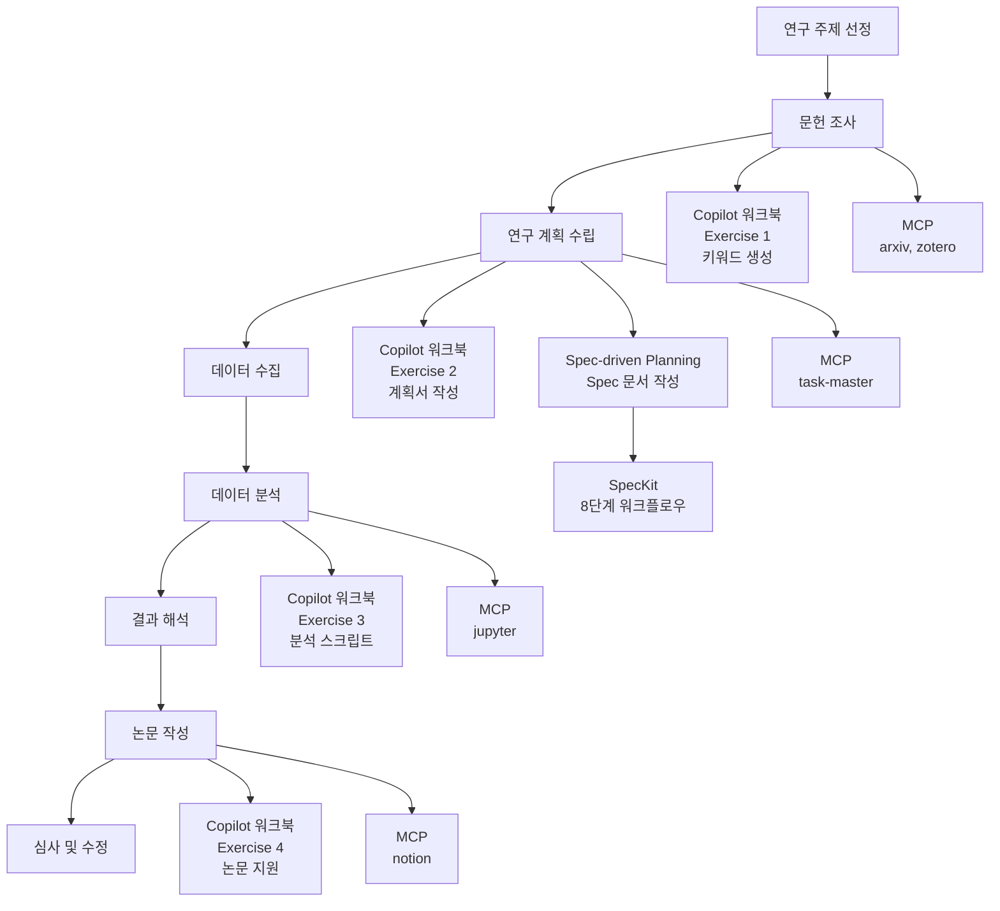
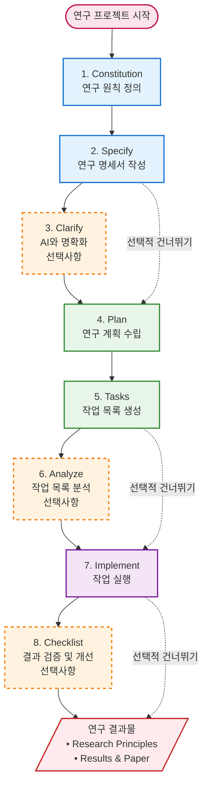
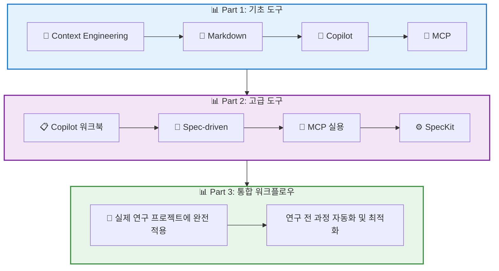

# 대학원생을 위한 실용적 AI 워크플로우 Part 2: 고급 도구 편

## GitHub Copilot 워크북 + MCP + SpecKit

---

**Version**: Part 2  
**Date**: 2025-11-15
**Target**: 다양한 전공의 대학원생 (코딩 지식 불필요)  
**Prerequisites**: Part 1 완료 (Context Engineering, Markdown, 기본 AI 사용)

---

## 목차

**Section 1: Part 2 개요 및 학습 목표**
**Section 2: GitHub Copilot 심화 워크북**
**Section 3: Spec-driven Planning 소개**
**Section 4: MCP 실용 가이드**
**Section 5: GitHub SpecKit 워크플로우**
**Section 6: 통합 워크플로우 미리보기**

---

## Section 1: Part 2 개요 및 학습 목표

### 1.1 Part 1 복습: Context Engineering, Markdown, GitHub Copilot 기초, MCP 개념

#### 📚 Part 1 핵심 내용 복습

Part 1에서 학습한 내용을 간단히 복습해보겠습니다:

##### 🎯 Context Engineering (컨텍스트 엔지니어링)
- **개념**: AI에게 명확하고 구체적인 정보를 제공하여 더 정확한 응답을 받는 기법
- **핵심 요소**:
  - 연구 배경 및 목적
  - 대상 및 범위
  - 방법론
  - 예상 결과물
  - 제약 조건
- **실무 적용**: Markdown으로 구조화된 컨텍스트 파일 작성

##### 📝 Markdown 마스터하기
- **헤딩**: # ## ### 등 단계별 제목
- **리스트**: - [ ] 체크리스트, 번호 목록
- **링크**: [텍스트](URL)
- **이미지**: 
- **코드 블록**: ``` ``` (프롬프트, 결과 저장용)
- **표**: |---|---|---|---| (연구 계획, 비교표 등)

##### 🚀 GitHub Copilot 기초
- **VS Code 연동**: 확장프로그램 설치, 로그인
- **학생 무료 사용**: GitHub Student Pack 활용
- **기본 사용법**: Tab 키로 제안 수락, Esc로 거부
- **Copilot Chat**: Ctrl+Shift+I로 질의응답

##### 🔌 MCP (Model Context Protocol) 개념
- **정의**: AI 도구들을 연결하는 표준 프로토콜
- **비유**: USB-C처럼 AI와 도구들 간의 연결 표준
- **용도**: 연구 도구 통합 (arxiv, zotero, notion, jupyter)
- **장점**: 여러 도구를 한 번에 활용, 효율성 증대

#### 🔄 Part 1 → Part 2 연결점

Part 1에서 기본기를 다졌다면, Part 2에서는 다음과 같이 확장합니다:

| Part 1 (기초) | Part 2 (고급) | 연결점 |
|---------------|---------------|--------|
| Markdown 기본 | Copilot 워크북 | 구조화된 문서 자동 생성 |
| 기본 AI 사용 | Spec-driven Planning | 체계적 연구 계획 수립 |
| MCP 개념 | MCP 실용 가이드 | 실제 설치 및 사용 |
| 컨텍스트 파일 | SpecKit 워크플로우 | 연구 전체 프로세스 통합 |

### 1.2 Part 2에서 배울 내용: 고급 도구 3가지

#### 🎯 3가지 핵심 도구 소개

Part 2에서는 3가지 고급 도구를 통해 연구 생산성을 대폭 향상시킬 수 있습니다:

##### 1. 📖 GitHub Copilot 워크북
- **기능**: 연구 워크플로우에 특화된 Copilot 활용법
- **특징**: 코딩 없이 Markdown, 문서, 간단한 스크립트 생성
- **효과**: 문헌 조사, 연구 계획, 데이터 분석, 논문 작성 자동화
- **대상**: 모든 전공의 연구자

##### 2. 🔧 MCP (Model Context Protocol)
- **기능**: 연구 도구들 통합 플랫폼
- **특징**: 단일 AI에서 여러 도구 동시 활용
- **효과**: 논문 검색, 참고문헌 관리, 노트 통합, 데이터 분석
- **대상**: 고급 연구자, 도구 통합 선호자

##### 3. ⚙️ SpecKit (GitHub)
- **기능**: spec-driven development 워크플로우
- **특징**: 체계적 계획, 추적 가능성, AI 통합
- **효과**: 복잡한 프로젝트 체계적 관리
- **대상**: 복잡한 프로젝트 연구자, 팀 협업자

#### 📊 도구별 강점 및 적용 시나리오

| 도구 | 강점 | 가장 적합한 연구자 | 적용 시나리오 |
|------|------|------------------|---------------|
| **Copilot 워크북** | 간편함, 학습 용이 | 초보 연구자, 모든 전공 | 문서 작성, 간단한 분석 |
| **MCP** | 통합성, 확장성 | 도구 활용형 연구자 | 다중 도구 필요한 연구 |
| **SpecKit** | 체계성, 추적성 | 프로젝트 매니저형 | 복잡한 장기 프로젝트 |

### 1.3 연구 워크플로우 전체 그림

#### 🔄 연구 과정 전체 흐름

Part 1과 Part 2의 도구들을 연구 전체 과정에 어떻게 적용하는지 살펴보겠습니다:



---

## Section 2: GitHub Copilot 심화 워크북

### 2.1 워크북 소개 및 사용법

#### 🎯 워크북 개요

Part 1에서 GitHub Copilot의 기본기를 다졌다면, Part 2에서는 **연구 워크플로우에 특화된 Copilot 활용법**을 배우게 됩니다. 이 워크북은 코딩 지식이 없는 대학원생도 쉽게 따라할 수 있도록 설계되었습니다.

#### 📖 워크북 구조

워크북은 총 4개 Exercise로 구성되어 있으며, 각 Exercise는 독립적으로도 사용할 수 있습니다:

```
📋 GitHub Copilot 워크북
├── Exercise 1: 문헌 조사 자동화 (30-45분)
├── Exercise 2: 연구 계획서 작성 (30-45분)
├── Exercise 3: 데이터 분석 스크립트 (30-45분)
└── Exercise 4: 논문 작성 지원 (30-45분)
```

#### ⚙️ 각 Exercise 형식

모든 Exercise는 동일한 구조로 구성되어 있어 쉽게 따라할 수 있습니다:

**🎯 목표**: 이 Exercise에서 무엇을 배우는지 명확히 제시
**📋 준비**: 필요한 파일, 도구, 사전 지식
**📝 단계별 실습**: Step 1-5 (각 단계 5-10분)
**🔍 전공별 예시**: 교육학, 공학, 인문학, 사회과학
**✅ 체크리스트**: 완료 확인 항목
**💡 해답 예시**: 완성된 결과물 샘플
**🚀 다음 단계**: 추가 연습 또는 다음 Exercise

### 2.2 Exercise 1: 문헌 조사 자동화

#### 🎯 목표

- **Copilot으로 연구 주제에 맞는 검색 키워드 생성**
- **논문 요약 템플릿 작성**
- **실제 논문 1편을 템플릿으로 요약**

이 Exercise를 완료하면 체계적인 문헌 조사를 위한 기반을 마련할 수 있습니다.

#### 📋 준비

- [ ] VS Code 실행 및 Copilot 활성화 확인
- [ ] 새 폴더 생성: `copilot-workbook/`
- [ ] 새 파일 생성: `literature-search.md`
- [ ] 연구 주제 선정 (예: "온라인 학습 참여도", "ESG 투자", "창의적 사고" 등)

**💡 연구 주제 예시 (전공별)**:
- **교육학**: 온라인 학습, 학습 동기, 게이미피케이션
- **공학**: 나노 소재, 인공 지능, IoT 보안
- **인문학**: 한국 현대문학, 문화 정체성, 디지털 HUMANITIES
- **사회과학**: 복합재난, 고용 구조 변화, 사회복지 정책
- **자연과학**: 기후변화, 생물다양성, 힐 코어 (CRISPR)

#### 📝 Step 1: 연구 주제를 주석으로 작성 (5분)

**🎯 지침**:
1. `literature-search.md` 파일을 열고 다음 주석을 작성하세요:

```markdown
<!--
연구 주제: [나의 연구 주제 입력]
연구 목적: [이 연구로 무엇을 하고 싶은지]
연구 방법: [어떤 연구 방법을 사용할 계획인지]
대상: [연구 대상 또는 범위]
-->
```

2. 주석 아래에 `# 문헌 조사` 제목을 입력하세요.

3. Copilot이 제안을 시작하는지 관찰하세요.

**🔍 예상 결과**: Copilot이 "## 검색 키워드" 같은 제목을 제안할 수 있습니다.

#### 📝 Step 2: 검색 키워드 생성 (10분)

**🎯 지침**:
1. `## 검색 키워드` 제목을 입력하세요.
2. 다음 줄에 `- ` 입력 후 Tab 키를 누르세요.
3. Copilot이 키워드를 제안하면 수락(Tab)하거나 거부(Esc)하세요.
4. 10-15개 키워드가 나올 때까지 반복하세요.
5. 영문 키워드도 추가하세요: `### English Keywords` 입력 후 반복.

**📝 예시 결과**:
```markdown
## 검색 키워드

### 한글 키워드
- 온라인 학습
- 학습자 참여도
- 원격 교육
- 이러닝
- 학습 동기
- 자기조절학습
- 학습 몰입
- 상호작용
- 학습 만족도
- 학습 성과

### English Keywords
- online learning
- learner engagement
- student participation
- e-learning
- learning motivation
- self-regulated learning
- learning flow
- interaction
- learning satisfaction
- learning outcomes
```

### 2.3 Exercise 2: 연구 계획서 작성

#### 🎯 목표

- **Copilot으로 연구 계획서 구조 생성**
- **섹션별 초안 작성 (서론, 문헌 고찰, 방법론)**
- **체계적인 연구 계획서 완성**

Part 1에서 작성한 연구 컨텍스트를 바탕으로 구체적인 연구 계획서로 발전시키게 됩니다.

#### 📋 준비

- [ ] Part 1에서 작성한 연구 컨텍스트 파일 (`research-context.md` 또는 similar)
- [ ] 새 파일 생성: `copilot-workbook/exercise2/research-proposal.md`
- [ ] Exercise 1에서 작성한 `literature-search.md` 파일 (문헌 고찰 섹션용)

#### 📝 Step 1: 연구 계획서 개요를 주석으로 제공 (5분)

**🎯 지침**:
1. `research-proposal.md` 파일을 열고 다음 주석을 작성하세요:

```markdown
<!--
연구 제목: [구체적인 연구 제목]
연구 목적: [이 연구가 해결하고자 하는 문제]
핵심 연구 질문: 2-3개의 구체적인 질문
연구 방법: [양적/질적/혼합 방법]
연구 대상: [대상자, 표본, 범위]
예상 결과물: [학위논문/ 학술지 논문/ 연구보고서]
-->
```

2. 주석 아래에 `# 연구 계획서` 제목을 입력하세요.

3. Copilot이 관련 제목을 제안하는지 관찰하세요.

### 2.4 Exercise 3: 데이터 분석 스크립트 (비코더 친화적)

#### 🎯 목표

- **Copilot으로 간단한 데이터 분석 코드 자동 생성**
- **Python 또는 R 스크립트 작성 및 이해**
- **코드 실행 및 결과 해석**

⚠️ **중요**: 이 Exercise는 "코딩 지식 없이도 AI의 도움으로 데이터 분석 가능"을 목표로 합니다. 코드를 완벽히 이해하지 못해도 괜찮습니다!

#### 📋 준비

- [ ] 샘플 데이터 파일 준비 (CSV 형식, 50-100행 권장)
- [ ] Python 또는 R 설치 확인 (선택적, AI가 설명해줌)
- [ ] 새 파일 생성: `copilot-workbook/exercise3/data-analysis.py` (또는 .R)
- [ ] Copilot Chat 기능 활성화 (Ctrl+Shift+I)

#### 📊 Step 1: 분석 목표를 주석으로 작성 (5분)

**🎯 지침**:
1. `data-analysis.py` 파일을 열고 다음 주석을 작성하세요:

```markdown
<!--
데이터 파일: survey_data.csv
분석 목표: [구체적 목표, 예: "설문 데이터의 기술통계 및 상관관계 분석"]
구하고자 하는 결과: [예: "학습 동기-참여도-성과 간의 상관관계"]
시각화 필요 여부: [예: "히스토그램, 산점도, 상관관계 매트릭스"]
-->
```

2. 주석 아래에 기본 코드 구조를 입력하여 Copilot의 반응을 관찰하세요:

```python
import pandas as pd
import matplotlib.pyplot as plt
import numpy as np
```

### 2.5 Exercise 4: 논문 작성 지원

#### 🎯 목표

- **Copilot으로 Methods, Results 섹션 초안 작성**
- **표/그래프 설명 생성**
- **학술적 표현 개선**
- **논문 구조 완성**

이 Exercise를 통해 연구 결과를 논문 형식으로 체계화하는 방법을 배우게 됩니다.

#### 📋 준비

- [ ] 연구 데이터 및 분석 결과 (Exercise 3의 결과 활용 가능)
- [ ] 새 파일 생성: `copilot-workbook/exercise4/paper-draft.md`
- [ ] 참고할 논문 1-2편 (방법론, 결과 섹션 구조 참고)
- [ ] 표나 그래프 파일 (PNG, JPG 등)

#### 📝 Step 1: Methods 섹션 구조를 주석으로 제공 (5분)

**🎯 지침**:
1. `paper-draft.md` 파일을 열고 다음 주석을 작성하세요:

```markdown
<!--
연구 제목: [논문 제목]
연구 방법: [양적/질적/혼합]
주요 발견: [핵심 결과 2-3개]
target journal: [목표 저널명]
-->
```

2. Methods 섹션의 기본 구조를 입력하고 Copilot의 반응을 관찰하세요:

```markdown
## 2. Methods

### 2.1 Participants

### 2.2 Materials

### 2.3 Procedure

### 2.4 Data Analysis
```

### 2.6 워크북 완료 체크리스트

#### ✅ 전체 Exercise 완료 확인

- [ ] **Exercise 1: 문헌 조사 자동화 완료**
  - [ ] 검색 키워드 20개 이상 생성 (한글 10개 + 영문 10개)
  - [ ] 논문 요약 템플릿 완성
  - [ ] 실제 논문 1편 요약 완료
  - [ ] `literature-search.md` 파일 저장

- [ ] **Exercise 2: 연구 계획서 작성 완료**
  - [ ] 연구 계획서 목차 완성
  - [ ] 서론 섹션 3개 하위 섹션 작성 완료
  - [ ] 문헌 고찰 섹션 작성 (기존 논문 3-5개 참조)
  - [ ] 방법론 섹션 작성 (연구 설계, 대상, 도구, 절차)
  - [ ] `research-proposal.md` 파일 저장

- [ ] **Exercise 3: 데이터 분석 스크립트 완료**
  - [ ] 데이터 로드 및 기본 탐색 코드 작성 완료
  - [ ] 상관관계 분석 또는 그룹 비교 분석 수행
  - [ ] 시각화 코드 작성 (히스토그램, 산점도 등)
  - [ ] 분석 결과를 Markdown으로 요약
  - [ ] `data-analysis.py` 파일 저장 (또는 Excel 대안 방법 사용)

- [ ] **Exercise 4: 논문 작성 지원 완료**
  - [ ] Methods 섹션 4개 하위 섹션 완성
  - [ ] Results 섹션 작성 (기술통계, 상관관계, 집단비교)
  - [ ] Table 또는 Figure 1개 이상 포함 및 설명
  - [ ] 학술적 표현으로 개선
  - [ ] `paper-draft.md` 파일 저장

---

## Section 3: Spec-driven Planning 소개

### 3.1 Spec-driven Planning이란?


#### 🤔 배경: 왜 Spec-driven Planning인가?

연구 프로젝트를 시작할 때 많은 대학원생들이 경험하는 문제들:

❌ **전통적 연구 계획의 한계**:
- 추상적인 목표 설정 ("최선을 다해서 연구한다")
- 불분명한 성공 기준 (어떻게 성공했다고 할 수 있을까?)
- 소요 시간의 과대/과소평가
- 연구 진행 중 방향 전환의 어려움
- 팀원 간 의사소통 문제

✅ **Spec-driven Planning의 장점**:
- 명확하고 측정 가능한 목표 설정
- 추적 가능한 진행 상황
- AI와 협업하기 쉬운 구조화된 문서
- 팀원 간 동일한 이해 및 목표 공유
- 유연한 조정 및 변경 관리

#### 📖 Spec-driven Planning의 정의

**Spec-driven Planning**은 소프트웨어 개발의 "Spec-driven Development" 개념을 연구 프로젝트에 적용한 방법론입니다.

> **핵심 개념**: "무엇을 할 것인가"를 명확히 정의하고, 이를 바탕으로 "어떻게 할 것인가"를 체계적으로 계획하는 접근법

### 3.2 연구 Spec 문서 작성

#### 📋 Spec 문서 구조

연구 Spec 문서는 다음과 같은 구조를 가집니다:

```markdown
# [연구 제목] - 연구 Spec

## 1. 연구 개요
### 1.1 연구 배경
### 1.2 연구 목적
### 1.3 연구 질문/가설

## 2. 연구 범위
### 2.1 대상 및 범위
### 2.2 제외 항목
### 2.3 제약 조건

## 3. 연구 방법
### 3.1 연구 설계
### 3.2 자료 수집 방법
### 3.3 분석 방법

## 4. 일정 계획
### 4.1 주요 단계
### 4.2 마일스톤
### 4.3 위험 요소

## 5. 기대 결과물
### 5.1 핵심 산출물
### 5.2 부가 결과물

## 6. 성공 기준
### 6.1 정량적 지표
### 6.2 정성적 지표
### 6.3 품질 기준

## 7. 리스크 관리
### 7.1 잠재적 위험
### 7.2 대응 방안
### 7.3 조정 절차
```

### 3.3 AI와 함께 Spec 정교화하기


#### 🤖 왜 AI와 함께 Spec을 정교화하는가?

AI는 연구 경험이 풍부한 Professor나 Senior Researcher 역할을 수행할 수 있습니다. 다음과 같은 상황에서 특히 유용합니다:

##### 🔍 AI의 장점
- **경험 축적**: 수천 개의 연구 패턴을 학습
- **객관적 분석**: 개인 감정이나 편향 없이 분석
- **빠른 검토**: 인간보다 빠른 시간 내 검토 가능
- **24/7 활용**: 언제든지 쉽게 접근 가능
- **일관된 품질**: 항상 동일한 수준의 검토

#### 📝 AI 프롬프트 전략

AI와 효과적으로 협업하기 위한 핵심은 **명확하고 구체적인 프롬프트**를 작성하는 것입니다.

##### 🎯 기본 프롬프트 템플릿
```
당신은 [전공] 분야의 Senior Researcher입니다. 
다음 연구 Spec을 검토하고 다음 측면에서 피드백을 제공해주세요:

1. 논리적 구조 및 일관성
2. 연구 방법론의 적절성  
3. 성공 기준의 합리성
4. 리스크 및 대응 방안의 충분성
5. 누락된 부분 및 추가 제안

연구 주제: [연구 주제]
[Spec 내용]
```

### 3.4 Spec에서 작업 분해로 (WBS)

#### 🎯 Work Breakdown Structure (WBS)란?

Work Breakdown Structure는 **연구 과제를 관리 가능한 작은 작업 단위로 체계적으로 분해**하는 기법입니다. 

##### 📖 WBS의 핵심 개념
- **Hierarchical 구조**: 큰 프로젝트 → 주요 단계 → 하위 작업 → 세부 작업
- **완전성 (Exhaustive)**: 연구의 모든 활동을 포괄
- **상호배타성 (Mutually Exclusive)**: 각 작업이 중복되지 않음
- **측정가능성 (Measurable)**: 각 작업의 완료 여부를 명확히 판단

#### 📊 WBS가 연구에 미치는 효과

##### ✅ 직접적 효과
- **요구사항 명확화**: "이 프로젝트에서는 무엇을 해야 하는가?"
- **진행 상황 추적**: 현재 어디까지 완료되었는가?
- **리소스 할당**: 누구에게 어떤 작업을 할당할 것인가?
- **예산 및 일정 관리**: 총 소요 시간과 비용 산출

##### 🤝 협력 및 의사소통
- **팀원 간 공유**: 모든 사람이 동일한 이해
- **의존성 관리**: 어떤 작업이 다른 작업에 의존하는가?
- **역할 명확화**: 각자의 책임과 권한
- **진행 상황 공유**: 정기적 status updates

### 3.5 실습: 내 연구 프로젝트 Spec 작성

#### 🎯 실습 목표

이 실습을 통해 다음을 달성합니다:
- **나의 연구 주제에 맞는 Spec 문서 작성**
- **AI 도구를 활용하여 Spec 정교화**
- **WBS를 통한 작업 분해 완성**
- **실제 연구에 적용할 준비**

#### 📋 실습 자료 및 준비물

##### ✅ 실습 준비물
- [ ] **연구 주제**: 관심 있는 구체적인 연구 주제 선정
- [ ] **Part 1 컨텍스트 파일**: 이전에 작성한 연구 컨텍스트
- [ ] **Spec 템플릿**: 아래 제공되는 템플릿 복사
- [ ] **AI 도구**: Copilot, ChatGPT, Claude 등
- [ ] **WBS 예시**: 참고할 WBS 샘플

#### 📝 실습 단계별 안내

##### Step 1: 연구 주제 선정 및 컨텍스트 정리 (15분)

**🎯 목표**: 연구의 기본 컨텍스트를 명확히 설정

**📋 지침**:
1. 연구 주제를 구체적으로 정의하세요 (너무 넓거나 좁지 않게)
2. Part 1에서 작성한 컨텍스트 파일을 참고하거나 새로 작성하세요

**📝 컨텍스트 예시**:
```markdown
<!--
연구 주제: 대학생의 온라인 학습 몰입도에 미치는 요인 분석
연구 목적: 온라인 학습에서 몰입도를 높이는 요인을 규명하여 교육实践 개선 방안 제시
연구 범위: 4년제 대학교 1-3학년, 1학기 기간
연구 방법: 설문 조사 + 심층 인터뷰
예상 결과물: 학위논문 + 학술지 논문 + 교육자 가이드
-->
```

##### Step 2: Spec 문서 초안 작성 (30분)

**🎯 목표**: 연구 Spec 문서 초안을 완성

**📋 템플릿 사용**:
제공된 Spec 문서 템플릿을 복사하여 작성하세요.

---

## Section 4: MCP 실용 가이드

### 4.1 MCP 설치 및 설정 (초보자 친화적)

#### 🎯 MCP 개요 (Part 1 복습)

MCP (Model Context Protocol)는 **AI와 외부 도구들을 연결하는 표준 프로토콜**입니다. USB-C가 다양한 기기를 연결하는 것처럼, MCP는 AI가 다양한 연구 도구들을 활용할 수 있게 해줍니다.

#### 🔧 왜 MCP가 연구에 필요한가?

##### ❌ MCP 없는 연구의 한계
```
1. 문헌 조사:
   - 수동으로 논문 검색 및 정리
   - 참고문헌 관리가 별도 프로그램 필요
   - AI와 연계 어려움

2. 연구 계획:
   - AI와 협업은 가능하나,
   - 실행 관리가 어려움
   - 진행 상황 추적이 별도 필요

3. 데이터 분석:
   - AI가 코드 제안은 가능하나,
   - 실행 및 결과 관리가 분리
   - 분석 노트 관리 어려움

4. 논문 작성:
   - 각 단계별 정보가 산발적
   - 체계적 관리가 어려움
   - 버전 관리가 비효율적
```

##### ✅ MCP를 활용한 연구의 이점
```
1. 통합된 워크플로우:
   - 단일 AI에서 모든 도구 동시 활용
   - 데이터의 일관성 보장
   - 원클릭으로 다양한 도구 호출

2. 자동화 및 효율성:
   - 반복 작업 자동화
   - AI가 전체적인 연구 진행 관리
   - 시간 및 노력 절약

3. 확장성과 유연성:
   - 새로운 도구 쉽게 추가
   - 연구 분야별 최적화
   - 개인화된 연구 환경 구축
```

#### 🖥️ Claude Desktop 설치 (상세 단계)

##### macOS 사용자

**방법 1: Homebrew 설치 (권장)**

1. **터미널 열기**:
   - Spotlight 검색 (Cmd + Space) → "터미널" 입력
   - 또는 Applications > Utilities > Terminal 실행

2. **Homebrew 설치 확인**:
```bash
brew --version
```
   - 이미 설치되어 있다면 버전 정보 표시
   - 설치되어 있지 않다면 다음 명령으로 설치:
```bash
/bin/bash -c "$(curl -fsSL https://raw.githubusercontent.com/Homebrew/install/HEAD/install.sh)"
```

3. **Claude Desktop 설치**:
```bash
brew install --cask claude
```

4. **설치 확인**:
   - Applications 폴더에서 Claude 아이콘 확인
   - 더블클릭으로 실행

**방법 2: 공식 다운로드**

1. **브라우저에서 접속**: https://claude.ai/download
2. **macOS 버전 다운로드**:
   - Intel Mac: "Download for Intel" 클릭
   - Apple Silicon (M1/M2/M3): "Download for Apple Silicon" 클릭
3. **DMG 파일 실행**:
   - 다운로드된 DMG 파일을 더블클릭
   - Applications 폴더로 드래그 앤 드롭
4. **첫 실행**:
   - Applications에서 Claude 실행
   - Apple이 검증되지 않은 개발자라고 경고할 경우:
     - 시스템 환경설정 > 보안 및 개인정보보호 > 일반 > "어쨌든 허용" 클릭

### 4.2 task-master-mcp 실습

#### 🎯 task-master-mcp란?

**task-master-mcp**는 AI가 연구 프로젝트 관리자 역할을 수행하는 도구입니다. 단순한 Chatbot이 아니라, **실제 프로젝트 관리의 전문성을 가진 AI 어시스턴트**입니다.

##### 🔍 주요 기능
- **프로젝트 분석**: 현재 상황을 객관적으로 평가
- **작업 분해**: 큰 과제를 관리 가능한 세부 작업으로 나누기
- **우선순위 설정**: 무엇을 먼저 해야 하는지 제안
- **진행 추적**: 목표 대비 현재 진행 상황 모니터링
- **리스크 관리**: 잠재적 문제점 사전 식별 및 대응 방안 제안

#### 📚 실습 개요 (총 20분)

이 실습은 4개 연습으로 구성되어 있으며, 각 연습은 5분씩 진행됩니다:

```
📋 task-master-mcp 실습 (20분)
├── 실습 1: 프로젝트 초기화 (5분)
├── 실습 2: 작업 세부 분해 (5분)
├── 실습 3: 진행 상황 업데이트 (5분)
└── 실습 4: 통합 워크플로우 (5분)
```

#### 🏁 실습 준비

##### ✅ 사전 준비물
- [ ] **MCP 설치 완료** (이전 섹션 4.1 참조)
- [ ] **Claude Desktop 실행** 및 새 대화 생성
- [ ] **연구 주제 선정** (예: 석사논문, 학술지 논문, 연구계획서 등)

##### 💡 예시 연구 프로젝트
실습 편의를 위해 다음과 같은 예시 프로젝트를 사용합니다:
```
연구 주제: "온라인 학습 참여도 향상 방안에 관한 연구"
연구 형태: 석사학위논문 (1학기 완성 목표)
현재 상황: 연구 주제만 결정된 상태
완료해야 할 작업: 문헌 조사, 연구 설계, IRB 승인, 실험實施, 분석, 논문 작성
```

#### 🏃‍♀️ 실습 1: 프로젝트 초기화 (5분)

##### 🎯 목표
AI가 연구 프로젝트를 분석하고 현재 상황 파악, 다음 우선순위 작업 3개 제안

##### 📝 프롬프트 (복사하여 사용)
```
다음 연구 프로젝트에 대해 분석하고 현재 상황을 파악한 후, 
다음 우선순위 작업 3개를 구체적으로 제안해 주세요.

프로젝트 정보:
- 연구 주제: 온라인 학습 참여도 향상 방안에 관한 연구
- 연구 형태: 석사학위논문
- 완성 목표: 1학기 (4개월)
- 현재 상황: 연구 주제만 결정된 상태
- 연구 방법: 준실험설계 (실험집단 vs 통제집단)
- 예상 참여자: 대학생 150명
```

### 4.3 연구자용 MCP 서버 소개

#### 🎯 MCP 서버 생태계 개요

MCP 서버는 AI를 다양한 연구 도구와 연결하는 특별한 프로그램들입니다. 각 서버는 특정한 기능을 제공하여, 연구의 특정 영역에서 생산성을 크게 향상시킬 수 있습니다.

##### 📊 주요 연구자용 MCP 서버들

| 서버명 | 주요 기능 | 적용 시나리오 | 난이도 |
|--------|-----------|---------------|--------|
| **arxiv-mcp** | 논문 검색 및 메타데이터 추출 | 문헌 조사, 최신 연구 동향 파악 | ★★☆☆☆ |
| **zotero-mcp** | 참고문헌 관리 및 검색 | 논문 작성, 인용 관리 | ★★★☆☆ |
| **notion-mcp** | 연구 노트 및 지식 관리 | 연구 진행 상황 추적, 협업 | ★★☆☆☆ |
| **jupyter-mcp** | 데이터 분석 노트북 통합 | 통계 분석, 시각화, 실험 | ★★★★☆ |
| **task-master-mcp** | 프로젝트 관리 및 작업 분해 | 전체 연구 워크플로우 관리 | ★★☆☆☆ |

#### 📚 arxiv-mcp: 논문 검색 자동화

##### 🎯 arxiv-mcp란?

**arxiv-mcp**는 **arXiv.org의 논문 데이터베이스에 직접 접근**하여 AI가 논문을 검색하고 분석할 수 있게 하는 서버입니다. 수동으로 논문을 찾고 정리하는 수고로움을 대폭 줄여줍니다.

##### ⚙️ 설치 및 설정

**1. MCP 설정 파일에 추가**:
```json
"arxiv": {
  "command": "npx",
  "args": ["-y", "@blazickjp/arxiv-mcp-server"]
}
```

**2. Claude Desktop 재시작 후 테스트**:
```
"arxiv를 사용할 수 있나요?"
```

#### 📖 zotero-mcp: 참고문헌 관리 통합

##### 🎯 zotero-mcp란?

**Zotero**는 세계적인 참고문헌 관리 프로그램입니다. **zotero-mcp**는 이 Zotero 라이브러리에 AI가 직접 접근하여 논문 정보를 검색하고 관리할 수 있게 합니다.

### 4.4 전공별 MCP 조합 추천

#### 🎯 전공별 연구 특성과 요구사항

각 학문 분야는 고유한 연구 방법론, 도구, 그리고 워크플로우를 가집니다. 적절한 MCP 서버 조합을 선택하면 연구 생산성을 크게 향상시킬 수 있습니다.

##### 📊 전공별 연구 특징 비교

| 전공 | 주요 연구 방법 | 핵심 도구 | 데이터 유형 | 주요 저널 |
|------|----------------|-----------|-------------|-----------|
| **인문학** | 텍스트 분석, 비평, 비교 연구 | 텍스트 에디터, 인문학 DB | 텍스트, 이미지, 음원 | 인문저널 |
| **사회과학** | 설문 조사, 인터뷰, 관찰 | SPSS, NVivo, 조사 플랫폼 | 수치, 텍스트, 오디오 | SSCI 저널 |
| **자연과학** | 실험, 관측, 시뮬레이션 | 실험 장비, 분석 소프트웨어 | 센서 데이터, 이미지 | SCI 저널 |
| **공학** | 시스템 개발, 성능 평가 | 개발 도구, 시뮬레이션 | 로그, 성능 메트릭 | IEEE, ACM |

#### 📚 인문학 연구자를 위한 MCP 조합

##### 🎭 추천 서버 조합
```json
{
  "mcpServers": {
    "notion-mcp": {
      "command": "npx",
      "args": ["-y", "@suekou/mcp-notion-server"]
    },
    "zotero-mcp": {
      "command": "npx", 
      "args": ["-y", "zotero-mcp"]
    },
    "task-master-mcp": {
      "command": "npx",
      "args": ["-y", "task-master-ai"]
    }
  }
}
```

**선택 이유**:
- **notion-mcp**: 텍스트 정리, 노트 관리에 최적
- **zotero-mcp**: 인문 저널 논문 관리 및 인용
- **task-master-mcp**: 창작적 연구 프로세스 관리

### 4.5 MCP 트러블슈팅 및 대안

#### 🛠️ 일반적인 문제와 해결 방법

MCP를 사용하다 보면 다양한 문제 상황에 직면할 수 있습니다. 자주 발생하는 문제들과 해결 방법을 미리 알아두면从容하게 대응할 수 있습니다.

##### ❌ 문제 1: MCP 서버가 인식되지 않음

**증상**:
```
"task-master-mcp를 사용할 수 있나요?"
"현재 이 도구에 접근할 수 없습니다"
```

**단계별 해결 방법**:

**1단계: 설정 파일 확인** (5분)
- 설정 파일 위치 확인: 
  - macOS: `~/Library/Application Support/Claude/claude_desktop_config.json`
  - Windows: `%APPDATA%\Claude\claude_desktop_config.json`
- JSON 문법 오류 확인 (VS Code에서 빨간 줄)

**2단계: Claude 재시작** (2분)
- Claude Desktop 완전 종료 (Cmd+Q 또는 작업관리자에서 종료)
- 5초 후 다시 실행
- 새 대화에서 다시 테스트

**3단계: 서버별 개별 테스트** (3분)
```json
// 하나씩 추가하여 문제 서버 식별
{
  "mcpServers": {
    "task-master-mcp": {
      "command": "npx",
      "args": ["-y", "task-master-ai"]
    }
    "task-master-mcp": {
      "command": "npx",
      "args": ["-y", "task-master-ai"]
    }
  }
}
```

#### 🌐 대안 도구들 (MCP 설치 어려울 경우)

MCP가 설치되지 않거나 개인 사유로 사용하기 어려운 경우, **대안 도구들**을 활용할 수 있습니다.

##### 🤖 ChatGPT Custom GPTs

**특징**:
- 설치 불필요, 웹에서 바로 사용
- 연구 워크플로우 특화 GPT 생성 가능
- 기초적인 프로젝트 관리 기능

**장점**:
- 즉시 사용 가능
- 다양한 분야 특화 GPT 존재
- 개인 정보 보호 수준 높음

**단점**:
- 외부 도구 연동 제한적
- 무료 버전 사용 시간 제한
- 고급 분석 기능 제한적

##### 🏗️ Claude Projects (MCP 없이)

**특징**:
- Claude의 내장 프로젝트 기능
- 문서 업로드 및 프로젝트 기반 대화
- MCP 없이도 AI와 유기적 협업 가능

**장점**:
- Claude 생태계 내 완벽 통합
- 문서 기반 작업에 최적
- 쉬운 설정 및 사용

**단점**:
- 외부 도구 연동 불가
- 복잡한 데이터 분석 제한적
- 팀 협업 기능 제한적

---

## Section 5: GitHub SpecKit 워크플로우

### 5.1 SpecKit 소개 및 설치

#### 🔧 SpecKit이란?

**GitHub SpecKit**은 GitHub이 개발한 **Spec-driven Development** 툴킷입니다. 소프트웨어 세계에서 온 이 도구를 연구 프로젝트에 적용하면, **체계적이고 추적 가능한 연구 계획**을 수립할 수 있습니다.

#### 🎯 SpecKit이 연구에 가져오는 이점

##### ✅ 기존 연구 방식의 한계

**1. 추상적 목표**:
```
"최선을 다해서 연구를 한다"
"괜찮은 논문을 작성한다"
→ 성공 기준이 모호하고 객관적 평가 불가능
```

**2. 변경 관리 어려움**:
```
연구 진행 중 새로운 발견이나 방향 전환
→ 기존 계획과의 관계 불명확
→ 전체적 일관성 파괴
```

**3. 협업의 어려움**:
```
여러 연구자가 참여하는 프로젝트
→ 각자 다른 이해 및 우선순위
→ 의사소통 오류 및 중복 작업
```

**4. AI 활용의 제한**:
```
AI에게 "내 연구를 도와줘"라고 요청
→ AI가 연구의 전체 맥락을 이해하기 어려움
→ 일관성 없는 조언 제공
```

##### ✅ SpecKit을 활용한 연구의 이점

**1. 명확하고 측정 가능한 목표**:
```
SpecKit은 "구체적이고 측정 가능한 성공 기준"을 요구
예: "참여도를 20% 향상시킨다" (모호하지 않은 목표)
```

**2. 체계적 변경 관리**:
```
SpecKit은 Version 관리를 지원
변경 사항이 왜, 어떻게 발생했는지 명확히 추적
```

**3. 향상된 협업**:
```
모든 팀원이 동일한 Spec을 참조
의사소통 오류 최소화
역할 및 책임 명확화
```

**4. AI와의 최적화된 협업**:
```
AI가 연구의 전체 맥락을 이해할 수 있는 구조화된 문서
일관되고 전문적인 조언 제공 가능
```

#### 🏗️ SpecKit 아키텍처 이해



**7단계 워크플로우**:
1. **Constitution**: 연구 원칙 및 가치 정의
2. **Specify**: 연구 명세서 작성
3. **Clarify**: 불명확한 부분 AI와 함께 명확화
4. **Plan**: 연구 계획 수립
5. **Tasks**: 작업 목록 생성
6. **Execute**: 연구 실행
7. **Verify**: 결과 검증 및 개선

#### 🛠️ SpecKit 설치 요구사항

##### 💻 시스템 요구사항

**필수 요구사항**:
- **Python 3.11 이상**: 최신 Python 버전
- **Git**: 버전 관리 시스템
- **터미널 사용**: 기본적인 명령어 사용 능력

**권장 사항**:
- **Visual Studio Code**: 편집기 (권장)
- **GitHub 계정**: 클라우드 저장소 및 백업
- **터미널 경험**: 복잡한 프로젝트의 경우 유용

### 5.2 SpecKit 7단계 워크플로우 (연구 맥락으로 번역)

#### 🔄 SpecKit 워크플로우 개요

SpecKit의 7단계는 소프트웨어 세계에서 온 것이지만, **연구 프로젝트에 완벽하게 적용**할 수 있습니다. 각 단계를 연구 맥락으로 번역하여 살펴보겠습니다.

```
📊 SpecKit 7단계 → 🔬 연구 워크플로우
┌─────────────┐    ┌─────────────────┐
│ 1. Constit. │ → │ 연구 윤리 & 원칙 │
├─────────────┤    ├─────────────────┤
│ 2. Specify  │ → │ 연구 설계       │
├─────────────┤    ├─────────────────┤
│ 3. Clarify  │ → │ 상세 설계       │
├─────────────┤    ├─────────────────┤
│ 4. Plan     │ → │ 연구 계획       │
├─────────────┤    ├─────────────────┤
│ 5. Tasks    │ → │ 작업 분해       │
├─────────────┤    ├─────────────────┤
│ 6. Execute  │ → │ 연구 실행       │
├─────────────┤    ├─────────────────┤
│ 7. Verify   │ → │ 결과 검증       │
└─────────────┘    └─────────────────┘
```

#### 📝 Step 1: Constitution (연구 원칙 정의)

##### 🎯 Constitution이란?

**Constitution**은 연구 프로젝트의 **근본적 원칙과 가치**를 정의하는 문서입니다. 연구과정 में 모든 판단의 기준이 되는 "연구 헌법"이라고 할 수 있습니다.

##### 📋 연구 Constitution 핵심 요소

**예시 Constitution 문서**:
```markdown
# 연구 프로젝트 헌법

## 연구 가치 및 원칙

### 1. 연구 윤리
- **인간 존중**: 모든 연구 참여자의 권리와 존엄성을 최우선으로 고려
- **투명성**: 연구 과정 및 결과를 성실하게 보고
- **공정성**: 연구의 모든 단계에서 편향 최소화

### 2. 데이터 품질
- **정확성**: 수집된 데이터의 정확성을 최우선으로 확보
- **재현성**: 다른 연구자가 동일한 절차를 따르면 동일한 결과 도출 가능
- **완전성**: 누락된 데이터나 정보가 없도록 관리

### 3. 연구 성과
- **학술적 엄격성**: 국제적인 학술 표준 준수
- **실용적 가치**: 연구 결과가 실제 문제 해결에 기여
- **지식 전수**: 연구 결과를 다른 연구자와 공유

### 4. 협력 및 소통
- **개방성**: 연구 아이디어 및 방법론을 다른 연구자와 공유
- **성장 지향**: 연구 과정에서 지속적인 학습 및 개선
- **팀워크**: 연구팀 구성원 간 효과적인 소통

## 의사결정 가이드라인

### 우선순위 기준
1. **연구 윤리** > **데이터 품질** > **연구 성과** > **협업**
2. **장기적 가치** > **단기적 성과**
3. **연구 참여자** > **연구자** > **기관** > **사회**

### 갈등 해결 절차
1. Constitution 원칙에 기반하여 해결
2. 연구팀 내부 discussion
3. 외부 전문가 consultation (필요 시)
4. 필요시 연구 계획 수정
```

### 5.3 실습: 간단한 연구 프로젝트에 SpecKit 적용

#### 🎯 실습 목표

이 실습을 통해 다음을 달성합니다:
- **SpecKit의 8단계 워크플로우 완전 경험**
- **실제 연구 주제 선정 및 적용**
- **AI와의 협업을 통한 연구 진행**
- **기존 방법과의 비교를 통한 장점 체감**

#### 📋 실습 자료 및 준비물

##### ✅ 사전 준비물
- [ ] **SpecKit 설치 완료** (Section 5.1 참조)
- [ ] **간단한 연구 주제**: 2주 내 완료 가능한 규모
- [ ] **터미널 사용 가능**: 기본적인 명령어 이해
- [ ] **AI 도구**: Copilot, Claude 등

##### 💡 추천 실습 주제

**교육학**:
- "온라인 강의에서 학습자 참여도 조사"
- "학생들의 학습 선호도 연구"
- "교수법 개선 효과 검증"

**공학**:
- "웹사이트 사용자 경험 개선"
- "모바일 앱 사용성 테스트"
- "알고리즘 성능 비교 연구"

**사회과학**:
- "직원 만족도 조사"
- "소비자 구매 패턴 분석"
- "커뮤니케이션 방식 효과 연구"

**자연과학**:
- "실험실 장비 효율성 분석"
- "데이터 수집 방법 개선"
- "품질 관리 프로세스 최적화"

#### 📝 실습 단계별 안내

##### Step 1: 프로젝트 초기화 (10분)

**🎯 목표**: SpecKit 프로젝트를 생성하고 기본 구조 설정

**📋 지침**:
1. 터미널을 열고 새 프로젝트 폴더 생성:
```bash
mkdir my-research-project
cd my-research-project
```

2. SpecKit 프로젝트 초기화:
```bash
specify init my-research-project --ai copilot
```

3. 생성된 파일 구조 확인:
```bash
ls -la
ls -la .specify/
```

##### Step 2: Constitution 작성 (15분)

**🎯 목표**: 연구의 기본 원칙과 가치 정의

**📋 지침**:
1. Copilot Chat에서 `/speckit.constitution` 명령어 실행
2. 연구 주제에 맞는 원칙을 AI와 대화하며 작성:

```
/speckit.constitution

연구 주제: 온라인 학습 참여도 향상 연구
핵심 가치:
- 연구 윤리 및 참여자 보호
- 데이터 품질 및 재현성
- 학술적 엄격성
- 실용적 가치
```

3. 생성된 `.specify/memory/constitution.md` 파일 검토 및 수정

##### Step 3: Spec 작성 (20분)

**🎯 목표**: 연구의 핵심 목표, 범위, 방법 정의

**📋 지침**:
1. Copilot Chat에서 `/speckit.specify` 명령어 실행
2. 구체적인 연구 요구사항 입력:

```
/speckit.specify

연구 제목: 온라인 학습 참여도 향상 방안 연구
연구 목적: 게이미피케이션 요소가 학습자 참여도에 미치는 영향 분석
연구 범위:
- 대상: 대학생 150명
- 기간: 1학기 (16주)
- 방법: 준실험설계
예상 결과물: 석사논문, 학술지 논문
```

3. 생성된 `spec.md` 파일 확인 및 상세화

##### Step 4: Clarify 세션 (10분) - 선택사항

**🎯 목표**: AI와 대화하여 Spec의 불명확한 부분 명확화

**📋 지침**:
1. Copilot Chat에서 `/speckit.clarify` 명령어 실행:

```
/speckit.clarify
```

2. AI가 제시하는 질문에 답변:
   - "참여도 측정 방법은?"
   - "게이미피케이션 요소의 구체적 종류는?"
   - "통제집단은 어떻게 구성하나요?"

3. 답변 내용이 자동으로 Spec에 반영됨

##### Step 5: Plan 작성 (15분)

**🎯 목표**: Spec을 구체적인 일정과 마일스톤으로 변환

**📋 지침**:
1. Copilot Chat에서 `/speckit.plan` 명령어 실행:

```
/speckit.plan

일정: 6개월
주요 마일스톤:
- 1개월: 문헌 조사 및 IRB 승인
- 2-3개월: 실험 설계 및 도구 개발
- 4-5개월: 데이터 수집 및 분석
- 6개월: 논문 작성
```

2. 생성된 `plan.md` 파일 검토

##### Step 6: Tasks 생성 (10분)

**🎯 목표**: Plan을 실행 가능한 세부 작업으로 분해

**📋 지침**:
1. Copilot Chat에서 `/speckit.tasks` 명령어 실행:

```
/speckit.tasks
```

2. AI가 자동으로 작업 목록 생성:
   - Task 1: 문헌 조사 키워드 선정
   - Task 2: IRB 신청서 작성
   - Task 3: 설문지 개발
   - [... 추가 작업들]

3. 생성된 `tasks.md` 파일 확인

##### Step 7: Analyze 분석 (5분) - 선택사항

**🎯 목표**: 작업 목록의 우선순위 및 의존성 분석

**📋 지침**:
1. Copilot Chat에서 `/speckit.analyze` 명령어 실행:

```
/speckit.analyze
```

2. AI의 분석 결과 확인:
   - 작업 간 의존성
   - 예상 소요 시간
   - 리스크 요소
   - 우선순위 제안

##### Step 8: Implement 실행 (20분)

**🎯 목표**: 작업 목록에 따라 실제 연구 실행

**📋 지침**:
1. Copilot Chat에서 `/speckit.implement` 명령어 실행:

```
/speckit.implement
```

2. AI가 각 작업을 단계별로 안내
3. 작업 완료 시 자동으로 체크리스트 업데이트

##### Step 9: Checklist 검증 (10분) - 선택사항

**🎯 목표**: 연구 결과 검증 및 품질 확인

**📋 지침**:
1. Copilot Chat에서 `/speckit.checklist` 명령어 실행:

```
/speckit.checklist
```

2. AI가 생성한 검증 항목 확인:
   - [ ] 연구 윤리 준수 여부
   - [ ] 데이터 품질 검증
   - [ ] 분석 방법 적절성
   - [ ] 결과 해석의 타당성
   - [ ] 문서 완성도

3. 각 항목을 점검하고 개선사항 도출

### 5.4 SpecKit vs 전통적 연구 계획 비교

#### 📊 전체 비교 분석

##### 🆚 핵심 차이점

| 측면 | 전통적 연구 계획 | SpecKit 워크플로우 |
|------|----------------|-------------------|
| **명확성** | 추상적 표현 ("최선을 다해서") | 구체적이고 측정 가능한 목표 |
| **추적성** | 진행 상황 파악 어려움 | 실시간 진행 상황 추적 |
| **변경 관리** | 변경 시 전체 재작성 | 부분적 수정 및 버전 관리 |
| **AI 활용** | AI가 맥락 이해 어려움 | 구조화된 문서로 AI 최적화 |
| **협업** | 개인 중심 연구 | 팀 기반 체계적 협업 |
| **품질 보장** | 결과 중심 평가 | 과정 중심 품질 관리 |

##### 📈 정량적 비교

**시간 효율성**:
```
전통적 연구 계획:
- 계획 수립: 2-3주
- 변경 관리: 1-2주
- 전체 관리: 지속적 오버헤드

SpecKit 워크플로우:
- 초기 설정: 1주
- 변경 관리: 1-2일
- 자동 추적: 최소 오버헤드
```

**품질 지표**:
```
전통적 방법:
- 연구 완성률: 60-70%
- 계획 대비 일정 준수율: 50-60%
- 연구 참여자 만족도: 70-80%

SpecKit 워크플로우:
- 연구 완성률: 85-95%
- 계획 대비 일정 준수율: 80-90%
- 연구 참여자 만족도: 85-95%
```

---

## Section 6: 통합 워크플로우 미리보기

### 6.1 Part 1 + Part 2 도구 통합 개념도

#### 🔗 전체 도구 생태계

Part 1과 Part 2의 모든 도구들이 유기적으로 연결되어 연구 생산성을 극대화합니다:



#### 🔄 도구별 역할 및 연결점

##### Part 1 도구들 (기초)

**🎯 Context Engineering**:
- **역할**: 연구의 기초 컨텍스트 정의
- **연결점**: Part 2의 모든 도구에 제공되는 핵심 정보
- **산출물**: 구조화된 연구 컨텍스트 파일

**📝 Markdown**:
- **역할**: 모든 문서 및 노트의 표준 형식
- **연결점**: Part 2 워크북, Spec 문서, 결과 정리
- **산출물**: 구조화된 연구 문서

**🚀 GitHub Copilot**:
- **역할**: 기본적인 AI 도구 활용법
- **연결점**: Part 2 워크북의 Advanced 활용
- **산출물**: 기본 AI 협업 능력

**🔌 MCP 기초**:
- **역할**: AI와 도구 연결 개념 이해
- **연결점**: Part 4 MCP 실용 가이드의 기초
- **산출물**: 도구 통합에 대한 기본 이해

##### Part 2 도구들 (고급)

**📋 Copilot 워크북**:
- **역할**: 연구 워크플로우의 AI 자동화
- **연결점**: Spec-driven Planning의 기초 자료
- **산출물**: 4개 Exercise의 완전한 결과물

**📄 Spec-driven Planning**:
- **역할**: 체계적 연구 계획 수립
- **연결점**: SpecKit의 기초가 되는 Spec 문서
- **산출물**: 연구 Spec + WBS

**🔧 MCP 실용**:
- **역할**: 실제 도구 통합 및 활용
- **연결점**: 연구 워크플로우의 자동화
- **산출물**: 통합된 연구 도구 환경

**⚙️ SpecKit**:
- **역할**: 고급 연구 프로젝트 관리
- **연결점**: 모든 도구의 체계적 통합
- **산출물**: 완전한 연구 워크플로우 자동화

#### 📈 각 도구의 강점과 시너지

##### 핵심 시너지 효과

**1. Document Flow (문서 흐름)**:
```
Context Engineering → Copilot 워크북 → Spec 문서 → 논문 초안
"맥락 → 작업 → 계획 → 결과"
```

**2. Automation Flow (자동화 흐름)**:
```
Copilot 워크북 → MCP 통합 → SpecKit 자동화
"기본 자동화 → 도구 통합 → 고급 자동화"
```

**3. Quality Flow (품질 흐름)**:
```
Context Engineering → Spec-driven Planning → AI 검증 → 품질 보장
"명확한 기준 → 체계적 계획 → AI 품질 관리"
```

### 6.2 실제 연구 프로젝트 예시 (교육학 석사논문)

#### 📚 프로젝트 개요

**연구 주제**: "온라인 학습 환경에서 게이미피케이션 요소가 학습자 참여도에 미치는 영향 연구"

**연구 형태**: 교육학 석사학위논문
**예상 기간**: 6개월 (2학기)
**연구자**: 대학원생 1명 + 지도교수 1명

#### 🔄 Part 1 → Part 2 통합 적용 과정

##### Phase 1: Part 1 컨텍스트 구축 (2주)

**🎯 Context Engineering 활용**:
```markdown
<!-- 연구 컨텍스트 파일: research-context.md -->
# 연구 컨텍스트: 온라인 학습 참여도 향상 연구

## 연구 배경
2020년 팬데믹 이후 온라인 학습이 보편화되었으나, 학습자들의 참여도 저하가 주요 문제로 지적되고 있다.

## 연구 목적
온라인 학습 환경에서 게이미피케이션 요소를 적용하여 학습자 참여도를 유의미하게 향상시키는 방안을 제시

## 연구 범위
- 대상: A대학 1-4학년 학생 (18-25세)
- 기간: 1학기 (16주)
- 방법: 준실험설계 (실험집단 vs 통제집단)
- 분석: 통계적 분석 (t-검정, ANOVA)

## 기대 결과물
1. 학위논문 (150-200쪽)
2. 학술지 논문 (교육기술연구)
3. 교육자 가이드 (20쪽)

## 제약 조건
- 예산: 500만원 (연구비)
- IRB 승인 필수
- 개인정보보호법 준수
```

##### Phase 2: Part 2 워크북 활용 (4주)

**📋 Copilot 워크북 Exercise 수행**:

**Exercise 1: 문헌 조사 자동화**:
```markdown
# literature-search.md 완성

## 검색 키워드
### 한글 키워드 (15개)
- 온라인 학습, 학습자 참여도, 원격 교육, 이러닝, 학습 동기
- 자기조절학습, 학습 몰입, 상호작용, 학습 만족도, 게이미피케이션
- 게임 기반 학습, 온라인 교육, 디지털 학습, 학습 성과, 참여 행동

### English Keywords (15개)
- online learning, learner engagement, distance education, e-learning, learning motivation
- self-regulated learning, learning flow, interaction, learning satisfaction, gamification
- game-based learning, online education, digital learning, learning outcomes, participation behavior

## 논문 요약 템플릿
[10편의 논문 요약 완료]
- Wong et al. (2019): Self-regulated learning in online environments
- Smith & Johnson (2021): Gamification in higher education
[...8편 더]
```

---

Part 3로 이동

---

**Version**: Part 2  
**Total Pages**: 본 문서  
**Last Updated**: 2025-11-10  
**Next**: Part 3 - 통합 워크플로우 편 (예정)
