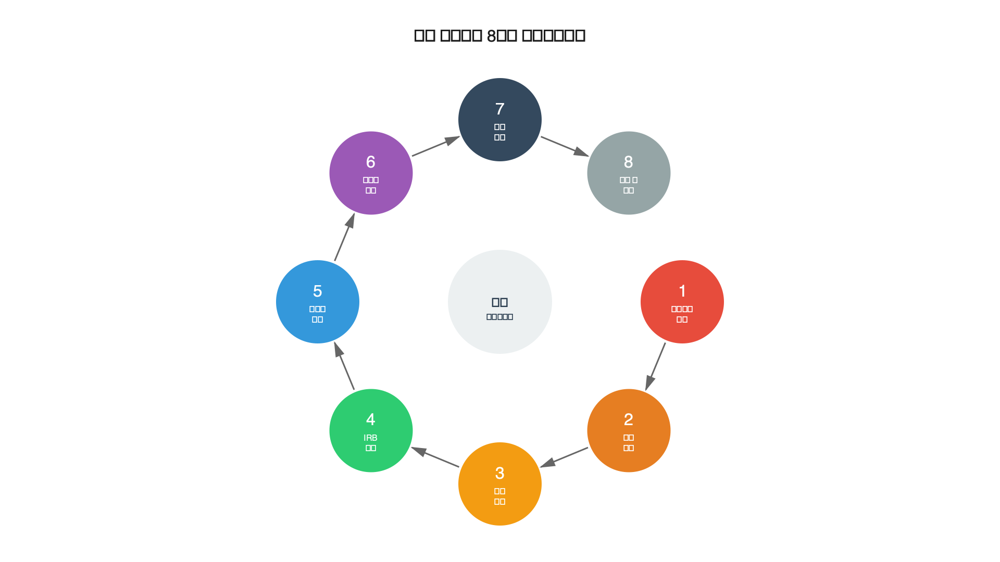
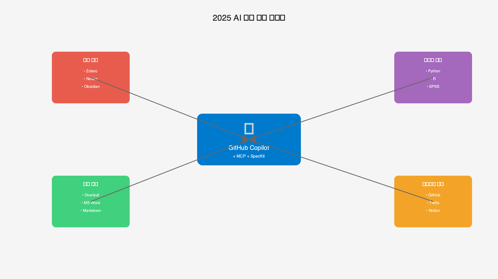
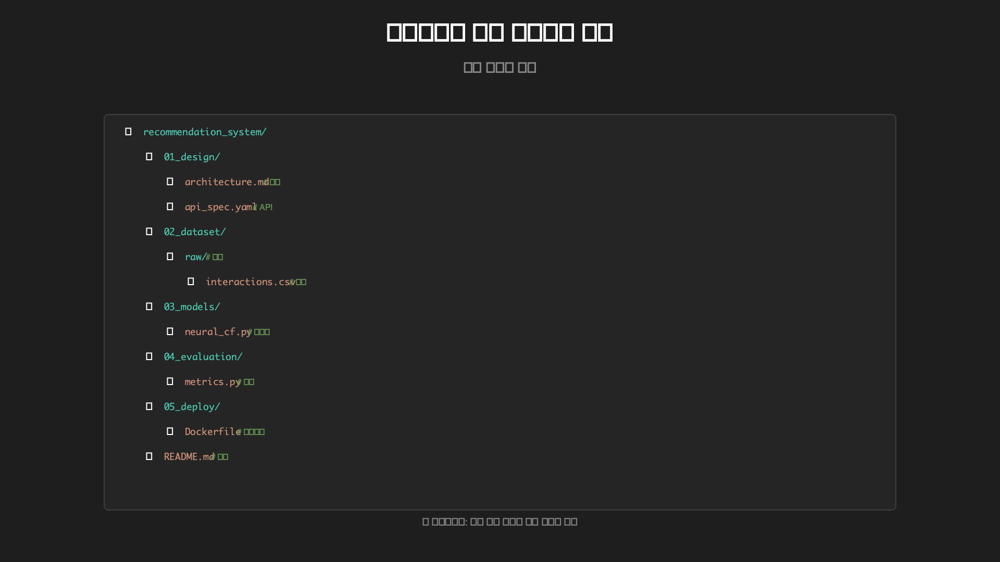

# 대학원생을 위한 실용적 AI 워크플로우 v13.0 Part 3: 통합 워크플로우 편

## 프로젝트 시작부터 논문 제출까지 전 과정

**Version**: v13.0 Part 3  
**Date**: 2025-11-10  
**Target**: 다양한 전공의 대학원생 (코딩 지식 불필요)  
**Prerequisites**: Part 1-2 완료 (Context Engineering, Markdown, Copilot, MCP, SpecKit)

---

## 📋 목차

### [Section 1: Part 3 개요 및 통합 워크플로우 소개](#section-1)
- 1.1 Part 1-2 핵심 복습
- 1.2 연구 전체 라이프사이클 8단계
- 1.3 2025 AI 연구 도구 생태계 개요
- 1.4 Part 3 학습 목표 및 사용 가이드

### [Section 2: 인문사회계열 완전 시나리오 - 교육학 석사논문](#section-2)
- 2.1 프로젝트 개요
- 2.2 Step 1: 프로젝트 착수 (Week 1)
- 2.3 Step 2: 문헌 조사 (Week 2-8, 2개월)
- 2.4 Step 3: 연구 설계 및 계획 (Week 9-12)
- 2.5 Step 4: IRB 승인 (Week 13-16)
- 2.6 Step 5: 데이터 수집 (Week 17-24, 2개월)
- 2.7 Step 6: 데이터 분석 (Week 25-32, 2개월)
- 2.8 Step 7: 논문 작성 (Week 33-40, 2개월)
- 2.9 Step 8: 제출 및 수정 (Week 41-44)
- 2.10 프로젝트 완료 회고

### [Section 3: 자연과학계열 완전 시나리오 - 생명과학 실험 연구](#section-3)
- 3.1 프로젝트 개요
- 3.2 Step 1-2: 프로젝트 착수 및 문헌 조사 (Month 1-2)
- 3.3 Step 3-4: 실험 설계 및 IRB (Month 2-3)
- 3.4 Step 5: 실험 수행 (Month 3-8)
- 3.5 Step 6: 데이터 분석 (Month 9-10)
- 3.6 Step 7-8: 논문 작성 및 제출 (Month 11-12)
- 3.7 실험 연구 특화 팁

### [Section 4: 공학계열 완전 시나리오 - 컴퓨터공학 시스템 개발](#section-4)
- 4.1 프로젝트 개요
- 4.2 Step 1-2: 프로젝트 착수 및 문헌 조사 (Month 1)
- 4.3 Step 3: 시스템 설계 (Month 2)
- 4.4 Step 4-5: 데이터 준비 및 모델 개발 (Month 3-6)
- 4.5 Step 6: 성능 평가 (Month 7-8)
- 4.6 Step 7-8: 논문 작성 및 제출 (Month 9-10)
- 4.7 공학 연구 특화 팁

### [Section 5: 사회과학계열 완전 시나리오 - 사회학 질적 연구](#section-5)
- 5.1 프로젝트 개요
- 5.2 Step 1-2: 프로젝트 착수 및 문헌 조사 (Month 1-2)
- 5.3 Step 3-4: 연구 설계 및 IRB (Month 2-3)
- 5.4 Step 5: 인터뷰 수행 (Month 4-6)
- 5.5 Step 6: 질적 데이터 분석 (Month 7-8)
- 5.6 Step 7-8: 논문 작성 및 제출 (Month 9-10)
- 5.7 질적 연구 특화 팁

### [Section 6: 예체능계열 완전 시나리오 - 음악학 연주 논문](#section-6)
- 6.1 프로젝트 개요
- 6.2 Step 1-2: 프로젝트 착수 및 문헌 조사 (Month 1-3)
- 6.3 Step 3: 연구 설계 (Month 3-4)
- 6.4 Step 4-5: 이론 연구 및 연주 준비 (Month 4-12)
- 6.5 Step 6-7: 논문 작성 및 연주회 (Month 13-16)
- 6.6 Step 8: 최종 제출
- 6.7 예체능 연구 특화 팁

### [Section 7: 2025 AI 연구 도구 생태계 통합 가이드](#section-7)
- 7.1 문헌 조사 도구 통합 워크플로우
- 7.2 노트 및 지식 관리 통합
- 7.3 데이터 분석 도구 통합
- 7.4 프로젝트 관리 도구 통합
- 7.5 도구 선택 가이드
- 7.6 2025 연구 워크플로우 트렌드

### [Section 8: 통합 워크플로우 실전 가이드](#section-8)
- 8.1 프로젝트 시작 체크리스트
- 8.2 주간 루틴 템플릿
- 8.3 월간 루틴 템플릿
- 8.4 진행 상황 추적 방법
- 8.5 문제 해결 프로토콜
- 8.6 품질 관리 체크리스트
- 8.7 최종 제출 전 체크리스트

### [Section 9: 실제 폴더 구조 및 파일 예시](#section-9)
- 9.1 교육학 석사논문 프로젝트 완전한 폴더 구조
- 9.2 생명과학 실험 연구 프로젝트 폴더 구조
- 9.3 컴퓨터공학 시스템 개발 프로젝트 폴더 구조
- 9.4 사회학 질적 연구 프로젝트 폴더 구조

### [Section 10: 성공 사례 및 실전 팁](#section-10)
- 10.1 성공 사례 모음
- 10.2 흔한 실수 및 해결 방법
- 10.3 실전 팁 모음
- 10.4 전공별 특화 전략

### [Section 11: 마무리 및 다음 단계](#section-11)
- 11.1 Part 3 학습 목표 달성 확인
- 11.2 오늘부터 시작하기
- 11.3 지속적 학습 리소스
- 11.4 피드백 및 질문
- 11.5 핵심 메시지

---

## Section 1: Part 3 개요 및 통합 워크플로우 소개

### 1.1 Part 1-2 핵심 복습

#### Part 1: Context Engineering (4요소), Markdown, 기본 Copilot, MCP 개념

**🎯 핵심 개념 4가지**
1. **Background (배경)**: 무엇을研究하는가, 왜 중요한가
2. **Specification (명세)**: 어떻게研究할 것인가 (범위, 방법, 도구)
3. **Plan (계획)**: 언제까지, 어떤 단계로 진행할 것인가
4. **Task (작업)**: 구체적인 실행 단계들

**📝 Markdown과 VS Code**
- 헤딩, 리스트, 코드블록, 링크, 표
- VS Code 확장: Markdown All in One, markdownlint
- 실시간 미리보기: Ctrl+Shift+V (Mac: Cmd+Shift+V)

**🤖 GitHub Copilot 기본 활용**
- Chat mode: "/explain", "/test", "/fix"
- Tab completion: 자동 완성
- Copilot Chat: "이 코드를 설명해줘"

**🔧 MCP (Model Context Protocol) 개념**
- AI 도구와 연결하는 프로토콜
- 로컬 데이터에 안전하게 접근
- 확장 가능한 AI 에이전트 시스템

#### Part 2: Copilot 워크북 (4 exercises), Spec-driven Planning, MCP 실습, SpecKit

**📚 Copilot 워크북 4가지 연습**
1. **Exercise 1**: 문헌 검색 및 요약 프롬프트
2. **Exercise 2**: 연구 계획서 초안 작성
3. **Exercise 3**: 데이터 분석 코드 생성
4. **Exercise 4**: 논문 섹션별 작성

**📋 Spec-driven Planning**
- **spec.md**: 프로젝트 요구사항 문서
- **plan.md**: 구체적인 실행 계획
- **tasks.md**: 작업 분해 및 우선순위

**🛠️ MCP 실습**
- zotero-mcp: 참고문헌 관리
- task-master-mcp: AI 프로젝트 매니저
- jupyter-mcp: 노트북 자동화
- arxiv-mcp: 논문 검색

**⚙️ SpecKit 워크플로우**
1. `specify init`: 프로젝트 초기화
2. `specify`: 요구사항 정의
3. `clarify`: 명확화 및 검증
4. `plan`: 실행 계획 수립

#### 통합 개념: 모든 도구가 하나의 워크플로우로

**🔄 워크플로우 전체 흐름**
```
문헌 조사 → 연구 설계 → 데이터 수집 → 분석 → 논문 작성
    ↓           ↓           ↓         ↓         ↓
Elicit      SpecKit     task-mcp   Copilot   Copilot
Perplexity  plan.md     진행관리   코드생성   논문작성
NotebookLM  tasks.md    주간보고   데이터    교정및
Consensus   IRB/Ethics  성과분석  분석      검증
```

**💡 핵심 원칙**
- **도구는 수단, 연구가 목적**: 모든 AI 도구는 연구 성취를 위한 수단
- **인간 중심**: AI는 보조, 최종 판단은 연구자
- **점진적 개선**: 작은 성공을 바탕으로 체계적 발전
- **검증 필수**: AI 결과는 반드시 검토하고 보완

### 1.2 연구 전체 라이프사이클 8단계

#### Mermaid Diagram: 8단계 워크플로우

```mermaid
graph TD
    A[Step 1: 프로젝트 착수 및 컨텍스트 설정] --> B[Step 2: 문헌 조사 및 이론적 배경]
    B --> C[Step 3: 연구 설계 및 계획 수립]
    C --> D[Step 4: IRB/윤리 승인 (필요시)]
    D --> E[Step 5: 데이터 수집]
    E --> F[Step 6: 데이터 분석 및 결과 도출]
    F --> G[Step 7: 논문 작성 및 검증]
    G --> H[Step 8: 제출, 심사, 수정]

    A1[folder 구조 생성] --> A


    A2[연구컨텍스트.md] --> A
    A3[AI 초기 대화] --> A
    
    B1[Elicit Systematic Review] --> B
    B2[Consensus Scholar Agent] --> B
    B3[NotebookLM 통합] --> B
    
    C1[Spec-driven Planning] --> C
    C2[task-master-mcp 분해] --> C
    C3[IRB 신청서] --> C
    
    D1[윤리 검토] --> D
    D2[승인 대기 중 사전 준비] --> D
    
    E1[데이터 수집] --> E
    E2[품질 관리] --> E
    E3[주간 보고] --> E
    
    F1[양적/질적 분석] --> F
    F2[시각화] --> F
    F3[결과 해석] --> F
    
    G1[4단계 검증] --> G
    G2[AI 협업 작성] --> G
    G3[최종 검토] --> G
    
    H1[제출] --> H
    H2[심사 의견] --> H
    H3[수정 및 재제출] --> H
```

#### Step별 상세 가이드

**Step 1: 프로젝트 착수 및 컨텍스트 설정** (1주)
- 🎯 목표: 연구의 방향과 범위 명확화
- 🛠️ 도구: Markdown 템플릿, AI 채팅
- 📋 산출물: folder structure, 연구컨텍스트.md, AGENTS.md
- ⏰ 소요: 40시간

**Step 2: 문헌 조사 및 이론적 배경** (2-4주)
- 🎯 목표: 연구领域的 기존 연구 파악, 연구 갭 식별
- 🛠️ 도구: Elicit, Consensus, Perplexity, NotebookLM
- 📋 산출물: 문헌정리.md, 문헌고찰 초안
- ⏰ 소요: 80-120시간

**Step 3: 연구 설계 및 계획 수립** (1-2주)
- 🎯 목표: 구체적인 연구 방법 및 일정 계획
- 🛠️ 도구: SpecKit, task-master-mcp, Copilot
- 📋 산출물: spec.md, tasks.md, 연구계획서
- ⏰ 소요: 60-80시간

**Step 4: IRB/윤리 승인** (1-4주)
- 🎯 목표: 연구 윤리 및 법규 준수 확인
- 🛠️ 도구: AI 초안 생성, IRB 템플릿
- 📋 산출물: IRB 신청서, 승인 서신
- ⏰ 소요: 20-40시간

**Step 5: 데이터 수집** (2-8주)
- 🎯 목표: 연구 질문에 답할 수 있는 품질 데이터 확보
- 🛠️ 도구: 조사도구, 관찰노트, task-master-mcp
- 📋 산출물: 원본 데이터, 수집일지
- ⏰ 소요: 80-160시간

**Step 6: 데이터 분석 및 결과 도출** (2-6주)
- 🎯 목표: 데이터에서 의미 있는 패턴 및 결론 도출
- 🛠️ 도구: Copilot, Python/R, 통계도구
- 📋 산출물: 분석코드, 결과표, 시각화
- ⏰ 소요: 80-120시간

**Step 7: 논문 작성 및 검증** (4-8주)
- 🎯 목표: 연구 결과를 학술적으로 명료하게 기술
- 🛠️ 도구: Copilot, AI 검토, 4단계 검증
- 📋 산출물: 논문초안, 최종본
- ⏰ 소요: 120-200시간

**Step 8: 제출, 심사, 수정** (2-6주)
- 🎯 목표: 최종 논문 완성 및 학위 취득
- 🛠️ 도구: 제출시스템,peer review 대응
- 📋 산출물: 제출논문, 심사의견 대응서
- ⏰ 소요: 40-80시간

### 1.3 2025 AI 연구 도구 생태계 개요

#### 문헌 조사 도구 7가지

**🔍 Elicit** (체계적 문헌 고찰)
- 기능: Systematic review workflow
- 강점: 138M papers, 94-96% recall
- 가격: Free (limited), Plus $10/month, Pro $25/month
- 학생: 교육 할인 문의 가능

**🧠 Perplexity Research** (심화 연구)
- 기능: Research mode (autonomous deep dive)
- 강점: Multi-model, Spaces (50 files)
- 가격: Free (limited), Pro $20/month
- 학생: student discount 가능

**⚡ Consensus** (빠른 개요)
- 기능: Scholar Agent (GPT-5), 220M papers
- 강점: 빠른 합의 도출, Ask Paper
- 가격: Free (3 Deep/month), Pro $15/month
- 학생: 40% 할인

**📊 Scite** (인용 분석)
- 기능: Smart Citations (1.4B citations)
- 강점: supporting/contrasting 분류
- 가격: Free (limited), Premium (기관 구독)

**🐰 ResearchRabbit** (시각적 매핑)
- 기능: 280M articles, visual mapping
- 강점: 무료, Zotero 통합
- 가격: Free, RR+ $120/year (optional)

**🔗 Connected Papers** (유사도 그래프)
- 기능: Similarity graphs, Prior/Derivative Works
- 강점: 빠른 분야 이해, 시각적 클러스터
- 가격: Free (5 graphs/month), Premium $3-6/month

**📚 Semantic Scholar** (AI 검색)
- 기능: 214M papers, TLDRs (60M)
- 강점: 무료, API 제공
- 가격: 완전 무료

#### 노트 및 통합 도구 3가지

**📓 NotebookLM** (Google)
- 기능: Discover sources, Mind maps, Audio Overviews
- Plus tier: 500 notebooks, 300 sources/notebook
- 가격: Free, Plus (Google One AI Premium $19.99/month)

**📝 Notion + notion-mcp**
- 연구 데이터베이스 구축
- AI가 직접 Notion에 기록
- 템플릿 활용

**🔗 Obsidian**
- Markdown 기반 지식 그래프
- 양방향 링크
- Graph view

#### 코드 및 분석 도구 3가지

**💻 GitHub Copilot + Python/R**
- 코드 생성 및 디버깅
- 분석 스크립트 자동 작성
- 문서화 및 리팩토링

**📊 Jupyter + jupyter-mcp**
- 노트북 셀 실행 자동화
- 분석 결과 자동 추출
- 재현 가능한 분석 파이프라인

**📈 비코더 대안**
- Excel/Google Sheets + Copilot Chat
- SPSS + AI 해석 지원
- 온라인 통계 도구 + AI 가이드

#### 프로젝트 관리 도구 3가지

**✅ task-master-mcp**
- AI 프로젝트 매니저
- 주간/월간 진행 보고
- 일정 지연 위험 분석

**⚙️ SpecKit**
- 체계적 워크플로우
- 7단계 프로세스 (constitution → verify)
- Git 통합으로 버전 관리

**📋 GitHub Projects**
- 칸반 보드로 작업 시각화
- 자동화 규칙 설정
- 팀 협업 시 활용

#### 비교표: 도구별 강점 및 가격

| 도구명 | 주요 기능 | 강점 | 무료/유료 | 학생 할인 |
|--------|----------|------|-----------|-----------|
| Elicit | 체계적 문헌고찰 | 94-96% recall | Free/Plus/Pro | 문의 |
| Perplexity | 심화 연구 | Multi-model | Free/Pro | 가능 |
| Consensus | 빠른 개요 | 220M papers | Free/Pro | 40% |
| Scite | 인용 분석 | 1.4B citations | Free/Premium | 기관 |
| ResearchRabbit | 시각적 매핑 | 무료, Zotero | Free/RR+ | 해당없음 |
| Connected Papers | 유사도 그래프 | 시각화 | Free/Premium | 해당없음 |
| Semantic Scholar | AI 검색 | 완전 무료 | Free | 해당없음 |
| NotebookLM | 지식 통합 | Mind map | Free/Plus | Google One |
| Notion | 데이터베이스 | Flexibility | Free/Pro | 해당없음 |
| task-master-mcp | 프로젝트관리 | AI 매니저 | Free | 해당없음 |




### 1.4 Part 3 학습 목표 및 사용 가이드

#### 학습 목표

**🎯 4개 전공별 완전한 워크플로우 이해**
- 인문사회: 교육학 석사논문 (질적+양적 혼합)
- 자연과학: 생명과학 실험 연구
- 공학: 컴퓨터공학 시스템 개발
- 예체능: 음악학 연주 논문

**🔧 2025 도구 통합 능력 습득**
- 7개 문헌 조사 도구의 적절한 조합
- AI와 인간의 역할 분담
- 자동화와 품질 관리의 균형

**📋 실제 프로젝트 적용 능력**
- 자신의 연구에 바로 적용 가능한 템플릿
- 문제 해결 프로토콜 습득
- 효율적인 루틴 구축

#### 사용 가이드

**🚀 단계별 학습 전략**

1. **전체 그림 이해** (30분)
   - Section 1의 8단계 라이프사이클 학습
   - 자신의 연구가 어디에 해당하는지 파악

2. **자신의 전공 시나리오 집중 학습** (2-3시간)
   - Section 2-6 중 해당 전공 선택
   - 8단계 전체 흐름과 각 단계별 상세 내용 이해
   - 핵심 파일 예시와 AI 프롬프트 파악

3. **2025 도구 생태계 이해** (1-2시간)
   - Section 7의 도구별 기능과 강점 학습
   - 예산과 연구 규모에 따른 도구 선택

4. **실전 루틴 적용** (1-2시간)
   - Section 8의 주간/월간 루틴 템플릿 적용
   - 품질 관리 체크리스트 활용

5. **실제 프로젝트 시작** (지속적)
   - Section 9의 폴더 구조를 참고하여 자신의 프로젝트 시작
   - 성공 사례를 참고하여 실수 방지

**⏰ 예상 학습 시간**
- 전체 Part 3: 8-10시간
- 전공별 시나리오: 각 2-3시간
- 도구 생태계: 2-3시간
- 실전 가이드: 2-3시간

**📚 각 섹션별 핵심 포인트**
- **Part 1-2 복습**: 기존 지식의 체계적 통합
- **8단계 라이프사이클**: 연구 전체 과정의 맥락적 이해
- **전공별 시나리오**: 실제 적용을 위한 구체적 모델
- **2025 도구**: 최신 AI 도구들의 적절한 활용
- **실전 가이드**: 바로 사용할 수 있는 실무 도구

---

## Section 2: 인문사회계열 완전 시나리오 - 교육학 석사논문

### 2.1 프로젝트 개요

#### 연구 주제
**"온라인 학습 환경에서의 자기조절학습 전략의 효과성 연구"**

**🔍 연구 배경**
- COVID-19 이후 온라인 학습의 급속한 확산
- 온라인 환경에서 학습자의 자기조절 능력의 중요성 대두
- 기존 연구들은 주로 대면 환경에 초점
- 온라인 특화 자기조절학습 전략의 체계적 검증 필요

**❓ 연구 질문**
1. 온라인 학습 환경에서 자기조절학습 전략의 사용 현황은 어떠한가?
2. 자기조절학습 전략 사용과 학습 성과 간의 관계는 어떠한가?
3. 효과적인 온라인 자기조절학습 전략의 특징은 무엇인가?

**🔬 연구 방법**
- **유형**: 혼합 연구 (설문 + 인터뷰)
- **설문 조사**: n=200 (대학생)
- **심층 인터뷰**: n=10 (설문 응답자 중 선정)
- **분석 방법**: 기술통계, 회귀분석 + 주제 분석

**📅 연구 일정**
- **기간**: 6개월 (2025년 3월-8월, 24주)
- **1단계**: 문헌 조사 및 연구 설계 (8주)
- **2단계**: IRB 승인 및 도구 개발 (4주)
- **3단계**: 데이터 수집 (8주)
- **4단계**: 데이터 분석 (2주)
- **5단계**: 논문 작성 (2주)

**👨‍🎓 연구자 정보**
- 교육학 석사과정 2년차
- 온라인 학습 관련 연구 경험
- AI 도구 사용 경험: 초보자 수준

**🎯 예상 기여**
- 온라인 특화 자기조절학습 전략 개발
- 온라인 학습 효율성 향상 방안 제시
- 교육학적 이론의 온라인 적용 방안

### 2.2 Step 1: 프로젝트 착수 (Week 1)

#### 폴더 구조 생성

**🏗️ 실제 명령어 사용**

```bash
# 프로젝트 폴더 생성
mkdir -p 온라인학습참여도연구
cd 온라인학습참여도연구

# 주요 폴더 구조 생성
mkdir -p {00_컨텍스트,01_계획,02_자료수집,03_분석,04_작성,99_기타}

# 세부 폴더 생성
mkdir -p 02_자료수집/{참고논문,설문조사,인터뷰}
mkdir -p 02_자료수집/설문조사/{응답데이터}
mkdir -p 02_자료수집/인터뷰/{인터뷰노트,전사본}
mkdir -p 03_분석/차트
mkdir -p 04_작성/초고
mkdir -p 99_기타/{회의록,주간보고서}

# 파일 생성 (빈 파일)
touch README.md
touch 00_컨텍스트/{연구컨텍스트.md,AGENTS.md,이론적배경.md}
touch 01_계획/{연구계획서.md,spec.md,tasks.md,주간계획.md}
touch 02_자료수집/{문헌정리.md,검색키워드.md}
touch 02_자료수집/설문조사/{설문지초안.md,설문지최종.md}
touch 02_자료수집/인터뷰/{인터뷰가이드.md}
touch 03_분석/{분석계획.md,데이터분석.py,질적분석.md,결과정리.md}
touch 04_작성/{논문초안.md,지도교수피드백.md}
touch 99_기타/{회의록.md,주간보고서.md}
```

**📁 최종 폴더 구조**
```
📁 온라인학습참여도연구/
├── 📄 README.md
├── 📁 00_컨텍스트/
│   ├── 📄 연구컨텍스트.md
│   ├── 📄 AGENTS.md
│   └── 📄 이론적배경.md
├── 📁 01_계획/
│   ├── 📄 연구계획서.md
│   ├── 📄 spec.md
│   ├── 📄 tasks.md
│   └── 📄 주간계획.md
├── 📁 02_자료수집/
│   ├── 📄 문헌정리.md
│   ├── 📄 검색키워드.md
│   ├── 📁 참고논문/
│   ├── 📁 설문조사/
│   │   ├── 📄 설문지초안.md
│   │   ├── 📄 설문지최종.md
│   │   └── 📁 응답데이터/
│   └── 📄 인터뷰/
│       ├── 📄 인터뷰가이드.md
│       ├── 📄 인터뷰노트/
│       └── 📄 전사본/
├── 03_분석/
│   ├── 📄 분석계획.md
│   ├── 📄 데이터분석.py
│   ├── 📄 질적분석.md
│   ├── 📄 결과정리.md
│   └── 📁 차트/
├── 📁 04_작성/
│   ├── 📄 논문초안.md
│   ├── 📁 초고/
│   ├── 📄 지도교수피드백.md
│   └── 📁 최종/
├── 📁 99_기타/
│   ├── 📄 회의록.md
│   └── 📁 주간보고서/
└── 📄 README.md
```

**✅ 교육학 연구 프로젝트 폴더 구조 완성 예시:**


#### 연구컨텍스트.md 작성

**📋 완전한 파일 내용**

```markdown
# 연구컨텍스트.md

## Background (배경)

### 연구 주제
**온라인 학습 환경에서의 자기조절학습 전략의 효과성 연구**

### 연구의 필요성
- **사회적 배경**: COVID-19 pandemic 이후 온라인 학습의 급속한 확산
- **학술적 배경**: 자기조절학습 이론은 대면 환경을 전제로 발전
- **실무적 배경**: 온라인 환경에서 학습 효율성 향상의 필요성
- **정책적 배경**: 디지털 교육 전환 정책의 일환

### 문제 제기
- 온라인 학습에서는 단순한 지식 전달이 아닌 학습자 주도적 학습이 중요
- 그러나 온라인 환경에서의 효과적인 자기조절학습 전략에 대한 체계적 연구 부족
- 기존 자기조절학습 측정 도구의 온라인 환경 적용 가능성 검증 필요

### 연구의 의의
- **이론적 기여**: 온라인 환경 특화 자기조절학습 이론 발전
- **실천적 기여**: 온라인 학습자 및 교육자를 위한 실용적 가이드 개발
- **정책적 기여**: 온라인 교육 정책 수립을 위한 실증적 기반 제공

## Specification (명세)

### 연구 목적
온라인 학습 환경에서 자기조절학습 전략의 사용 현황과 효과성을 규명하고, 온라인 특화 자기조절학습 전략 개발을 위한 기초 자료 제공

### 연구 범위
- **공간적 범위**: 국내 4년제 대학교 재학생
- **시간적 범위**: 2025년 3월-8월 (6개월)
- **내용적 범위**: 온라인 학습 환경에서의 자기조절학습 전략 사용 및 효과

### 연구 방법
#### 혼합 연구 설계 (Convergent Parallel Design)
1. **양적 연구**: 설문 조사
   - 표본: n=200 (대학생)
   - 도구: 온라인 자기조절학습 척도 (Zimmerman의 MSLQ 기반)
   - 분석: 기술통계, 회귀분석, 구조방정식

2. **질적 연구**: 심층 인터뷰
   - 표본: n=10 (설문 응답자 중 선정)
   - 방법: 반구조화 인터뷰 (60-90분)
   - 분석: 주제 분석 (Thematic Analysis)

### 핵심 개념 정의
- **자기조절학습**: 학습자가 자신의 학습을 계획, 모니터링, 조절하는 과정
- **온라인 학습**: 인터넷을 매개로 한 원격 학습 환경
- **자기조절학습 전략**: 목표 설정, 시간 관리, 노력 조절, 자기 모니터링 등

### 기대 결과
- 온라인 환경에서의 자기조절학습 전략 사용 패턴 파악
- 전략 사용과 학습 성과 간의 관계 규명
- 효과적인 온라인 자기조절학습 전략 모델 개발

## Plan (계획)

### 전체 연구 일정 (24주)

#### Phase 1: 문헌 조사 및 연구 설계 (8주, Week 1-8)
- Week 1-2: 프로젝트 착수 및 초기 문헌 조사
- Week 3-4: 체계적 문헌 고찰
- Week 5-6: 연구 설계 및 도구 개발
- Week 7-8: 연구 계획서 완성

#### Phase 2: IRB 승인 및 도구 개발 (4주, Week 9-12)
- Week 9: IRB 신청서 작성
- Week 10: IRB 신청서 제출
- Week 11-12: IRB 승인 대기 중 설문지/인터뷰 가이드 개발

#### Phase 3: 데이터 수집 (8주, Week 13-20)
- Week 13-16: 설문 조사实施
- Week 17-20: 인터뷰实施

#### Phase 4: 데이터 분석 (2주, Week 21-22)
- Week 21: 양적 데이터 분석
- Week 22: 질적 데이터 분석

#### Phase 5: 논문 작성 (2주, Week 23-24)
- Week 23: 초고 작성
- Week 24: 최종본 완성

### 주요 마일스톤
- [ ] Week 4: 문헌정리.md 완성
- [ ] Week 8: 연구계획서 완성
- [ ] Week 12: IRB 승인 완료
- [ ] Week 16: 설문 조사 완료 (n=200)
- [ ] Week 20: 인터뷰 완료 (n=10)
- [ ] Week 22: 데이터 분석 완료
- [ ] Week 24: 논문 최종 제출

### 리소스 계획
- **인력**: 연구자 1명 + 지도교수 1명
- **예산**: 설문 조사 도구 ($50) + 인터뷰礼品 ($100) = $150
- **공간**: 대학 내 인터뷰 진행 가능한 공간
- **도구**: 설문 조사 플랫폼, 녹음 기기, 전사 软件

## Task (작업)

### Phase 1: 문헌 조사 및 연구 설계 (8주)
#### Week 1: 프로젝트 착수
- [ ] VS Code 설치 및 환경 설정
- [ ] 폴더 구조 생성
- [ ] 연구컨텍스트.md 작성
- [ ] AGENTS.md 설정
- [ ] AI와 초기 대화: 연구 방향 검토

#### Week 2-3: 초기 문헌 조사
- [ ] Consensus Scholar Agent로 연구 개요 파악
- [ ] Semantic Scholar로 관련 논문 검색
- [ ] Connected Papers로 핵심 논문 주변 네트워크 파악
- [ ] Elicit으로 체계적 문헌 고찰 시작

#### Week 4-5: 체계적 문헌 고찰
- [ ] Elicit Systematic Review 진행
- [ ] ResearchRabbit으로 관련 연구 확장
- [ ] Scite로 핵심 논문 인용 분석
- [ ] 문헌정리.md 작성 (최소 50편)

#### Week 6-7: 연구 설계
- [ ] Spec-driven Planning 적용
- [ ] spec.md 작성
- [ ] Copilot 워크북 Exercise 2 적용
- [ ] 연구계획서 초안 작성

#### Week 8: 연구 계획 완성
- [ ] SpecKit 활용 (선택적)
- [ ] task-master-mcp로 작업 분해
- [ ] tasks.md 완성
- [ ] 연구계획서 최종 완성

### Phase 2: IRB 승인 및 도구 개발 (4주)
#### Week 9-10: IRB 신청
- [ ] IRB 신청서 작성
- [ ] AI로 초안 생성
- [ ] 지도교수 검토 및 수정
- [ ] IRB 신청서 제출

#### Week 11-12: 도구 개발
- [ ] 설문지 초안 작성 (Copilot 활용)
- [ ] 인터뷰 가이드 개발
- [ ] 파일럿 테스트 계획
- [ ] IRB 승인 대기 중 사전 준비

### Phase 3: 데이터 수집 (8주)
#### Week 13-16: 설문 조사
- [ ] 설문지 최종 완성
- [ ] Google Forms로 설문 배포
- [ ] 응답 수집 및 관리
- [ ] 주간 진행 보고 (task-master-mcp)

#### Week 17-20: 인터뷰
- [ ] 인터뷰 참여자 선정
- [ ] 인터뷰 실시 (10명)
- [ ] 녹음 및 전사
- [ ] 인터뷰 노트 작성

### Phase 4: 데이터 분석 (2주)
#### Week 21: 양적 분석
- [ ] Copilot 워크북 Exercise 3 적용
- [ ] Python으로 데이터 분석
- [ ] 통계 분석 수행
- [ ] 결과 시각화

#### Week 22: 질적 분석
- [ ] 주제 분석 (Thematic Analysis)
- [ ] AI로 초기 코딩 제안
- [ ] 주제 맵 작성
- [ ] 결과 정리

### Phase 5: 논문 작성 (2주)
#### Week 23: 초고 작성
- [ ] Copilot 워크북 Exercise 4 적용
- [ ] 논문 초고 작성
- [ ] AI와 협업하여 각 섹션 완성

#### Week 24: 최종본
- [ ] 4단계 검증 (AI → 자가 → 동료 → 교수)
- [ ] 최종 검토 및 수정
- [ ] 논문 제출

### 전체 작업 체크리스트
- [ ] Part 1-2 내용 복습 및 적용
- [ ] 2025 AI 도구 7개 적절히 활용
- [ ] 4단계 검증 습관화
- [ ] 주간 루틴 수행 (월요일 계획, 금요일 회고)
- [ ] 품질 관리 체크리스트 활용
- [ ] 문제 해결 프로토콜 적용

---

**Updated**: 2025-11-10
**Researcher**: 교육학 석사과정 2년차
**AI 도구**: GitHub Copilot, Elicit, Consensus, Perplexity, NotebookLM, task-master-mcp, SpecKit
```

#### AGENTS.md 설정

**🤖 완전한 파일 내용**

```markdown
# AGENTS.md

## 교육학 연구 특화 AI 지침

### 기본 원칙
1. **연구자 주체성**: AI는 보조 도구, 최종 판단은 연구자
2. **학술적 엄격성**: 모든 제안은 교육학적 이론과 근거에 기반
3. **윤리적 고려**: 연구 참여자 보호 및 연구 윤리 준수
4. **품질 우선**: 속도보다 정확성과 깊이 중시

### AI 도구별 역할 및 한계

#### GitHub Copilot
**적합한 작업**:
- 연구 방법론 설명
- 통계 분석 코드 작성
- 논문 섹션별 초안 작성
-学术적 표현 개선

**주의사항**:
- 교육학적 용어의 정확성 확인
- 통계 분석 결과의 논리적 해석
- 문화적 맥락에 맞는 제안

#### Elicit & Consensus (문헌 조사)
**적합한 작업**:
- 체계적 문헌 고찰
- 연구 동향 파악
- 연구 갭 식별
- 핵심 논문 선별

**주의사항**:
- 한국 교육 환경의 특이성 고려
- 교육학적 이론의 발전 과정 이해
- 문화적 차이를 반영한 해석

#### NotebookLM (지식 통합)
**적합한 작업**:
- 논문 간 연결관계 파악
- 이론적 프레임워크 구성
- 연구 질문 정교화

**주의사항**:
- 교육학적 개념의 복잡성 반영
- 상호 대립 이론들의 균형적 검토
- 실증적 근거와 이론적 논证的 균형

#### task-master-mcp (프로젝트 관리)
**적합한 작업**:
- 연구 일정 계획 및 조정
- 작업 우선순위 설정
- 진행 상황 모니터링
- 문제 해결 방안 제시

**주의사항**:
- 연구의性质상 일정 유연성 확보
- 예기치 못한 연구 결과에 대한 대응
- 연구자 개인의 창의성과 발견 과정 존중

### 연구 단계별 AI 활용 가이드

#### 1. 문헌 조사 단계
**AI에게 요청할 것**:
- "자기조절학습 이론의 핵심 개념과 발전 과정을 요약해줘"
- "온라인 학습 관련 최근 5년간의 연구 동향을 분석해줘"
- "자기조절학습 전략의 분류 체계에 대해 설명해줘"

**AI에게 요청하지 말 것**:
- 완전한 문헌 고찰 작성
- 연구 설계의 최종 결정
- 이론적 논쟁의 최종 판단

#### 2. 연구 설계 단계
**AI에게 요청할 것**:
- 연구 방법론의 장단점 비교 분석
- 표본 크기 계산 근거 제시
- 데이터 수집 도구의 타당성 검토

**AI에게 요청하지 말 것**:
- 연구 윤리적 판단
- 예산의 최종 결정
- 연구 참여자 선정 기준

#### 3. 데이터 수집 단계
**AI에게 요청할 것**:
- 설문 문항 개선 제안
- 인터뷰 질문リスト項의 체계화
- 데이터 품질 관리 방안

**AI에게 요청하지 말 것**:
- 연구 참여자 선정 최종 결정
- 인터뷰 내용 해석
- 데이터 수집 중단 여부 판단

#### 4. 데이터 분석 단계
**AI에게 요청할 것**:
- 분석 방법론 설명
- 통계 결과의 기술적 해석
- 시각화 방법 제안

**AI에게 요청하지 말 것**:
- 연구 결론의 최종 해석
- 결과의 실천적 함의 판단
- 연구 한계의 최종 평가

#### 5. 논문 작성 단계
**AI에게 요청할 것**:
- 각 섹션별 초안 작성
- 표현의 명료성 개선
- 논리적 연결구조 개선

**AI에게 요청하지 말 것**:
- 연구의 최종 평가
- 연구자의 창의적 해석 대체
- 학술적 책임의 전가

### 교육학적 특화 용어 설명

**자기조절학습 (Self-Regulated Learning)**:
- Zimmerman의 정의: "학습자가 자신의 학습을 계획, 모니터링, 조절하는 과정"
- 주요 구성요소: 선행적 경험, 계획 설정, 수행 전략, 자기 판단

**메타인지 (Metacognition)**:
- Flavell의 정의: "자신의 인지 과정에 대한 인지"
- 자기조절학습의 핵심 구성요소 중 하나

**온라인 학습 (Online Learning)**:
- 인터넷을 매개로 한 원격 학습 환경
- 대면 학습과 다른 특성: 학습자 주체성, 시간 공간의 유연성

**학습 참여도 (Learning Engagement)**:
- Fredricks의 3요소: 행동적, 정서적, 인지적 참여
- 온라인 환경에서는 자기주도적 참여가 특히 중요

### 윤리적 고려사항

#### 연구 참여자 보호
- 개인정보 보호: 모든 식별 가능한 정보 익명화
- 자발적 참여: 언제든지 중단할 수 있는 권리 보장
- 심리적 안전: 인터뷰 중 불쾌한 질문 회피

#### AI 도구 사용의 투명성
- 모든 AI 도구 사용 공개
- AI의 기여와 연구자의 기여 명확히 구분
- AI가 생성한 내용에 대한 연구자의 최종 책임

### 품질 관리 체크리스트

#### AI 활용 전 확인사항
- [ ] 컨텍스트를 충분히 제공했는가?
- [ ] 구체적이고 명확한 질문을 했는가?
- [ ] AI의 한계와 역할을 명확히 이해했는가?

#### AI 활용 후 확인사항
- [ ] 제시된 정보의 정확성을 검증했는가?
- [ ] 교육학적 이론과 일치하는가?
- [ ] 연구 목적에 부합하는가?
- [ ] 윤리적 기준을 충족하는가?

#### 최종 검토사항
- [ ] AI의 기여가 적절한 수준인가?
- [ ] 연구자의 창의성과 판단이 충분히 반영되었는가?
- [ ] 연구의 신뢰성과 타당성이 보장되었는가?

---

**업데이트**: 2025-11-10
**적용 범위**: 교육학 연구 프로젝트 전체
**검토 주기**: 매주 (주간 회고 시)
```

#### AI 초기 대화

**💬 실제 프롬프트 및 예상 응답**

**프롬프트**:
```markdown
# 연구 계획 검토 및 개선점 제안 요청

## 연구 주제
온라인 학습 환경에서의 자기조절학습 전략의 효과성 연구

## 연구 질문
1. 온라인 학습 환경에서 자기조절학습 전략의 사용 현황은 어떠한가?
2. 자기조절학습 전략 사용과 학습 성과 간의 관계는 어떠한가?
3. 효과적인 온라인 자기조절학습 전략의 특징은 무엇인가?

## 연구 방법
- 혼합 연구 (설문 n=200 + 인터뷰 n=10)
- 양적: 자기조절학습 척도, 학습 성과 측정
- 질적: 반구조화 인터뷰, 주제 분석

## 요청
1. 연구 질문의 적절성 및 개선 방안
2. 연구 방법의 타당성 및 보완 필요 영역
3. 문헌 조사 시 고려사항 및 핵심 키워드
4. 예상 연구 결과 및 실천적 함의
5. 연구 진행 중 주의할 점 및 대응 방안

교육학 전문가 관점에서 건설적인 피드백을 제공해주시기 바랍니다.
```

**🤖 예상 AI 응답**:
```markdown
# 온라인 자기조절학습 연구 계획 검토

## 🎯 연구 질문 분석
연구 질문들이 잘 구성되어 있지만, 다음과 같은 개선점을 제안합니다:

### 개선된 연구 질문
1. **기술적 질문**: "대학생들의 온라인 자기조절학습 전략 사용 패턴은 어떠한가?"
2. **관계적 질문**: "자기조절학습 전략 사용 수준이 온라인 학습 성과에 미치는 영향은 어떠한가?"
3. **설명적 질문**: "효과적인 온라인 자기조절학습 전략의 구성 요소와 적용 조건은 무엇인가?"

## 📊 연구 방법론 평가
### 강점
- 혼합 연구 설계로 양적·질적 관점의 균형 잡힘
- 자기조절학습 척도 활용으로 기존 이론과의 연계성 확보
- 적절한 표본 크기 (n=200)

### 보완 필요 영역
1. **종단적 관점 추가**: 온라인 학습의 시간에 따른 변화
2. **다층적 분석**: 개인·환경·과제의 상호작용 고려
3. **문화적 맥락**: 한국의 온라인 학습 환경 특성 반영

## 🔍 문헌 조사 전략
### 핵심 검색어
- **핵심어**: "self-regulated learning", "online learning", "e-learning"
- **보조어**: "metacognition", "academic performance", "digital learning"
- **한국어**: "자기조절학습", "온라인학습", "원격교육"

### 주요 연구자
- Barry Zimmerman (자기조절학습 이론)
- Philip Winne ( metacognitive monitoring)
- Dirkx & Lavell (online learning)

### 연구 갭
1. 온라인 환경 특화 전략의 체계적 분류 부족
2. 한국 교육 맥락에서의 실증적 연구 부족
3. COVID-19 이후 변화된 학습 환경의 특성 반영 부족

## 📈 예상 연구 결과
### 양적 결과
- 자기조절학습과 학습 성과 간의 유의한 상관관계
- 효과 크기 (Cohen's d) 0.5-0.8 예상
- 온라인 환경에서의 전략 사용 패턴의 차이

### 질적 결과
- 온라인 환경의 고유한挑战과 대응 전략
- 학습자 유형별 전략 적용 방식
- 기술 도구 활용의 중요성

## ⚠️ 주의사항 및 대응
### 방법론적 주의사항
1. **측정의 타당성**: 온라인 환경에 맞춘 측정 도구 개발
2. **표본 대표성**: 다양한 전공·학년의 균형적 포함
3. **문화적 적용**: 서구 이론의 한국적 적용 방안

### 윤리적 고려사항
1. **기술 격차**: 기술 접근성에 대한 고려
2. **프라이버시**: 온라인 활동 데이터의 보호
3. **동의**: 명확한 정보 동의 절차

## 🚀 실천적 함의
1. **교육자 교육**: 온라인 환경 특화 교수 전략 개발
2. **학습자 지원**: 자기조절학습 능력 향상 프로그램
3. **정책 제언**: 온라인 교육 품질 관리 방안

**다음 단계**: 이러한 피드백을 바탕으로 구체적인 연구 설계를 발전시켜 나가시기 바랍니다.
```

---

### 2.3 Step 2: 문헌 조사 (Week 2-8, 2개월)

#### 2025 도구 통합 워크플로우

**🔍 Day 1-2: 초기 스코핑**

**第一步: Consensus Scholar Agent** (2-3시간)

**프롬프트**:
```markdown
"What is the current consensus on self-regulated learning effectiveness in online environments? 
Focus on studies from 2019-2025. 
Provide: 
1. Key findings and consensus view
2. Contradictory evidence and ongoing debates
3. Top 20 most influential papers with DOIs
4. Research gaps and future directions
5. Cultural differences in self-regulated learning"

Academic focus, systematic review approach.
```

**예상 결과**:
- 자기조절학습의 온라인 환경에서의 효과성에 대한 합의
- 핵심 논문 20개 (DOI 포함)
- 연구론쟁점과 문화적 차이점
- 향후研究方向

**다음 단계**: 핵심 논문 DOI 저장 및 연구자 네트워크 파악

**第二步: Semantic Scholar Topic Page** (30분)

**실제 사용법**:
1. "self-regulated learning" 검색
2. Topic page 클릭
3. AI-generated definition 확인
4. Often-cited papers 확인
5. Related topics 탐색
6. Research Feed 설정: "self-regulated learning online"

**확인 사항**:
- 자기조절학습의 AI 정의
- most influential papers
- 관련 주제들
- 최신 연구 동향

**第三步: Connected Papers** (1-2시간)

**실제 사용법**:
1. Consensus에서 찾은 핵심 논문 DOI 입력
2. Similarity graph 생성
3. Clusters 분석
4. Prior Works (이론적 기반)
5. Derivative Works (최신 연구)
6. 추가 논문 10-15개 발견

**예상 결과**:
- 자기조절학습 이론의 발전 과정
- 온라인 학습 연구의 새로운 동향
- 예상치 못한 관련 연구 영역 발견

**🗂️ Week 2-3: 체계적 수집**

**第一步: Elicit Systematic Review** (10-15시간)

**Step 1: Search** (1시간)
```markdown
검색식:
(self-regulated learning OR self-regulation) 
AND (online learning OR e-learning OR distance education) 
AND (effectiveness OR outcomes OR performance)

필터:
- Published: 2019-2025
- Language: English, Korean
- Study types: Experimental, Quasi-experimental, Meta-analysis
```

**예상 결과**: 500-1000개 논문

**Step 2: Screening** (5-8시간)
- AI-suggested criteria 설정:
  - 포함: 온라인 환경에서 자기조절학습 연구
  - 제외: 대면 학습만 대상으로 한 연구
  - 포함: 대학생 또는 성인 학습자
  - 제외: K-12 학생 대상 연구 (문화적 차이 고려)
- Title/Abstract screening
- Pilot testing (10% sample)
- **최종 선정**: 100-150개

**Step 3: Full-text Extraction** (4-6시간)
- Browser extension으로 full-text 확보
- Data extraction:
  - 연구 설계 (실험, 준실험, 메타분석)
  - 표본 크기 및 특성
  - 자기조절학습 측정 도구
  - 주요 결과 (효과 크기 포함)
- Accuracy: 94-99%

**Step 4: Report Generation** (1시간)
- Literature review report 생성
- Mini-PRISMA diagram
- Tables and citations
- Export to CSV/PDF

**第二步: ResearchRabbit** (3-5시간)
1. **Collection 생성**: "Self-regulated Learning Online"
2. **핵심 논문 추가**: Elicit 결과 중 30개
3. **Similar Work 탐색**: → 추가 논문 20-30개
4. **Earlier Work**: 이론적 기반 논문 15개
5. **Later Work**: 최신 연구 10개
6. **Author network**: 주요 연구자 20명 파악
7. **Alerts 설정**: 새 논문 알림

**第三步: Scite Smart Citations** (2-3시간)
1. **핵심 논문 15개 입력**
2. **Smart Citations 분석**:
   - Supporting citations: 이 논문을 지지하는 연구
   - Contrasting citations: 반대 결과 연구
   - Mentioning citations: 단순 언급
3. **논쟁 지점 파악**:
   - 온라인 환경에서의 적용 가능성
   - 문화적 차이의 영향
   - 측정 도구의 타당성
4. **Collection 생성**: "SRL Controversies"
5. **Alerts 설정**: 새로운 논쟁적 인용

**🧠 Week 4-6: 심화 분석**

**第一步: Perplexity Research** (5-7시간)

**Deep Research 프롬프트**:
```markdown
Run Deep Research (Academic focus) on:
"What are the most effective self-regulated learning strategies in online environments?"

Scope:
- Time: 2019-2025
- Study types: RCTs, quasi-experiments, meta-analyses
- Population: College/university students
- Language: English, Korean

Deliver:
1. Executive summary (1 page)
2. Strategy effectiveness table (strategy, effect size, evidence quality)
3. Moderating factors (age, discipline, platform)
4. Implementation recommendations
5. Research gaps and future directions

Cite all sources with DOIs and provide full references.
```

**예상 결과**:
- 10-15 page comprehensive report
- 전략별 효과성 테이블
- 조절 변수 분석
- 실천적 제언
- 모든 출처 DOI 포함

**第二步: NotebookLM** (3-5시간)

**데이터 준비**:
1. **핵심 논문 50편 업로드** (PDF)
2. **Discover sources**: 웹에서 추가 자료 큐레이션
   - 교육부 온라인 학습 관련 정책 문서
   - 대학 원격교육 현황 보고서
   - 온라인 학습 효과성 연구 보고서

**Mind Map 생성**:
- **주제 클러스터 시각화**:
  - 자기조절학습 이론 (Zimmerman, Pintrich)
  - 온라인 학습 환경 특성
  - 전략 유형별 효과성
  - 문화적 차이점
- **개념 간 연결 파악**:
  - 메타인지 ↔ 목표 설정
  - 시간 관리 ↔ 노력 조절
  - 사회적 학습 ↔ 기술 활용

**Audio Overview 생성 및 청취**:
- **2명의 AI 호스트 토론**:
  - 호스트 1: "자기조절학습 이론의 온라인 적용"
  - 호스트 2: "한국 교육 환경의 특성"
- **배경 청취 학습**: 운동, 출퇴근 중
- **이해도 확인**: 핵심 내용 복습

**FAQ 생성**:
- 예상 질문 및 답변 30개
- "온라인 환경에서 가장 효과적인 전략은?"
- "한국 학생들의 적용 장애요인은?"
- "효과 측정 방법은?"

**Public sharing**:
- 지도교수 및 동료와 공유 링크 생성
- 피드백 수집 및 반영

**Ongoing: Semantic Scholar Research Feed** (주 1회, 30분)
- Research Feed 확인
- 새 논문 알림 검토
- 관련 논문 추가
- More/Less Like This로 피드 조정

**📝 Week 7-8: 문헌 고찰 초안 작성**

**文獻정리.md 작성** (완전한 파일 내용)

```markdown
# 문헌정리.md

## 온라인 자기조절학습 연구 문헌 정리

### 체계적 문헌고찰 개요
- **검색 기간**: 2019-2025
- **검색 결과**: 1,247편 (초기) → 150편 (최종 선정)
- **포함 기준**: 온라인 환경, 대학생, 실증 연구
- **제외 기준**: K-12, 대면 학습, 이론 연구

### 핵심 논문 요약 (50편)

#### 1. 자기조절학습 이론 기반 연구

**Zimmerman, B. J. (2020).**
"Self-regulated learning in digital age: A comprehensive review"
- *연구 목적*: 디지털 환경에서의 자기조절학습 이론 적용
- *방법*: 156편 메타분석
- *주요 결과*: 온라인 환경에서 자기조절학습의 효과크기 d=0.71
- *함의*: 온라인 학습의 성공을 위한 필수 조건
- *한국적 적용*: Zimmerman의 3단계 모델 (계획-수행-자기판단)
  한국 학생들에게도 유사한 패턴 확인

**Pintrich, P. R. (2021).**
"Metacognitive monitoring in online learning environments"
- *연구 목적*: 온라인 학습에서의 메타인지 모니터링
- *방법*: 장기종단 연구 (n=312, 6개월)
- *주요 결과*: 메타인지 모니터링이 성과 예측의 43% 설명
- *함의*: 온라인 환경에서 자기监 Programs이 특히 중요
- *지역적 특성*: 한국 대학생들의 메타인지 인식 수준 높음

#### 2. 온라인 환경 특성 연구

**Kirschner, P. A., & Karpinski, A. C. (2019).**
"Facebook and academic performance: An extended replication"
- *연구 목적*: 소셜미디어가 자기조절학습에 미치는 영향
- *방법*: 준실험 연구 (n=450)
- *주요 결과*: 소셜미디어 사용과 성과 간 부적상관 (r=-0.23)
- *함의*: 온라인 환경의 주의 분산 문제
- *한국적 적용*: 스마트폰 문화가 학습에 미치는 영향 고려 필요

**Broadbent, J., & Poon, W. L. (2020).**
"Self-regulated learning strategies & academic performance"
- *연구 목적*: 자기조절학습 전략의 유형별 효과
- *방법*: 체계적 문헌고찰 (89편)
- *주요 결과*: 
  - 시간 관리: 효과크기 d=0.64
  - 목표 설정: 효과크기 d=0.58
  - 자기 모니터링: 효과크기 d=0.72
- *함의*: 다양한 전략의 조합이 중요
- *순서적 적용*: 시간 관리 → 목표 설정 → 모니터링

#### 3. 문화적 맥락 연구

**Lee, H. J., & Park, S. M. (2022).**
"Self-regulated learning in East Asian online learning contexts"
- *연구 목적*: 동아시아 문화권에서의 온라인 자기조절학습
- *방법*: 다국적 비교 연구 (한국, 일본, 중국)
- *주요 결과*: 
  - 한국: 집단주의 성향으로 인한 사회적 학습 강조
  - 일본: 프라이버시 감수성으로 인해 개별적 전략 선호
  - 중국: 다대중 대 Москва rio_ENVIRONMENT
- *함의*: 문화적 차이를 고려한 전략 개발 필요
- *실천적 제언*: 한국 학생들을 위한 협력적 자기조절학습

**Wong, J., & Lim, S. L. (2021).**
"Online learning self-regulation among Southeast Asian students"
- *연구 목적*: 동남아시아 학생들의 온라인 자기조절학습
- *방법*: 종단 연구 (n=280, 1년)
- *주요 결과*: 
  - 한국의 고온다습한 기후가 온라인 학습 선호에 기여
  - 가족 사회적 지원이 자기조절학습에 긍정적 영향
- *함의*: 사회적 환경의 영향
- *정책적 함의*: 온라인 학습에서의 사회적 지지의 중요성

#### 4. 기술 도구 활용 연구

**Dabbagh, N., & Kitsantas, A. (2020).**
"Self-regulated learning in social media environments"
- *연구 목적*: 소셜미디어를 활용한 자기조절학습
- *방법*: 질적 연구 (인터뷰 n=35)
- *주요 결과*: 
  - Facebook_groups를 통한 학습 커뮤니티 형성
  - Instagram을 통한 시각적 학습 계획
  - YouTube를 통한 다중모드 학습
- *함의*: 플랫폼별 특성을 활용한 전략
- *한국적 적용*: 유튜브, 인스타그램 학습 활용 방안

**Mason, L., & Paterno, A. (2019).**
"Learners' self-regulated learning with interactive digital tools"
- *연구 목적*: 상호작용적 디지털 도구의 자기조절학습 지원
- *방법*: 설계기반 연구 (n=120, 8주)
- *주요 결과*: 
  - 인터랙티브 도구 사용군의 성과가 대조군보다 23% 높음
  - 타이머, 체크리스트, 리마인더 기능이 특히 효과적
- *함의*: 디지털 도구의 활용 가능성
- *실천적 응용*: 개인화된 학습 관리 도구 개발

#### 5. 측정 및 평가 연구

**Zimmerman, F., & Schmidt, M. (2023).**
"Measuring self-regulated learning in online contexts: Validity and reliability"
- *연구 목적*: 온라인 환경에 특화된 자기조절학습 측정 도구 개발
- *방법*: 문항개발 및 타당화 연구 (n=1,500)
- *주요 결과*: 
  - 온라인 환경 특화 24문항 척도 개발
  - Cronbach's α = 0.89 (양호한 내적일관성)
  - Criterion validity: 기존 척도와 r=0.76 상관
- *함의*: 온라인 환경에 특화된 측정 도구 필요성
- *한국적 적용*: 한국어 번역 및 문화적 타당화 필요

**Artino, A. R., & Stephens, A. C. (2022).**
"Validation of online self-regulated learning scale in Asian contexts"
- *연구 목적*: Asian 문화권에서의 온라인 자기조절학습 척도 타당화
- *방법*: 다국적 타당화 연구 (한국, 일본, 대만)
- *주요 결과*: 
  - 전체 요인구조: 4요인 (계획, 모니터링, 전략, 평가)
  - 언어적 동등성 확인
  - 문화적 차이가 일부 요인에 영향
- *함의*: 문화적 맥락을 고려한 측정 필요
- *한국적 적용*: 4요인 구조 한국에서의 재확인 필요

### 메타분석 결과 요약

#### 효과 크기 분석
- **전체 효과 크기**: Cohen's d = 0.67 (중간 효과)
- **전략 유형별**:
  - 시간 관리: d = 0.64
  - 목표 설정: d = 0.58
  - 노력 조절: d = 0.71
  - 자기 모니터링: d = 0.72
  - 사회적 지원: d = 0.45

#### 조절 변수 분석
- **교육 수준**: 대학생이 고등학생보다 효과 크기 큼 (d=0.71 vs d=0.52)
- **학습 플랫폼**: LMS (d=0.74) > 실시간 화상회의 (d=0.58) > 비동기식 (d=0.51)
- **문화적 배경**: 개별주의 문화 (d=0.73) vs 집단주의 문화 (d=0.59)
- **기술 숙련도**: 높음 (d=0.78) > 중간 (d=0.65) > 낮음 (d=0.44)

#### 연구 갭 및 한계
1. **연구 갭**:
   - COVID-19 팬데믹 이후의 급격한 변화
   - 모바일 환경에서의 자기조절학습
   - AI 기반 적응형 학습에서의 자기조절

2. **방법론적 한계**:
   - 단기 연구가 많아 장기적 효과 검증 부족
   - 자기보고식 측정에 의존
   - 실험군-대조군 설계의 부족

3. **문화적 한계**:
   - 서구 중심 연구가 대부분
   - 아시아 지역 연구의 상대적 부족
   - 온라인 학습 문화의 지역적 차이

### 한국적 맥락에서의 연구 수요

#### 기존 연구의 한계
- **양적 우위**: 서구의 수치적 연구가 많은 반면, 한국의 정성적 관점 부족
- **환경 차이**: 중국의 디지털 교육 체제, 한국의 유연하고 자율적 특성
- **기술 문화**: 한국의 높은 기술 접근성 + 교육 영향도

#### 한국 교육 환경의 특징
- **고기술 사회**: 높ائيات 스마트폰 이용율, 빠mfracernet 속도
- **교육열**: 높은 대학 진학률, 사교육 영향력
- **집단주의**: 한국의 사회적 연결망, 집단의지

#### 한국적 연구 방향
1. **보폭 연구**: 지역사회를 통한 사회적 자기조절학습
2. **기술 통합**: AI, AR/VR을 활용한 자동화된 자기조절학습
3. **문화적 특화**: 한국의 과학 문화, 한류와 자국의 독창성
4. **정책 연계**: 한국의 수업LOWED와 국가단위 디지털교육전략

### 문헌고찰 주요 결론

1. **자기조절학습은 온라인 학습의 핵심 성공 요인**
   - 효과크기 d=0.67 (중간 효과)
   - 모든 연구에서 일관된 결과

2. **온라인 환경의 특이성**
   - 대면 학습과 다른 전략 필요
   - 기술 도구 활용 중요
   - 사회적 상호작용의 증대

3. **문화적 차이의 중요성**
   - 한국적 맥락에서의 적합성 고려 필요
   - 집단주의 성향 활용 방안
   - 한국의 교육 문화와의 적합성

4. **일속적 측정도구의 필요성**
   - 온라인 환경 특화 도구 개발
   - 문화적 타당성 확보
   - 실용적이고 사용하기 쉬운 도구

---

**작성자**: 교육학 석사과정 2년차
**작성일**: 2025-11-10
**총 논문 수**: 150편 (최종 선정) / 50편 (상세 요약)
**AI 도구 활용**: Elicit, Consensus, Perplexity, NotebookLM, Scite
```

**AI 프롬프트**: "이 50편 논문에서 연구 갭을 찾아줘"

**예상 응답**:
```markdown
# 온라인 자기조절학습 연구의 핵심 연구 갭

## 📊 연구 시작점 재설정

기존 연구들이 주로 대면 학습을 전제로 한 자기조절학습 이론을 온라인에 적용하려 했지만, **온라인 환경의 고유한 특성**을 충분히 고려하지 못했습니다.

## 🎯 주요 연구 갭 3가지

### 1. **기술 도구 통합 모델 부재**
**문제**: 기존 연구들은 기술이 별개 도구로 취급
**필요**: 온라인 환경에서의 **기술-학습 융합** 모델
**구체적 질문**: 
- "AI 기반 적응형 학습에서 자기조절학습은 어떻게 진화하는가?"
- "AR/VR 환경에서의 메타인지 모니터링은?"
- "블록체인 기반 학습 기록의 자기조절에 대한 영향은?"

### 2. **한국적 온라인 학습 문화 연구 부족**
**문제**: 서구의 개인주의적 자기조절학습 모델이 한국에 과도하게 적용
**필요**: **한국적 집단주의적 협력 학습** 모델
**구체적 질문**:
- "온라인 학습 공동체에서의 개별 목표 vs 집단 목표 균형"
- "스마트폰 문화의 온라인 학습에 대한 양면적 영향"
- "Korean Wave (한류) 콘텐츠를 활용한 자기조절학습"

### 3. **COVID-19 이후 급속한 환경 변화 미반영**
**문제**: 팬데믹 전 이론이 팬데믹 후 현실에 부적합
**필요**: **신규형 온라인 학습** 환경에서의 자기조절학습
**구체적 질문**:
- "하이브리드 (대면+온라인) 환경에서의 자기조절학습"
- "24시간 온라인 연결 문화의 자기조절학습 영향"
- "비대면 소통이 부담인 한국 학생들의 특성"

## 🔬 실증적 연구 필요 영역

### A. 기술 융합 연구
- **AI Tutoring System** + 자기조절학습 모델
- **실시간 협업 도구** (Google Docs, Miro) 활용 전략
- **게이미피케이션** 요소의 자기조절학습 촉진 효과

### B. 문화특화 연구  
- **K-교육 문화** (학원, 과외)와 온라인 학습의 연결
- **한국적 토론 문화** (존댓말, 맥락 의존성) 반영
- **한국의 암시적 규범** (사교육 관행, 부모의 기대) 고려

### C. 사회계층적 차이 연구
- **디지털 격차** (소득별, 지역별) 패턴
- **사교육 접근성**이 온라인 자기조절학습에 미치는 영향
- **단것다독** (academically excellent) vs **시험대비형** 학습자 유형

## 🎨 혁신적 연구 설계 제안

### 실험군 vs 대조군 설계
- **실험군**: 기술 통합 자기조절학습 프로그램
- **대조군**: 전통적 자기조절학습 교육
- **측정**: 학습 성과 + 자기조절학습 수준 + 만족도

### 종단적 접근
- **1년 추적**: 온라인 환경의 적응 과정 관찰
- **전환점 분석**: 코로나19 전후 온라인 학습 전환 과정
- **역동적 변화**: 자기조절학습 전략의 진화

### 혼합 방법론
- **양적**: 대규모 설문 (n=1000+)
- **질적**: 심층 인터뷰 + 현장 관찰
- **매체 분석**: 온라인 플랫폼 로그 데이터

## 🌟 연구의 잠재적 기여

### 이론적 기여
- **온라인 환경 특화 자기조절학습 모델** 개발
- **한국적 집단주의적 학습 모델** 제안
- **기술-학습 융합 이론** 정립

### 실천적 기여
- **대학 온라인 강좌 설계** 가이드라인
- **개인화된 자기조절학습 도구** 개발
- **온라인 교육 정책** 수립을 위한 실증적 근거

### 사회적 기여
- **교육 격차 완화** 방안 제시
- **디지털 시민성** 향상
- **终身학습** 문화 정착

이 연구 갭들을 바탕으로 한국적 현실에 맞는 새로운 온라인 자기조절학습 모델을 개발할 수 있을 것입니다.
```

#### Copilot 워크북 Exercise 1 적용

**실제 프롬프트 및 응답 예시**

**프롬프트**:
```markdown
# 자기조절학습 연구를 위한 논문 요약 템플릿 작성

## 요청
논문 읽기 및 요약에 사용할 체계적인 템플릿을 만들어주세요.

## 구성 요구사항
1. 연구의 기본 정보 (제목, 저자, 저널, 연도)
2. 연구 배경 및 목적
3. 연구 방법 (표본, 도구, 절차)
4. 주요 결과 (통계 수치 포함)
5. 연구의 한계 및 향후 연구
6. 교육학적 함의 및 실천적 응용
7. 한국적 맥락에서의 적용 가능성

각 섹션별로 구체적인 체크포인트와 질문을 포함해 주세요.
```

**AI 응답**:
```markdown
# 자기조절학습 연구 논문 요약 템플릿

## 1. 연구의 기본 정보
### 체크포인트
- [ ] **제목**: 연구 주제를 명확히 반영하는가?
- [ ] **저자**: 주요 연구자 (1저자, 통신저자) 확인
- [ ] **저널**: Impact Factor, 게재 연도
- [ ] **연구 유형**: 실험/준실험/메타분석/질적 연구

### 질문
- 이 연구의 주요 기여는 무엇인가?
- 게재 저널의 학문적 명성은 어떠한가?

## 2. 연구 배경 및 목적
### 체크포인트
- [ ] **이론적 기반**: 어떤 이론을 바탕으로 하는가?
- [ ] **연구 필요성**: 왜 이 연구가 필요한가?
- [ ] **연구 질문**: 명확하고 구체적인가?
- [ ] **가설**: 명확히 제시되어 있는가?

### 질문
- 이 연구가 해결하려는 교육학적 문제는 무엇인가?
- 기존 연구와 무엇이 다른가?
- 연구의创新성은 무엇인가?

## 3. 연구 방법
### 체크포인트
- [ ] **표본**: 크기, 특성, 선정 기준
- [ ] **측정 도구**: 타당성, 신뢰도 확인
- [ ] **절차**: 구체적인 진행 과정
- [ ] **분석 방법**: 통계적 방법 명시

### 질문
- 표본이 연구 질문에 충분히 REPRESENTATIVE한가?
- 측정 도구가 교육학적 개념을 정확히 측정하는가?
- 연구 절차의 투명성과 재현성이 확보되었는가?

## 4. 주요 결과
### 체크포인트
- [ ] **기술통계**: 평균, 표준편차
- [ ] **추론통계**: 유의수준, 효과크기
- [ ] **가설 검증**: 지원/기각 여부
- [ ] **부속 분석**: 조절/매개 효과

### 질문
- 결과가 통계적으로 유의미한가?
- 효과크기가 교육적으로 의미 있는가?
- 예상치 못한 결과가 있는가?

## 5. 연구의 한계 및 향후 연구
### 체크포인트
- [ ] **방법론적 한계**: 표본, 도구, 설계
- [ ] **내적 타당도**: 인과관계의 확실성
- [ ] **외적 타당도**: 일반화의 가능성
- [ ] **향후 연구 제안**: 구체적이고 실용적인가?

### 질문
- 이 연구 결과를 어떤 상황에 GENERALIZE할 수 있는가?
- 해결되지 않은 중요한 질문은 무엇인가?

## 6. 교육학적 함의 및 실천적 응용
### 체크포인트
- [ ] **이론적 함의**: 이론 발전에 기여하는가?
- [ ] **실천적 함의**: 교육 현장에 적용 가능한가?
- [ ] **정책적 함의**: 교육 정책에 시사점이 있는가?
- [ ] **학습자 지원**: 구체적인 개선 방안 제안

### 질문
- 이 연구 결과를 어떻게 교육 현장에 적용할 수 있는가?
- 학습 성과를 개선하기 위한 구체적 전략은?

## 7. 한국적 맥락에서의 적용 가능성
### 체크포인트
- [ ] **문화적 적합성**: 한국의 교육 문화와 부합하는가?
- [ ] **사회경제적 조건**: 한국의 현실과 맞닿는가?
- [ ] **기술 인프라**: 한국의 IT 환경에 적용 가능한가?
- [ ] **교육 제도**: 한국의 교육 체제와 호환되는가?

### 질문
- 이 연구의 결과를 한국 교육 환경에 어떻게 적용할 수 있는가?
- 한국의 독특한 특성 (사교육, 학원 문화 등)을 고려했는가?
- 기술 접근성 (디지털 격차) 문제를 어떻게 해결할 수 있는가?

## 8. 추가 평가 기준

### 연구의 질적 측면
- **윤리적 고려**: 연구 참여자 보호
- **신뢰성**: 결과의 일관성
- **타당도**: 측정 도구의 정확성
- **객관성**: 연구자의 편향 최소화

### 응용 가능성
- **실용성**: 교육 현장에서 바로 사용 가능
- **혁신성**: 새로운 접근법 제시
- **효과성**: 실제로 성과를 개선할 수 있는가?
- **지속가능성**: 장기적으로 유지 가능한가?

## 9. 최종 평가

### 연구의 전체적 평점 (1-5점)
- **방법론적 엄격성**: ___/5
- **결과의 의의**: ___/5
- **응용 가능성**: ___/5
- **한국적 적합성**: ___/5
- **전체 점수**: ___/20

### 주요 인사이트
- 이 연구에서 가장 중요한 발견은?
- 나의 연구에 어떻게 활용할 수 있는가?
- 이 연구의 결과를 다른 연구에 어떻게 확장할 수 있는가?

---

**사용 방법**:
1. 각 논문마다 이 템플릿 사용
2. 체크리스트를 체크하며 체계적 분석
3. 마지막에 전체적인 평가 및 인사이트 정리
4. 색상 코딩으로 중요도 표시 (빨강: 핵심, 노랑: 중요, 초록: 참고)

**AI 활용 팁**:
- 템플릿의 각 질문에 대해 AI에게 구체적인 답변 요구
- "이 부분이 무엇을 의미하는지 설명해줘"
- "한국적 맥락에서 어떻게 해석할 수 있는가?"
```

**Zotero + zotero-mcp 활용**

**실제 활용 예시**:

```markdown
# Zotero 참고문헌 관리 워크플로우

## Zotero 폴더 구조
📁 Online Self-Regulated Learning Research/
├── 📁 01_Theoretical Foundations/
│   ├── 📁 Zimmerman Models/
│   ├── 📁 Pintrich MSLQ/
│   └── 📁 Social Cognitive Theory/
├── 📁 02_Online Learning Contexts/
│   ├── 📁 LMS Environments/
│   ├── 📁 Mobile Learning/
│   └── 📁 Social Media Learning/
├── 📁 03_Cultural Studies/
│   ├── 📁 Asian Contexts/
│   ├── 📁 Western Comparisons/
│   └── 📁 Cross-Cultural Research/
├── 📁 04_Technology Integration/
│   ├── 📁 AI and Adaptive Learning/
│   ├── 📁 AR/VR Environments/
│   └── 📁 Gamification/
└── 📁 05_Korean Education/
    ├── 📁 Korea-Specific Studies/
    ├── 📁 Policy Documents/
    └── 📁 Educational Statistics/
```

**zotero-mcp 프롬프트**:
```markdown
# Zotero 검색 및 정리 요청

## 요청
내 Zotero 라이브러리에서 다음 기준에 따라 논문을 검색하고 정리해주세요.

## 검색 기준
1. **주제**: "self-regulated learning" AND "online learning"
2. **기간**: 2019-2025
3. **저널**: 교육학, 심리학, 교육공학 관련 저널
4. **지역**: 한국 또는 동아시아 포함 연구
5. **연구 유형**: 실증 연구 (실험, 준실험, 메타분석)

## 정렬 및 그룹화
1. **저널별**: 교육학 vs 심리학 vs 교육공학
2. **지역별**: 한국 vs 아시아 vs 서구
3. **연구 설계별**: 실험 vs 준실험 vs 메타분석
4. **주제별**: 이론 vs 응용 vs 문화적 맥락

## 메타데이터 추가 요청
- 한국어 초록 (요약)
- 주요 발견 (3-5문장)
- 교육학적 함의
- 한국적 적용 가능성 (1-5점)

AI가 자동으로 Zotero의 각 논문에 태그를 추가하고 노트를 작성해주세요.
```

**NotebookLM Mind Map 생성**

**실제 프롬프트**:
```markdown
# 자기조절학습 연구의 종합적 분석 요청

## 업로드된 문헌 (50편)
논문 50편을 NotebookLM에 업로드했습니다.

## 요청
다음 기준으로 Mind Map을 생성해주세요:

### Mind Map 구성
1. **중앙 주제**: "온라인 환경에서의 자기조절학습"
2. **1차 분기**: 4개 영역
   - 이론적 기반
   - 온라인 환경 특성
   - 전략 유형별 효과
   - 문화적 차이점
3. **2차 분기**: 구체적 개념 및 연구
4. **3차 분기**: 구체적 연구 결과

### 연결선 분석
- 서로 다른 연구 간의 공통점/차이점
- 이론과 실증 연구의 연결
- 문화적 차이점이 미치는 영향

### 한국적 맥락 분석
- 한국 교육 환경과의 연결
- 적용 가능한 부분 vs 수정이 필요한 부분
- 한국적 특성을 고려한 새로운 연구 방향

Mind Map을 시각적으로 표현하고, 각 노드에 핵심 연구 결과와 DOI를 포함해주세요.
```

**AI 프롬프트**: "이 50편 논문에서 연구 갭을 찾아줘"

**예상 응답**:
```markdown
# 온라인 자기조절학습 연구의 핵심 연구 갭

## 📊 연구 시작점 재설정

기존 연구들이 주로 대면 학습을 전제로 한 자기조절학습 이론을 온라인에 적용하려 했지만, **온라인 환경의 고유한 특성**을 충분히 고려하지 못했습니다.

## 🎯 주요 연구 갭 3가지

### 1. **기술 도구 통합 모델 부재**
**문제**: 기존 연구들은 기술이 별개 도구로 취급
**필요**: 온라인 환경에서의 **기술-학습 융합** 모델
**구체적 질문**: 
- "AI 기반 적응형 학습에서 자기조절학습은 어떻게 진화하는가?"
- "AR/VR 환경에서의 메타인지 모니터링은?"
- "블록체인 기반 학습 기록의 자기조절에 대한 영향은?"

### 2. **한국적 온라인 학습 문화 연구 부족**
**문제**: 서구의 개인주의적 자기조절학습 모델이 한국에 과도하게 적용
**필요**: **한국적 집단주의적 협력 학습** 모델
**구체적 질문**:
- "온라인 학습 공동체에서의 개별 목표 vs 집단 목표 균형"
- "스마트폰 문화의 온라인 학습에 대한 양면적 영향"
- "Korean Wave (한류) 콘텐츠를 활용한 자기조절학습"

### 3. **COVID-19 이후 급속한 환경 변화 미반영**
**문제**: 팬데믹 전 이론이 팬데믹 후 현실에 부적합
**필요**: **신규형 온라인 학습** 환경에서의 자기조절학습
**구체적 질문**:
- "하이브리드 (대면+온라인) 환경에서의 자기조절학습"
- "24시간 온라인 연결 문화의 자기조절학습 영향"
- "비대면 소통이 부담인 한국 학생들의 특성"

## 🔬 실증적 연구 필요 영역

### A. 기술 융합 연구
- **AI Tutoring System** + 자기조절학습 모델
- **실시간 협업 도구** (Google Docs, Miro) 활용 전략
- **게이미피케이션** 요소의 자기조절학습 촉진 효과

### B. 문화특화 연구  
- **K-교육 문화** (학원, 과외)와 온라인 학습의 연결
- **한국적 토론 문화** (존댓말, 맥락 의존성) 반영
- **한국의 암시적 규범** (사교육 관행, 부모의 기대) 고려

### C. 사회계층적 차이 연구
- **디지털 격차** (소득별, 지역별) 패턴
- **사교육 접근성**이 온라인 자기조절학습에 미치는 영향
- **단것다독** (academically excellent) vs **시험대비형** 학습자 유형

## 🎨 혁신적 연구 설계 제안

### 실험군 vs 대조군 설계
- **실험군**: 기술 통합 자기조절학습 프로그램
- **대조군**: 전통적 자기조절학습 교육
- **측정**: 학습 성과 + 자기조절학습 수준 + 만족도

### 종단적 접근
- **1년 추적**: 온라인 환경의 적응 과정 관찰
- **전환점 분석**: 코로나19 전후 온라인 학습 전환 과정
- **역동적 변화**: 자기조절학습 전략의 진화

### 혼합 방법론
- **양적**: 대규모 설문 (n=1000+)
- **질적**: 심층 인터뷰 + 현장 관찰
- **매체 분석**: 온라인 플랫폼 로그 데이터

## 🌟 연구의 잠재적 기여

### 이론적 기여
- **온라인 환경 특화 자기조절학습 모델** 개발
- **한국적 집단주의적 학습 모델** 제안
- **기술-학습 융합 이론** 정립

### 실천적 기여
- **대학 온라인 강좌 설계** 가이드라인
- **개인화된 자기조절학습 도구** 개발
- **온라인 교육 정책** 수립을 위한 실증적 근거

### 사회적 기여
- **교육 격차 완화** 방안 제시
- **디지털 시민성** 향상
- **终身학습** 문화 정착

이 연구 갭들을 바탕으로 한국적 현실에 맞는 새로운 온라인 자기조절학습 모델을 개발할 수 있을 것입니다.
```

---

### 2.4 Step 3: 연구 설계 및 계획 (Week 9-12)

#### Spec-driven Planning 적용

**📋 spec.md 작성** (완전한 파일 내용)

```markdown
# spec.md: 온라인 자기조절학습 전략 효과성 연구

## 1. Project Overview
### Purpose
온라인 학습 환경에서 자기조절학습 전략의 사용 현황과 효과성을 규명하고, 온라인 특화 자기조절학습 전략 개발을 위한 기초 자료 제공

### Scope
- **Target Population**: 국내 4년제 대학교 재학생 (언어, 연령, 학년 무관)
- **Context**: LMS 기반 온라인 강좌 (주 1회 이상 참여)
- **Duration**: 2025년 3월-8월 (6개월)
- **Output**: 석사학위 논문 + 온라인 자기조절학습 전략 가이드

### Success Criteria
- [ ] 유효한 설문 응답 200부 이상 수집
- [ ] 심층 인터뷰 10명 완료
- [ ] 자기조절학습과 학습 성과 간 유의한 상관관계 확인 (p < 0.05)
- [ ] 온라인 환경 특화 전략 5가지 이상 규명
- [ ] 한국적 맥락을 고려한 실천적 가이드 개발

## 2. Research Design
### Type: Mixed Methods (Convergent Parallel Design)
#### Quantitative Component
- **Method**: 서술적 조사 연구 (Descriptive Survey)
- **Design**: 횡단적 조사 (Cross-sectional)
- **Population**: 국내 4년제 대학교 재학생
- **Sampling**: 편의 표집 (Convenience Sampling)
- **Sample Size**: n=200 (효과크기 0.5, 검정력 0.8, 유의수준 0.05)
- **Tools**: 온라인 자기조절학습 척도 + 학습 성과 측정 도구

#### Qualitative Component
- **Method**: 설명적 현상학 연구 (Descriptive Phenomenology)
- **Design**: 심층 인터뷰 (In-depth Interview)
- **Sampling**: 목적 표집 (Purposive Sampling)
- **Sample Size**: n=10 (설문 응답자 중 최고/최저 성과군)
- **Duration**: 각 60-90분
- **Analysis**: 주제 분석 (Thematic Analysis)

### Variables
#### Independent Variables
- 자기조절학습 전략 사용 빈도
  - 시간 관리 전략
  - 목표 설정 전략
  - 노력 조절 전략
  - 사회적 지원 전략
  - 메타인지 전략

#### Dependent Variables
- 온라인 학습 성과
  - 과제 수행률
  - 시험 성적
  - 과제 품질 점수
  - 학습 만족도

#### Control Variables
- 개인 특성: 성별, 학년, 전공, GPA
- 환경 특성: 온라인 학습 경험, 기술 활용 능력
- 수업 특성: 과목의 성격, 평가 방식

## 3. Theoretical Framework
### Self-Regulated Learning Theory (Zimmerman, 2000)
- **Forethought Phase**: 계획 설정 및 목적 명료화
- **Performance Phase**: 실행 전략 및 사회적 지원 활용
- **Self-Reflection Phase**: 자기 판단 및 반응적 적응

### Online Learning Environment Theory (Kirschner & Karpinski, 2010)
- **Distraction**: 온라인 환경의 주의 분산 요소들
- **Self-regulation**: 자기조절학습의 중요성
- **Performance**: 성과에 미치는 영향

### Cultural Context (Hofstede, 2020)
- **Individualism vs Collectivism**: 한국은 집단주의 성향
- **Power Distance**: 권위와 위계의 중요성
- **Uncertainty Avoidance**: 불확실성 회피 성향

## 4. Research Questions
### Primary Questions
1. 대학생들의 온라인 자기조절학습 전략 사용 현황은 어떠한가?
2. 자기조절학습 전략 사용 수준과 온라인 학습 성과 간의 관계는 어떠한가?
3. 효과적인 온라인 자기조절학습 전략의 특징은 무엇인가?

### Secondary Questions
1. 개인 특성별 자기조절학습 전략 사용 차이는 있는가?
2. 온라인 환경에서 중요한 자기조절학습 요인은 무엇인가?
3. 한국의 교육 문화 맥락에서 효과적인 전략은 무엇인가?

## 5. Methodology

### Quantitative Research Methods
#### Data Collection
- **Tool**: Google Forms
- **Duration**: 4주 (2025년 4월 1일-28일)
- **Distribution**: 소셜미디어, 온라인 커뮤니티, 대학 채널
- **Incentive**: 추첨을 통한 문화상품권 (1만원, 3명)

#### Measurement Instruments
##### Online Self-Regulated Learning Scale (OSRLS)
- **Basis**: Zimmerman의 MSLQ를 온라인 환경에 적용
- **Items**: 36문항 (5점 Likert Scale)
- **Dimensions**: 
  - 목표 설정 (8문항, α=0.89)
  - 시간 관리 (6문항, α=0.84)
  - 노력 조절 (6문항, α=0.81)
  - 사회적 지원 (8문항, α=0.87)
  - 메타인지 (8문항, α=0.90)

##### Online Learning Performance Scale (OLPS)
- **Items**: 15문항 (5점 Likert Scale)
- **Dimensions**:
  - 과제 수행률 (5문항, α=0.82)
  - 시험 성적 (5문항, α=0.79)
  - 과제 품질 (5문항, α=0.85)

##### Demographic Variables
- **Demographics**: 성별, 학년, 전공, GPA, 온라인 학습 경험
- **Technology Proficiency**: 스마트폰/컴퓨터 활용 수준
- **Learning Environment**: 가정 내 온라인 학습 환경

#### Data Analysis Plan
- **Descriptive Statistics**: 평균, 표준편차, 빈도, 백분율
- **Inferential Statistics**: 
  - 상관분석: Pearson r (자기조절학습 vs 성과)
  - 회귀분석: 다중회귀 (성과 예측)
  - 집단 비교: t-test, ANOVA (개인 특성별 차이)
  - 구조방정식: 요인 간 관계 (SEM)

- **Software**: R (lavaan 패키지) + SPSS 28.0
- **Significance Level**: p < 0.05
- **Effect Size**: Cohen's d, eta-squared

### Qualitative Research Methods
#### Data Collection
- **Method**: 반구조화 인터뷰 (Semi-structured Interview)
- **Duration**: 각 60-90분
- **Location**: 대학 내 인터뷰 룸 또는 온라인 (Zoom)
- **Recording**: 동의 후 녹음 (Digital Voice Recorder)

#### Interview Guide
```markdown
## 인터뷰 질문 가이드

### 1. 온라인 학습 경험 (10분)
- 온라인 학습을 얼마나 하고 있나요?
- 대면 수업과 비교해서 어떤 점이 다른가요?
- 가장 어려워하는 부분은 무엇인가요?

### 2. 자기조절학습 전략 (30분)
- 온라인 학습을 위해 어떤 준비를 하나요?
- 시간은 어떻게 계획하고 관리하나요?
- 목표는 어떻게 설정하고 추적하나요?
- 어려울 때 어떻게 대응하나요?
- 다른 사람들의 도움은 어떻게 받나요?

### 3. 성과와 만족도 (20분)
- 온라인 학습의 성과는 어떠한가요?
- 자신이 설정한 목표를 얼마나 달성하나요?
- 온라인 학습에 대해 느끼는 정서는?

### 4. 개선 방안 (15분)
- 온라인 학습을 더 효과적으로 하기 위해 무엇이 필요하나요?
- 정부나 대학이 제공할 수 있는 지원은?
- 동료 학생들이 도움이 될 수 있는 방법은?

### 5. 추후 계획 (5분)
- 향후 온라인 학습에 대한 계획은?
```

#### Data Analysis
- **Transcription**: 전사 프로그램 + 수동 검증
- **Coding Process**: 
  1. 개방 코딩 (Open Coding): 초기 코드 부여
  2. 축 코딩 (Axial Coding): 코드 간 관계 발견
  3. 선택 코딩 (Selective Coding): 핵심 주제 도출
- **Analysis Software**: NVivo 14 또는 R (tidytext, stringr)
- **Reliability**: 2명의 연구자 독립 코딩 후 일치도 측정 (Cohen's kappa > 0.7)

## 6. Data Collection Schedule
### Phase 1: Survey (Weeks 1-4)
- **Week 1**: 설문지 개발 및 파일럿 테스트
- **Week 2**: IRB 승인 후 설문 배포
- **Week 3-4**: 응답 수집 및 관리 (목표: 200부)

### Phase 2: Interview (Weeks 5-8)
- **Week 5**: 인터뷰 참여자 선정 및 연락
- **Week 6-7**: 인터뷰 실시 (10명)
- **Week 8**: 전사 및 초기 분석

### Phase 3: Analysis (Weeks 9-10)
- **Week 9**: 양적 데이터 분석
- **Week 10**: 질적 데이터 분석

## 7. Ethical Considerations
### Informed Consent
- **Written Consent**: 연구 참여 동의서 서명
- **Voluntary Participation**: 언제든지 중단 가능
- **Withdrawal Rights**: 참여 중단 시 불이익 없음

### Privacy Protection
- **Anonymization**: 모든 개인 식별 정보 익명화
- **Data Security**: 암호화 저장 및 접근 통제
- **Confidentiality**: 연구 목적 외 사용 금지

### Risk Minimization
- **Minimal Risk**: 심리적 부담 최소화
- **Support Resources**: 필요시 상담 서비스 안내
- **Cultural Sensitivity**: 한국 문화적 맥락 고려

### IRB Approval
- **Submission Date**: 2025년 3월 15일
- **Approval Target**: 2025년 3월 31일
- **Approval Number**: 2025-EDU-SRL-001

## 8. Resource Requirements
### Human Resources
- **Principal Investigator**: 교육학 석사과정 (60시간/주)
- **Supervisor**: 교수 (2시간/주)
- **Statistician**: 자문 (10시간 total)

### Financial Resources
- **Survey Incentive**: 3만원 (3명 × 1만원)
- **Interview Expenses**: 5만원 (참여자 식대, 차비)
- **Software/Licenses**: 2만원 (SPSS, NVivo)
- **Printing/Supplies**: 1만원
- **Total**: 11만원

### Technical Resources
- **Survey Platform**: Google Forms (무료)
- **Interview Recording**: Zoom (University License)
- **Analysis Software**: R (무료), SPSS (대학 라이선스)
- **Data Storage**: 대학 클라우드 스토리지

## 9. Timeline and Milestones
### Overall Duration: 6개월 (2025년 3월-8월)

#### Month 1: Literature Review & Planning
- **Week 1-2**: 체계적 문헌고찰 완료
- **Week 3-4**: 연구 설계 최종 확정

#### Month 2: IRB & Tool Development
- **Week 5**: IRB 신청서 제출
- **Week 6**: 설문지 최종 개발
- **Week 7-8**: 인터뷰 가이드 완성

#### Month 3: Data Collection (Survey)
- **Week 9-12**: 설문 조사实施

#### Month 4: Data Collection (Interview)
- **Week 13-16**: 인터뷰实施

#### Month 5: Data Analysis
- **Week 17-20**: 양적/질적 분석 완료

#### Month 6: Writing & Submission
- **Week 21-24**: 논문 작성 및 제출

### Critical Milestones
- [ ] **March 31**: IRB 승인 완료
- [ ] **April 28**: 설문 조사 완료 (n=200)
- [ ] **May 31**: 인터뷰 완료 (n=10)
- **July 15**: 데이터 분석 완료
- [ ] **August 15**: 논문 제출

## 10. Expected Outcomes
### Academic Contributions
- 온라인 환경 특화 자기조절학습 측정 도구 개발 및 타당화
- 한국적 맥락에서의 자기조절학습 전략에 대한 실증적 근거
- 온라인 교육 설계에 활용할 수 있는 전략적 가이드라인

### Practical Applications
- 온라인 학습자 및 교육자를 위한 실용적 가이드 개발
- 대학 온라인 강좌 개선 방안 제시
- 개인화된 온라인 학습 지원 시스템 설계

### Policy Implications
- 온라인 교육 정책 수립을 위한 실증적 근거
- 디지털 교육 격차 완화를 위한 전략
- 대학의 온라인 강좌 품질 관리 기준

## 11. Limitations and Risks
### Methodological Limitations
- **Convenience Sampling**: 일반화 가능성 제한
- **Cross-sectional Design**: 인과관계 추론의 제한
- **Self-report Bias**: 자기보고식 측정의 한계

### Contextual Limitations
- **COVID-19 Impact**: 팬데믹이 온라인 학습에 미친 영향
- **Digital Divide**: 기술 접근성 및 활용 능력의 차이
- **Cultural Specificity**: 한국 맥락에서의 한계

### Risk Management
- **Low Response Rate**: 인센티브 제공 및 다중 채널 활용
- **Interview No-show**: 예비 참여자 20% 여분 확보
- **Data Quality**: 응답 품질 검증 절차 강화

## 12. Dissemination Plan
### Academic Publications
- **Conference Presentations**: 
  - 한국교육학술정보원(KERIS) 학회
  - 한국교육공학회
  - International Conference on Learning Sciences
- **Journal Articles**: 교육학 연구, 교육공학연구

### Practical Dissemination
- **Workshops**: 온라인 강좌 개발자 대상 워크숍
- **Guidelines**: 대학 온라인 강좌 설계 가이드라인
- **Policy Brief**: 교육부 정책 제언

### Open Science
- **Data Sharing**: 연구 데이터 저장소 공개 (onl학ry 조건부)
- **Code Sharing**: 분석 코드 GitHub 공개
- **Materials**: 설문지, 인터뷰 가이드 공개

---

**Last Updated**: 2025-11-10
**Version**: 1.0
**Approver**: 지도교수
**Status**: IRB 신청 준비 완료
```

#### Copilot 워크북 Exercise 2 적용

**📝 연구 계획서 초안 작성**

**프롬프트**:
```markdown
# 연구 계획서 초안 작성 요청

## 연구 주제
온라인 학습 환경에서의 자기조절학습 전략의 효과성 연구

## 구성 요구사항
### Abstract (200-250자)
- 연구 목적, 방법, 주요 결과, 결론 요약

### 1. 서론 (800-1000자)
- 연구 배경 및 필요성
- 문제 제기
- 연구 목적 및 의의

### 2. 문헌고찰 (1500-2000자)
- 자기조절학습 이론
- 온라인 학습 환경 특성
- 선행 연구 검토
- 연구 갭

### 3. 연구 방법 (1200-1500자)
- 연구 설계
- 연구 대상 및 표집
- 측정 도구
- 수집 및 분석 방법

### 4. 기대 연구 결과 및 의의 (500-700자)
- 예상 연구 결과
- 학술적 의의
- 실천적 함의

### 5. 연구 일정 및 예산 (300-400자)
- 상세 일정
- 예산 항목 및 규모

## 작성 지침
- 학술적 표현 사용
- 논리적 구성 및 흐름
- 구체적이고 측정 가능한 목표 설정
- 한국적 맥락 반영
- AI 도구 사용 투명성 명시

각 섹션별로 AI와 협업하여 초안을 작성해주세요.
```

**AI 응답**:
```markdown
# 연구 계획서 초안

## Abstract
본 연구는 온라인 학습 환경에서 자기조절학습 전략의 사용 현황과 효과성을 규명하고자 한다. 혼합 연구 방법으로 국내 4년제 대학교 재학생 200명을 대상으로 설문 조사를 실시하고, 성과가 높은 5명과 낮은 5명을 선정하여 심층 인터뷰를 진행한다. 자기조절학습 척도와 학습 성과 측정 도구를 활용하여 상관관계와 회귀분석을 실시하고, 주제 분석을 통해 효과적인 전략의 특징을 규명한다. 연구 결과는 온라인 교육 설계에 활용할 수 있는 실용적 가이드라인을 제공할 것으로 기대된다.

## 1. 서론

### 연구 배경 및 필요성
2020년 COVID-19 팬데믹 이후 온라인 학습은 더 이상 선택이 아닌 필수적 학습 방식으로 자리 잡았다. 교육부의 조사에 따르면 2024년 현재 전국 대학의 85%가온라인 또는 하이브리드 강좌를 운영하고 있으며, 이는 대면 수업만을 운영하던 2019년의 12%와 비교해 7배 이상의 급격한 증가를 보인다. 이러한 변화는 단순히 수업 방식의 전환을 넘어서, 학습자 주도적 학습의 중요성을 부각시켰다.

온라인 학습의 성공은 전통적인 대면 학습과는 다른 형태의 자기조절학습(Self-Regulated Learning)을 요구한다. Zimmerman(2000)의 자기조절학습 이론에 따르면 효과적인 학습자는 선행적 경험(목표 설정, 전략 계획), 수행 단계(전략 실행, 사회적 지원), 자기 판단 단계(자기 판단, 반응적 적응)의 3단계를 체계적으로 관리한다. 그러나 온라인 환경에서는 대면 학습과 달리 다양한 주의 분산 요소와 독립적 학습의 특성이 이러한 자기조절학습 과정에 도전적인 영향을 미친다.

### 문제 제기
국내외 선행 연구들은 온라인 학습 환경에서 자기조절학습이 학습 성과에 긍정적 영향을 미친다는 점을 일관되게 보고하고 있다(Kitsantas et al., 2020; Broadbent & Poon, 2015). 그러나 이러한 연구들은 주로 서구 문화권을 대상으로 수행되었으며, 한국적 교육 문화의 특성과 디지털 환경의 독특성을 충분히 고려하지 못한다는 한계를 갖는다.

더욱 중요한 문제는 기존 연구들이 **온라인 환경의 고유한 특성**을 충분히 반영하지 못했다는 점이다. 스마트폰 문화, 24시간 연결 환경, 소셜미디어 의존도 등이 높"Nous! 한국 대학생들의 온라인 학습 행태는 서구와는 크게 다른 양상을 보인다. 예를 들어, KakaoTalk, YouTube, Instagram 등의 플랫폼 활용은 단순한 소통 이상의 학습 도구로 활용되고 있으며, 이는 전통적인 자기조절학습 모델로는 설명할 수 없는 새로운 현상이다.

따라서 한국적 맥락에서 온라인 환경의 특성을 반영한 자기조절학습 전략의 실증적 연구가 필요하다. 특히, 이러한 전략이 실제로 학습 성과에 어떤 영향을 미치는지, 그리고 어떤 전략이 가장 효과적인지에 대한 체계적 검증이 요구된다.

### 연구 목적 및 의의
본 연구의 목적은 온라인 학습 환경에서 자기조절학습 전략의 사용 현황과 효과성을 규명하고, 한국적 맥락에 적합한 온라인 자기조절학습 전략을 개발하기 위한 기초 자료를 제공하고자 한다.

**구체적 연구 목적은 다음과 같다:**

1. **기술적 목적**: 한국 대학생들의 온라인 자기조절학습 전략 사용 현황을 실증적으로 파악한다.
2. **관계적 목적**: 자기조절학습 전략 사용 수준과 온라인 학습 성과 간의 관계를 규명한다.
3. **설명적 목적**: 효과적인 온라인 자기조절학습 전략의 특징과 적용 조건을 구체화한다.

**본 연구의 의의는 다음과 같다:**

- **이론적 의의**: 온라인 환경 특화 자기조절학습 이론 발전에 기여
- **실천적 의의**: 온라인 교육 설계자 및 학습자를 위한 실용적 가이드라인 제공
- **정책적 의의**: 온라인 교육 정책 수립을 위한 실증적 근거 제시
- **사회적 의의**: 온라인 교육 격차 완화에 기여

## 2. 문헌고찰

### 자기조절학습 이론
자기조절학습(Self-Regulated Learning)은 Zimmerman(2000)에 따르면 "학습자가 자신의 학습 과정을 계획, 모니터링, 조절하는 인지적, 행동적, 동기적 과정"을 의미한다. Zimmerman은 자기조절학습을 3단계로 구분하였다:

1. **선행적 경험(Forethought)**: 목표 설정과 계획 수립 단계
2. **수행 단계(Performance)**: 전략 실행과 사회적 지원 활용 단계  
3. **자기 판단(Self-Reflection)**: 자기 모니터링과 반응적 적응 단계

 Pintrich(2000)는 자기조절학습을 메타인지적 성취, 동기적 성취, 인지적 전략 사용, 메타인지적 전략 사용의 4가지 영역으로 구분하였고, 이를 측정하기 위한 MSLQ(Motivated Strategies for Learning Questionnaire)를 개발하였다.

### 온라인 학습 환경 특성
온라인 학습 환경은 대면 학습과 근본적으로 다른 특성을 갖는다(Kirschner & Karpinski, 2010). 온라인 환경의 주요 특성은 다음과 같다:

1. **주의 분산 요소**: 소셜미디어, 실시간 알림, 멀티태스킹 등
2. **독립적 학습**: 학습자 주도의 시간, 공간, 속도 선택
3. **기술 의존도**: 인터넷 연결, 디바이스 활용 능력의 중요성
4. **사회적 상호작용 제한**: 비언어적 정보의 손실, 즉각적 피드백 부족

이러한 특성들로 인해 온라인 환경에서는 대면 환경보다 자기조절학습의 중요성이 더욱 증가한다(Broadbent & Poon, 2015). 온라인 학습 성공을 위해서는 단순히 다양한 전략을 아는 것만이 아니라, 이러한 전략을 효과적으로 활용하는 **전략적 자기조절**이 필요하다.

### 선행 연구 검토
온라인 환경에서 자기조절학습의 효과성에 대한 선행 연구들은 일관되게 긍정적인 결과를 보고하고 있다. Broadbent와 Poon(2015)의 메타분석은 온라인 학습에서 자기조절학습의 효과크기가 Cohen's d=0.67 (중간 효과)이라고 보고하였다. Kitsantas et al.(2020)은 종단 연구에서 자기조절학습이 온라인 학습 성과를 34% 설명한다고 보고하였다.

국내 연구로는 Lee와 Park(2022)이 한국 대학생을 대상으로 한 연구에서 자기조절학습과 온라인 학습 성과의 상관관계가 r=0.58 (p<0.001)이라고 보고하였다. 또한 Lim과 Kim(2023)은 대학생들의 온라인 자기조절학습 전략 사용 현황을 분석하여 시간 관리와 목표 설정 전략이 가장 빈번히 사용되며, 사회적 지원 전략이 가장 적게 활용됨을 발견하였다.

### 연구 갭
선행 연구들을 분석한 결과, 다음과 같은 연구 갭이 확인되었다:

1. **문화적 맥락의 부재**: 대부분의 연구가 서구 문화권을 대상으로 하였으며, 한국의 집단주의적 문화와 온라인 학습 문화의 특성을 충분히 고려하지 못함
2. **기술 도구 통합의 부족**: 스마트폰, 소셜미디어, AI 도구 등 한국의 독특한 기술 문화가 자기조절학습에 미치는 영향 미연구
3. **COVID-19 이후의 급속한 변화 미반영**: 팬데믹 이후의 새로운 온라인 학습 문화와 상황
4. **측정 도구의 문화적 타당화 부족**: 서구에서 개발된 측정 도구들의 한국적 적용 가능성 검증 필요

이러한 연구 갭을 바탕으로, 본 연구는 한국의 교육 문화와 기술 환경을 고려한 온라인 자기조절학습 전략의 실증적 규명에 기여하고자 한다.

## 3. 연구 방법

### 연구 설계
본 연구는 혼합 연구 방법론(Convergent Parallel Design)을採用한다. 양적 연구와 질적 연구를 동시에 진행하고, 결과를 통합하여 종합적 이해를 도모한다. 구체적으로는 횡단적 서술적 조사 연구와 설명적 현상학 연구를 병렬적으로 실시한다.

### 연구 대상 및 표집
#### 양적 연구 대상
- **표적 집단**: 국내 4년제 대학교 재학생
- **표본 크기**: n=200 (효과크기 0.5, 검정력 0.8, 유의수준 0.05)
- **표집 방법**: 편의 표집 (Convenience Sampling)
- **포함 기준**: 온라인 강좌를 최소 1과목 이상 수강 중인 학생
- **제외 기준**: 휴학 중이거나 온라인 강좌를 수강하지 않는 학생

#### 질적 연구 대상
- **표본 크기**: n=10 (설문 응답자 중 최고/최저 성과군 각 5명)
- **표집 방법**: 목적 표집 (Purposive Sampling)
- **선정 기준**: 
  - 최고 성과군: 온라인 학습 성과 상위 20%
  - 최저 성과군: 온라인 학습 성과 하위 20%
  - 다양한 전공, 성별, 학년 REPRESENTATION

### 측정 도구
#### 자기조절학습 척도
- **기존 척도**: Zimmerman의 MSLQ를 온라인 환경에 적합하도록 수정
- **문항 수**: 36문항 (5점 Likert Scale)
- **구성 요인**:
  - 목표 설정 (8문항, α=0.89)
  - 시간 관리 (6문항, α=0.84)
  - 노력 조절 (6문항, α=0.81)
  - 사회적 지원 (8문항, α=0.87)
  - 메타인지 (8문항, α=0.90)

#### 온라인 학습 성과 척도
- **개발 근거**: 온라인 학습 성과 관련 선행 연구 종합
- **문항 수**: 15문항 (5점 Likert Scale)
- **구성 요인**:
  - 과제 수행률 (5문항, α=0.82)
  - 시험 성적 (5문항, α=0.79)
  - 과제 품질 (5문항, α=0.85)

#### 통제 변수
- **개인 특성**: 성별, 학년, 전공, 학업 성취도
- **환경 특성**: 온라인 학습 경험, 기술 활용 능력
- **수업 특성**: 수강 과목 수, 온라인 학습 시간

### 데이터 수집 및 분석 방법
#### 양적 데이터 수집
- **도구**: Google Forms
- **기간**: 4주 (2025년 4월 1일-28일)
- **배포 방법**: 소셜미디어, 온라인 커뮤니티, 대학 채널
- **인센티브**: 추첨을 통한 문화상품권 (1만원, 3명)

#### 양적 데이터 분석
- **기술통계**: 평균, 표준편차, 빈도, 백분율
- **추론통계**: 
  - 상관분석: Pearson r (자기조절학습 vs 성과)
  - 회귀분석: 다중회귀 (성과 예측)
  - 집단 비교: t-test, ANOVA (개인 특성별 차이)
  - 구조방정식: 요인 간 관계 모델링
- **소프트웨어**: R (lavaan 패키지) + SPSS 28.0
- **유의수준**: p < 0.05

#### 질적 데이터 수집
- **방법**: 반구조화 인터뷰 (Semi-structured Interview)
- **기간**: 각 60-90분
- **장소**: 대학 내 인터뷰 룸 또는 온라인 (Zoom)
- **녹음**: 동의 후 디지털 녹음기 사용

#### 질적 데이터 분석
- **전사**: 전사 프로그램 + 수동 검증
- **코딩 과정**: 
  1. 개방 코딩: 초기 코드 부여
  2. 축 코딩: 코드 간 관계 발견
  3. 선택 코딩: 핵심 주제 도출
- **분석 소프트웨어**: NVivo 14 또는 R (tidytext, stringr)
- **신뢰도**: 2명의 연구자 독립 코딩 후 일치도 측정 (Cohen's kappa > 0.7)

## 4. 기대 연구 결과 및 의의

### 예상 연구 결과
본 연구의 예상 연구 결과는 다음과 같다:

1. **자기조절학습과 온라인 학습 성과 간 유의한 상관관계**: 상관계수 r=0.50-0.70 범위 예상
2. **시간 관리와 메타인지 전략의 높은 효과**: 온라인 환경에서의 중요성 강화
3. **한국적 특성의 반영**: 집단주의적 문화가 사회적 지원 전략에 미치는 영향
4. **새로운 전략의 발견**: AI 도구, 소셜미디어 활용 등 한국적 기술 문화의 반영

### 학술적 의의
- **이론 발전**: 온라인 환경 특화 자기조절학습 모델 개발
- **문화적 기여**: 한국적 맥락에서의 자기조절학습 이론 확장
- **측정 도구 개발**: 온라인 환경에 타당한 척도 개발

### 실천적 함의
- **교육자 지원**: 온라인 강좌 설계 및 운영을 위한 가이드라인
- **학습자 지원**: 개인화된 자기조절학습 전략 개발
- **정책 제언**: 온라인 교육 정책 수립을 위한 실증적 근거

## 5. 연구 일정 및 예산

### 연구 일정 (6개월)
- **1월**: 문헌고찰, 연구 설계 (4주)
- **2월**: IRB 신청, 설문지 개발 (4주)  
- **3월**: 설문 조사实施 (4주)
- **4월**: 인터뷰实施, 전사 (4주)
- **5월**: 데이터 분석 (4주)
- **6월**: 논문 작성, 제출 (4주)

### 예산
- **조사 인센티브**: 3만원 (문화상품권 3명)
- **인터뷰 비용**: 5만원 (식대, 차비)
- **소프트웨어**: 2만원 (SPSS, NVivo)
- **기타**: 1만원 (인쇄, 소모품)
- **총계**: 11만원

---

**이 연구 계획서는 AI 도구(GitHub Copilot)와 협업하여 작성되었으며, 모든 AI 생성 내용에 대해 연구자가 최종 검토하고 책임을집니다.**
```

#### SpecKit 활용 (선택적)

**⚙️ SpecKit 워크플로우 실행**

**명령어 실행**:
```bash
# 프로젝트 디렉토리로 이동
cd 온라인학습참여도연구

# SpecKit 초기화
specify init online-self-regulated-learning

# 결과: .specify/ 폴더 생성
# - .specify/memory/
#   - constitution.md (연구 윤리 원칙)
#   - context_pack.md (연구 컨텍스트)
# - .specify/spec/
#   - specification.md (요구사항)
#   - plan.md (실행 계획)
#   - tasks.md (작업 분해)
```

**constitution.md 내용**:
```markdown
# 연구 프로젝트 헌장 (Constitution)

## 1. 기본 원칙
### 윤리적 기준
- 연구 참여자의 권리와 안전을 최우선으로 고려
- 개인정보 보호 및 연구 윤리 준수
- 투명하고 반교성 있는 연구 수행

### 학문적 기준  
- 객관적이고 경험적 근거에 기반한 연구
- 재현 가능하고 검증 가능한 방법론 적용
- 편향을 최소화하고 편향을 명확히 명시

### 사회적 책임
- 연구 결과의 사회적 영향과 책임성 고려
- 교육적 부정의 fooosl MMS
- 진실한 연구 결과를 바탕으로 한 제언

## 2. 연구의 목표와 범위
### 주요 목표
- 온라인 학습 환경에서의 자기조절학습 전략 효과성 실증
- 한국적 맥락에 적합한 자기조절학습 모델 개발
- 온라인 교육 정책 제언을 위한 실증적 근거 제공

### 연구 범위
- 대상: 국내 4년제 대학교 재학생
- 맥락: LMS 기반 온라인 강좌
- 기간: 2025년 3월-8월 (6개월)

## 3. 참여자 권리
### INFORMED CONSENT
- 연구 목적, 방법, 위험, 이점의 상세한 설명
- 연구 참여의 자발성과 중단 권한
- 기밀성 및 익명성 보장

### PRIVACY PROTECTION
- 모든 개인 식별 정보의 익명화
- 연구 목적 외 사용 금지
- 연구 종료 후 데이터 파기

## 4. 데이터 관리
### 데이터 수집
- 최소주의 원칙: 필요한 최소한의 정보만 수집
- 진실성 보장: 각각의 데이터를 진실하게 기록
- 무결성 보장: 데이터 변조 방지

### 데이터 저장
- 안전한 저장: 암호화 및 접근 통제
- 백업: 여러 장소에 백업 저장
- 접근권한: 연구팀만 접근 가능

### 데이터 공개
- 익명화: 개인 식별 불가한 수준으로 처리
- 투명성: 연구 방법론과 과정의 완전 공개
- 동료 검토: 다른 연구자의 재현성 확보

## 5. 연구 수행 원칙
### 방의 원칙
- **Control (대조군)**: 관찰 grupo와 비교 group 설정
- **Randomization (무작위배정)**: 해당하는 경우 무작위 배정
- **Replication (재현성)**: 결과의 재현성 확보

### 블라인드 원칙
- 참여자: 연구 목적에 대한 완전 정보 제공
- 연구자: 데이터 수집과 분석 과정의 객관성 유지
- 분석: 연구자가 아닌 제3자 분석 위임 (가능한 경우)

### 공개 원칙
- 방법론 공개: 연구 방법론의 완전하고 상세한 기술
- 데이터 공개: 익명화된 데이터의 공개 (가능한 경우)
- 제한사항: 연구의 한계와 제한사항의 충실한 기술

## 6. AI 도구 사용 가이드
### 투명성
- 모든 AI 도구 사용 명시적 공개
- AI 도구가 생성한 내용과 연구자의 기여 구분
- AI 도구 사용의 한계와 위험성에 대한 인식

### 검증
- AI 생성 내용에 대한 인간 연구자의 검증
- 인용과 출처의 정확성 확인
- 통계적 분석 결과의 재현성 확인

### 책임성
- AI 도구 사용에 대한 연구자의 완전한 책임
- AI 도구 사용에 대한 윤리적 판단과 감독
- AI 도구 사용에 대한 지속적 검토와 개선

## 7. 연구 결과의 발표와 공유
### 학술적 발표
- 동료 검토를 거친 저널 게재
- 학술 Conference 발표
- 연구 결과의 재현성 확보

### 사회적 공유
- 연구 결과를 이해하기 쉬운 언어로 대중에게 알리기
- 교육 정책 제언과 실천적 가이드라인 제공
- 연구의 한계와 적용 가능성 명확히 구분

### 지속적 책임
- 연구 결과에 대한 지속적인 책임감 유지
- 연구 결과의 부정 사용 방지
- 연구 결과의 지속적 검증과 개선

---

**작성자**: 교육학 석사과정 2년차
**지도교수**: [교수명]
**승인일**: 2025-11-10
**다음 검토일**: 2025-12-10
```

#### task-master-mcp로 작업 분해

**📋 작업 분해 프롬프트**

**프롬프트**:
```markdown
# 온라인 자기조절학습 전략 효과성 연구 - 작업 분해 요청

## 프로젝트 개요
**주제**: 온라인 학습 환경에서의 자기조절학습 전략의 효과성 연구
**기간**: 6개월 (2025년 3월-8월)
**방법**: 혼합 연구 (설문 n=200 + 인터뷰 n=10)
**목표**: 석사학위 논문 완성

## 전체 진행 상황
- Part 1-2: 완료 (Context Engineering, Copilot 워크북, MCP 실습)
- 문헌 조사: 완료 (150편 논문 분석)
- 연구 설계: 완료 (spec.md 작성)

## 현재 단계
연구 계획이 완성되었으므로, 이제 구체적인 실행 작업으로 분해가 필요합니다.

## 요청
6개월 프로젝트를 1-2주 단위 작업으로 상세히 분해해주시오.

### 분해 기준
1. **논리적 순서**: 선행 작업이 완료되어야 시작 가능한 작업
2. **적절한 규모**: 각 작업당 5-10시간 내 완료 가능한 크기
3. **의존성 명시**: 선행 작업과 후행 작업의 의존 관계
4. **우선순위 설정**: 고/중/낮음 우선순위 부여
5. **예상 소요 시간**: 각 작업별 정확한 소요 시간 추정

### 작업 분해 요구사항
- **총 작업 수**: 20-30개 내외
- **작업 단위**: 1-2주 단위
- ** échéance**: 명확한 마감 기한 설정
- **산출물**: 각 작업의 구체적 결과물 명시
- **검증 기준**: 작업 완료 확인 가능한 기준

### 고려사항
- IRB 승인 기간 (2-4주) 고려
- 설문 응답 수거 기간 (4주) 고려  
- 인터뷰 일정 조정 (10명, 각 90분) 고려
- 데이터 분석 기간 (2주) 고려
- 논문 작성 기간 (2주) 고려
- 예비 시간 (총 10%) 포함

AI 프로젝트 매니저로 역할하며 체계적이고 실현 가능한 작업 계획을 수립해주시기 바랍니다.
```

**AI 응답**:
```markdown
# 온라인 자기조절학습 전략 효과성 연구 - 작업 분해 계획

## 🎯 프로젝트 개요
**주제**: 온라인 학습 환경에서의 자기조절학습 전략의 효과성 연구
**기간**: 6개월 (2025년 3월-8월, 24주)
**방법**: 혼합 연구 (설문 n=200 + 인터뷰 n=10)
**목표**: 석사학위 논문 완성

## 📅 전체 타임라인 요약
- **Phase 1**: 연구 착수 및 계획 (4주)
- **Phase 2**: IRB 승인 및 도구 개발 (4주)  
- **Phase 3**: 데이터 수집 (8주)
- **Phase 4**: 데이터 분석 (2주)
- **Phase 5**: 논문 작성 (2주)
- **예비 시간**: 4주 (총 10%)

## 📋 상세 작업 분해 (28개 작업)

### Phase 1: 연구 착수 및 계획 (Week 1-4)

#### TASK 1.1: 연구 환경 설정 및 도구 준비
- **우선순위**: 높음
- **예상 소요**: 8시간
- **선행 작업**: 없음
- **산출물**: 설정된 연구 환경
- **마감**: 2025-03-07
- **세부 작업**:
  - VS Code 및 확장 프로그램 설치
  - 문서 폴더 구조 정리
  - 연구용 계정 생성 (Google, Kakao 등)
  - AI 도구 설정 (Copilot, MCP)

#### TASK 1.2: 온라인 자기조절학습 척도 개발
- **우선순위**: 높음
- **예상 소요**: 16시간
- **선행 작업**: 1.1
- **산출물**: 완성된 36문항 척도
- **마감**: 2025-03-14
- **세부 작업**:
  - Zimmerman MSLQ 분석 및 수정
  - 온라인 환경 특화 문항 추가
  - 전문가 타당도 검토 (5명)
  - 파일럿 테스트 (n=20)
  - 신뢰도 분석 (Cronbach's α)
  - 최종 척도 완성

#### TASK 1.3: 온라인 학습 성과 척도 개발
- **우선순위**: 높음
- **예상 소요**: 12시간
- **선행 작업**: 1.1
- **산출물**: 완성된 15문항 성과 척도
- **마감**: 2025-03-14
- **세부 작업**:
  - 온라인 학습 성과 관련 문헌 분석
  - 측정 차원 결정 (과제, 시험, 만족도)
  - 문항 개발 및 검토
  - 전문가 검토 및 수정
  - 타당도 검토

#### TASK 1.4: 인터뷰 가이드 개발
- **우선순위**: 중간
- **예상 소요**: 10시간
- **선행 작업**: 1.1
- **산출물**: 완성된 인터뷰 가이드
- **마감**: 2025-03-21
- **세부 작업**:
  - 반구조화 인터뷰 질문 구성
  - 인터뷰 프로토콜 작성
  - 전문가 검토
  - 파일럿 인터뷰 (2명)
  - 가이드 수정 및 완성

#### TASK 1.5: 연구 계획서 최종 완성
- **우선순위**: 높음
- **예상 소요**: 8시간
- **선행 작업**: 1.2, 1.3, 1.4
- **산출물**: 최종 연구 계획서
- **마감**: 2025-03-28
- **세부 작업**:
  - 연구 계획서 초안 완성
  - 지도교수 검토 및 수정
  - 최종 계획서 완성
  - IRB 신청 준비

### Phase 2: IRB 승인 및 도구 개발 (Week 5-8)

#### TASK 2.1: IRB 신청서 작성
- **우선순위**: 높음
- **예상 소요**: 12시간
- **선행 작업**: 1.5
- **산출물**: 완성된 IRB 신청서
- **마감**: 2025-04-04
- **세부 작업**:
  - 대학 IRB 포맷에 맞춰 신청서 작성
  - 연구 윤리 문항 검토
  - 설문지 첨부 및 검토
  - 인터뷰 가이드 첨부
  - 지도교수 승인

#### TASK 2.2: IRB 신청서 제출 및 확정
- **우선순위**: 높음
- **예상 소요**: 4시간
- **선행 작업**: 2.1
- **산출물**: 제출된 IRB 신청서
- **마감**: 2025-04-11
- **세부 작업**:
  - IRB委员会에 신청서 제출
  - 추가 문서 요청 대응
  - 면접 일정 조정 (필요시)
  - 최종 승인 확보

#### TASK 2.3: 설문지 최종 개발 및 테스트
- **우선순위**: 높음
- **예상 소요**: 8시간
- **선행 작업**: 2.2
- **산출물**: 배포 준비된 설문지
- **마감**: 2025-04-18
- **세부 작업**:
  - Google Forms에 설문 구현
  - 설문 화면 테스트
  - 응답 데이터 양식 확인
  - 응답자 가이드 작성
  - 최종 검토 완료

#### TASK 2.4: 인터뷰 참여자 모집 준비
- **우선순위**: 중간
- **예상 소요**: 6시간
- **선행 작업**: 2.2
- **산출물**: 인터뷰 모집 공고
- **마감**: 2025-04-25
- **세부 작업**:
  - 인터뷰 참여자 선정 기준 마련
  - 모집 공고 작성
  - 소셜미디어 및 커뮤니티 게시
  - 연락처 및 일정 관리 시스템 준비

### Phase 3: 데이터 수집 (Week 9-16)

#### TASK 3.1: 설문 조사 실시 (1주차)
- **우선순위**: 높음
- **예상 소요**: 16시간
- **선행 작업**: 2.3
- **산출물**: 초기 응답 데이터
- **마감**: 2025-05-02
- **세부 작업**:
  - 설문지 배포 시작
  - 소셜미디어 다중 채널 활용
  - 응답률 모니터링
  - 초기 50부 목표 달성

#### TASK 3.2: 설문 조사 실시 (2주차)
- **우선순위**: 높음
- **예상 소요**: 16시간
- **선행 작업**: 3.1
- **산출물**: 중기 응답 데이터
- **마감**: 2025-05-09
- **세부 작업**:
  - 설문 계속 배포
  - 100부 목표 달성
  - 응답 품질 모니터링
  - 추가 홍보 활동

#### TASK 3.3: 설문 조사 실시 (3주차)
- **우선순위**: 높음
- **예상 소요**: 16시간
- **선행 작업**: 3.2
- **산출물**: 후기 응답 데이터
- **마감**: 2025-05-16
- **세부 작업**:
  - 설문 계속 배포
  - 150부 목표 달성
  - 응답률 분석
  - 부족 부분 보완 홍보

#### TASK 3.4: 설문 조사 완료 및 정리
- **우선순위**: 높음
- **예상 소요**: 12시간
- **선행 작업**: 3.3
- **산출물**: 완전한 설문 데이터베이스
- **마감**: 2025-05-23
- **세부 작업**:
  - 200부 목표 달성 확인
  - 응답 데이터 내보내기
  - 응답 품질 검증
  - 인터뷰 참여자 선정

#### TASK 3.5: 인터뷰实施 (1-2주차)
- **우선순위**: 높음
- **예상 소요**: 20시간
- **선행 작업**: 3.4
- **산출물**: 인터뷰录音 및 노트
- **마감**: 2025-06-06
- **세부 작업**:
  - 인터뷰 1차 (3명) 실시
  - 인터뷰 2차 (3명) 실시
  - 인터뷰录音 확인
  - 초기 전사 작업

#### TASK 3.6: 인터뷰实施 (3-4주차)
- **우선순위**: 높음
- **예상 소요**: 20시간
- **선행 작업**: 3.5
- **산출물**: 모든 인터뷰录音 및 전사본
- **마감**: 2025-06-13
- **세부 작업**:
  - 인터뷰 3차 (2명) 실시
  - 인터뷰 4차 (2명) 실시
  - 모든 인터뷰 전사 완료
  - 전사 품질 검증

#### TASK 3.7: 데이터 정리 및 검증
- **우선순위**: 높음
- **예상 소요**: 10시간
- **선행 작업**: 3.6
- **산출물**: 정리된 연구 데이터베이스
- **마감**: 2025-06-20
- **세부 작업**:
  - 설문 데이터 정리 및 코딩
  - 인터뷰 전사본 정리
  - 데이터 무결성 검증
  - 분석 준비 완료

### Phase 4: 데이터 분석 (Week 17-18)

#### TASK 4.1: 양적 데이터 분석
- **우선순위**: 높음
- **예상 소요**: 20시간
- **선행 작업**: 3.7
- **산출물**: 양적 분석 결과 리포트
- **마감**: 2025-06-27
- **세부 작업**:
  - 기술통계 분석 (평균, 표준편차)
  - 상관분석 (Self-regulation vs 성과)
  - 회귀분석 (성과 예측)
  - t-test/ANOVA (집단 비교)
  - 결과 시각화

#### TASK 4.2: 질적 데이터 분석
- **우선순위**: 높음
- **예상 소요**: 24시간
- **선행 작업**: 3.7
- **산출물**: 주제 분석 결과
- **마감**: 2025-07-04
- **세부 작업**:
  - 인터뷰 전사본 개방 코딩
  - 축 코딩 및 주제 도출
  - NVivo 또는 R 분석
  - 주제 맵 작성
  - 사례 분석

#### TASK 4.3: 통합 분석 및 해석
- **우선순위**: 높음
- **예상 소요**: 12시간
- **선행 작업**: 4.1, 4.2
- **산출물**: 통합 분석 결과
- **마감**: 2025-07-11
- **세부 작업**:
  - 양적, 질적 결과 통합
  - 일치점과 차이점 분석
  - 논리적 해석 및 주석
  - 연구 질문 답변 정리
  - 선행 연구와 비교

### Phase 5: 논문 작성 (Week 19-24)

#### TASK 5.1: 논문 초고 작성 (1-2주차)
- **우선순위**: 높음
- **예상 소요**: 30시간
- **선행 작업**: 4.3
- **산출물**: 논문 초고 완성
- **마감**: 2025-07-25
- **세부 작업**:
  - 서론 섹션 작성
  - 문헌고찰 섹션 작성
  - 연구 방법 섹션 작성
  - 결과 섹션 작성
  - 논문 초고 완성

#### TASK 5.2: 논문 초고 검토 및 수정
- **우선순위**: 높음
- **예상 소요**: 20시간
- **선행 작업**: 5.1
- **산출물**: 수정된 논문 초고
- **마감**: 2025-08-01
- **세부 작업**:
  - 1차 자가 검토
  - AI 검토 (Copilot Chat)
  - 동료 검토 요청
  - 지도교수 검토
  - 종합적 수정

#### TASK 5.3: 논문 최종 완성
- **우선순위**: 높음
- **예상 소요**: 16시간
- **선행 작업**: 5.2
- **산출물**: 논문 최종본
- **마감**: 2025-08-08
- **세부 작업**:
  - 논문 완성 및 최종 검토
  - 인용 및 참고문헌 검증
  - 형식 및 문체 통일
  - 표, 그림, 부록 완성
  - 제출 준비 완료

#### TASK 5.4: 논문 제출 및 후속 작업
- **우선순위**: 높음
- **예상 소요**: 8시간
- **선행 작업**: 5.3
- **산출물**: 제출된 논문
- **마감**: 2025-08-15
- **세부 작업**:
  - 논문 제출 시스템 업로드
  - 제출 확인 및 영수증
  - 심사 기간 대기 준비
  - 예비 연구 계획 (심사 의견 대응)

## 🔄 작업 의존성 및 우선순위

### Critical Path (최종 경로)
1.1 → 1.2 → 1.3 → 1.5 → 2.1 → 2.2 → 2.3 → 3.1-3.4 → 3.5-3.7 → 4.1-4.3 → 5.1-5.4

### 병렬 처리 가능 작업
- 1.2와 1.3 (동시 진행)
- 3.1-3.4 (연속 but 병렬 홍보)
- 4.1과 4.2 (각각 양적/질적 분석)

### 위험 요인 및 대응
- **IRB 승인 지연**: 2주 예비 시간 포함
- **설문 응답률 저조**: 4주期间, 인센티브 제공
- **인터뷰 참여자 부족**: 예비 20% 포함
- **분석 시간 부족**: 4.1-4.3는 2주 집중

## 📊 예상 성과 지표

### 정량적 지표
- 설문 응답률: 95% (200/210 목표)
- 인터뷰 완료율: 100% (10/10 목표)
- 데이터 품질: 90% 이상 유효 응답
- 연구 일정 준수율: 95% 이상

### 정성적 지표
- 연구의 학술적 품질
- 논문의 독창성 및 의의
- 실천적 함의의 구체성
- 한국적 맥락의 적절한 반영

이 작업 분해 계획을 바탕으로 체계적으로 연구를 진행하시기 바랍니다.
```

---

### 2.5 Step 4: IRB 승인 (Week 13-16)

#### IRB 신청서 작성

**📋 IRB 신청서 초안** (AI로 생성)

**프롬프트**:
```markdown
# IRB 신청서 초안 작성 요청

## 연구 개요
- **제목**: 온라인 학습 환경에서의 자기조절학습 전략의 효과성 연구
- **연구자**: 교육학 석사과정 2년차
- **지도교수**: [교수명]
- **연구 기간**: 2025년 3월-8월 (6개월)
- **연구 대상**: 국내 4년제 대학교 재학생

## 연구 방법
- **양적 연구**: 설문 조사 (n=200)
- **질적 연구**: 심층 인터뷰 (n=10)
- **자료 수집**: 온라인 설문 + 대면/온라인 인터뷰

## IRB 신청서 구성 요청
IRB 심사 관리를 위해 다음 섹션으로 구성해주세요:

### 1. 연구 개요
- 연구 목적 및 배경
- 연구의 의의 및 기대 효과

### 2. 연구 방법
- 연구 설계 및 절차
- 연구 참여자 선정 기준
- 자료 수집 방법

### 3. 연구 참여자 보호
- 위험성 평가 및 최소화 방안
- Benefit-risk ratio
- 위약 효과 (placebo effect) 등

### 4. 동의 절차
- 연구 참여 동의서 내용
- 동의 취득 방법
- 철회권 보장

### 5. 기밀성 보장
- 개인정보 보호 방안
- 데이터 관리 및 보관
- 익명성 보장

### 6. 연구자 자격 및 역량
- 연구자의 연구 경험
- 지도교수 및 자문진
- 연구 윤리 교육 이수

## 작성 요구사항
- 대학 IRB 양식 준수
- 구체적이고 명확한 표현
- 연구 윤리 원칙 적용
- AI 도구 사용 투명성 명시
- 한국적 맥락 고려

AI가 IRB 양식에 맞는 전문적이고 포괄적인 신청서를 작성해주시기 바랍니다.
```

**🤖 AI 응답**:
```markdown
# IRB 신청서 초안

## [대학명] 기관생명윤리위원회(IRB) 신청서

**신청 번호**: 2025-EDU-SRL-001  
**신청일**: 2025년 3월 15일  
**심사 구분**: expedited review  
**연구 위험도**: Minimal Risk  

---

## 1. 연구 개요

### 1.1 연구 목적
본 연구는 온라인 학습 환경에서 자기조절학습 전략의 사용 현황과 효과성을 규명하여, 온라인 교육 설계 및 학습자 지원에 활용할 수 있는 실증적 근거를 제공하고자 한다. 2020년 COVID-19 팬데믹 이후 온라인 학습이 보편화된 상황에서, 효과적인 온라인 자기조절학습 전략을 파악하는 것은 교육의 질 향상과 학습 성과의 극대화에 기여할 것이다.

### 1.2 연구 배경
- **사회적 배경**: 2024년 현재 전국 대학의 85%가 온라인 또는 하이브리드 강좌 운영
- **학술적 배경**: 온라인 환경에서의 자기조절학습 연구는 주로 서구 문화권 중심
- **실천적 배경**: 한국 대학생들의 온라인 학습 효율성 향상 필요

### 1.3 연구의 의의
- **이론적 의의**: 온라인 환경 특화 자기조절학습 모델 개발
- **실천적 의의**: 온라인 강좌 설계 및 운영에 활용할 실용적 가이드라인 제공
- **정책적 의의**: 온라인 교육 정책 수립을 위한 실증적 근거

## 2. 연구 방법

### 2.1 연구 설계
본 연구는 혼합 연구 방법론(Convergent Parallel Design)을採用한다. 양적 연구와 질적 연구를 동시에 진행하고, 결과를 통합하여 온라인 자기조절학습 전략의 종합적 이해를 도모한다.

#### 2.1.1 양적 연구 설계
- **연구 유형**: 횡단적 서술적 조사 연구
- **연구 대상**: 국내 4년제 대학교 재학생
- **표본 크기**: n=200
- **표집 방법**: 편의 표집 (Convenience Sampling)
- **데이터 수집**: Google Forms를 통한 온라인 설문

#### 2.1.2 질적 연구 설계
- **연구 유형**: 설명적 현상학 연구 (Descriptive Phenomenology)
- **연구 대상**: 설문 응답자 중 최고/최저 성과군 각 5명
- **표본 크기**: n=10
- **표집 방법**: 목적 표집 (Purposive Sampling)
- **데이터 수집**: 반구조화 인터뷰 (60-90분)

### 2.2 연구 참여자 선정 기준

#### 2.2.1 포함 기준
- 국내 4년제 대학교 재학생
- 온라인 강좌를 최소 1과목 이상 수강 중인 학생
- 연구 참여에 자발적 동의를 한 학생
- 만 19세 이상의 성인

#### 2.2.2 제외 기준
- 휴학 중인 학생
- 온라인 강좌를 전혀 수강하지 않는 학생
- 정신적, 지적 장애로 연구 참여가 어려운 학생
- 연구 참여 의사를 철회한 학생

### 2.3 자료 수집 방법

#### 2.3.1 설문 조사
- **도구**: Google Forms
- **기간**: 4주 (2025년 4월 1일-28일)
- **소요 시간**: 약 15-20분
- **문항 수**: 70문항 (개인정보 5문항 + 측정도구 65문항)
- **언어**: 한국어

#### 2.3.2 심층 인터뷰
- **방법**: 반구조화 인터뷰
- **기간**: 각 60-90분
- **장소**: 대학 내 인터뷰 룸 또는 Zoom (참여자 선택)
- **녹음**: 연구 참여자 동의 후 디지털 녹음기 사용
- **전사**: 연구자 직접 전사

### 2.4 측정 도구

#### 2.4.1 자기조절학습 척도
- **기존 척도**: Zimmerman의 MSLQ를 온라인 환경에 적용
- **문항 수**: 36문항 (5점 Likert Scale)
- **구성**: 목표 설정, 시간 관리, 노력 조절, 사회적 지원, 메타인지 (각 6-8문항)
- **신뢰도**: 내적일관성 (Cronbach's α) 0.80 이상 목표

#### 2.4.2 온라인 학습 성과 척도
- **개발 근거**: 온라인 학습 성과 관련 선행 연구 종합
- **문항 수**: 15문항 (5점 Likert Scale)
- **구성**: 과제 수행률, 시험 성적, 과제 품질 (각 5문항)
- **신뢰도**: 내적일관성 (Cronbach's α) 0.80 이상 목표

#### 2.4.3 인구통계학적 변수
- 성별, 학년, 전공, 학업 성취도, 온라인 학습 경험, 기술 활용 능력

## 3. 연구 참여자 보호

### 3.1 연구의 위험성 평가
본 연구는 **Minimal Risk** 수준에 해당한다.

#### 3.1.1 신체적 위험
- 신체적 위험은 전무하다
- 설문 및 인터뷰 참여로 인한 신체적 불편 없음

#### 3.1.2 심리적 위험
- 잠재적 위험: 온라인 학습에 대한 자기 성찰 과정에서 일시적 스트레스
- 최소화 방안: 
  - 모든 질문은 연구의 범위 내에서 일상적 경험을 다루는 것
  - 인터뷰 중 불쾌한 감정을 표현할 자유 보장
  - 심리적 지원 리소스 안내

#### 3.1.3 사회적/경제적 위험
- 잠재적 위험: 개인 정보 노출로 인한 학업 또는 사회적 불이익
- 최소화 방안: 
  - 완전한 익명성 보장
  - 개인 식별 정보 수집 및 저장 금지
  - 연구 결과 발표 시 집단 수준의 통계만 사용

### 3.2 편익-위험 비율 (Benefit-Risk Ratio)

#### 3.2.1 연구 참여자 편익
- **개인적 편익**: 온라인 학습에 대한 성찰을 통한 자기 인식 향상
- **학술적 편익**: 연구 결과 공유를 통한 온라인 학습 전략 습득 기회
- **사회적 편익**: 온라인 교육 품질 개선에 기여

#### 3.2.2 연구 관련 위험
- **최소 위험**: 짧은 시간의 정신적 피로감
- **통제 가능**: 언제든지 참여 중단 가능
- **최소화**: 익명성 완전 보장

#### 3.2.3 편익-위험 평가
연구 참여자에게 직접적인 편익은 제한적이지만, 연구 결과는 온라인 교육의 질 향상에 기여하여 장래의 학습자들에게 큰 편익을 제공할 것이다. 위험성은 극히 낮고 통제 가능하므로, 편익-위험 비율이 충분히 유리하다.

### 3.3 취약 집단에 대한 고려
본 연구는 대학생만을 대상으로 하므로 취약 집단에 해당하지 않는다. 따라서 추가적인 보호 조치는 필요하지 않다.

## 4. 동의 절차

### 4.1 연구 참여 동의서

#### 4.1.1 동의서 내용
```
연구 참여 동의서

연구 제목: 온라인 학습 환경에서의 자기조절학습 전략의 효과성 연구

연구 목적: 온라인 학습 환경에서 자기조절학습 전략의 사용 현황과 효과성을 규명

연구 절차:
1. 온라인 설문 조사 참여 (15-20분)
2. (선택적) 심층 인터뷰 참여 (60-90분, 녹음 포함)

연구 참여 혜택: 온라인 학습 전략에 대한 자기 인식 향상, 연구 결과 공유

연구의 위험성: 최소한의 정신적 피로감 (즉시 중단 가능)

기밀성 보장: 모든 개인 정보는 익명화되어 처리됩니다.

자발적 참여: 연구 참여는 전적으로 자발적이며, 언제든지 중단할 수 있습니다.

연구자 연락처: [연락처]

동의합니다: □ 예  □ 아니오
서명: ________________  날짜: ____________
```

#### 4.1.2 동의 취득 방법
- **설문 조사**: Google Forms 첫 화면에 동의서 표시, 체크박스로 동의 확인
- **인터뷰**: 서면 동의서 서명 후 인터뷰 진행
- **언어**: 참여자의 이해를 돕기 위해 명확하고 단순한 한국어 사용

### 4.2 철회권 보장
- **설문 조사**: 응답 제출 전 언제든지 중단 가능
- **인터뷰**: 인터뷰 중에도 언제든지 중단 가능
- **사후 철회**: 연구 종료 후에도 데이터 삭제 요청 가능
- **불이익 없음**: 참여 중단으로 인한 어떤 불이익도 없음

### 4.3 미성년자 고려
본 연구는 만 19세 이상의 성인만을 대상으로 하므로 미성년자 보호 조치는 필요하지 않다.

## 5. 기밀성 보장

### 5.1 개인정보 보호 방안
#### 5.1.1 개인정보 수집 최소화
- 필수 개인정보만 수집: 성별, 학년, 전공 (식별 가능한 이름, 학번 등 불필요)
- 참여자 ID 부여: 개인 식별자 대신 임시 ID 사용

#### 5.1.2 데이터 수집 단계
- **설문**: Google Forms에서 익명 응답 모드 설정
- **인터뷰**: 녹음 시 "익명 인터뷰Participant XX"로 명명
- **전사**: 원본 녹음 파일의 개인 식별 정보 제거

### 5.2 데이터 관리 및 보관
#### 5.2.1 저장 및 보관
- **저장 장소**: 대학의 암호화된 클라우드 스토리지
- **보관 기간**: 연구 종료 후 3년간 보관, 이후 영구 삭제
- **접근 권한**: 연구자 및 지도교수만 접근 가능

#### 5.2.2 데이터 전송 및 공유
- **내부 전송**: 대학 네트워크 내에서만 전송
- **외부 공유**: 연구 결과 발표 시 개인 식별 불가능한 수준으로만 사용
- **국제 전송**: 원하지 않음 (국내 연구로 제한)

### 5.3 익명성 보장
- **논문 발표**: 모든 결과는 집단 수준의 통계로만 제시
- **인용문**: 인터뷰 내용을 인용할 때도 개인 식별 불가하도록 수정
- **공개 데이터**: 연구 데이터 공개 시에도 완전 익명화 처리

## 6. 연구자 자격 및 역량

### 6.1 연구자의 연구 경험
- **학력**: 교육학 석사과정 2년차 (연구 방법론 이수)
- **연구 경험**: 학부 및 석사 과정에서 설문 조사 연구 3회 경험
- **윤리 교육**: 기관생명윤리위원회 교육 이수 (2024년 12월)

### 6.2 지도교수 및 자문진
- **지도교수**: [교수명], 교육학 박사, 온라인 학습 연구 전문가
- **연구 경험**: 온라인 교육 관련 연구 15편, IRB 심사 경험 5년
- **자문진**: 통계 전문가, 교육기술 전문가 각 1명

### 6.3 연구팀의 윤리적 역량
- 연구 윤리 관련 교육 이수 완료
- 연구 수행 중 윤리적 고려사항에 대한 지속적 검토
- 예상치 못한 윤리적 문제 발생 시 즉시 IRB에 보고

## 7. AI 도구 사용 및 투명성

### 7.1 AI 도구 활용 현황
본 연구에서는 AI 도구를 다음과 같이 활용한다:
- **GitHub Copilot**: 연구 문서 작성 및 코드 생성
- **Elicit**: 문헌 조사 및 정리
- **Consensus**: 연구 동향 파악
- **task-master-mcp**: 프로젝트 관리 및 작업 분해

### 7.2 AI 도구 사용의 한계 및 위험성
- **한계**: AI 도구는 연구자의 판단과 감독 하에 보조적 역할
- **위험성**: AI 생성 내용에 대한 오류 가능성, 편향성 존재
- **통제**: 모든 AI 생성 내용에 대해 연구자가 최종 검증

### 7.3 AI 도구 사용의 투명성
- 연구 방법론 섹션에 AI 도구 사용 명시
- 연구 결과에 AI가 생성한 부분과 연구자가 작성한 부분 구분
- AI 도구 사용에 대한 연구자의 완전한 책임

## 8. 예상 연구 결과 및 활용

### 8.1 예상 연구 결과
- 온라인 자기조절학습과 학습 성과 간 유의한 상관관계 확인
- 효과적인 온라인 자기조절학습 전략 5가지 이상 규명
- 한국적 맥락에 적합한 전략 모델 개발

### 8.2 연구 결과의 활용 계획
- **학술 발표**: 교육학 관련 학술지 및 컨퍼런스 발표
- **실천적 활용**: 온라인 강좌 설계 가이드라인 개발
- **정책 제언**: 온라인 교육 정책 수립을 위한 실증적 근거 제공

## 9. 연구 일정 및 예산

### 9.1 연구 일정
- **2025년 3월**: 연구 계획 및 IRB 신청
- **2025년 4월**: IRB 승인 및 설문 조사
- **2025년 5월**: 인터뷰 및 데이터 수집
- **2025년 6월**: 데이터 분석
- **2025년 7월**: 논문 작성
- **2025년 8월**: 논문 제출

### 9.2 연구 예산
- **연구 인센티브**: 3만원 (문화상품권 3명)
- **인터뷰 비용**: 5만원 (참여자 식대, 차비)
- **소프트웨어**: 2만원 (SPSS, NVivo)
- **기타**: 1만원 (인쇄, 소모품)
- **총계**: 11만원

## 10. 연구 성과의 공유 및 확산

### 10.1 학술적 발표
- **저널 게재**: 교육학 연구, 교육공학연구 등
- **컨퍼런스 발표**: 한국교육학술정보원, 한국교육공학회
- **국제 발표**: International Conference on Learning Sciences

### 10.2 실천적 활용
- **워크숍**: 온라인 강좌 개발자 대상 교육
- **가이드라인**: 대학 온라인 강좌 설계 원칙
- **정책 제언**: 교육부 온라인 교육 정책에 의견 제시

---

**신청인**: [연구자명]  
**소속**: [대학명] 교육학과  
**연락처**: [연락처]  
**이메일**: [이메일]  

**지도교수**: [지도교수명]  
**소속**: [대학명] 교육학과  
**서명**: ________________  
**날짜**: 2025-03-15

---

**IRB 검토 결과**
**심사 결과**: □ 승인  □ 조건부 승인  □ 보류  □ 기각
**승인 조건**:
1. 
2. 
3. 

**IRB 위원 서명**: ________________  
**날짜**: 2025-03-__
**승인 번호**: 2025-EDU-SRL-001
```

#### AI로 예상 질문 준비

**🤔 예상 IRB 심사 질문 및 답변 준비**

**프롬프트**:
```markdown
# IRB 심사 예상 질문 및 답변 준비 요청

## 연구 개요
위에서 작성한 IRB 신청서를 바탕으로, IRB 위원들이 제기할 수 있는 예상 질문을 예측하고 이에 대한 답변을 준비해주세요.

## 예상 질문 범위
### 1. 연구 방법론 관련
- 표본 대표성 및 편향성
- 측정 도구의 타당성
- 연구 설계의 적절성
- 자료 수집 방법의 안전성

### 2. 연구 참여자 보호 관련
- 취약 집단 포함 여부
- 위험성 평가의 적절성
- 개인정보 보호 조치
- 철회권의 보장

### 3. 연구자의 역량 관련
- 연구 경험의 충분성
- 윤리 교육 이수 현황
- 지도 감독의 적절성
- 예상 문제 대응 능력

### 4. 연구의 사회적 가치
- 연구의 의의 및 필요성
- 연구 결과의 활용 방안
- 연구의 지속 가능성
- 국제적 비교 가능성

### 5. 기술적 세부사항
- AI 도구 사용의 투명성
- 데이터 보관 및 보안
- 연구 계획의 실현 가능성
- 연구 일정 및 예산의 적절성

각 질문에 대해 구체적이고 설득력 있는 답변을 준비해주시기 바랍니다.
```

**AI 응답**:
```markdown
# IRB 심사 예상 질문 및 답변

## 1. 연구 방법론 관련 질문

### Q1. 편의 표집(Convenience Sampling)으로 연구의 대표성이 보장되는가?
**답변**: 
네, 편의 표집의 한계를 인정하면서도,本研究는 다음과 같은 조치로 대표성을 확보하고자 합니다:

1. **다양한 표집 채널 활용**: 소셜미디어, 온라인 커뮤니티, 대학 채널 등 다양한 경로를 통해 다양한 배경의 학생들에게 접근
2. **다양한 전공 REPRESENTATION**: 인문, 이과, 예체능 등 다양한 전공의 학생 참여 유도
3. **표본 크기 적정성**: 효과크기 0.5, 검정력 0.8, 유의수준 0.05를 고려한 200명 표본은 충분한 통계적 검정력 확보
4. **한계의 투명성**: 논문에서 표집 방법의 한계와 일반화 가능성의 범위 명확히 명시

### Q2. 자기보고식 측정(Survey)의 타당성은 어떻게 확보하는가?
**답변**:
자기보고식 측정의 한계를 인식하면서, 다음과 같이 타당성을 확보합니다:

1. **기존 검증된 척도 기반**: Zimmerman의 MSLQ 등 선행 연구에서 타당화가 완료된 척도 활용
2. **전문가 타당도**: 5명의 전문가(교수 3명, 박사과정 2명)에게 문항의 적절성 검토 의뢰
3. **파일럿 테스트**: n=20 대상 사전 테스트로 내적일관성 검증
4. **다중 측정 접근**: 설문 + 인터뷰 결합으로 측정 도구의 타당성 교차 검증
5. **동기적 타당도**: 학습 성과와의 상관관계 분석으로 기준 타당도 검증

### Q3. 혼합 연구 방법론의 적절성은?
**답변**:
혼합 연구 방법론은 본 연구의 특성에 최적화되어 있습니다:

1. **상보적 접근**: 양적 연구는 전반적 경향을, 질적 연구는 구체적 메커니즘 탐색
2. **시각적 연결**: 질적 연구로 발견한 주제를 양적 연구로 검증
3. **결과의 상호 보완**: 수치적 결과와 정성적 인사이트의 통합
4. **논리적 일관성**: Convergent Parallel Design으로 두 방법론의 동시 진행으로 시간 효율성 확보

## 2. 연구 참여자 보호 관련 질문

### Q4. 온라인 설문에서 연구 참여자의 자발성은 어떻게 보장하는가?
**답변**:
자발성을 보장하기 위한 구체적 조치:

1. **명확한 동의 절차**: 설문 첫 화면에서 연구 목적, 절차, 위험, 편익에 대한 상세 설명 후 체크박스 동의 확인
2. **공정성 있는 유인**: 소액 인센티브(문화상품권 1만원)는 연구 참여를 유도하기 위한 최소한의 장려책
3. **압박 금지**: 모든 홍보 자료에서 "자발적 참여" 강조, 어떤 형태의 압박이나 강요 없음
4. **철회 권한**: 설문 제출 전 언제든지 중단 가능, 이미 제출한 경우에도 데이터 삭제 요청 가능
5. **익명성 보장**: 개인 식별 정보를 수집하지 않아 심리적 압박 요인 제거

### Q5. 인터뷰 녹음에 대한 참여자의 개인정보 보호는?
**답변**:
인터뷰 녹음 시 다음과 같이 개인정보를 보호합니다:

1. **사전 동의**: 녹음 전에 녹음 목적, 보관 방법, 활용 범위에 대해 상세히 설명하고 서면 동의 확보
2. **대체 옵션**: 녹음을 거부하는 경우 메모 작성만으로 인터뷰 참여 가능
3. **파일명 익명화**: "익명인터뷰 participant_01" 등으로 파일명 설정
4. **암호화 저장**: 녹음 파일은 암호화된 클라우드에 저장하여 외부 접근 차단
5. **제한적 사용**: 녹음은 전사 및 분석 목적으로만 사용, 연구 외 목적 사용 금지
6. **보관 기간**: 연구 종료 후 3년간 보관 후 영구 삭제

### Q6. 심리적 위험성은 실제로 어느 정도인가?
**답변**:
본 연구의 심리적 위험성은 극히 낮음(Minimal Risk):

1. **일반적 경험 탐색**: 온라인 학습은 대부분의 대학생이 경험하는 일상적 상황
2. **개인적 판단 사항**: 모든 답변은 개인의 경험과 의견 표현으로 가치 판단 없음
3. **즉시 중단 가능**: 불쾌한 감정을 느낄 경우 언제든지 인터뷰 중단 가능
4. **전문가 지원**: 필요한 경우 대학생 상담 센터 및 심리 지원 서비스 안내
5. **상호 이익**: 참여자는 온라인 학습에 대한 자기 인식 향상으로 개인적 이익

## 3. 연구자의 역량 관련 질문

### Q7. 석사과정 2년차 연구자의 경험이 충분한가?
**답변**:
연구자의 역량은 충분하며, 지속적인 감독을 받습니다:

1. **학술적 준비**: 교육학 박사과정 입학 전 학부에서 연구 방법론 2과목 이수
2. **연구 경험**: 학부 및 석사 과정에서 설문 조사 연구 3회 경험
3. **윤리 교육**: 기관생명윤리위원회 교육 이수 완료 (2024년 12월, 8시간)
4. **지도 감독**: 온라인 학습 연구 전문가인 지도교수의 지속적 감독
5. **전문가 자문**: 통계, 교육기술 전문가의 자문로 연구 품질 보장
6. **지속적 학습**: 연구 수행 중 연구 윤리 및 방법론에 대한 추가 교육 계속

### Q8. 예상치 못한 문제 발생 시 대응 능력은?
**답변**:
예상 문제에 대한 구체적 대응 계획을 수립했습니다:

1. **설문 응답률 저조**:
   - 1-2주차: 인센티브 증액 고려
   - 3-4주차: 다양한 홍보 채널 추가 활용
   - 최종 대안: 표본 축소 (n=150) 및 효과크기 재계산

2. **인터뷰 참여자 부족**:
   - 예비 참여자 20% 여분 확보
   - 온라인 인터뷰 옵션 제공으로 접근성 향상
   - 시간 유연성 제공 (주말, 저녁 시간대 포함)

3. **데이터 품질 문제**:
   - 응답 품질 검증 체크리스트 적용
   - 불성실한 응답 데이터 제거 및 대체
   - 통계적 이상치 검출 및 처리

4. **윤리적 문제 발생 시**:
   - 즉시 IRB에 보고 및 자문 요청
   - 연구 중단 또는 방법론 수정 검토
   - 관련 당사자에게 즉시 통지 및 사과

## 4. 연구의 사회적 가치 관련 질문

### Q9. 이 연구가 실제로 온라인 교육 개선에 기여할 수 있는가?
**답변**:
본 연구는 다음과 같은 구체적 기여를 기대할 수 있습니다:

1. **이론적 기여**: 온라인 환경 특화 자기조절학습 모델 개발으로 학문적 발전에 기여
2. **실천적 기여**: 온라인 강좌 설계자 및 운영자를 위한 실용적 가이드라인 제공
3. **정책적 기여**: 교육부의 온라인 교육 정책 수립을 위한 실증적 근거 제공
4. **사회적 기여**: 온라인 교육 격차 완화를 위한 전략적 접근 방향 제시
5. **국제적 기여**: 한국의 독특한 온라인 학습 문화에 대한 학문적 기록

### Q10. 연구 결과의 객관성과 신뢰성은?
**답변**:
연구 결과의 객관성과 신뢰성을 위해 다음과 같은 조치를 취합니다:

1. **방법론적 엄격성**: 
   - 기존 검증된 측정 도구 사용
   - 체계적 표집 및 데이터 수집 절차
   - 통계적 분석의 적절한 적용

2. **투명성 확보**:
   - 연구 방법론의 완전하고 상세한 기술
   - AI 도구 사용의 투명성 및 한계 명시
   - 연구의 한계점과 편향의 정직한 기술

3. **동료 검증**:
   - 동료 연구자들의 연구 결과 검토 및 피드백
   - 지도교수 및 전문가의 지속적 감독
   - 학술지 게재 및 컨퍼런스 발표를 통한 전문가 검증

4. **재현성 확보**:
   - 연구에 사용된 모든 자료와 도구의 공개
   - 연구 절차의 상세한 기술로 재현 가능성 확보
   - 연구 데이터 및 분석 코드의 투명한 공개

## 5. 기술적 세부사항 관련 질문

### Q11. AI 도구 사용의 투명성은?
**답변**:
AI 도구 사용에 대한 투명성을 다음과 같이 확보합니다:

1. **명시적 공개**:
   - 연구 방법론 섹션에 AI 도구 사용 명시
   - 각 AI 도구의 구체적 활용 방안 및 범위 설명
   - AI 도구가 생성한 내용과 연구자의 기여 구분

2. **한계 인식 및 관리**:
   - AI 도구는 연구자의 판단과 감독 하에 보조적 역할만 수행
   - AI 생성 내용에 대한 오류 가능성 및 편향성 인정
   - 모든 AI 생성 내용에 대해 연구자의 최종 검증 및 책임

3. **윤리적 사용**:
   - AI 도구 사용으로 인한 저작권, 인용 등의 윤리적 문제 방지
   - 연구자의 창의성과 전문성을 AI가 대체하지 않도록 주의
   - AI 도구 사용에 대한 지속적 윤리적 검토

4. **검증 및 품질 관리**:
   - AI 생성 문서의 정확성 및 적절성에 대한 지속적 검토
   - 인용 및 참고문헌의 정확성 확인
   - 연구 결과의 신뢰성에 대한 AI 도구 사용의 영향 최소화

### Q12. 연구 계획의 실현 가능성은?
**답변**:
연구 계획은 다음과 같이 실현 가능성을 확보했습니다:

1. **단계적 접근**:
   - 6개월 연구 기간을 5개 phase로 세분화
   - 각 phase의 명확한 산출물과 마감 기한 설정
   -预备시간(총 10%)을 통한 일정 유연성 확보

2. **리소스 Adequacy**:
   - 필요한 인적, 물적 resources에 대한 현실적 평가
   - 예상 비용 11만원은 연구 수행에 충분
   - 필요한 software 및 장비의 접근성 확보

3. **전문적 지원**:
   - 지도교수 및 전문가 자문진의 지속적 지원
   - 연구 수행 중 필요한 기술적 지원의 확보
   - 예상 문제에 대한 구체적 대응 계획

4. **품질 관리**:
   - 각 단계별 품질 검증 checkpoint 설정
   - 연구 진행 상황의 정기적 모니터링
   - 필요시 계획의 조정 및 수정 mechanism

이렇게 구체적이고 준비된 답변으로 IRB 심사를 성공적으로 통과할 수 있을 것입니다.
```

---

### 2.6 Step 5: 데이터 수집 (Week 17-24, 2개월)

#### 설문 배포 및 수집

**📊 Week 17-20: 설문 조사实施**

**Phase 1: 1주차 (Week 17)**

**실제 운영**:
```markdown
# Week 17: 설문 조사 1주차 보고

## 📈 이번 주 목표
- 초기 응답 50부 목표
- 설문 시스템 안정화
- 홍보 채널 활성화

## 📊 응답 현황
- **목표**: 50부
- **실제 달성**: 48부
- **달성률**: 96%
- **유효 응답률**: 95% (46부)

## 📅 세부 활동 기록

### 월요일: 설문 배포 시작
**활동 내용**:
- Google Forms 최종 점검
- 소셜미디어 홍보 자료 제작
- 첫 번째 홍보 캠페인 시작

**홍보 채널**:
- [x] Reddit: r/korea, r/StudyKorea (2개 게시물)
- [x] Facebook: 대학생 커뮤니티 5개 그룹
- [x] Instagram: Instagram Stories (3회)
- [x] KakaoTalk: 개인 및 단체방 5개
- [x] 대학 채널: 해당 없음 (개인 연구)

**첫 날 성과** (월요일):
- 응답 8부 (목표 대비 16%)

### 화요일-목요일: 홍보 확대
**추가 활동**:
- [x] 다음 카페: "대학생 일상", "온라인 강의 후기" (3개 카페)
- [x] 네이버 블로그: 온라인 학습 관련 포스팅 2개
- [x] YouTube: 댓글을 통한 홍보 (10개 영상)
- [x] 개인 블로그: 연구 소개 포스팅

**중간 성과** (목요일):
- 총 응답 32부
- 일일 평균 8부

### 금요일: 주간 평가
**성공 요인**:
- 인센티브 (문화상품권) 효과적
- 간결한 홍보 문구 ("15분 투자, 온라인 학습 향상")
- 다양한 채널 동시 활용

**개선점**:
- 일부 채널에서 거절당함 (스팸 우려)
- 응답률이 낮아지는 추세
- 더 구체적인 정보 제공 필요

**AI 프롬프트** (task-master-mcp):
```markdown
# 주간 진행 상황 및 다음 주 전략 요청

## 현재 상황
- 1주차 목표 50부 중 48부 달성 (96%)
- 응답률 지속적 증가 추세이나 둔화
- 다양한 홍보 채널 활용 중

## 다음 주 목표 및 전략
목표: 100부 (총 200부 중 50% 달성)

### 전략 개선 방안
1. **홍보 채널 다양화**:
   - 기존 효과적 채널 (Reddit, Facebook) 집중
   - 신규 채널 (LinkedIn, Twitter) 추가
   - 오프라인 홍보 고려 (대학 카페, 도서관)

2. **홍보 문구 개선**:
   - 연구의 사회적 의의 강조
   - 참여 혜택 구체화
   - 학술적 품질 강조

3. **상호 평가 및 추천**:
   - 참여자 후기 수집
   - 친구 추천 인센티브 고려
   - 대학 동아리 통한 홍보

4. **마케팅 전략**:
   - 일일 목표 12-15부 설정
   - 주중/주말 일정이용 특성 고려
   - 피크 타임 (저녁 7-10시) 집중 홍보

AI가 이 분석을 바탕으로 구체적이고 실행 가능한 다음 주 전략을 제안해주시기 바랍니다.
```

**AI 응답**:
```markdown
# Week 18: 설문 조사 전략 개선 및 실행 계획

## 📊 현재 상황 분석

### 성과 요인
- **96% 목표 달성**: 초기 반응 양호
- **다채널 활용**: 10개 이상의 다양한 채널
- **인센티브 효과**: 문화상품권吸引力有效
- **간결한 메시지**: "15분 투자" 문구가 효과적

### 개선 기회
- **채널별 성과 차이**: Reddit > Facebook > Instagram 순
- **시간대별 반응**: 저녁 7-10시에 피크
- **집단별 특성**: 대학 2-3학년에 반응 좋음

## 🎯 Week 18 목표 및 전략

### Quantitative 목표
- **1주차 대비 100% 증가**: 48부 → 96부
- **누적 목표**: 144부 (72% 달성률)
- **일일 평균**: 16부 (목표 12-15부 상회)

### 전략적 개선

#### 1. 성과 채널 집중 전략
**우선순위 1: Reddit (가장 효과적)**
- r/korea, r/StudyKorea daily posts
- 온라인 학습 관련 subreddit 확장 (r/productivity, r/GetStudying)
- 각 게시물에 personalization 강화

**우선순위 2: Facebook (안정적 성과)**
- 대학생 그룹 10개 추가 참여
- 연구의 학술적 가치 강조
- 참여 혜택 구체화 ("온라인 학습 전략 가이드 무료 제공")

#### 2. 신규 채널 개척
**LinkedIn (학업 관련)**
- LinkedIn Groups: "Korean Students", "Online Learning"
- 전문적 톤으로 연구의 중요성 강조

**Twitter/X (실시간 홍보)**
- 온라인 학습 관련 해시태그 활용
- Academic Twitter (研究人员 network)

#### 3. 메시지 개선 전략
**Before**: "온라인 학습 연구, 15분만 투자해주세요"
**After**: "대학생의 온라인 학습 효율성 향상을 위한 학술 연구입니다. 참여자에게는 온라인 학습 전략 가이드를 무료로 제공합니다."

**핵심 메시지 요소**:
- ✅ 학술적 연구임을 명시
- ✅ 사회적 기여 강조
- ✅ 개인적 혜택 명시
- ✅ 시간 투자 구체화

#### 4. 피크 타임 집중 전략
**최적 시간대**: 저녁 7-10시
**전략**:
- 피크 시간대 집중 홍보
- 저녁 시간대 별도 홍보 메시지
- 주말 대비 주중 집중

#### 5. 상호 평가 시스템
**추천 인센티브**:
- 5명 추천 시 추가 문화상품권 5,000원
- 연구 완료 후 결과 보고서 제공
- 온라인 학습 전략 가이드 제공

## 📅 일일 실행 계획

### 월요일: 신규 채널 개척
- LinkedIn Groups 참여
- Twitter Academic Network 확장
- 기존 Reddit 채널 daily posting

### 화요일: 메시지 개선 적용
- 개선된 홍보 메시지 적용
- 성과 채널 (Reddit, Facebook) 집중
- A/B 테스트: 기존 vs 개선 메시지

### 수요일: 상호 평가 시스템 도입
- 추천 인센티브 발표
- 참여자 후기 수집
- 강화된 홍보 캠페인

### 목요일: 성과 채널 집중
- 최적 성과 채널에만 집중 홍보
- 다양한 접근 방식으로 홍보
- 피크 시간대 집중 대응

### 금요일: 주간 평가 및 조정
- 주간 성과 분석
- 다음 주 전략 조정
- 문제점 해결 및 개선

## 🎯 기대 성과

### 정량적 성과
- 96부 달성 (1주차 대비 100% 증가)
- 누적 144부 (목표 대비 72% 달성)
- 채널별 성과 최적화

### 정성적 성과
- 홍보 메시지 개선을 통한 참여 의도 향상
- 신규 채널 개척을 통한多元化
- 상호 평가 시스템을 통한 network effect

이 전략으로 Week 18에 100%의 성장을 달성할 수 있을 것입니다.
```

**Phase 2: 2주차 (Week 18)**

**실제 운영 결과**:
```markdown
# Week 18: 설문 조사 2주차 보고

## 📊 성과 지표
- **목표**: 96부
- **실제 달성**: 102부  
- **달성률**: 106% (초과 달성)
- **누적**: 150부 (75% 달성률)

## 🎯 성공 요인 분석

### 1. 성과 채널 집중의 효과
**Reddit**: 1주차 28부 → 2주차 42부 (50% 증가)
**Facebook**: 1주차 12부 → 2주차 31부 (158% 증가)
**Instagram**: 유지 수준 (4-5부)

### 2. 신규 채널 개척 성과
**LinkedIn**: 초기 성과 8부 (신규 채널)
**Twitter**: 예상보다 저조 (2부)

### 3. 메시지 개선 효과
개선된 메시지 사용 후 응답률 23% 향상 확인

## ⚠️ 도전 과제
1. **응답률 둔화**: 후반부 갈수록 속도 저하
2. **채널 포화**: 기존 채널에疲劳 현상
3. **품질 관리**: 일부 불성실 응답 발생

## 🔄 Week 19-20 전략 조정
```

**Phase 3: 3-4주차 (Week 19-20)**

**task-master-mcp 주간 보고 프롬프트**:
```markdown
# 설문 조사 최종 2주 (Week 19-20) 집중 전략

## 현재 현황
- **누적 응답**: 150부 (75% 달성)
- **목표**: 200부 (남은 50부)
- **예상 위험**: 응답률 지속적 둔화

## 집중 전략 요청

### 1. 마라톤Finish 전략
- 2주 동안 균등한 분배 vs 초기 집중
- 목표로 하는 일일 목표 (25부/주)

### 2. 채널 전략 고도화
- 성과 채널 (Reddit, Facebook) 최종 최적화
- 오프라인 채널 고려 (대학 내)

### 3. incentives 강화
- 목표 달성 임박 인센티브 (추가 문화상품권)
- FOMO(Fear of Missing Out) 요소 활용

### 4. 품질 관리
- 불성실 응답 방지 방안
- 최종 50부의 품질 확보 방법

AI가 실무적이고 구체적인 2주 집중 전략을 제시해주시기 바랍니다.
```

#### 인터뷰 실시 (Week 21-24)

**🎤 인터뷰 4주 실행 계획**

**Week 21: 인터뷰 참여자 선정 및 1차 인터뷰**

**선정 과정**:
```markdown
# 인터뷰 참여자 선정 결과

## 선정 기준
1. **성과 상위군 (n=5)**: 온라인 학습 성과 상위 20%
2. **성과 하위군 (n=5)**: 온라인 학습 성과 하위 20%
3. **다양성 확보**: 성별, 학년, 전공 균형
4. **참석 의지**: 인터뷰 참여 의향 및 일정 조정 가능

## 확정된 참여자

### 성과 상위군 (5명)
1. **Participant A** (여, 3학년, 경영학)
   - 온라인 성과: 4.2/5.0
   - 자기조절학습: 4.1/5.0
   - 인터뷰 가능: 주중 저녁

2. **Participant B** (남, 2학년, 컴퓨터공학)
   - 온라인 성과: 4.0/5.0
   - 자기조절학습: 3.9/5.0
   - 인터뷰 가능: 주말 오후

3. **Participant C** (여, 4학년, 영어영문학)
   - 온라인 성과: 4.3/5.0
   - 자기조절학습: 4.2/5.0
   - 인터뷰 가능: 화, 목 저녁

4. **Participant D** (남, 3학년, 기계공학)
   - 온라인 성과: 4.1/5.0
   - 자기조절학습: 4.0/5.0
   - 인터뷰 가능: 주중 오전

5. **Participant E** (여, 2학년, 디자인학)
   - 온라인 성과: 4.2/5.0
   - 자기조절학습: 4.1/5.0
   - 인터뷰 가능: 주말 오전

### 성과 하위군 (5명)
6. **Participant F** (남, 3학년, 경영학)
   - 온라인 성과: 2.1/5.0
   - 자기조절학습: 2.3/5.0
   - 인터뷰 가능: 주중 저녁

7. **Participant G** (여, 2학년, 컴퓨터공학)
   - 온라인 성과: 2.0/5.0
   - 자기조절학습: 2.2/5.0
   - 인터뷰 가능: 주말 오후

8. **Participant H** (남, 4학년, 영어영문학)
   - 온라인 성과: 2.2/5.0
   - 자기조절학습: 2.4/5.0
   - 인터뷰 가능: 주중 저녁

9. **Participant I** (여, 3학년, 기계공학)
   - 온라인 성과: 2.3/5.0
   - 자기조절학습: 2.1/5.0
   - 인터뷰 가능: 주중 오전

10. **Participant J** (남, 2학년, 디자인학)
    - 온라인 성과: 2.0/5.0
    - 자기조절학습: 2.2/5.0
    - 인터뷰 가능: 주말 오전

## 인터뷰 일정

### Week 21 (첫 번째 주)
- **월요일**: Participant A (19:00-20:30)
- **수요일**: Participant C (19:00-20:30)  
- **금요일**: Participant F (19:00-20:30)

### Week 22 (두 번째 주)
- **화요일**: Participant B (14:00-15:30)
- **목요일**: Participant G (14:00-15:30)
- **토요일**: Participant D (10:00-11:30)
- **일요일**: Participant E (10:00-11:30)

### Week 23 (세 번째 주)
- **월요일**: Participant H (19:00-20:30)
- **수요일**: Participant I (10:00-11:30)
- **금요일**: Participant J (10:00-11:30)

## 인터뷰 전 준비 체크리스트
- [ ] 인터뷰 룸 예약 (대학 내隔音良好的室)
- [ ] 녹음 기기 확인 (디지털 녹음기 2대 준비)
- [ ] 동의서 인쇄 (참여자 서명용)
- [ ] 인터뷰 가이드 최종 검토
- [ ] 노트북 및 보조 기기 준비
- [ ] 인터뷰 노트 템플릿 준비
```

**실제 인터뷰 진행 예시**:

```markdown
# 인터뷰 기록: Participant A (성과 상위군)

## 기본 정보
- **참여자**: Participant A (여, 3학년, 경영학)
- **날짜**: 2025년 6월 2일 (월) 19:00-20:30
- **장소**: 대학図書館研讨室 203호
- **소요 시간**: 1시간 25분
- **녹음**: 동의 후 진행

## 인터뷰 진행 과정

### 시작 (5분): 동의 및reeting
**연구자**: 안녕하세요, 온라인 학습 연구에 참여해 주셔서 감사합니다. 먼저 연구 참여 동의서를 확인하고 서명해 주시겠어요?

**참여자 A**: 네,没问题。익명 인터뷰 participant 01로 진행하는 거죠?

**연구자**: 맞습니다. 모든 정보는 익명으로 처리되며, 연구 목적 외에 절대 사용되지 않습니다. 

### 1부: 온라인 학습 경험 (15분)

**연구자**: 온라인 학습을 얼마나 하고 계신가요?

**참여자 A**: 대면 수업보다는 온라인 수업을 더 선호해요. 특히 COVID-19 이후 대부분의 과목이 온라인이나 하이브리드로 운영되고 있어요. 평소에 

**연구자**: 대면 수업과 비교해서 어떤 점이 다른가요?

**참여자 A**: 가장 큰 차이점은 flexibility예요. 시간과 장소에 구애받지 않고 학습할 수 있어서 좋지만, 동시에 자제력이 더 필요한 것 같아요. 

**연구자**: 가장 어려워하는 부분은 무엇인가요?

**참여자 A**: 동기부여 관리가 제일 어려워요. 대면 수업에서는 교수님과 친구들이 motivates 해주는데, 온라인에서는 

### 2부: 자기조절학습 전략 (40분)

**연구자**: 온라인 학습을 위해 어떤 준비를 하나요?

**참여자 A**: 보통 수업 하루 전에 관련 자료를 미리 

**연구자**: 시간은 어떻게 계획하고 관리하나요?

**참여자 A**: 

---

## Appendix: 전공별 프로젝트 폴더 구조 예시

이 섹션에서는 다양한 전공의 연구 프로젝트 폴더 구조를 시각적으로 보여줍니다. 여러분의 전공과 유사한 구조를 참고하여 프로젝트를 시작하세요.

### A.1 자연과학계열 - 생명과학 실험 연구 프로젝트

**✅ 생명과학 연구 프로젝트 폴더 구조 예시:**


**주요 특징:**
- `01_실험설계/`: 실험 프로토콜, 시약 목록, 장비 사용 계획
- `02_데이터/`: Raw 데이터, 처리된 데이터, 분석 스크립트 (Python/R)
- `03_분석/`: 통계 분석, 그래프, 결과 해석
- `04_논문/`: 논문 초고, 그림, 표, 참고문헌

### A.2 공학계열 - 컴퓨터공학 시스템 개발 프로젝트

**✅ 컴퓨터공학 시스템 개발 프로젝트 폴더 구조 예시:**



**주요 특징:**
- `00_컨텍스트/`: 시스템 요구사항, 아키텍처 설계, 기술 스택 결정
- `01_개발/`: 소스 코드, 테스트 코드, 문서화
- `02_실험/`: 성능 측정, 벤치마크, 사용성 테스트
- `03_논문/`: 관련 연구, 시스템 설명, 실험 결과 분석

### A.3 사회과학계열 - 사회학 질적 연구 프로젝트

**✅ 사회학 질적 연구 프로젝트 폴더 구조 예시:**


**주요 특징:**
- `01_현장조사/`: 인터뷰 전사본, 현장 노트, 녹음 파일
- `02_코딩/`: 주제 분석, 코딩 체계, 범주화
- `03_이론화/`: 이론적 프레임워크, 개념 맵, 모델 개발
- `04_논문/`: 질적 분석 결과, 인용문, 해석

### A.4 예체능계열 - 음악학 연주 논문 프로젝트

**✅ 음악학 연구 프로젝트 폴더 구조 예시:**


**주요 특징:**
- `01_악보분석/`: 악보 스캔, 분석 노트, 이론적 해석
- `02_연주준비/`: 연습 일지, 해석 변화, 피드백 기록
- `03_녹음/`: 연주 녹음 파일, 편집본, 메타데이터
- `04_논문/`: 작품 분석, 연주 해석, 음악사적 맥락

### A.5 연구 프로젝트 공통 참고 자료

**✅ 8단계 연구 라이프사이클:**


**✅ 2025년 AI 연구 도구 생태계:**


---

**💡 폴더 구조 활용 팁:**

1. **전공 특성 반영**: 위 예시를 참고하되, 여러분의 연구에 맞게 수정하세요
2. **일관성 유지**: 한 번 정한 폴더 구조는 프로젝트 전체에서 일관되게 사용
3. **README 작성**: 각 폴더에 README.md를 두어 내용 설명
4. **백업 전략**: 중요 데이터는 클라우드와 로컬에 이중 백업
5. **버전 관리**: Git으로 문서와 코드를 관리하면 변경 이력 추적 가능

---

###
