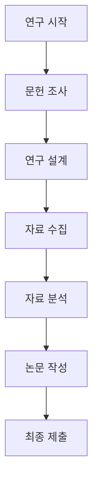
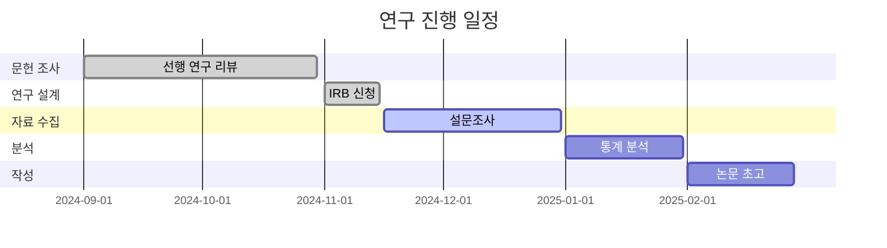

# Markdown 빠른 참조 가이드

**목적**: AI 시대 연구 문서 작성을 위한 Markdown 핵심 문법  
**소요 시간**: 5분 학습 + 실습  
**대상**: 연구 문서 작성자 (초보자 포함)  

---

## 🎯 AI 친화적 Markdown 작성 원칙

### 왜 Markdown인가?
```
✨ AI 시대 최적 문서 형식
├── 🤖 AI가 읽기 쉬움 (토큰 효율)
├── 📝 간단한 문법으로 빠른 작성
├── 🔄 모든 프로그램과 호환
├── 📱 모든 기기에서 동일하게 보임
└── 💾 버전 관리 최적화
```

### 핵심 원칙
- **구조화**: 제목, 목록, 표로 정보 계층화
- **간결성**: 불필요한 서식 최소화
- **일관성**: 전체 문서에서 동일한 스타일 유지
- **연결성**: 내부/외부 링크로 문서 간 연계
- **명확성**: AI가 이해하기 쉬운 명확한 표현

---

## 📚 기본 문법 (5분 마스터)

### 제목 (Headers)
```markdown
# 제목 1 (가장 큰 제목, 문서 제목용)
## 제목 2 (섹션 제목용)
### 제목 3 (하위 섹션 제목용)
#### 제목 4 (하위 하위 섹션)
##### 제목 5 (가장 작은 제목)
```

### 텍스트 효과
```markdown
**굵은 글씨** 또는 __굵은 글씨__
*기울임 글씨* 또는 _기울임 글씨_
***굵고 기울임***
~~취소선~~
`코드` (인라인 코드)
```

### 목록 (Lists)

**비순서 목록**:
```markdown
- 첫 번째 항목
- 두 번째 항목
  - 하위 항목 1
  - 하위 항목 2
- 세 번째 항목

* 또는 + 사용 가능
```

**순서 목록**:
```markdown
1. 첫 번째 단계
2. 두 번째 단계
3. 세 번째 단계
   1. 하위 단계 1
   2. 하위 단계 2
```

**체크리스트**:
```markdown
- [ ] 완료하지 않은 작업
- [x] 완료한 작업
- [ ] 다른 작업 (마감일: 2024-12-31)
```

### 링크와 이미지
```markdown
[링크 텍스트](https://example.com)


[상대 경로 링크](./다른파일.md)
[문서 내 앵커](#제목-이름)
```

### 인용문
```markdown
> 이것은 인용문입니다.
> 여러 줄에 걸쳐서 작성할 수 있습니다.

> 추가 인용문
> 
> > 중첩된 인용문도 가능합니다.
```

### 코드 블록
```markdown
`인라인 코드` (문장 중간에)

```python
# 블록 코드 (언어 지정 가능)
import pandas as pd
import matplotlib.pyplot as plt

def hello_world():
    print("Hello, World!")
```

```javascript
// JavaScript 코드
const greeting = "Hello, World!";
console.log(greeting);
```
```

---

## 📊 연구 문서에 특화된 문법

### 표 (Tables)
```markdown
| 열 제목 1 | 열 제목 2 | 열 제목 3 |
|----------|----------|----------|
| 내용 1   | 내용 2   | 내용 3   |
| 내용 4   | 내용 5   | 내용 6   |

| 변인 | 유형 | 측정도구 | 비고 |
|------|------|----------|------|
| 성별 | 명목 | 직접 기입 | 남성/여성 |
| 나이 | 비율 | 만 나이 | 연속변인 |
| 만족도 | 순간 | 5점 척도 | 1-5점 |
```

### 수평선
```markdown
---

위와 아래 내용을 구분할 때 사용
```

### 각주 (Footnotes)
```markdown
텍스트 내용[^1]과 추가 설명[^note].

[^1]: 각주 내용입니다.
[^note]: Another footnote.
```

### 정의 목록
```markdown
주요 용어
: 용어에 대한 정의
: 추가 설명

AI (Artificial Intelligence)
: 인공 지능, 기계를 인간처럼 intelligent하게 만드는 기술
```

---

## 🔗 문서 구조화 패턴

### 연구 문서 템플릿
```markdown
# 연구 제목

## 📋 개요
- **연구자**: [이름]
- **기간**: [시작일] ~ [종료일]
- **목적**: [연구 목적]

## 🎯 연구 배경
[배경 설명]

## 📚 문헌 검토
[선행 연구 요약]

## 🔬 연구 방법
[방법론 설명]

## 📊 결과
[분석 결과]

## 💡 논의
[결과 해석]

## 📚 참고문헌
1. [참고문헌 1]
2. [참고문헌 2]
```

### 진행 상황 추적
```markdown
## 📈 진행률

### 전체 진행률: 65% ████████████░░░░░░░░░░░░░░░░░░

| 단계 | 진행률 | 상태 | 마감일 |
|------|--------|------|---------|
| 문헌 조사 | 100% | ✅ 완료 | 2024-10-30 |
| 연구 설계 | 80% | 🔄 진행중 | 2024-11-15 |
| 데이터 수집 | 30% | 📅 예정 | 2024-12-15 |
| 데이터 분석 | 0% | ⏳ 대기 | 2025-01-15 |
| 논문 작성 | 0% | ⏳ 대기 | 2025-02-15 |
```

### 체크리스트
```markdown
## ✅ 완료 사항

### 이번 주 목표
- [x] 문헌 조사 완료
- [x] 설문지 초안 작성
- [ ] 지도교수님 검토 요청
- [ ] IRB 신청서 준비
- [ ] 예비 조사 계획 수립

### 다음 주 계획
- [ ] 설문지 최종 완성
- [ ] 데이터 수집 도구 준비
- [ ] 인터뷰 가이드 작성
```

---

## 🎨 VS Code에서 Markdown 활용

### 필수 단축키
```
Ctrl+B (Cmd+B)       → 굵은 글씨
Ctrl+I (Cmd+I)       → 기울임
Ctrl+Shift+P         → 명령 팔레트
Ctrl+Shift+V         → 미리보기
Ctrl+/ (Cmd+/)       → 주석 토글
Tab / Shift+Tab      → 들여쓰기/내어쓰기
```

### 유용한 확장 프로그램


- **Markdown All in One**: 완성도 높은 Markdown 도구
- **markdownlint**: 문법 검사 및 자동 수정
- **Markdown TOC**: 목차 자동 생성
- **Markdown PDF**: PDF로 내보내기
- **LaTeX Math**: 수식 입력 지원

### 미리보기 설정
```markdown
# 미리보기 팁

1. **실시간 미리보기**: `Ctrl+Shift+V` 또는 `Cmd+Shift+V`
2. **분할 화면**: 에디터와 미리보기를 나란히 보기
3. **자동 스크롤**: 에디터와 미리보기가 동기화됨
4. **확장 기능**: 수식, 다이어그램, 표 지원
```

---

## 📝 AI 친화적 작성 가이드

### ✅ 좋은 Markdown 작성법
```markdown
## 좋은 예시

### 연구 방법론
- **연구 설계**: 준실험 설계 (quasi-experimental)
- **자료 수집**: 온라인 설문 (Google Forms)
- **분석 도구**: Python pandas, scipy.stats
- **표본 크기**: 200명 (효과크기 d=0.5, power=0.8)

### 결과 요약
| 조건 | 평균 | 표준편차 | 유의수준 |
|------|------|----------|----------|
| 실험군 | 4.2 | 0.8 | p < 0.05 |
| 대조군 | 3.1 | 0.9 | p < 0.05 |
```

### ❌ 피해야 할 작성법
```markdown
## 나쁜 예시

### 연구 방법
方法론이 매우 중요합니다. 여러 가지 방법이 있는데...
(일반적인 표현, AI가 이해하기 어려움)

분석에서는... 그..., 어..., 음... 
(구어체, 불명확한 표현)

결과는 좋았습니다. 정말 좋았어요!
(주관적 표현, 수치 부족)
```

### AI에게 효과적인 컨텍스트 제공
```markdown
## AI 활용 예시

### 질문 형식
**나의 연구 상황**:
- 주제: 온라인 학습 참여도
- 방법: 설문조사 (N=200)
- 변수: 성별, 학년, 참여도 점수

**구체적인 질문**:
"성별에 따른 참여도 차이를 분석하는 Python 코드를 작성해주세요."

### AI 응답 품질 향상
- 구체적인 맥락 제공
- 원하는 출력 형식 명시
- 피드백을 통한 개선 요청
```

---

## 🔄 고급 문법 활용

### UML 다이어그램 (PlantUML)
```markdown

```

### 수식 (LaTeX)
```markdown
## 통계 공식 예시

$t$ 검정 통계량:
$$t = \frac{\bar{X_1} - \bar{X_2}}{\sqrt{\frac{s_1^2}{n_1} + \frac{s_2^2}{n_2}}}$$

회귀식:
$$Y = \beta_0 + \beta_1X_1 + \beta_2X_2 + \varepsilon$$
```

### 타임라인
```markdown
## 📅 연구 일정


```

---

## 📚 연구 문서 패턴 모음

### 연구 계획서 구조
```markdown
# 연구 계획서

## 1. 연구 개요
- **제목**: [연구 제목]
- **연구자**: [이름 및 소속]
- **기간**: [시작일] ~ [종료일]

## 2. 연구 배경 및 필요성
[왜 이 연구가 필요한가?]

## 3. 연구 목적 및 질문
### 3.1 연구 목적
[구체적 목적]

### 3.2 연구 질문
1. **RQ1**: [첫 번째 질문]
2. **RQ2**: [두 번째 질문]

## 4. 이론적 배경
[관련 이론 및 선행 연구]

## 5. 연구 방법
### 5.1 연구 설계
[구체적 설계]

### 5.2 연구 대상
[표본 및 표집 방법]

### 5.3 자료 수집 방법
[도구 및 절차]

### 5.4 자료 분석 방법
[분석 계획]

## 6. 연구 일정
[상세 일정표]

## 7. 기대 효과
[학술적 및 실용적 기여]

## 8. 참고문헌
[APA 스타일 참고문헌 목록]
```

### 주간 진행 보고서
```markdown
# 주간 진행 보고서

**보고 기간**: 2024년 11월 11일 ~ 11월 17일  
**보고자**: [이름]

## ✅ 완료 사항
- [x] [작업 1] (소요시간: 5시간)
- [x] [작업 2] (소요시간: 3시간)
- [x] [작업 3] (소요시간: 2시간)

## 🔄 진행 중인 작업
- [ ] [작업 4] (진행률: 70%)
  - 현재 상황: [진행 상황]
  - 예상 완료: [날짜]

## 📋 다음 주 계획
- [ ] [작업 5] (예상 소요: 4시간)
- [ ] [작업 6] (예상 소요: 6시간)
- [ ] [작업 7] (예상 소요: 2시간)

## 🚨 이슈 및 문제점
- **문제 1**: [구체적 문제]
  - 해결 방안: [계획]
  - 필요 지원: [요청 사항]

## 💡 새로운 아이디어/발견
[연구过程中 새로운 발견이나 아이디어]

## 📈 전체 진행률
**현재**: 45% (목표: 50%)

| 단계 | 계획 | 실제 | 차이 |
|------|------|------|------|
| 문헌 조사 | 100% | 100% | ✅ |
| 연구 설계 | 80% | 75% | ⚠️ -5% |
| 데이터 수집 | 20% | 15% | ⚠️ -5% |
```

### 논문 초고 구조
```markdown
# 논문 제목

## 초록 (Abstract)
[200-300자 초록]

**키워드**: 키워드1, 키워드2, 키워드3, 키워드4, 키워드5

## 1. 서론 (Introduction)
### 1.1 연구 배경 및 필요성
### 1.2 연구 목적 및 질문
### 1.3 연구의 의의 및 제한점

## 2. 이론적 배경 (Literature Review)
### 2.1 [주제 1]
### 2.2 [주제 2]
### 2.3 이론적 프레임워크

## 3. 연구 방법 (Methodology)
### 3.1 연구 설계
### 3.2 연구 대상
### 3.3 자료 수집 방법
### 3.4 자료 분석 방법

## 4. 연구 결과 (Results)
### 4.1 기술통계 분석
### 4.2 가설 검증 결과
### 4.3 추가 분석 결과

## 5. 논의 (Discussion)
### 5.1 주요 연구 결과의 의미
### 5.2 이론적 시사점
### 5.3 실용적 시사점
### 5.4 연구의 한계점

## 6. 결론 (Conclusion)
[연구 요약 및 제언]

## 참고문헌 (References)
[APA 스타일]

## 부록 (Appendix)
[추가 자료]
```

---

## 🛠️ 도구별 Markdown 지원

### GitHub/GitLab
```markdown
- ✅ 기본 Markdown 지원
- ✅ tables, task lists
- ✅ code syntax highlighting
- ✅ emoji 지원
- ❌ LaTeX 수식 미지원
```

### Notion/Obsidian
```markdown
- ✅ 기본 Markdown 지원
- ✅ LaTeX 수식 지원
- ✅ 다이어그램 지원 (mermaid)
- ✅ 양방향 링크
- ✅ 테이블的强大한 기능
```

### VS Code Preview
```markdown
- ✅ 실시간 미리보기
- ✅ LaTeX 수식
- ✅ Mermaid 다이어그램
- ✅ 확장 프로그램으로 기능 확장
- ✅ PDF 내보내기
```

### Typora/마크다운 에디터
```markdown
- ✅ 실시간 미리보기
- ✅ LaTeX 수식
- ✅ 다이어그램
- ✅ 내보내기 다양 (PDF, Word, HTML)
- ✅ 테마自定义 지원
```

---

## 📋 체크리스트

### 문서 완성도 체크
- [ ] **구조**: 제목 계층이 논리적임
- [ ] **내용**: 추상적 표현 대신 구체적 사실 중심
- [ ] **형식**: 일관된 Markdown 문법 사용
- [ ] **연결**: 관련 문서로 적절한 링크 제공
- [ ] **완전성**: 누락된 정보가 없음
- [ ] **AI 친화적**: AI가 이해하기 쉬운 구조

### AI 활용 준비도 체크
- [ ] **컨텍스트**: 연구 배경이 명확히 설명됨
- [ ] **명세**: 연구 방법과 변인이 구체적으로 정의됨
- [ ] **질문**: AI에게 할 구체적인 질문 준비
- [ ] **도구**: 필요한 AI 모델과 프롬프트 준비
- [ ] **목표**: AI 도움으로 달성하고자 하는 결과 명시

### 버전 관리 준비도 체크
- [ ] **파일명**: 명확하고 일관된 파일명 사용
- [ ] **경로**: 논리적인 폴더 구조
- [ ] **인코딩**: UTF-8 인코딩 사용
- [ ] **백업**: 중요 문서 정기 백업
- [ ] **버전**: 변경사항 기록

---

## 🚨 주의사항

### ❌ 피해야 할 작성법
- **과도한 서식**: 불필요한 bold, italic 남용
- **중복 내용**: 같은 내용을 여러 번 반복
- **불명확한 표현**: "효과적이다", "좋다" 등 추상적 표현
- **복잡한 구조**: 지나치게 중첩된 목록이나 표
- **불완전한 정보**: 샘플이나 예시로만 작성

### ✅ 권장 작성법
- **간결명료**: 핵심 내용 중심
- **구체적**: 수치, 날짜, 도구 등 구체적 정보
- **구조화**: 논리적 제목 계층과 목록 활용
- **연결성**: 문서 간 적절한 링크
- **일관성**: 전체 문서에서 동일한 스타일

---

**📚 관련 자료**
- 연구 컨텍스트 템플릿: `04_context_template_2025.md`
- 연구 폴더 구조: `03_folder_structure_templates.md`
- Copilot Chat 예시: `07_copilot_chat_examples.md`

---

*마지막 업데이트: 2025-11-10*  
*버전: Part 1*
