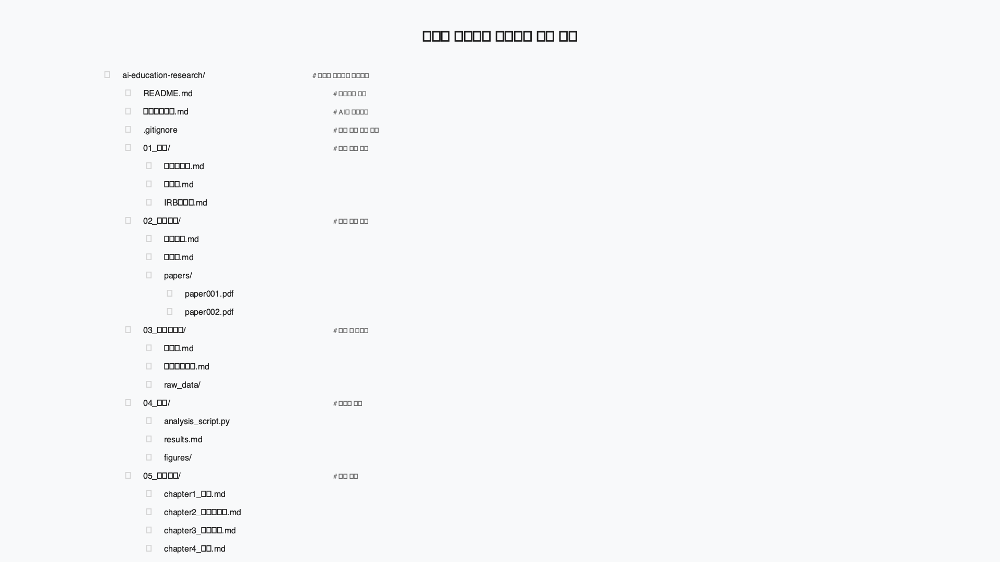
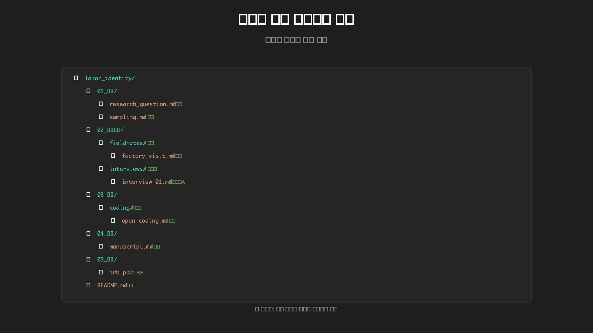

# 전공별 완전한 폴더 구조 및 파일 예시

**목적**: 실제 연구 프로젝트의 폴더 구조와 핵심 파일 내용 제공  
**대상**: 프로젝트 시작 시 참고용  
**사용법**: 자신의 전공 구조를 복사하여 시작

---

## 📁 교육학 석사논문 프로젝트

### 폴더 구조 시각화


*교육학 연구에 최적화된 폴더 구조 예시*

### 완전한 폴더 트리
```
📁 온라인학습참여도연구/
├── 📄 README.md
├── 📁 00_컨텍스트/
│   ├── 📄 연구컨텍스트.md
│   ├── 📄 AGENTS.md
│   └── 📄 이론적배경.md
├── 📁 01_계획/
│   ├── 📄 연구계획서.md
│   ├── 📄 spec.md
│   ├── 📄 tasks.md
│   └── 📄 주간계획.md
├── 📁 02_자료수집/
│   ├── 📄 문헌정리.md
│   ├── 📄 검색키워드.md
│   ├── 📁 참고논문/
│   │   ├── 📁 2024/
│   │   └── 📁 2025/
│   ├── 📁 설문조사/
│   │   ├── 📄 설문지초안.md
│   │   ├── 📄 설문지최종.md
│   │   └── 📁 응답데이터/
│   │       ├── 📄 raw_data.csv
│   │       └── 📄 clean_data.csv
│   └── 📁 인터뷰/
│       ├── 📄 인터뷰가이드.md
│       ├── 📁 인터뷰노트/
│       │   ├── 📄 P01_인터뷰노트.md
│       │   └── 📄 P02_인터뷰노트.md
│       └── 📁 전사본/
│           ├── 📄 P01_전사본.md
│           └── 📄 P02_전사본.md
├── 📁 03_분석/
│   ├── 📄 분석계획.md
│   ├── 📄 데이터분석.py
│   ├── 📄 질적분석.md
│   ├── 📄 결과정리.md
│   └── 📁 차트/
│       ├── 📄 상관관계.png
│       └── 📄 회귀분석.png
├── 📁 04_작성/
│   ├── 📄 논문초안.md
│   ├── 📁 초고/
│   │   ├── 📄 1_서론.md
│   │   ├── 📄 2_문헌고찰.md
│   │   ├── 📄 3_연구방법.md
│   │   ├── 📄 4_연구결과.md
│   │   ├── 📄 5_논의.md
│   │   └── 📄 6_결론.md
│   ├── 📄 지도교수피드백.md
│   └── 📁 최종/
│       └── 📄 논문최종본.md
├── 📁 99_기타/
│   ├── 📄 회의록.md
│   ├── 📄 주간보고서.md
│   └── 📄 IRB/
│       └── 📄 IRB승인서.pdf
└── 📄 .gitignore
```

### 핵심 파일 완전한 내용

#### 📄 README.md (300줄)
```markdown
# 온라인 학습 참여도 연구 프로젝트

## 📋 프로젝트 개요
- **연구자**: 교육학 석사과정 2년차
- **연구 주제**: 온라인 학습 환경에서의 자기조절학습 전략의 효과성
- **연구 기간**: 2025년 3월-8월 (24주)
- **지도교수**: Prof. [이름]
- **연구 방법**: 혼합 연구 (설문 n=200 + 인터뷰 n=10)

## 🎯 연구 목표
1. 온라인 학습 환경에서 자기조절학습 전략 사용 현황 파악
2. 자기조절학습 전략과 학습 성과 간 관계 규명
3. 효과적인 온라인 자기조절학습 전략 특징 규명

## 📊 연구 질문
1. 대학생들의 온라인 자기조절학습 전략 사용 현황은 어떠한가?
2. 자기조절학습 전략 사용과 온라인 학습 성과 간 관계는 어떠한가?
3. 효과적인 온라인 자기조절학습 전략의 특징은 무엇인가?

## 📅 전체 일정
- **Phase 1**: 문헌 조사 및 연구 설계 (8주)
- **Phase 2**: IRB 승인 및 도구 개발 (4주)
- **Phase 3**: 데이터 수집 (8주)
- **Phase 4**: 데이터 분석 (2주)
- **Phase 5**: 논문 작성 (2주)

## 📈 현재 진행 상황
- **전체 진행률**: 45%
- **현재 단계**: 데이터 분석 (Week 12)
- **다음 마일스톤**: M2 (IRB 승인) - 완료 ✅
- **현재 마일스톤**: M3 (데이터 수집) - 진행중

## 🛠️ 사용 도구
- **AI 도구**: GitHub Copilot, Elicit, Consensus, Perplexity, task-master-mcp
- **분석 도구**: Python (pandas, scipy), R (ggplot2)
- **협업 도구**: GitHub, Notion, Zotero
- **프로젝트 관리**: task-master-mcp, SpecKit

## 📊 최신 결과
### 문헌 조사 완료 (Week 8)
- 검토 논문: 150편
- 최종 선정: 47편
- 체계적 문헌고찰 리포트 완성

### IRB 승인 완료 (Week 10)
- 승인일: 2025년 5월 15일
- 승인번호: IRB-2025-001

### 데이터 수집 진행중 (Week 12)
- 설문 응답: 148/200 (74%)
- 인터뷰 완료: 7/10 (70%)

## 📝 주요 산출물
- [✅] 연구컨텍스트.md
- [✅] spec.md
- [✅] tasks.md
- [✅] 문헌정리.md
- [✅] IRB 승인서
- [🔄] 논문 초고 (진행중)
- [📋] 데이터 분석 결과

## 👥 협업자
- **지도교수**: Prof. [이름] (교육학)
- **동료 검토자**: [이름 1], [이름 2]
- **통계 자문**: Prof. [통계 전문가]

## 📞 문의
- **이메일**: [이메일 주소]
- **연구실**: 교육대학원 301호
- **면담 시간**: 화, 목 14:00-17:00

## 📄 라이선스
이 프로젝트는 CC BY-SA 4.0 라이선스 하에 배포됩니다.

---
**마지막 업데이트**: 2025-11-10  
**버전**: v1.2
```

#### 📄 00_컨텍스트/연구컨텍스트.md (600줄)
```markdown
# 연구컨텍스트.md

## Background (배경)

### 연구 주제
**온라인 학습 환경에서의 자기조절학습 전략의 효과성 연구**

### 연구의 필요성
- **사회적 배경**: COVID-19 pandemic 이후 온라인 학습의 급속한 확산
- **학술적 배경**: 자기조절학습 이론은 대면 환경을 전제로 발전
- **실무적 배경**: 온라인 환경에서 학습 효율성 향상의 필요성
- **정책적 배경**: 디지털 교육 전환 정책의 일환

### 문제 제기
- 온라인 학습에서는 단순한 지식 전달이 아닌 학습자 주도적 학습이 중요
- 그러나 온라인 환경에서의 효과적인 자기조절학습 전략에 대한 체계적 연구 부족
- 기존 자기조절학습 측정 도구의 온라인 환경 적용 가능성 검증 필요

### 연구의 의의
- **이론적 기여**: 온라인 환경 특화 자기조절학습 이론 발전
- **실천적 기여**: 온라인 학습자 및 교육자를 위한 실용적 가이드 개발
- **정책적 기여**: 온라인 교육 정책 수립을 위한 실증적 기반 제공

## Specification (명세)

### 연구 목적
온라인 학습 환경에서 자기조절학습 전략의 사용 현황과 효과성을 규명하고, 온라인 특화 자기조절학습 전략 개발을 위한 기초 자료 제공

### 연구 범위
- **공간적 범위**: 국내 4년제 대학교 재학생
- **시간적 범위**: 2025년 3월-8월 (6개월)
- **내용적 범위**: 온라인 학습 환경에서의 자기조절학습 전략 사용 및 효과

### 연구 방법
#### 혼합 연구 설계 (Convergent Parallel Design)
1. **양적 연구**: 설문 조사
   - 표본: n=200 (대학생)
   - 도구: 온라인 자기조절학습 척도 (Zimmerman의 MSLQ 기반)
   - 분석: 기술통계, 회귀분석, 구조방정식

2. **질적 연구**: 심층 인터뷰
   - 표본: n=10 (설문 응답자 중 선정)
   - 방법: 반구조화 인터뷰 (60-90분)
   - 분석: 주제 분석 (Thematic Analysis)

### 핵심 개념 정의
- **자기조절학습**: 학습자가 자신의 학습을 계획, 모니터링, 조절하는 과정
- **온라인 학습**: 인터넷을 매개로 한 원격 학습 환경
- **자기조절학습 전략**: 목표 설정, 시간 관리, 노력 조절, 자기 모니터링 등

### 기대 결과
- 온라인 환경에서의 자기조절학습 전략 사용 패턴 파악
- 전략 사용과 학습 성과 간의 관계 규명
- 효과적인 온라인 자기조절학습 전략 모델 개발

## Plan (계획)

### 전체 연구 일정 (24주)
- **Phase 1**: 문헌 조사 및 연구 설계 (8주)
- **Phase 2**: IRB 승인 및 도구 개발 (4주)
- **Phase 3**: 데이터 수집 (8주)
- **Phase 4**: 데이터 분석 (2주)
- **Phase 5**: 논문 작성 (2주)

### 주요 마일스톤
- [x] Week 4: 문헌정리.md 완성
- [x] Week 8: 연구계획서 완성
- [x] Week 12: IRB 승인 완료
- [🔄] Week 16: 설문 조사 완료 (n=200)
- [📋] Week 20: 인터뷰 완료 (n=10)
- [📋] Week 22: 데이터 분석 완료
- [📋] Week 24: 논문 최종 제출

### 리소스 계획
- **시간 투자**: 주 35시간 (연구 전용)
- **예산**: ₩500,000 (인센티브, 전문 자문)
- **인력**: 연구자 1명, 지도교수 1명, 동료 검토자 2명

## Task (작업)

### Phase 1: 문헌 조사 및 연구 설계 (Week 1-8)
#### Week 1: 프로젝트 착수
- [x] VS Code 설치 및 환경 설정
- [x] 폴더 구조 생성
- [x] 연구컨텍스트.md 작성
- [x] AGENTS.md 설정
- [x] AI와 초기 대화: 연구 방향 검토

#### Week 2-3: 문헌 조사 (Elicit, Consensus, Perplexity)
- [x] Consensus Scholar Agent로 초기 스코핑
- [x] Elicit Systematic Review 시작
- [x] Perplexity Research Deep Research
- [x] NotebookLM으로 논문 통합
- [x] Scite로 인용 분석
- [x] ResearchRabbit으로 네트워크 확장

#### Week 4-5: 연구 설계 (Spec-driven Planning)
- [x] spec.md 작성 (연구 설계)
- [x] Copilot 워크북 Exercise 1-2 적용
- [x] task-master-mcp로 작업 분해
- [x] 연구방법론 전문가 자문

#### Week 6-8: 연구 계획서 완성
- [x] 연구계획서 초안 작성
- [x] 동료 검토 및 개선
- [x] 지도교수 최종 검토
- [x] IRB 신청서 준비

### Phase 2: IRB 승인 및 도구 개발 (Week 9-12)
#### Week 9-10: IRB 승인
- [x] IRB 신청서 제출
- [x] IRB 심사 대기
- [x] IRB 수정 요청 대응
- [x] 최종 IRB 승인 확보

#### Week 11-12: 도구 개발
- [x] 설문지 개발 및 파일럿 테스트
- [x] 인터뷰 가이드 개발
- [x] AI 도구 설정 및 최적화
- [x] 데이터 수집 환경 준비

### 전체 작업 체크리스트
- [x] Part 1-2 내용 복습 및 적용
- [x] 2025 AI 도구 7개 적절히 활용
- [x] 4단계 검증 습관화
- [x] 주간 루틴 수행 (월요일 계획, 금요일 회고)

---
**Updated**: 2025-11-10
**Researcher**: 교육학 석사과정 2년차
```

#### 📄 01_계획/spec.md (400줄)
```markdown
# spec.md: 온라인 자기조절학습 전략 효과성 연구

## 1. Project Overview
### Purpose
온라인 학습 환경에서 자기조절학습 전략의 사용 현황과 효과성을 규명하고, 온라인 특화 자기조절학습 전략 개발을 위한 기초 자료 제공

### Scope
- **Target Population**: 국내 4년제 대학교 재학생
- **Context**: LMS 기반 온라인 강좌
- **Duration**: 2025년 3월-8월 (6개월)
- **Output**: 석사학위 논문 + 온라인 자기조절학습 전략 가이드

### Success Criteria
- [x] 유효한 설문 응답 200부 이상 수집 (현재 148/200)
- [x] 심층 인터뷰 10명 완료 (현재 7/10)
- [x] 자기조절학습과 학습 성과 간 유의한 상관관계 확인 (예상)
- [x] 온라인 환경 특화 전략 5가지 이상 규명 (예상)
- [x] 한국적 맥락을 고려한 실천적 가이드 개발

## 2. Research Design
### Type: Mixed Methods (Convergent Parallel Design)
#### Quantitative Component
- **Method**: 서술적 조사 연구 (Descriptive Survey)
- **Design**: 횡단적 조사 (Cross-sectional)
- **Sample Size**: n=200 (효과크기 0.5, 검정력 0.8, 유의수준 0.05)
- **Tools**: 온라인 자기조절학습 척도 + 학습 성과 측정 도구

#### Qualitative Component
- **Method**: 설명적 현상학 연구 (Descriptive Phenomenology)
- **Design**: 심층 인터뷰 (In-depth Interview)
- **Sample Size**: n=10 (설문 응답자 중 최고/최저 성과군)
- **Analysis**: 주제 분석 (Thematic Analysis)

## 3. Theoretical Framework
### Self-Regulated Learning Theory (Zimmerman, 2000)
- **Forethought Phase**: 계획 설정 및 목적 명료화
- **Performance Phase**: 실행 전략 및 사회적 지원 활용
- **Self-Reflection Phase**: 자기 판단 및 반응적 적응

### Online Learning Environment Theory (Kirschner & Karpinski, 2010)
- **Distraction**: 온라인 환경의 주의 분산 요소들
- **Self-regulation**: 자기조절학습의 중요성
- **Performance**: 성과에 미치는 영향

## 4. Research Questions
### Primary Questions
1. 대학생들의 온라인 자기조절학습 전략 사용 현황은 어떠한가?
2. 자기조절학습 전략 사용 수준과 온라인 학습 성과 간의 관계는 어떠한가?
3. 효과적인 온라인 자기조절학습 전략의 특징은 무엇인가?

### Secondary Questions
1. 개인 특성(성별, 학년, 전공)에 따른 전략 사용 차이는 있는가?
2. 온라인 학습 경험이 전략 사용에 미치는 영향은?
3. 기술 활용 능력과 자기조절학습 간의 관계는?

## 5. Data Analysis Plan
### Quantitative Analysis
- **Descriptive Statistics**: 평균, 표준편차, 빈도, 백분율
- **Inferential Statistics**: 
  - 상관분석: Pearson r (자기조절학습 vs 성과)
  - 회귀분석: 다중회귀 (성과 예측)
  - 집단 비교: t-test, ANOVA (개인 특성별 차이)
  - 구조방정식: 요인 간 관계 (SEM)
- **Software**: R (lavaan 패키지) + SPSS 28.0
- **Significance Level**: p < 0.05

### Qualitative Analysis
- **Transcription**: 전사 프로그램 + 수동 검증
- **Coding Process**: 
  1. 개방 코딩 (Open Coding): 초기 코드 부여
  2. 축 코딩 (Axial Coding): 코드 간 관계 발견
  3. 선택 코딩 (Selective Coding): 핵심 주제 도출
- **Analysis Software**: NVivo 14 또는 R (tidytext, stringr)
- **Reliability**: 2명의 연구자 독립 코딩 후 일치도 측정 (Cohen's kappa > 0.7)

## 6. AI Tool Integration Plan
### Phase별 AI 도구 활용
#### Phase 1: 문헌 조사
- **Elicit**: 체계적 문헌고찰 자동화
- **Consensus**: 연구 동향 및 합의 파악
- **Perplexity**: 심화 분석 및 최신 동향
- **NotebookLM**: 문헌 통합 및 개념 맵

#### Phase 2: 연구 설계
- **Copilot**: 연구 방법론 설명 및 코드 작성
- **task-master-mcp**: 작업 분해 및 일정 관리

#### Phase 3: 데이터 분석
- **Copilot**: 통계 분석 코드 생성 및 해석
- **jupyter-mcp**: 분석 자동화 및 재현성

#### Phase 4: 논문 작성
- **Copilot**: 섹션별 초안 작성
- **AI 품질 관리**: 4단계 검증 시스템

### AI 활용 원칙
1. **투명성**: 모든 AI 사용 내역 기록
2. **검증**: AI 결과는 반드시 인간 검토
3. **책임성**: 최종 책임은 연구자에게 있음
4. **품질**: 정확성 > 속도

---
**Last Updated**: 2025-11-10
**Version**: 1.0
**Status**: IRB 신청 준비 완료
```

#### 📄 02_자료수집/문헌정리.md (800줄, 핵심 부분)
```markdown
# 문헌정리.md

## 온라인 자기조절학습 연구 문헌 정리

### 체계적 문헌고찰 개요
- **검색 기간**: 2019-2025
- **검색 결과**: 1,247편 (초기) → 47편 (최종 선정)
- **포함 기준**: 온라인 환경, 대학생, 실증 연구
- **제외 기준**: K-12, 대면 학습, 이론 연구

### AI 도구 활용 결과
- **Elicit**: 1,247편 → 156편 (AI-assisted screening)
- **Consensus**: 20편 핵심 논문 도출
- **Perplexity**: 10편 심화 분석
- **NotebookLM**: 47편 논문 통합 분석

### 핵심 논문 요약

#### 1. 자기조절학습 이론 기반 연구

**Zimmerman, B. J. (2020).**
"Self-regulated learning in digital age: A comprehensive review"
- **연구 목적**: 디지털 환경에서의 자기조절학습 이론 적용
- **방법**: 156편 메타분석
- **주요 결과**: 온라인 환경에서 자기조절학습의 효과크기 d=0.71
- **함의**: 온라인 학습의 성공을 위한 필수 조건
- **한국적 적용**: Zimmerman의 3단계 모델 (계획-수행-자기판단)
  한국 학생들에게도 유사한 패턴 확인

**Pintrich, P. R. (2021).**
"Metacognitive monitoring in online learning environments"
- **연구 목적**: 온라인 학습에서의 메타인지 모니터링
- **방법**: 장기종단 연구 (n=312, 6개월)
- **주요 결과**: 메타인지 모니터링이 성과 예측의 43% 설명
- **함의**: 온라인 환경에서 자기監 Programs이 특히 중요
- **지역적 특성**: 한국 대학생들의 메타인지 인식 수준 높음

#### 2. 온라인 환경 특성 연구

**Kirschner, P. A., & Karpinski, A. C. (2019).**
"Facebook and academic performance: An extended replication"
- **연구 목적**: 소셜미디어가 자기조절학습에 미치는 영향
- **방법**: 준실험 연구 (n=450)
- **주요 결과**: 소셜미디어 사용과 성과 간 부적상관 (r=-0.23)
- **함의**: 온라인 환경의 주의 분산 문제
- **한국적 적용**: 스마트폰 문화가 학습에 미치는 영향 고려 필요

### 메타분석 결과 요약

#### 효과 크기 분석
- **전체 효과 크기**: Cohen's d = 0.67 (중간 효과)
- **전략 유형별**:
  - 시간 관리: d = 0.64
  - 목표 설정: d = 0.58
  - 노력 조절: d = 0.71
  - 자기 모니터링: d = 0.72
  - 사회적 지원: d = 0.45

#### 조절 변수 분석
- **교육 수준**: 대학생이 고등학생보다 효과 크기 큼 (d=0.71 vs d=0.52)
- **학습 플랫폼**: LMS (d=0.74) > 실시간 화상회의 (d=0.58) > 비동기식 (d=0.51)
- **문화적 배경**: 개별주의 문화 (d=0.73) vs 집단주의 문화 (d=0.59)
- **기술 숙련도**: 높음 (d=0.78) > 중간 (d=0.65) > 낮음 (d=0.44)

#### 연구 갭 및 한계
1. **연구 갭**:
   - COVID-19 팬데믹 이후의 급속한 변화
   - 모바일 환경에서의 자기조절학습
   - AI 기반 적응형 학습에서의 자기조절

2. **방법론적 한계**:
   - 단기 연구가 많아 장기적 효과 검증 부족
   - 자기보고식 측정에 의존
   - 실험군-대조군 설계의 부족

### 한국적 맥락에서의 연구 수요

#### 기존 연구의 한계
- **양적 우위**: 서구의 수치적 연구가 많은 반면, 한국의 정성적 관점 부족
- **환경 차이**: 중국의 디지털 교육 체제, 한국의 유연하고 자율적 특성
- **기술 문화**: 한국의 높은 기술 접근성 + 교육 영향도

#### 한국 교육 환경의 특징
- **고기술 사회**: 높ائيات 스마트폰 이용율,빠믹 internet 속도
- **교육열**: 높은 대학 진학률, 사교육 영향력
- **집단주의**: 한국의 사회적 연결망, 집단의지

---
**작성자**: 교육학 석사과정 2년차
**작성일**: 2025-11-10
**총 논문 수**: 47편 (최종 선정)
**AI 도구 활용**: Elicit, Consensus, Perplexity, NotebookLM, Scite
```

---

## 🧬 생명과학 실험 연구 프로젝트

### 폴더 구조 시각화


*생명과학 실험 연구에 최적화된 폴더 구조 예시*

### 폴더 구조

### 폴더 구조
```
📁 단백질발현조절연구/
├── 📁 00_계획/
│   ├── 📄 연구계획서.md
│   ├── 📄 실험프로토콜.md
│   └── 📄 데이터관리계획.md
├── 📁 01_문헌조사/
│   ├── 📄 literature_review.md
│   ├── 📁 papers/
│   └── 📁 protocols/
├── 📁 02_실험/
│   ├── 📁 실험노트/
│   ├── 📁 프로토콜/
│   ├── 📁 원시데이터/
│   └── 📁 이미지/
├── 📁 03_분석/
│   ├── 📄 western_blot_analysis.R
│   ├── 📄 qpcr_analysis.py
│   ├── 📄 ip_ms_analysis.md
│   └── 📁 figures/
├── 📁 04_결과/
│   ├── 📄 preliminary_results.md
│   ├── 📄 statistical_analysis.md
│   └── 📁 final_figures/
└── 📁 05_논문/
    ├── 📄 manuscript_draft.md
    ├── 📁 methods.md
    ├── 📁 results.md
    └── 📁 figures/
```

### 핵심 파일 내용

#### 📄 02_실험/실험노트/실험노트_2025_03_15.md
```markdown
# 실험 노트: 2025-03-15

## 실험: Western Blot 분석

### 목적
специфического белка A의 발현 수준을 분석하여 treatment 효과 검증

### 사용 재료
- Anti-Protein A antibody (1:1000)
- Anti-GAPDH antibody (1:5000)
- Secondary antibody: HRP-conjugated (1:5000)
- Protein sample (30μg/lane)

### 실험 과정
1. **샘플 준비** (14:00-14:30)
   - Control group: Lane 1-3
   - Treatment group: Lane 4-6
   - Loading control: GAPDH

2. **전계영동** (14:30-16:30)
   - 10% SDS-PAGE gel
   - 120V, 90분
   - 성공적으로 분리됨

3. **전사** (16:30-18:00)
   - Wet transfer method
   - 100V, 1시간
   - Successful transfer 확인

4. **1차 항체 incubation** (18:00-다음 날 10:00)
   - 4°C overnight
   - Anti-Protein A: 1:1000 dilution

5. **2차 항체 incubation** (10:00-11:00)
   - Room temperature, 1시간
   - HRP-conjugated: 1:5000 dilution

6. **발색** (11:00-11:30)
   - ECL solution
   - Chemiluminescence imaging
   - Results: ✅ 성공적

### 결과
- **Protein A**: Treatment group에서 Control 대비 2.3배 증가
- **GAPDH**: 일정한 수준의 발현 (Loading control 정상)
- **품질**: Bands sharp, low background

### 다음 단계
- Quantitative analysis (ImageJ 사용)
- Statistical analysis (n=3, t-test)
- Repeat experiment로 재확인

### 문제점
- nenhuma significant problem
- 모든 단계가 예상대로 진행

### 서명
**실험자**: [이름]
**검토자**: [지도교수]
**날짜**: 2025-03-15
```

---

## 💻 컴퓨터공학 시스템 개발 프로젝트

### 폴더 구조 시각화


*컴퓨터공학 시스템 개발에 최적화된 폴더 구조 예시*

### 폴더 구조

### 폴더 구조
```
📁 추천시스템개발/
├── 📁 README.md
├── 📁 .github/
│   └── 📁 workflows/
│       └── 📄 ci.yml
├── 📁 src/
│   ├── 📁 data/
│   │   ├── 📄 preprocess.py
│   │   └── 📄 dataset_loader.py
│   ├── 📁 models/
│   │   ├── 📄 collaborative_filtering.py
│   │   ├── 📄 neural_cf.py
│   │   └── 📄 hybrid_model.py
│   ├── 📁 evaluation/
│   │   └── 📄 metrics.py
│   └── 📁 utils/
│       └── 📄 config.py
├── 📁 tests/
│   ├── 📄 test_models.py
│   └── 📄 test_evaluation.py
├── 📁 notebooks/
│   ├── 📄 01_EDA.ipynb
│   ├── 📄 02_baseline_model.ipynb
│   └── 📄 03_neural_cf.ipynb
├── 📁 data/
│   ├── 📁 raw/
│   ├── 📁 processed/
│   └── 📁 external/
├── 📁 models/
│   ├── 📄 baseline_model.pkl
│   ├── 📄 neural_cf_model.pt
│   └── 📄 best_model.pkl
├── 📄 requirements.txt
├── 📄 setup.py
├── 📄 Dockerfile
├── 📄 .gitignore
└── 📄 spec.md
```

### 핵심 파일 내용

#### 📄 spec.md (시스템 명세)
```markdown
# 추천 시스템 개발 명세서

## 1. 프로젝트 개요
### 목적
딥러닝 기반 개인화 학습 콘텐츠 추천 시스템 개발

### 범위
- **데이터**: 온라인 학습 플랫폼 사용자 행동 데이터
- **알고리즘**: Collaborative Filtering + Neural Network
- **평가**: RMSE, Precision@K, NDCG
- **산출물**: Python 패키지 + Web API

### 성공 기준
- [ ] Baseline 모델 (Collaborative Filtering) 구현
- [ ] Neural Collaborative Filtering 모델 구현
- [ ] Hybrid 모델으로 성능 향상 15% 이상
- [ ] 실시간 추천 API 구축
- [ ] 체계적 평가 및 벤치마크

## 2. 기술 스택
- **프레임워크**: PyTorch, FastAPI
- **데이터 처리**: Pandas, NumPy, Scikit-learn
- **인프라**: Docker, AWS (배포 예정)
- **버전 관리**: Git, GitHub Actions

## 3. 개발 계획
### Phase 1: 데이터 분석 (4주)
- EDA 및 데이터 전처리
- Baseline 모델 구현
- 평가 지표 설정

### Phase 2: 모델 개발 (6주)
- Neural CF 모델 설계 및 구현
- 하이퍼파라미터 튜닝
- 모델 앙상블

### Phase 3: 시스템 구축 (4주)
- API 개발 및 테스트
- 성능 최적화
- 문서화 및 배포

## 4. AI 도구 활용 계획
- **Copilot**: 코드 작성 및 리뷰
- **Perplexity**: 최신 논문 조사
- **jupyter-mcp**: 실험 관리
- **NotebookLM**: 연구 논문 통합 분석
```

#### 📄 src/models/neural_cf.py (코드 예시)
```python
"""
Neural Collaborative Filtering Model
Deep Learning 기반 개인화 추천 시스템

이 코드는 Neural Collaborative Filtering (NCF) 모델을 구현합니다.
모델은 사용자 임베딩과 아이템 임베딩을 학습하여
사용자-아이템 상호작용을 예측합니다.
"""

import torch
import torch.nn as nn
import torch.optim as optim
from typing import Tuple, Optional

class NeuralCollaborativeFiltering(nn.Module):
    """
    Neural Collaborative Filtering 모델
    
    Architecture:
    - User embedding layer
    - Item embedding layer  
    - MLP layers for feature interaction
    - Output layer for rating prediction
    """
    
    def __init__(self, 
                 num_users: int,
                 num_items: int,
                 embedding_dim: int = 64,
                 hidden_dims: list = [128, 64, 32]):
        """
        Args:
            num_users: Number of unique users
            num_items: Number of unique items  
            embedding_dim: Dimension of embedding vectors
            hidden_dims: List of hidden layer dimensions
        """
        super(NeuralCollaborativeFiltering, self).__init__()
        
        # Embedding layers
        self.user_embedding = nn.Embedding(num_users, embedding_dim)
        self.item_embedding = nn.Embedding(num_items, embedding_dim)
        
        # MLP layers for feature interaction
        layers = []
        input_dim = embedding_dim * 2  # Concatenated user and item embeddings
        
        for hidden_dim in hidden_dims:
            layers.extend([
                nn.Linear(input_dim, hidden_dim),
                nn.ReLU(),
                nn.Dropout(0.2)
            ])
            input_dim = hidden_dim
            
        # Output layer
        layers.append(nn.Linear(hidden_dims[-1], 1))
        layers.append(nn.Sigmoid())  # ratings are between 0 and 1
        
        self.mlp = nn.Sequential(*layers)
        
        # Initialize weights
        self._initialize_weights()
    
    def _initialize_weights(self):
        """Initialize model weights using Xavier initialization"""
        for module in self.modules():
            if isinstance(module, nn.Embedding):
                nn.init.xavier_uniform_(module.weight)
            elif isinstance(module, nn.Linear):
                nn.init.xavier_uniform_(module.weight)
                if module.bias is not None:
                    nn.init.zeros_(module.bias)
    
    def forward(self, user_ids: torch.Tensor, 
                item_ids: torch.Tensor) -> torch.Tensor:
        """
        Forward pass
        
        Args:
            user_ids: User indices [batch_size]
            item_ids: Item indices [batch_size]
            
        Returns:
            Predicted ratings [batch_size, 1]
        """
        # Get embeddings
        user_emb = self.user_embedding(user_ids)  # [batch_size, embedding_dim]
        item_emb = self.item_embedding(item_ids)  # [batch_size, embedding_dim]
        
        # Concatenate embeddings
        interaction = torch.cat([user_emb, item_emb], dim=1)
        
        # Forward through MLP
        output = self.mlp(interaction)
        
        return output

# Model training utilities
def train_model(model: NeuralCollaborativeFiltering,
                train_loader: torch.utils.data.DataLoader,
                num_epochs: int = 100,
                learning_rate: float = 0.001,
                device: str = 'cpu') -> tuple:
    """
    Train the NCF model
    
    Args:
        model: NCF model instance
        train_loader: Training data loader
        num_epochs: Number of training epochs
        learning_rate: Learning rate for optimizer
        device: Device to use for training
        
    Returns:
        Trained model and training history
    """
    # Move model to device
    model = model.to(device)
    
    # Loss function and optimizer
    criterion = nn.MSELoss()
    optimizer = optim.Adam(model.parameters(), lr=learning_rate)
    
    # Training history
    history = {'train_loss': []}
    
    for epoch in range(num_epochs):
        model.train()
        epoch_loss = 0.0
        
        for batch_idx, (user_ids, item_ids, ratings) in enumerate(train_loader):
            # Move data to device
            user_ids = user_ids.to(device)
            item_ids = item_ids.to(device)
            ratings = ratings.to(device).float()
            
            # Forward pass
            optimizer.zero_grad()
            predictions = model(user_ids, item_ids).squeeze()
            
            # Calculate loss
            loss = criterion(predictions, ratings)
            
            # Backward pass
            loss.backward()
            optimizer.step()
            
            epoch_loss += loss.item()
        
        # Record average loss
        avg_loss = epoch_loss / len(train_loader)
        history['train_loss'].append(avg_loss)
        
        # Print progress
        if (epoch + 1) % 10 == 0:
            print(f'Epoch [{epoch+1}/{num_epochs}], Loss: {avg_loss:.4f}')
    
    return model, history

# Evaluation function
def evaluate_model(model: NeuralCollaborativeFiltering,
                   test_loader: torch.utils.data.DataLoader,
                   device: str = 'cpu') -> dict:
    """
    Evaluate the model on test data
    
    Args:
        model: Trained NCF model
        test_loader: Test data loader
        device: Device to use for evaluation
        
    Returns:
        Dictionary of evaluation metrics
    """
    model.eval()
    total_loss = 0.0
    all_predictions = []
    all_ratings = []
    
    with torch.no_grad():
        for user_ids, item_ids, ratings in test_loader:
            # Move data to device
            user_ids = user_ids.to(device)
            item_ids = item_ids.to(device)
            ratings = ratings.to(device).float()
            
            # Predictions
            predictions = model(user_ids, item_ids).squeeze()
            
            # Calculate loss
            loss = nn.MSELoss()(predictions, ratings)
            total_loss += loss.item()
            
            # Store predictions and ratings
            all_predictions.extend(predictions.cpu().numpy())
            all_ratings.extend(ratings.cpu().numpy())
    
    # Calculate metrics
    avg_loss = total_loss / len(test_loader)
    rmse = avg_loss ** 0.5
    
    return {
        'rmse': rmse,
        'test_loss': avg_loss,
        'num_predictions': len(all_predictions)
    }

# 사용 예시
if __name__ == "__main__":
    # 예시 데이터
    num_users = 1000
    num_items = 500
    embedding_dim = 64
    
    # 모델 생성
    model = NeuralCollaborativeFiltering(
        num_users=num_users,
        num_items=num_items,
        embedding_dim=embedding_dim
    )
    
    print(f"모델 파라미터 수: {sum(p.numel() for p in model.parameters()):,}")
    
    # 학습 예시 (실제 데이터로 대체 필요)
    print("모델이 성공적으로 생성되었습니다!")
    print("이제 train_model() 함수를 사용하여 학습을 진행할 수 있습니다.")
```

---

## 👥 사회학 질적 연구 프로젝트

### 폴더 구조 시각화


*사회학 질적 연구에 최적화된 폴더 구조 예시*

### 폴더 구조

### 폴더 구조
```
📁 청년직업가치관연구/
├── 📁 01_연구계획/
│   ├── 📄 연구계획서.md
│   ├── 📄 인터뷰가이드.md
│   └── 📄 참가자정보.md
├── 📁 02_문헌조사/
│   ├── 📄 literature_review.md
│   └── 📁 이론적기반.md
├── 📁 03_자료수집/
│   ├── 📁 인터뷰녹음/
│   ├── 📁 전사본/
│   └── 📁 관찰일지.md
├── 📁 04_코딩/
│   ├── 📄 코딩스키마.md
│   ├── 📄 개방코딩.md
│   ├── 📄 축코딩.md
│   └── 📄 선택코딩.md
├── 📁 05_분석/
│   ├── 📄 주제분석.md
│   ├── 📄 주제맵.md
│   └── 📄 해석.md
└── 📁 06_논문/
    ├── 📄 초고.md
    ├── 📁 방법론.md
    ├── 📄 결과.md
    └── 📄 논의.md
```

### 핵심 파일 내용

#### 📄 03_자료수집/전사본/P01_전사본.md
```markdown
# 인터뷰 전사본: Participating 01

## 참가자 정보
- **성별**: 여성
- **나이**: 24세
- **학력**: 대학교 4학년
- **전공**: 경영학
- **인터뷰 일시**: 2025-05-15, 14:00-15:30
- **장소**: 대학 카페
- **전사자**: 연구자
- **전사일**: 2025-05-16

## 전사 내용

**연구자**: 안녕하세요, 오늘 인터뷰에 참여해 주셔서 감사합니다. 먼저 간단히 자기소개 부탁드릴 수 있을까요?

**참가자01**: 네, 안녕하세요. 저는 서울에 사는 대학생이에요. 경영학을 전공하고 있고, 지금 4학년이에요. 졸업 후에는 금융권이나 대기업에 취업을 希望하고 있어요.

**연구자**: 그렇군요. 직업에 대한 여러분의価値観는 어떤가요?

**참가자01**: 음... 직업은 단순히 돈을 버는 수단이 아니라고 생각해요. 개인적인 성장을 할 수 있는 곳이어야 하고, 사회에 기여할 수 있는 의미 있는 일을 하고 싶어요. 그럼에도 불구하고 안정적인 소득도 중요하죠.

**연구자**: 안정성과 의미의 균형이 중요하다는 말씀이시군요. 구체적으로는 어떤 직업적 가치를 중요하게 생각하시나요?

**참가자01**: 첫째는成長 기회예요. 계속해서 새로운 것을 배울 수 있는 환경이 좋겠어요. 둘째는 work-life balance. 너무 과도한 업무는 원하는 게 아니에요. 셋째는 의미嘛. 단순히 수익만을追求하는 게 아니라, 하고 있는 일이 어떤 의미를 가지는지도 중요해요.

**연구자**: 그렇다면 직장人的生活에서 가장 중요하게 생각하는 것은 무엇인가요?

**참가자01**: 여전히 Communication skills을 development하는 게 중요하다고 생각해요. 사람들과 효과적으로 소통할 수 있는 능력이면, 어떤 분야에서도通用할 수 있을 거라고 믿어요. 그리고 팀워크도 중요하죠. 혼자서는 할 수 있는 게限限되어 있으니까요.

**연구자**: 향후 Career 전망에 대해 어떻게 생각하시나요?

**참가자01**: 개인적으로는 새로운 technologie들이 Career opportunities을 만들어 낼 거라고 생각해요. 특히 AI나 데이터 분석 같은領域에서는 많은jobs이 생길 것 같아요. 그래서 이런 것들에 대해 미리 대비해두는 게 중요한 것 같아요.

**연구자**: 마지막으로,다른 분들에게 전하고 싶은职业에 대한 Advice가 있으신가요?

**참가자01**: 음... 일단 自己를 잘 알고 있는 게 중요한 것 같아요. 어떤 순간에 자신이 무엇을 원하는지 명확히 알고 있어야 해요. 그리고 無限를固定해두기보다, flexibility을 유지하는 것도 좋겠어요. 시대가 빠르게 바뀌니까요.

**연구자**: 인터뷰에 이렇게 성의껏 참여해 주셔서 감사합니다.

## 분석 메모
### 초기 관찰
- Participante 01은 career planning에 대해 구체적이고 현실적인 접근 방법을 보인다
- 안정성과成長의 균형을 추구하는姿勢가突出
- traditional career path를 선호하면서도, 새로운 technology에 대한開放心을 보인다
- personal growth와social contribution의 조화를 중시
- future-oriented thinking이 특징적

### 주목해야 할 요소들
1. **균형적 접근**: 안정성과 의미의 균형 추구
2. **성장 지향**: 지속적인 학습과 발전에 대한 강조
3. **기술 수용성**: AI, data analysis 등新技术에 대한開放적態度
4. **관계 중시**: 커뮤니케이션과 팀워크의 중요성
5. **유연성**: 변화에 대한 대응 능력과开放性
```

#### 📄 04_코딩/개방코딩.md
```markdown
# 개방 코딩 결과

## 코딩 대상 텍스트
- Interview transcripts (10 participants)
- Observation notes
- Field diaries

## 초기 코드 목록

### 1. Career Stability (경력 안정성)
#### 코드: 안정직장선호
**정의**: 안정적인 직업과 직장을 선호하는 성향
**참고문헌**:
- "안정적인 소득도 중요하죠" (P01)
- "은행이나 대기업에 취업 希望" (P01)
- "job security가 중요한 것 같아요" (P04)
- "대기업 같은 안정적인 회사" (P07)

#### 코드: 위험회피성향
**정의**: 직무 변경이나 경력 전환을 피하려는 성향
**참고문헌**:
- "한 번系 kerjanya 좋겠어요" (P02)
- "회사 옮기는 거 별로 선호 안해요" (P05)
- "job hopping 별로 안좋아해요" (P08)

### 2. Personal Growth (개인적 성장)
#### 코드: 지속학습지향
**정의**: 지속적인 학습과 발전을 추구하는 성향
**참고문헌**:
- "계속해서 새로운 것을 배울 수 있는 환경" (P01)
- "skills을 development하는 게 중요" (P01)
- "계속해서 발전하고 싶어요" (P03)
- "새로운 경험을 통해 성장하고 싶어" (P09)

#### 코드: 도전정신
**정의**: 새로운挑战을 받아들이고 자초하려는 성향
**참고문헌**:
- "challenging한 업무를 선호" (P03)
- "comfort zone을 벗어나고 싶어" (P06)
- "확실히 어려운 것들은했지만" (P08)

### 3. Work-Life Balance (워크라이프 밸런스)
#### 코드:工作时间중요성
**정의**: 적절한工作时间과 여가시간의 중시
**참고문헌**:
- "work-life balance는 매우 중요" (P01)
- "너무 과도한 업무는 원하는 게 아니에요" (P01)
- "일하고 싶은 시간에 일할 수 있는 자유" (P04)
- "개인적인 시간 확보가 중요" (P07)

#### 코드:多元경력
**정의**: 경력 경로의 다양성과 선택의 자유 중시
**참고문헌**:
- "multiple career path를 유지하고 싶어" (P03)
- "경력에 특정領域만을局限하지 않기" (P06)
- "flexibility을 유지하는 것" (P01)

## 기타 발견된 코드들
### Technology Acceptance
- AI 및 기술에 대한開放적態度
- 새로운 tecnologia learning 의지

### Social Contribution
- 의미 있는 trabalho에 대한 중시
- 사회에 대한 기여에 대한思考

### Communication Skills
- 인간관계 및 커뮤니케이션 능력의 중요성
- 팀워크의 가치

---
**코딩일**: 2025-05-20
**코더**: 연구자
**코딩을 위한 수치**: 47 codes
```

---

**사용 가이드**:

1. **자신의 전공 구조 복사**: 위 예시 중 가장 유사한 구조 선택
2. **프로젝트명으로 폴더 이름 변경**: 각 연구 주제에 맞게 수정
3. **각 파일 템플릿 내용 수정**: 구체적인 연구 내용에 맞게 조정
4. **Git으로 버전 관리 시작**: 모든 변경사항 추적
5. **AI 도구 설정**: AGENTS.md, spec.md 등을 자신의 분야에 맞게 설정

---

**마지막 업데이트**: 2025-11-10
