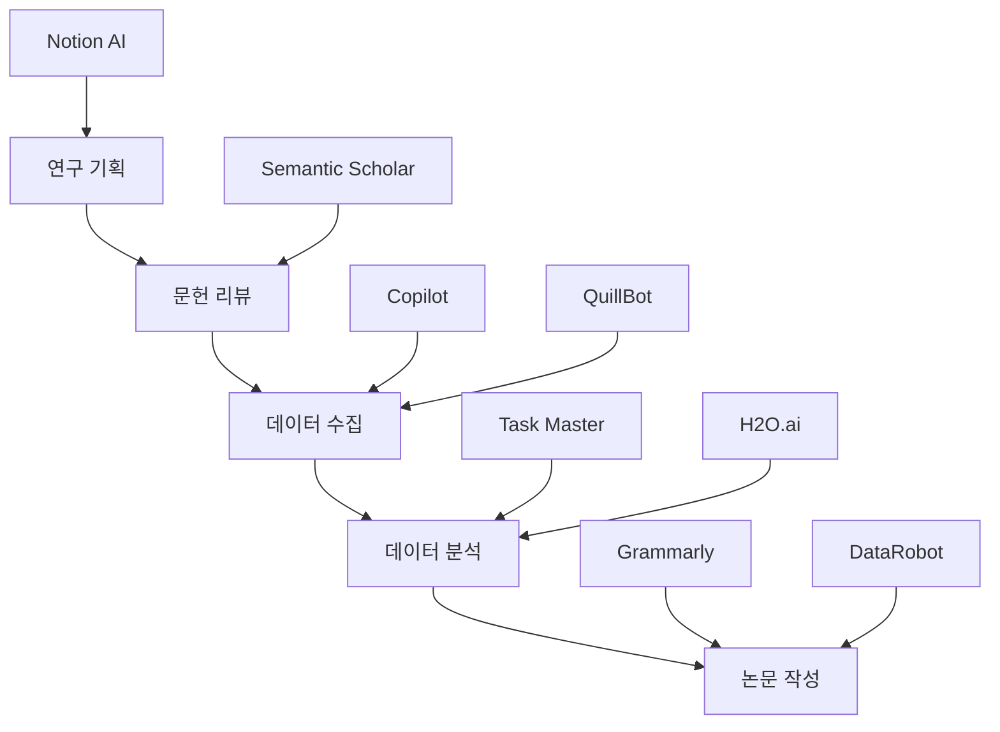

# 분야별 워크플로우 가이드 2025

## 목적
- 5개 주요 연구 분야별 맞춤 AI 도구 활용 워크플로우 제공
- 각 분야의 고유한 요구사항과 특성을 반영한 최적화된 연구 프로세스
- 연구 단계별 AI 도구 조합 및 활용 방법 구체적 가이드

## 1. 자연과학 (Natural Sciences)

### 연구 특성 및 요구사항
- **대용량 데이터 처리**: 실험 데이터, 시뮬레이션 결과
- **정밀한 계산 및 모델링**: 수치 해석, 통계 분석
- **시뮬레이션 및 모델링**: Physics-based 모델,化学反应 시뮬레이션
- **윤리적 고려사항**: 실험윤리, 안전성

### AI 도구 역할 및 활용

#### 연구 기획 단계
| AI 도구 | 주요 활용 | 구체적 사용법 | 예상 효과 |
|---------|-----------|---------------|----------|
| **Semantic Scholar** | 문헌 트렌드 분석 | 자연과학 논문 인용 네트워크 분석, 최신 연구 동향 파악 | 연구 격차 식별 |
| **Copilot** | 연구 설계 지원 | 샘플 크기 계산, 실험 설계 자동화, 통계적 검정력 분석 | 연구 설계 품질 향상 |
| **Notion AI** | 연구项目管理 | 실험 계획서, safety protocols, IRB 서류 정리 | 체계적项目管理 |

#### 문헌 리뷰 단계
| AI 도구 | 주요 활용 | 구체적 사용법 | 예상 효과 |
|---------|-----------|---------------|----------|
| **Copilot** | 논문 요약 및 분석 | 수학 공식, 그래프 해석, 실험 방법론 분석 | 40% 시간 절약 |
| **H2O.ai** | 메타분석 | 대용량 문헌 데이터의 통계적 메타분석 | 인사이트 발견 |
| **Grammarly** | 학술적 표현 | 자연과학 전문 용어 및 수식 표현 교정 | 논문 품질 향상 |

#### 데이터 수집/실험 단계
| AI 도구 | 주요 활용 | 구체적 사용법 | 예상 효과 |
|---------|-----------|---------------|----------|
| **Task Master** | 실험 진도 관리 | 실험 단계별 마일스톤, 품질 체크, 재현성 추적 | 실험 효율성 30% 향상 |
| **Copilot** | 실험 프로토콜 | 실험手順 자동화, 오류 방지 체크리스트 | 실험 정확성 향상 |
| **Notion AI** | 데이터 정리 | 실험 노트, 측정값, 관찰사항 체계적 정리 | 데이터 품질 관리 |

#### 데이터 분석 단계
| AI 도구 | 주요 활용 | 구체적 사용법 | 예상 효과 |
|---------|-----------|---------------|----------|
| **Copilot** | Python/R 분석 | scipy, numpy, matplotlib 활용한 통계 분석 코드 | 50% 코드 작성 시간 단축 |
| **H2O.ai** | 대용량 데이터 | 분산 처리, AutoML, 하이퍼파라미터 최적화 | 분석 속도 10배 향상 |
| **DataRobot** | 예측 모델링 | 실험 결과 기반 예측 모델 구축 및 검증 | 모델링 전문성 확보 |

#### 논문 작성 단계
| AI 도구 | 주요 활용 | 구체적 사용법 | 예상 효과 |
|---------|-----------|---------------|----------|
| **Copilot** | 논문 초안 | Results, Discussion 섹션 자동 생성 | 작성 시간 60% 단축 |
| **Grammarly** | 과학적 표현 | 수학 표기법, 단위, Figures/Tables 교정 | 논문 전문성 향상 |
| **Task Master** | 진도 추적 | 논문 작성 진도, Peer Review 관리 | 작성 품질 관리 |

### 핵심 AI 프롬프트 (자연과학)
```markdown
Copilot 프롬프트:
"자연과학 연구 [구체적 주제]의 실험 데이터를 분석하고,
Python 코드를 작성해주세요. 
사용 가능한 도구: pandas, numpy, scipy, matplotlib
출력: 통계 분석, 시각화, 결과 해석"
```

## 2. 공학 (Engineering)

### 연구 특성 및 요구사항
- **시스템 설계 및 최적화**: 알고리즘 개발, 시스템 성능 최적화
- **하드웨어-소프트웨어 연동**: 임베디드 시스템, IoT
- **실시간 데이터 처리**: 센서 데이터, 제어 시스템
- **팀 협업**: 멀티 디스플린 협업

### AI 도구 역할 및 활용

#### 연구 기획 단계
| AI 도구 | 주요 활용 | 구체적 사용법 | 예상 효과 |
|---------|-----------|---------------|----------|
| **GitHub Copilot** | 시스템 아키텍처 | 시스템 설계 다이어그램, API 명세, 클래스 구조 | 설계 효율성 향상 |
| **Amazon CodeWhisperer** | AWS 연동 | 클라우드 기반 연구 환경 구축, 배포 자동화 | 개발 속도 40% 향상 |
| **Notion AI** | 요구사항 관리 | 시스템 요구사항, 사용 사례, 테스트 시나리오 | 요구사항 명확화 |

#### 개발/설계 단계
| AI 도구 | 주요 활용 | 구체적 사용법 | 예상 효과 |
|---------|-----------|---------------|----------|
| **Copilot** | 알고리즘 구현 | 최적화 알고리즘, 제어 로직, 데이터 처리 파이프라인 | 코드 작성 속도 50% 향상 |
| **JetBrains AI Assistant** | 코드 리뷰 | 코드 품질 점검, 성능 최적화, 보안 분석 | 코드 품질 향상 |
| **Task Master** | 개발 진도 | Sprint 계획, 코드 커버리지, 테스트 관리 | 개발 프로세스 체계화 |

#### 테스트/검증 단계
| AI 도구 | 주요 활용 | 구체적 사용법 | 예상 효과 |
|---------|-----------|---------------|----------|
| **Copilot** | 테스트 코드 | 단위 테스트, 통합 테스트, 성능 벤치마크 자동 생성 | 테스트 커버리지 80% 달성 |
| **DataRobot** | 성능 모델링 | 시스템 성능 예측, 병목 지점 분석 | 성능 최적화 |
| **Semantic Scholar** | 성능 비교 | 최신 연구와 성능 비교, 벤치마크 업데이트 | 연구 경쟁력 확보 |

#### 배포/최적화 단계
| AI 도구 | 주요 활용 | 구체적 사용법 | 예상 효과 |
|---------|-----------|---------------|----------|
| **CodeWhisperer** | CI/CD | 자동화된 빌드, 테스트, 배포 파이프라인 | 배포 자동화 |
| **Notion AI** | 배포 문서 | 사용자 가이드, API 문서, 운영 매뉴얼 | 문서화 효율성 |
| **Task Master** | 운영 관리 | 모니터링, 알림, 버그 트래킹 | 안정적 운영 |

### 핵심 AI 프롬프트 (공학)
```markdown
Copilot 프롬프트:
"공학 시스템 [구체적 시스템]을 위한 Python 코드를 작성해주세요.
요구사항: 
- 실시간 데이터 처리
- 성능 최적화
- 오류 처리 및 로깅
사용 도구: asyncio, pandas, numpy, logging"
```

## 3. 사회과학 (Social Sciences)

### 연구 특성 및 요구사항
- **인간 대상 연구**: 설문, 인터뷰, 관찰 연구
- **정성적 데이터 분석**: 테마 분석, 내용 분석
- **윤리적 고려**: 개인정보 보호, 피험자 보호
- **문화적 맥락**: 지역별, 문화별 차이 고려

### AI 도구 역할 및 활용

#### 연구 기획 단계
| AI 도구 | 주요 활용 | 구체적 사용법 | 예상 효과 |
|---------|-----------|---------------|----------|
| **Notion AI** | 연구 설계 | 설문지 구조, 인터뷰 가이드, 샘플링 전략 | 연구 설계 체계화 |
| **Copilot** | 설문 개발 | 문항 구성, 척도 설계, 타당성 검증 | 설문지 품질 향상 |
| **Semantic Scholar** | 이론 검토 | 사회과학 이론, 연구 방법론, 선행연구 | 이론적 기반 강화 |

#### 데이터 수집 단계
| AI 도구 | 주요 활용 | 구체적 사용법 | 예상 효과 |
|---------|-----------|---------------|----------|
| **Copilot** | 설문 최적화 | 응답률 향상, 편향 최소화, UX 개선 | 응답률 25% 향상 |
| **Notion AI** | 인터뷰 가이드 | 반구조화 인터뷰 질문, 프로빙 전략 | 인터뷰 품질 향상 |
| **Task Master** | 수집 진도 | 샘플링 진도, 응답 추적, 품질 관리 | 데이터 수집 효율성 |

#### 정성적 분석 단계
| AI 도구 | 주요 활용 | 구체적 사용법 | 예상 효과 |
|---------|-----------|---------------|----------|
| **QuillBot** | 인터뷰 전사 | 음성-텍스트 변환, 다국어 지원, 정제 | 전사 시간 70% 단축 |
| **H2O.ai** | 텍스트 마이닝 | 테마 분석, 감정 분석, 키워드 추출 | 정성적 인사이트 |
| **Copilot** | 코딩 지원 | 코드북 개발, 코딩 일관성, 테마 매핑 | 분석 체계성 향상 |

#### 정량적 분석 단계
| AI 도구 | 주요 활용 | 구체적 사용법 | 예상 효과 |
|---------|-----------|---------------|----------|
| **Copilot** | 통계 분석 | SPSS/R/Python 통계 분석, 가설 검정 | 분석 전문성 확보 |
| **DataRobot** | 예측 모델링 | 사회 phenomena 예측, 인과관계 분석 | 모델링 효율성 |
| **Notion AI** | 결과 정리 | 분석 결과 시각화, 보고서 작성 | 결과 제시 품질 |

#### 논문 작성 단계
| AI 도구 | 주요 활용 | 구체적 사용법 | 예상 효과 |
|---------|-----------|---------------|----------|
| **Grammarly** | 학술 문체 | 사회과학적 표현, 인용, 논리 구조 | 논문 전문성 |
| **Copilot** | 섹션별 작성 | 서론, 방법론, 결과, 토론 섹션 | 작성 효율성 50% 향상 |
| **Task Master** | 작성 진도 | 논문 작성 진도, peer review, 수정 관리 | 작성 품질 관리 |

### 핵심 AI 프롬프트 (사회과학)
```markdown
Copilot 프롬프트:
"사회과학 연구 [구체적 주제]의 정량적 분석을 위한
Python 코드를 작성해주세요.
요구사항:
- 설문 데이터 전처리
- 기술통계, 인과관계 분석
- 시각화 및 결과 해석
사용 도구: pandas, scipy, matplotlib, seaborn"
```

## 4. 인문학 (Humanities)

### 연구 특성 및 요구사항
- **텍스트 분석**: 문학, 역사, 철학 자료
- **다국어 연구**: 원어 문헌, 번역 비교
- **정성적 해석**: 의미론, 담화 분석
- **문화적 맥락**: 시대별, 지역별 배경 고려

### AI 도구 역할 및 활용

#### 연구 기획 단계
| AI 도구 | 주요 활용 | 구체적 사용법 | 예상 효과 |
|---------|-----------|---------------|----------|
| **QuillBot** | 다국어 지원 | 원어 문헌 번역, Paraphrase, 요약 | 다국어 접근성 향상 |
| **Notion AI** | 연구 설계 | 연구 질문, 텍스트 선택, 해석 프레임워크 | 연구 방향 명확화 |
| **Semantic Scholar** | 문헌调研 | 인문학 연구 동향, 학자 네트워크, 인용 관계 | 연구 기반 강화 |

#### 텍스트 수집/정리 단계
| AI 도구 | 주요 활용 | 구체적 사용법 | 예상 효과 |
|---------|-----------|---------------|----------|
| **Copilot** | 텍스트 전처리 | OCR, 텍스트 정제, 메타데이터 추출 | 전처리 효율성 |
| **Notion AI** | 텍스트 관리 | 원문, 번역, 주석 체계적 정리 | 텍스트 관리 체계 |
| **Task Master** | 작업 추적 | 텍스트 읽기 진도, 분석 단계, 마일스톤 | 연구 진행 관리 |

#### 텍스트 분석 단계
| AI 도구 | 주요 활용 | 구체적 사용법 | 예상 효과 |
|---------|-----------|---------------|----------|
| **H2O.ai** | NLP 분석 | 단어 빈도, 공기어, 감정 분석, 주제 모델링 | 텍스트 패턴 발견 |
| **QuillBot** | 의미 분석 | 동음이의어, 문맥별 의미, 번역 비교 | 의미 해석 지원 |
| **Copilot** | 코딩 체계 | 코드북, 테마 분류, 인용 관리 | 분석 체계화 |

#### 해석/비평 단계
| AI 도구 | 주요 활용 | 구체적 사용법 | 예상 효과 |
|---------|-----------|---------------|----------|
| **Notion AI** | 해석 정리 | 이론적 프레임, 비교 분석, 인사이트 정리 | 해석 깊이 향상 |
| **Grammarly** | 문체 개선 | 학술적 표현, 인용, 주석 교정 | 문학적 표현 향상 |
| **Task Master** | 진도 추적 | 해석 단계, peer review, 수정 관리 | 해석 품질 관리 |

#### 논문 작성 단계
| AI 도구 | 주요 활용 | 구체적 사용법 | 예상 효과 |
|---------|-----------|---------------|----------|
| **Copilot** | 초안 작성 | Literary analysis, historical context, 비교 논문 | 작성 속도 향상 |
| **Grammarly** | 문체 교정 | 인문학적 문체, 인용, 주석 표기 | 논문 완성도 |
| **Notion AI** | 참고문헌 | 인용 관리, 주석, 참고문헌 정리 | 인용 정확성 |

### 핵심 AI 프롬프트 (인문학)
```markdown
QuillBot 프롬프트:
"인문학 텍스트 [구체적 문헌]의 의미 분석을 수행해주세요.
요구사항:
- 문학적/철학적 의미 해석
- 문화적/역사적 맥락 고려
- 다국어 비교 분석 (원어-번역)
- 텍스트 내 반복 패턴 및 주제"
```

## 5. 의학 (Medicine)

### 연구 특성 및 요구사항
- **임상 연구**: RCT, 관찰 연구, 코호트 연구
- **의료 데이터**: EMR, 생체신호, 의료 영상
- **윤리적 기준**: 윤리위원회, 개인정보보호, 임상시험
- **통계적 엄격성**: 유의성 검정, 신뢰구간, 효과크기

### AI 도구 역할 및 활용

#### 연구 기획 단계
| AI 도구 | 주요 활용 | 구체적 사용법 | 예상 효과 |
|---------|-----------|---------------|----------|
| **Copilot** | 연구 설계 | RCT 설계, 샘플 크기 계산, 통계적 검정력 분석 | 연구 설계 품질 향상 |
| **Semantic Scholar** | 의학 문헌 | 최신 의학 연구, 임상시험 결과, 가이드라인 | 근거 기반 연구 |
| **Notion AI** | IRB 서류 | 동의서, 연구 계획서, 안전성 모니터링 | 윤리 준수 체계화 |

#### 임상시험 단계
| AI 도구 | 주요 활용 | 구체적 사용법 | 예상 효과 |
|---------|-----------|---------------|----------|
| **Task Master** | 시험 관리 | 피험자 추적, 방문 스케줄, 안전성 모니터링 | 시험 효율성 30% 향상 |
| **Copilot** | 프로토콜 | 임상시험 프로토콜, 케이스 리포트 폼 | 문서화 효율성 |
| **Notion AI** | 안전성 | 부작용 추적, 안전성 데이터 정리 | 안전성 관리 |

#### 데이터 분석 단계
| AI 도구 | 주요 활용 | 구체적 사용법 | 예상 효과 |
|---------|-----------|---------------|----------|
| **Copilot** | 생체의학 통계 | Kaplan-Meier, Cox 회귀, 로지스틱 회귀 | 통계 분석 전문성 |
| **DataRobot** | 의료 예측 | 질병 위험 예측, 치료 효과 예측, 진단 지원 | 예측 모델링 |
| **H2O.ai** | 대용량 의료 | 유전체 데이터, 의료 영상, 시계열 분석 | 대규모 분석 |

#### 논문 작성 단계
| AI 도구 | 주요 활용 | 구체적 사용법 | 예상 효과 |
|---------|-----------|---------------|----------|
| **Grammarly** | 의학 문체 | 의학 용어, 증상/치료법 표기, 의학적 표현 | 의학 논문 전문성 |
| **Copilot** | CONSORT | 임상시험 보고, 결과 제시, 통계 표 | 보고 표준 준수 |
| **Task Master** | 저널 관리 | 투고 진도, 수정 요구사항, 승인 추적 | 투고 효율성 |

### 핵심 AI 프롬프트 (의학)
```markdown
Copilot 프롬프트:
"의학 연구 [구체적 임상시험/연구]의 통계 분석을 위한
Python/R 코드를 작성해주세요.
요구사항:
- 생존분석 (Kaplan-Meier, Cox regression)
- 의학통계 (odds ratio, confidence interval)
- 의료 데이터 전처리 및 시각화
사용 도구: lifelines, scipy, matplotlib, seaborn"
```

## AI 도구 조합 전략

### 분야별 핵심 조합
| 연구 분야 | 핵심 AI 도구 조합 | 연동 방식 | 예상 성과 |
|-----------|-------------------|-----------|----------|
| **자연과학** | Copilot + H2O.ai + Task Master | MCP 서버 연동 | 분석 효율성 60% 향상 |
| **공학** | GitHub Copilot + CodeWhisperer + Notion | GitHub Actions 연동 | 개발 속도 50% 향상 |
| **사회과학** | Notion AI + Grammarly + QuillBot | 브라우저 확장 연동 | 연구 품질 40% 향상 |
| **인문학** | QuillBot + Notion AI + H2O.ai | API 연동 | 텍스트 분석 70% 단축 |
| **의학** | Copilot + DataRobot + Task Master | 의료데이터 전용 MCP | 임상시험 효율성 30% 향상 |

### 통합 워크플로우 예시


## 선택 가이드

### 1. 연구자 유형별 추천
| 연구자 유형 | 권장 분야 | 핵심 AI 도구 | 학습 우선순위 |
|-------------|-----------|-------------|--------------|
| **초보 연구자** | 사회과학 | Notion AI, Grammarly | 1. 문서 작성 → 2. 연구 설계 |
| **박사과정** | 모든 분야 | GitHub Copilot, Task Master | 1. 코드 작성 → 2. 프로젝트 관리 |
| **연구 PI** | 공학, 의학 | DataRobot, H2O.ai | 1. 데이터 분석 → 2. 팀 관리 |
| **팀 연구** | 모든 분야 | Task Master, Notion AI | 1. 협업 도구 → 2. 통합 워크플로우 |

### 2. 예산별 단계적 도입
1. **1단계 (월 $10)**: GitHub Copilot (모든 분야)
2. **2단계 (월 $20)**: + Notion AI 또는 Grammarly
3. **3단계 (월 $40)**: + Task Master + 분야별 특화 도구
4. **4단계 (월 $60+)**: + DataRobot/H2O.ai + 통합 워크플로우

## 관련 리소스
- 연구 워크플로우: `22_integrated_workflow_example.md`
- AI 도구 비교: `42_tools_comparison_comprehensive.md`
- Task Master 가이드: `16_task_master_mcp_tutorial.md`
- 분야별 사례: `10_discipline_examples.md`
- AI 도구 로드맵: `43_ai_tools_roadmap_2025.md`
- v5.0 워크플로우: `../v5.0_resources/08_sample_research_notes_v5.md`

---
**마지막 업데이트**: 2025-11-11  
**버전**: Part 3
