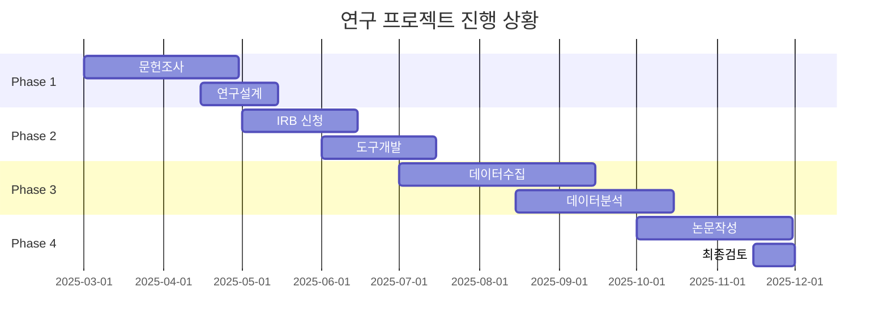
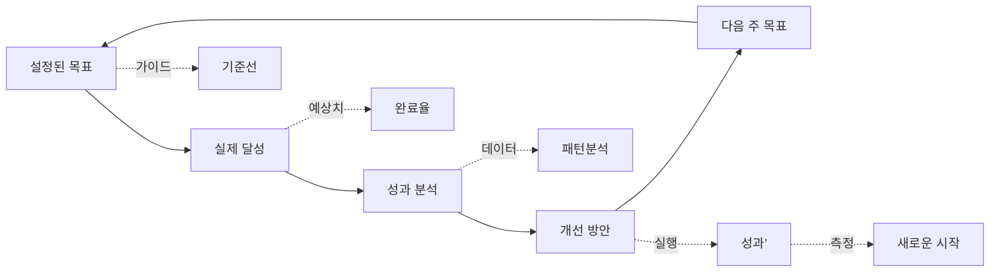

# 진행 상황 추적 방법
## AI를 활용한 연구 프로젝트 모니터링

**목적**: 체계적인 진행 상황 추적으로 일정 준수 및 성과 관리  
**대상**: 모든 전공의 대학원생  
**효과**: 지연 예방, 성과 향상, 스트레스 감소

---

## 🎯 진행 상황 추적의 중요성

### 왜 추적해야 하는가?
- **일정 지연 예방**: 조기 경보 시스템으로 지연 위험 감소
- **성과 향상**: 시간별 소요 파악으로 효율성 개선
- **스트레스 감소**: 현재 상태를 명확히 파악하여 불확실성 감소
- **품질 보장**: 각 단계별 검토를 통한 품질 관리

### 추적의 핵심 원칙
- **데이터 기반**: 주관적 느낌보다 객관적 데이터 수집
- **정기적**: 주간/월간 정기적 체크로 일정한 리듬 유지
- **실행 가능**: 단순 기록이 아닌 개선 액션으로 연결
- **개인화**: 자신의 연구 스타일에 맞는 추적 방법 적용

---

## 📊 마크다운 기반 추적

### 기본 진행률 표시

**진행률 바 (Progress Bar)**:
```markdown
## 프로젝트 진행률
████████░░░░░░░░ 68% (M3 / M8 마일스톤 완료)

## 주간 진행률 (Week 12)
████████████░░ 80% (4/5 작업 완료)

## 일일 진행률 (2025-11-10)
███████░░░░░░ 35% (3.5/10 시간 목표)
```

**마일스톤 테이블**:
```markdown
| 마일스톤 | 목표일 | 실제일 | 상태 | 진도 |
|---------|--------|--------|------|------|
| M1: 문헌조사 완료 | 2025-05-15 | 2025-05-12 | ✅ | 100% |
| M2: IRB 승인 | 2025-06-15 | 2025-06-18 | ⚠️ | 100% |
| M3: 데이터수집 | 2025-08-15 | - | 🔄 | 74% |
| M4: 데이터분석 | 2025-09-15 | - | ⏳ | 0% |
| M5: 논문초고 | 2025-10-15 | - | ⏳ | 0% |
```

### 체크리스트 기반 추적

**주간 작업 체크리스트**:
```markdown
# Week 12 주간 진행 상황

## 🎯 목표 작업
- [x] IRB 수정 요청 대응 (목표: 8시간 → 실제: 7.5시간)
- [x] 설문 응답률 증대 활동 (목표: 12시간 → 실제: 11시간)
- [ ] 문헌고찰 섹션 2 작성 (목표: 10시간 → 실제: 6시간, 60% 완료)
- [x] 주간 계획 수립 (목표: 0.5시간 → 실제: 0.5시간)

## 📊 시간 관리
- **예상 총시간**: 30.5시간
- **실제 소요시간**: 25시간
- **효율성**: 82% (예상 대비 실제 시간)

## 🚨 문제점
- 문헌고찰 섹션 2가 계획보다 2시간 부족
- **원인**: 인터뷰 전사 예상보다 시간이 듦
- **대응**: 주말 2시간 추가 작업 필요

## ✅ 성과
- IRB 수정 요청 가순 승인됨
- 설문 응답률 목표 50% → 54% 달성
- 전반적으로 일정 준수 상태
```

**월간 회고 체크리스트**:
```markdown
# 11월 월간 회고

## 📈 정량적 지표
- **진행률**: 68% (목표: 70% → 2% 지연)
- **마일스톤**: 2/3 완료 (M1, M2 완료, M3 진행중)
- **시간 관리**: 평균 105% 시간 초과
- **품질 지표**: 4.2/5.0 만족도

## 🎯 정성적 지표
- **스트레스 수준**: 3.5/5.0 (관리 가능)
- **동기 부여**: 4.0/5.0 (높음)
- **도구 효과**: 4.1/5.0 (매우 만족)
- **연구 만족도**: 4.3/5.0 (높음)

## 🚨 발견된 문제
1. **시간 초과 패턴**: 모든 작업이 평균 5% 시간 초과
2. **품질 변동**: 섹션별 품질 편차 발생
3. **AI 의존도**: 효율적인 사용법 미숙

## 🔧 개선 방안
1. **시간 버퍼**: 각 작업에 10% 버퍼 추가
2. **품질 체크리스트**: 섹션별 품질 기준 적용
3. **AI 학습**: 효과적인 프롬프트 기법 숙달
```

---

## 🤖 AI 기반 진행 분석

### task-master-mcp를 활용한 분석

**진행 상황 분석 프롬프트**:
```markdown
# 진행 상황 분석 및 개선 제안

## 프로젝트 현황
- **프로젝트명**: 온라인 자기조절학습 전략 효과성 연구
- **시작일**: 2025-03-01
- **예상 완료일**: 2025-11-01
- **현재 진행률**: 68%
- **현재 마일스톤**: M3 (데이터 수집, 74% 완료)

## 주간 데이터
- **목표 작업**: 4개 (완료 3개, 진행중 1개)
- **시간 투자**: 예상 30.5시간, 실제 25시간
- **성과 지표**: IRB 승인, 설문 응답률 54% 달성

## 문제점 분석
- 문헌고찰 섹션 2가 계획보다 2시간 부족
- 시간 초과 패턴: 모든 작업 5% 초과
- 품질 편차: 섹션별 품질 불일치

## 요청사항
1. **진행률 분석**: 목표 대비 실제 진행률 평가
2. **위험 평가**: 향후 일정 지연 가능성 분석
3. **개선 제안**: 구체적이고 실행 가능한 3가지 방안
4. **다음 주 전략**: 조기 달성을 위한 우선순위 재조정
```

**AI 예상 응답**:
```markdown
# 진행 상황 분석 리포트

## 📊 진행률 분석
**종합 평가**: 68% 진행률로 목표(70%) 대비 2% 지연
- **지연정도**: ⚠️ 주의 수준 (1주 내 정상화 가능)
- **원인**: 시간 초과 패턴과 품질 변동
- **예상 완료일**: 2025-11-05 (4일 지연 예상)

## 🚨 위험 평가
**고위험 요인**:
- 문헌고찰 섹션 2 지연 → 논문 초고 작성 지연 가능성
- 주말 작업 필요 → 개인 시간 부족 위험

**중위험 요인**:
- 설문 응답률 54% → 목표(200부) 달성 시간 길어짐
- AI 도구 사용법 미숙 → 추가 시간 소요

## 🔧 개선 제안

### 1. 시간 버퍼 전략 (우선순위: 높음)
- **현재**: 각 작업에 0% 버퍼 → 5% 시간 초과
- **개선**: 각 작업에 10% 버퍼 추가
- **효과**: 예상치 못한 문제 대응 시간 확보
- **실행**: 다음 주 작업부터 적용

### 2. 품질 체크리스트 도입 (우선순위: 높음)
- **현재**: 섹션별 품질 편차 0.8/5.0
- **개선**: 섹션별 품질 기준 체크리스트 적용
- **효과**: 일관된 품질 보장, 반복 수정 감소
- **실행**: 작성 전 품질 기준 확인

### 3. AI 도구 마스터링 (우선순위: 중간)
- **현재**: AI 효율성 3.5/5.0
- **개선**: 고품질 프롬프트 기법 숙달
- **효과**: AI 활용 시간 단축, 품질 향상
- **실행**: 주 1시간 AI 학습 시간 배정

## 📅 다음 주 전략

### 우선순위 재조정
1. **최우선**: 문헌고찰 섹션 2 완료 (주말 2시간)
2. **2순위**: 설문 응답률 목표 달성 (기존 활동 지속)
3. **3순위**: AI 도구 사용법 학습 (1시간)

### 리소스 조정
- **시간 투자**: 기존 35시간 + 주말 2시간
- **중단점 관리**: 설문 응답률 70% 달성 시 활동 중단
- **품질 관리**: 작성 전 AI 검토 + 작성 후 자가 검토

## 🎯 성공 지표
- **다음 주 목표**: 문헌고찰 섹션 2 100% 완료
- **시간 목표**: 모든 작업 100% 시간 내 완료
- **품질 목표**: 작성 문서 품질 4.5/5.0 이상

이 분석 바탕으로 다음 주에 한 단계 더 성장할 수 있을 것입니다!
```

### AI 패턴 분석

**성과 패턴 분석 프롬프트**:
```markdown
# 성과 패턴 분석

## 데이터 수집 (최근 8주)
| 주 | 소요시간 | 목표시간 | 효율성 | 품질 | 스트레스 |
|----|---------|---------|--------|------|----------|
| 1 | 35h | 32h | 91% | 4.0 | 3.0 |
| 2 | 38h | 35h | 92% | 4.2 | 3.2 |
| 3 | 40h | 36h | 90% | 3.8 | 3.5 |
| 4 | 37h | 34h | 92% | 4.1 | 3.1 |
| 5 | 42h | 38h | 90% | 3.9 | 3.8 |
| 6 | 39h | 36h | 92% | 4.3 | 3.0 |
| 7 | 41h | 37h | 90% | 4.0 | 3.4 |
| 8 | 25h | 30h | 120% | 4.1 | 2.5 |

## 분석 요청
1. **시간 관리 패턴**: 주별 효율성 변화 분석
2. **품질 패턴**: 품질이 높은 작업의 특징
3. **스트레스 패턴**: 스트레스와 효율성의 상관관계
4. **개선 포인트**: 구체적인 개선 방안 3가지
```

---

## 📈 시각화 도구 활용

### GitHub Projects 활용

**칸반 보드 설정**:
```
| To Do | In Progress | Review | Done |
|-------|-------------|--------|------|
| IR브 수정 요청 | 설문 분석 | 논문 초고 1.0 | IRB 승인서 |
| 주간 계획 | 데이터 수집 | AI 검토 | 문헌고찰 1.0 |
| 동료 검토 | 인터비이 설정 | 지도교수 승인 | 설문지 개발 |
| 주간 회고 | 프로토콜 작성 | 동료 피드백 | 연구계획서 |
```

**자동화 규칙 설정**:
- Issue 생성 → To Do 자동 이동
- PR 생성 → Review 자동 이동
- PR 병합 → Done 자동 이동
- 마일스톤 완료 → 리포트 자동 생성

### Notion 데이터베이스

**진행 상황 대시보드**:
```
Database: 연구 프로젝트 진행 상황

속성:
- 📅 날짜 (Date)
- 🎯 작업명 (Title)
- 📊 진행률 (Progress bar)  
- ⏰ 소요시간 (Number)
- 🎨 품질 (Select: 높음, 중간, 낮음)
- 👤 담당자 (Person)
- 📋 마일스톤 (Relation)
- 🏷️ 태그 (Multi-select)
- 📝 메모 (Text)
```

**자동화 설정**:
- 진행률 100% → 완료 상태 자동 변경
- 소요시간 > 목표시간 20% → 리뷰 필요 알림
- 품질 낮음 → 품질 개선 작업 자동 생성

### Mermaid 차트 활용

**진행 상황 Gantt 차트**:


**성과 추적 차트**:


---

## 📊 KPI 측정 및 관리

### 핵심 성과 지표 (KPI)

**시간 관리 KPI**:
```markdown
| 지표 | 계산식 | 목표치 | 현재값 | 상태 |
|------|--------|--------|---------|------|
| 일정 준수율 | (실제 완료/목표 완료) × 100 | 95% | 88% | ⚠️ |
| 시간 예측 정확도 | (1 - \|실제-예상\|/예상) × 100 | 90% | 85% | ⚠️ |
| 생산성 추이 | 주별 완료 작업수/시간 | 1.2개/h | 1.1개/h | ⚠️ |
| 시간 초과율 | (실제-예상)/예상 × 100 | <10% | 12% | ⚠️ |
```

**품질 관리 KPI**:
```markdown
| 지표 | 계산식 | 목표치 | 현재값 | 상태 |
|------|--------|--------|---------|------|
| 1차 완성 품질 | 수정 없이 통과한 작업/전체 작업 | 70% | 65% | ⚠️ |
| AI 도구 효과 | AI 사용 전/후 품질 비교 | +30% | +25% | ⚠️ |
| 동료 검토 만족도 | 리뷰어 평가 점수 | 4.0/5.0 | 4.1/5.0 | ✅ |
| 지도교수 승인율 | 1차 승인/전체 제출 | 80% | 75% | ⚠️ |
```

**AI 활용 KPI**:
```markdown
| 지표 | 계산식 | 목표치 | 현재값 | 상태 |
|------|--------|--------|---------|------|
| AI 도구 사용률 | AI 사용 시간/전체 연구 시간 | 40% | 35% | ⚠️ |
| AI 응답 품질 | 유용한 응답/전체 응답 | 85% | 82% | ⚠️ |
| AI-인간 협업 효율 | AI 도구로 절약된 시간 | 20% | 18% | ⚠️ |
| 프롬프트 최적화 | 개선된 프롬프트 사용률 | 60% | 45% | ⚠️ |
```

### 성과 대시보드

**주간 성과 대시보드**:
```markdown
# Week 12 성과 대시보드

## 📊 핵심 지표
| KPI | 목표 | 현재 | 변화 | 상태 |
|-----|------|------|------|------|
| 일정 준수율 | 95% | 88% | -2% | ⚠️ |
| 품질 만족도 | 4.0 | 4.1 | +0.1 | ✅ |
| AI 활용 효과 | 85% | 82% | -3% | ⚠️ |
| 스트레스 수준 | <3.0 | 2.5 | -0.3 | ✅ |

## 📈 추세 분석
**긍정적 추세**:
- 품질이 지속적 상승 (3.8 → 4.1)
- 스트레스 관리 개선 (3.0 → 2.5)

**개선 필요**:
- 시간 관리 효율성 저하 (92% → 88%)
- AI 활용 효율성 감소 (85% → 82%)

## 🎯 다음 주 개선 목표
1. **시간 관리**: 88% → 92% (버퍼 전략 적용)
2. **AI 활용**: 82% → 85% (프롬프트 개선)
3. **품질**: 4.1 → 4.2 (체크리스트 적용)
```

---

## 🔄 지속적 개선 체계

### 주간 개선 루프

**1. 측정 (Measure)**:
```markdown
# 주간 성과 측정
## 정량적 데이터
- 완료 작업: X개
- 소요 시간: Y시간  
- 품질 점수: Z/5.0
- AI 활용: A%

## 정성적 관찰
- 가장 잘된 작업: [작업명]
- 가장 어려웠던 작업: [작업명]
- 새로 발견한 방법: [방법]
- 하고 싶은 개선: [개선사항]
```

**2. 분석 (Analyze)**:
```markdown
# 패턴 분석
## 시간 패턴
- 가장 효율적인 시간대: [시간]
- 시간 소모가 많은 작업 유형: [유형]
- 예상 시간과 실제 시간 차이: [차이]

## 품질 패턴  
- 높은 품질의 산출물의 공통점: [특징]
- 낮은 품질의 원인: [원인]
- AI 도구가 효과적이었던 경우: [상황]
```

**3. 개선 (Improve)**:
```markdown
# 개선 방안
## 단기 개선 (다음 주 적용)
- [개선사항 1]: [실행 방법]
- [개선사항 2]: [실행 방법]  
- [개선사항 3]: [실행 방법]

## 중기 개선 (다음 달 적용)
- [개선사항 1]: [실행 방법]
```

**4. 실행 (Execute)**:
```markdown
# 실행 계획
## 우선순위
1. [가장 중요한 개선]: [위험/비용/효과 분석]
2. [두번째 개선]: [위험/비용/효과 분석]

## 성공 지표
- [구체적 측정 가능한 목표]
```

### 월간 포괄적 개선

**성장 분석**:
```markdown
# 3개월 성장 분석

## 정량적 성장
| 지표 | 1개월전 | 현재 | 성장률 |
|------|---------|------|--------|
| 연구 생산성 | 0.8개/h | 1.1개/h | +37% |
| 품질 점수 | 3.5/5.0 | 4.1/5.0 | +17% |
| 일정 준수율 | 82% | 88% | +7% |
| AI 활용률 | 20% | 35% | +75% |

## 정성적 성장
**기술적 역량**:
- Context Engineering 숙련도 증가
- AI 프롬프트 작성 능력 향상
- 주간 루틴 습관화

**방법론적 이해**:
- 체계적 연구 방법론 체득
- AI-인간 협업 패턴 확립
- 개인화된 워크플로우 완성

## 개선의 인사이트
**가장 효과적인 변화**:
1. 주간 루틴 도입 (가장 큰 영향)
2. AI 도구 체계적 활용 (큰 영향)
3. 4단계 검증 시스템 (중간 영향)

**지속할 효과적인 습관**:
1. 월요일 주간 계획 (고효율)
2. 4단계 검증 (품질 보장)
3. AI 프롬프트 저장 (효율성)
```

---

## 🎯 개인화된 추적 방법

### 연구 성향별 맞춤화

**계획형 연구자 (Planner)**:
- **특징**: 상세한 계획 선호, 예측 가능성 중시
- **추적 방법**: 
  - 일일/주간/월간 상세 일정 수립
  - 시간별 세부 계획 (30분 단위)
  - 예상 대비 실제 기록 필수
- **도구**: task-master-mcp + 상세한 체크리스트
- **강점**: 정확한 예측, 체계적 진행
- **주의점**: 유연성 부족, 과도한 계획으로 스트레스

**적응형 연구자 (Adaptor)**:
- **특징**: 유연성 중시, 상황 대응력 강함
- **추적 방법**:
  - 주간 목표만 설정, 일일 계획은 유연
  - 진행 상황 중심, 세부 일정 덜 중요
  - 변경사항에 대한 회고 중심
- **도구**: Notion + AI 실시간 분석
- **강점**: 빠른 상황 변화 대응, 효율적 리소스 배분
- **주의점**: 일관성 부족, 장기 계획 미흡

**실행형 연구자 (Executor)**:
- **특징**: 실행력 강함, 계획 대비 실행 우수
- **추적 방법**:
  - 실행 성과 중심 (완료 작업 수, 품질)
  - 시간 관리less 디테일한 추적
  - 즉각적 피드백 및 개선
- **도구**: GitHub Projects + 성과 대시보드
- **강점**: 높은 실행력, 빠른 성과 달성
- **주의점**: 계획 부족, 체계적 접근 미흡

### 전공별 맞춤화

**인문사회계 (교육학, 사회학)**:
- **추적 강조점**: 질적 데이터 분석 진도, 인터뷰 진행 상황
- **특수 지표**: 
  - 분석된 인터뷰 수/전체 수
  - 주제 분석 진행률 (개방코딩/축코딩/선택코딩)
  - 이론적 정합성 검토 상황
- **AI 활용**: NotebookLM로 질적 분석 도움, 주제 패턴 발견

**자연과학계 (생명과학, 물리학)**:
- **추적 강조점**: 실험 진행 상황, 데이터 분석 효율성
- **특수 지표**:
  - 실험 성공률 (계산/전체)
  - 데이터 품질 (결측치, 오류율)
  - 분석 완료 프로젝트 수/전체
- **AI 활용**: Consensus로 프로토콜 최적화, Copilot로 분석 코드

**공학계 (컴퓨터공학, 기계공학)**:
- **추적 강조점**: 개발 진도, 코드 품질, 성능 지표
- **특수 지표**:
  - 개발 완료 모듈/전체 모듈
  - 코드 커버리지 (테스트 성공률)
  - 성능 벤치마크 달성률
- **AI 활용**: Copilot로 코드 작성, SpecKit으로 프로젝트 관리

**예체능계 (음악학, 미술학)**:
- **추적 강조점**: 이론 연구 진도, 창작/연주 발전 상황
- **특수 지표**:
  - 분석 완료 작품/전체 작품
  - 이론적 논리 구조 완성도
  - 창작/연주 기술 발전도
- **AI 활용**: Perplexity로 문헌 조사, Notion으로 지식 관리

---

## 🚨 경보 시스템

### 조기 경보 신호

**빨간 신호 (Red Alert)**:
```markdown
# 🚨 빨간 신호: 즉시 대응 필요

## 지연 경보
- 일정 준수율 < 80% (2주 연속)
- 마일스톤 지연 > 2주
- 핵심 작업 진행률 0% (1주 이상)

## 품질 경보  
- 품질 점수 < 3.0/5.0 (2주 연속)
- 지도교수 승인율 < 60%
- 동료 검토 불통과율 > 50%

## 스트레스 경보
- 스트레스 수준 > 4.0/5.0 (2주 연속)
- 연구 만족도 < 2.5/5.0
- 동력/동기 저하 ("하고 싶지 않다"这种感觉)

## 대응 방안
1. **즉시**: 문제 상황 분석 + 해결책 수립
2. **24시간 내**: 실행 방안 시작  
3. **1주 내**: 지지자(지도교수/동료)에게 지원 요청
```

**노란 신호 (Yellow Alert)**:
```markdown
# ⚠️ 노란 신호: 주의 모니터링

## 경미한 지연
- 일정 준수율 80-90%
- 예상 시간 대비 10-20% 초과
- 1개 마일스톤 지연 가능성

## 품질 주의
- 품질 점수 3.0-3.5/5.0
- AI 도구 활용 효율성 저하
- 검토가 필요한 항목 증가

## 대응 방안
1. **예측**: 1-2주 내 상황 개선 계획
2. **모니터링**: 주간 체크 강화
3. **대비**: 문제 발생 시 대안 준비
```

**녹색 신호 (Green Status)**:
```markdown
# ✅ 녹색 상태: 정상 진행

## 정상 지표
- 일정 준수율 ≥ 90%
- 품질 점수 ≥ 3.5/5.0
- AI 활용 효율성 ≥ 80%
- 스트레스 수준 ≤ 3.0/5.0

## 다음 단계
- 현재 추적 방법 유지
- 효율성 개선 방안 모색
- 장기 목표 달성 전략 수립
```

### 자동화 경보 시스템

**Notion 자동화**:
```markdown
## 자동화 규칙
1. 일정 준수율 < 85% → "경보" 태그 추가
2. 품질 점수 < 3.5 → "품질 검토 필요" 알림
3. 1주 이상 작업 미완료 → "지연" 상태 변경
4. 스트레스 지표 > 4.0 → "휴식 필요" 알림
```

**task-master-mcp 경보**:
```markdown
## 주간 자동 분석
- 진행률 계산 및 경보
- 패턴 분석 및 개선 제안
- 다음 주 위험요인 예측
- 맞춤형 대안 제시
```

---

## 💡 효과적인 추적을 위한 팁

### 시작하기 팁

**1. 간단히 시작**:
- 복잡한 시스템보다 간단한 체크리스트부터
- 주 1회 15분 진행 상황 기록
- 점진적 체계화 (마일스톤 → 주간 → 일일)

**2. 일관성 유지**:
- 매주 같은 시간에 진행 상황 확인
- 동일한 포맷으로 기록
- 습관이 되면 자동화 도구 도입

**3. 의미 있는 지표만**:
- 연구에 실질적으로 도움이 되는 지표만 추적
- 과도한 측정으로 번거롭게 하지 않기
- 핵심 성과 지표 집중 관리

### 유지하기 팁

**1. 재미있게**:
- 게임화된 진행률 표시 활용
- 성취 시 적절한 보상 제공
- 동료와 진행 상황 공유 (참고용)

**2. 유연하게**:
- 계획 변경이 필요하면 기쁙넉이 반영
- 연휴, 개인 사정 등은 유연하게 조정
- 연구 특성에 맞는 추적 방법 발전

**3. 의미 있게**:
- 단순 기록이 아닌 개선으로 연결
- 추적 결과를 실제 연구에 활용
- 성장過程을 즐겁게 기록

### 고급 활용 팁

**1. 패턴 인식**:
- 장기간 데이터로 개인 특성 파악
- 업무 시간대별 생산성 패턴 분석
- AI 도구 활용 효과 극대화

**2. 예측 모델링**:
- 과거 데이터를 바탕으로 완료일 예측
- 리스크 요인 사전 파악 및 대응
- 최적의 연구 시퀀스 계획

**3. 지식 공유**:
- 성공적인 추적 방법 Others와 공유
- 동료 연구자들과 피드백
- 커뮤니티에서 학습

---

**마지막 업데이트**: 2025-11-10  
**다음 검토**: 2025-12-10 (월간 업데이트)
