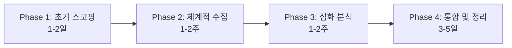

# 2025 문헌 조사 통합 워크플로우
## 7개 AI 도구를 활용한 체계적 문헌 고찰

**목적**: 최신 AI 도구들을 통합하여 효율적이고 체계적인 문헌 조사 수행  
**대상**: 모든 전공의 대학원생  
**소요 시간**: 2-4주 (연구 규모에 따라)  
**도구**: Elicit, Perplexity, Consensus, Scite, ResearchRabbit, Connected Papers, Semantic Scholar

---

## 📊 통합 워크플로우 개요

### 4단계 프로세스


### 각 단계별 도구 매핑
| 단계 | 목적 | 주요 도구 | 소요 시간 | 산출물 |
|------|------|-----------|-----------|--------|
| **Phase 1** | 분야 개요 파악 | Consensus, Connected Papers, Semantic Scholar | 1-2일 | 핵심 논문 20-30개 |
| **Phase 2** | 체계적 수집 | Elicit, ResearchRabbit, Scite | 1-2주 | 체계적 문헌고찰 리포트 |
| **Phase 3** | 심화 분석 | Perplexity, NotebookLM, Research Feed | 1-2주 | 심화 분석 리포트 |
| **Phase 4** | 통합 정리 | Zotero, Notion, AI 초안 | 3-5일 | 문헌고찰 초안 |

---

## 🔍 Phase 1: 초기 스코핑 (1-2일)

### Day 1: Consensus Scholar Agent (2-3시간)

**목적**: 연구 분야 개요 및 핵심 논문 파악

**프롬프트**:
```markdown
"What is the current consensus on [연구 주제]? 
Focus on studies from [기간].

Provide: 
1. Key findings and consensus view
2. Contradictory evidence and ongoing debates  
3. Top 20 most influential papers with DOIs
4. Research gaps and future directions
5. Cultural differences (if applicable)

Academic focus, systematic review approach."
```

**예상 결과**:
- 합의된 연구 동향
- 핵심 논문 20개 (DOI 포함)
- 연구 논쟁점
- 향후研究方向

**다음 단계**: 핵심 논문 DOI 저장

### Day 1: Semantic Scholar Topic Page (30분)

**목적**: 분야 전체 이해, 주요 저자/저널 파악

**사용법**:
1. "핵심 키워드" 검색
2. Topic page 클릭
3. AI-generated definition 확인
4. Often-cited papers 확인
5. Related topics 파악
6. Research Feed 설정 (최신 논문 알림)

### Day 2: Connected Papers (1-2시간)

**목표**: 핵심 논문 주변 네트워크 탐색

**사용법**:
1. Consensus에서 찾은 핵심 논문 DOI 입력
2. Similarity graph 생성
3. Cluster 분석:
   - Prior Works (이론적 기반)
   - Derivative Works (최신 연구)
   - Influential papers (중심 논문)
4. 추가 논문 10-15개 발견

**결과**: 분야 전체 지도, 핵심 연구자 네트워크

---

## 🗂️ Phase 2: 체계적 수집 (1-2주)

### Week 1-2: Elicit Systematic Review (10-15시간)

**Step 1: Search (1시간)**
```markdown
검색식:
([키워드1] OR [키워드2] OR [키워드3]) 
AND ([키워드4] OR [키워드5])

필터:
- Published: [연도 범위]
- Language: English, Korean
- Study types: Experimental, Quasi-experimental, Meta-analysis
```

**예상 결과**: 500-1000개 논문

**Step 2: Screening (5-8시간)**
- AI-suggested criteria 설정
- Title/Abstract screening
- Pilot testing (10% sample)
- **최종 선정**: 100-150개

**Step 3: Full-text Extraction (4-6시간)**
- Browser extension으로 full-text 확보
- Data extraction: 방법론, 표본, 결과, 효과크기
- Accuracy: 94-99%

**Step 4: Report Generation (1시간)**
- Literature review report 생성
- Mini-PRISMA diagram
- Tables and citations
- Export to CSV/PDF

### Week 2: ResearchRabbit (3-5시간)

**컬렉션 생성**: "연구 주제명"
1. 핵심 논문 20개 추가
2. Similar Work 탐색 → 추가 논문 20-30개
3. Earlier Work: 이론적 기반 논문
4. Later Work: 최신 연구
5. Author network: 주요 연구자 파악
6. Alerts 설정: 새 논문 알림

### Week 2: Scite Smart Citations (2-3시간)

**핵심 논문 10개 입력**
1. Smart Citations 분석:
   - Supporting citations: 지지하는 연구
   - Contrasting citations: 반대 결과 연구
   - Mentioning citations: 단순 언급
2. 논쟁 지점 파악
3. Collection 생성 및 Alerts 설정

---

## 🔬 Phase 3: 심화 분석 (1-2주)

### Week 3: Perplexity Research (5-7시간)

**Deep Research 실행**:
```markdown
Run Deep Research (Academic focus) on:
"[구체적 연구 질문]"

Scope:
- Time: [연도 범위]
- Study types: [연구 유형]
- Population: [표적 집단]
- Language: English, Korean

Deliver:
1. Executive summary (1-2 pages)
2. [구체적 요청사항들]
3. Research gaps and future directions
4. Implementation recommendations

Cite all sources with DOIs and provide full references.
```

**예상 결과**: 10-15페이지 종합 리포트

### Week 3-4: NotebookLM (3-5시간)

**핵심 논문 30-50편 업로드**
1. Mind Map 생성:
   - 주제 클러스터 시각화
   - 개념 간 연결 파악
2. Audio Overview 생성 및 청취:
   - 2명의 AI 호스트가 논문 토론
   - 배경 청취 학습 (운동, 출퇴근 중)
3. FAQ 생성: 예상 질문 및 답변
4. Briefing Doc: 핵심 내용 요약
5. Public sharing: 지도교수/동료와 공유

### Ongoing: Semantic Scholar Research Feed (주 1회, 30분)

**설정 및 모니터링**:
1. Research Feed 확인
2. 새 논문 알림 검토
3. 관련 논문 추가
4. More/Less Like This로 피드 조정

---

## 📝 Phase 4: 통합 및 정리 (3-5일)

### Zotero + zotero-mcp (3-5시간)

**참고문헌 관리**:
1. 모든 논문 Zotero에 추가
2. 메타데이터 정리
3. 태그 및 컬렉션 구성
4. AI가 Zotero 검색: "내 Zotero에서 [키워드] 관련 논문 찾아줘"

### Notion + notion-mcp (2-3시간)

**문헌 데이터베이스 구축**:
```
Database 구조:
- 논문 (제목, 저자, 저널, 연도)
- 방법 (연구 설계, 표본, 분석)
- 결과 (주요 발견, 효과크기)
- 관련성 (연구 질문과의 연관도)
- 태그 (주제, 방법론, 분야)
```

### AI로 문헌고찰 초안 (5-8시간)

**프롬프트**:
```markdown
# 문헌 조사 결과 요약 및 초안 작성 요청

## 입력 자료
[Elicit report + Perplexity report + NotebookLM briefing + Zotero 데이터]

## 요청
위 자료를 바탕으로 문헌고찰 초안을 작성해줘.

구조:
1. 서론 (연구 주제 소개)
2. 이론적 배경 ([주제] 이론)
3. 선행 연구 검토 (주제별 분류)
   - [주제 A]: [요약]
   - [주제 B]: [요약]
   - [주제 C]: [요약]
4. 연구 갭 및 본 연구의 위치
5. 소결

요구사항:
- 각 섹션 3-5페이지
- 학술적 표현 사용
- APA 인용 형식
- 표와 그림 포함 (필요시)
- DOI 및 출처 명시
```

**AI 초안 → 연구자 검토 → 수정 → 최종본**

---

## 📊 도구별 장단점 및 선택 가이드

### 비교표: 7개 도구

| 도구명 | 강점 | 단점 | 가격 | 학생할인 | 사용적기 |
|--------|------|------|------|---------|----------|
| **Elicit** | 체계적고찰 전문 | 제한적 무료 | $10-25 | 문의 | PhD/박사 |
| **Perplexity** | Deep research | 제한적 무료 | $20 | 가능 | 심화분석 |
| **Consensus** | 빠른 합의 | Deep 제한 | $15 | 40% | 학부/석사 |
| **Scite** | 인용분석 | 제한적 무료 | 기관구독 | 해당없음 | 논문영향력 |
| **ResearchRabbit** | 무료+시각화 | 기본기능만 | 무료 | 해당없음 | 연구발견 |
| **Connected Papers** | graph 시각화 | 제한적 무료 | $3-6 | 해당없음 | 분야이해 |
| **Semantic Scholar** | 완전무료 | 기능제한 | 무료 | 해당없음 | 일상검색 |

### 연구 규모별 추천

**소규모 (1-2주)**:
- Consensus (개요) + Semantic Scholar (검색) + Connected Papers (이해)

**중규모 (1개월)**:
- + Elicit (체계적) + NotebookLM (통합)

**대규모 (2개월+)**:
- 모든 도구 활용 + Scite (인용분석) + ResearchRabbit (네트워크)

### 예산별 추천

**무료 ($0)**:
- Consensus (3 Deep/month) + Semantic Scholar + ResearchRabbit + Connected Papers (5 graphs)

**학생 ($20-40/month)**:
- Consensus Pro (40% 할인) + Perplexity Pro + Elicit (교육 할인)

**연구비充足 ($50-100/month)**:
- Elicit Pro + Perplexity Pro + Consensus Pro + Scite Premium

---

## 💡 실전 팁 및 주의사항

### 효율성 팁

1. **도구 순서**: Consensus (개요) → Elicit (체계적) → Perplexity (심화)
2. **병렬 작업**: Elicit screening 중 NotebookLM으로 핵심 논문 학습
3. **자동화**: Alerts 설정으로 지속적 모니터링

### 품질 팁

1. **교차 검증**: 여러 도구에서 같은 논문 발견 시 중요도 높음
2. **원본 확인**: AI 요약 신뢰하되 핵심 논문은 직접 읽기
3. **인용 정확성**: DOI 확인, 메타데이터 검증

### 주의사항

1. **AI 환각 (hallucination)**: 인용 정보 반드시 확인
2. **페이월**: 기관 구독 또는 OA 논문 우선
3. **도구 과다**: 필요한 도구만 선택적 사용

---

## 🔄 2025 업데이트 사항

### 새로운 기능 (2025년)
- **Elicit**: AI-assisted paper screening 개선
- **Perplexity**: GPT-5 integration, longer context
- **Consensus**: Scholar Agent 성능 향상
- **NotebookLM**: Audio Overview 품질 개선

###今後のトレンド
- **Multi-modal analysis**: 텍스트+이미지+오디오 통합
- **Real-time collaboration**: AI와 실시간 협업
- **Automated workflows**: 반복 작업 자동화
- **Quality assurance**: AI 생성 内容의 지속적 검증

---

## 📚 지속적 학습 리소스

### 공식 문서
- Elicit: https://elicit.org/help
- Perplexity: https://docs.perplexity.ai/
- Consensus: https://consensus.app/help
- Scite: https://scite.ai/docs
- ResearchRabbit: https://researchrabbit.notion.site/
- Connected Papers: https://www.connectedpapers.com/help
- Semantic Scholar: https://www.semanticscholar.org/product

### 커뮤니티
- Reddit: r/artificial, r/MachineLearning
- Discord: 각 도구별 공식 서버
- Twitter: @PerplexityAI, @consensus_ai

---

**마지막 업데이트**: 2025-11-10  
**다음 확인**: 2025-12-10 (월간 업데이트)
